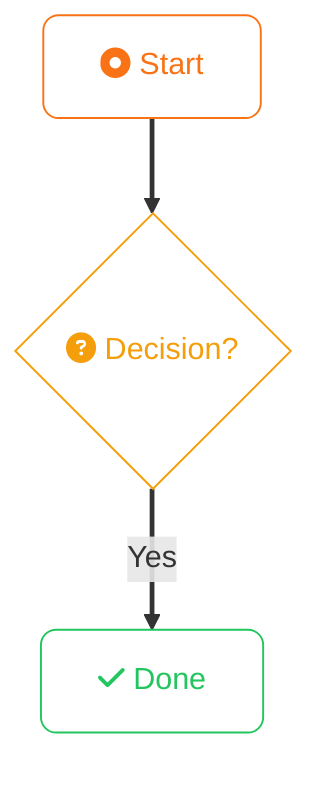

# Acert — Project Guidelines

Acert is an educational platform for cloud/programming certifications, built with Astro as a static site. The AI's primary role is **knowledge expert** — generating clear, detailed lesson content and maintaining the content/component architecture.

## Build & Dev Commands

```sh
bun run dev       # dev server at localhost:4321
bun run build     # production build → ./dist/
bun run preview   # preview production build
```

Package manager: **Bun**. Use `bun` for all install/run operations, not npm/yarn/pnpm.

## Tech Stack

- **Astro 5.x** — static site, no SSR
- **TypeScript** — strict mode (`astro/tsconfigs/strict`), ESNext
- **Tailwind CSS 4** — CSS-first config via `@tailwindcss/vite` (no `tailwind.config.*`; theme in `src/styles/global.css` `@theme {}` block)
- **MDX** — lesson content with locally imported components
- **Expressive Code** (`astro-expressive-code`) — syntax highlighting, configured in `ec.config.mjs`
- **Icons** — `astro-icon` with `<Icon name="set:name" />`; available sets: `@iconify-json/mdi`, `logos`, `skill-icons`, `clarity`
- **Mermaid** — `astro-mermaid` with transparent background, ELK layout available

## Content Collections

All five collections (`programming`, `cloud`, `cicd`, `data`, `networking`) share one schema — `lessonSchema` in `src/content/config.ts`:

```ts
{
  title: string;           // required
  description: string;     // required
  order: number;           // required — controls sort/prev-next order
  duration?: number;       // minutes
  tags?: string[];
  icon?: string;           // iconify name e.g. "logos:aws"
  certifications?: string[];
  sharedWith?: string[];   // tracks that reuse this common/ file e.g. ["aws", "azure", "gcp"]
  sharedConcepts?: string[]; // slugs of common/ files to cross-reference e.g. ["iam-concepts"]
}
```

**New lesson frontmatter minimum:**
```yaml
---
title: "..."
description: "..."
order: 5
---
```

### Shared Content Pattern

Common lessons live in `cloud/common/` and `networking/common/` etc. Track-specific lessons reference them via `sharedConcepts`. Always add `sharedWith: ["aws", "azure", "gcp"]` to cloud common files so they appear in all three tracks' sidebars.

### Adding a New Track (Checklist)

When adding a new sub-track (e.g. a new cloud provider or language) to an existing collection:

1. **Create content files** — `src/content/{collection}/{track}/` with correct `order` values
2. **Create page routes** — `src/pages/{collection}/{track}/[slug].astro` and `index.astro`
3. **Update the collection's top index page** — e.g. `src/pages/cloud/index.astro`:
   - Fetch the new track's lessons with `getCollection`
   - Add a `<FeatureCard>` for the new track
   - Update `lessonCount` in `<TutorialHeader>` to include the new track
   - Update `description`, `keywords`, and `certifications` in `<BaseLayout>`
4. **Update all shared/common files** — add the new track name to `sharedWith` in every `common/` lesson so it appears in the new track's sidebar

## Routing Architecture

- **Track lessons:** `src/pages/cloud/aws/[slug].astro` (and equivalent for `azure/`, `gcp/`) — fetches collection filtered by `id.startsWith('aws/')`, sorted by `order`, injects `prev`/`next` as props
- **Common pages:** emit two params each — `slug` and `_${slug}` — so `/common/iam-concepts` and `/common/_iam-concepts` both resolve (see `src/lib/content-slugs.ts`)
- **Rendering:** `const { Content } = await render(entry)` then `<Content />`

Slug helpers in `src/lib/content-slugs.ts`: `toTrackSlug`, `toCommonSlug`, `toCommonIdCandidates`.

## Component & Styling Conventions

**TypeScript props:** Always use `interface Props { ... }` in Astro frontmatter (never inline or type aliases for props).

**Tailwind dynamic classes — critical rule:** Never interpolate colors into class strings (`text-${color}-400` will be purged). Use a `colorMap` Record with full class strings:
```ts
const colorMap: Record<string, string> = {
  orange: 'text-orange-400 bg-orange-400/10',
  blue: 'text-blue-400 bg-blue-400/10',
};
```

**Dark mode:** Theme is class-based on `<html>` — `html.theme-night` (dark, default) and `html.theme-day` (light). **No Tailwind `dark:` prefix.** All light-mode overrides go in `src/styles/global.css` as `html.theme-day .my-class { ... }`.

**MDX components:** Use `class="not-prose"` on block-level MDX components (Callout, CodeComparison, etc.) to escape Tailwind typography.

**Named slots** (e.g. `CodeComparison`): `<Fragment slot="left">...</Fragment>` inside MDX.

## Colors & Visual Style

### Track / Path Accent Colors

Defined as CSS custom properties in `src/styles/global.css` `@theme {}`. Use in Tailwind by referencing the full class string (never interpolate):

| Track | CSS var | Hex | Tailwind equivalent |
|-------|---------|-----|---------------------|
| Java | `--color-java` | `#f97316` | `orange-500` |
| Rust | `--color-rust` | `#ef4444` | `red-500` |
| AWS | `--color-aws` | `#f59e0b` | `amber-500` |
| Azure | `--color-azure` | `#3b82f6` | `blue-500` |
| CI/CD | `--color-cicd` | `#22c55e` | `green-500` |
| Common / shared | `--color-common` | `#a855f7` | `purple-500` |

GCP uses green — `#22c55e` / `green-500` — same as CI/CD.

Always use a `colorMap` record with full class strings when a component accepts a track color prop:
```ts
const colorMap: Record<string, string> = {
  orange: 'text-orange-500 border-orange-500/30 bg-orange-500/10',
  red:    'text-red-500    border-red-500/30    bg-red-500/10',
  amber:  'text-amber-500  border-amber-500/30  bg-amber-500/10',
  blue:   'text-blue-500   border-blue-500/30   bg-blue-500/10',
  green:  'text-green-500  border-green-500/30  bg-green-500/10',
  purple: 'text-purple-500 border-purple-500/30 bg-purple-500/10',
};
```

### Base Palette

Dark theme (default): background `#0a0a0f`, body text `#e2e8f0`, muted text `text-slate-400`.  
Light theme: background `#f8fafc`, body text `#0f172a`.  
Fonts: headings use `font-mono` (JetBrains Mono), body uses `font-sans` (Plus Jakarta Sans).

### Mermaid Diagram Standards

Every mermaid diagram **must** follow all of these rules:

**1. A11y — always first two lines inside the fence:**
```
accTitle: Short diagram title
accDescr: One-sentence description of what the diagram shows.
```

**2. Node style — transparent fill, coloured stroke, rounded corners:**
```
classDef myClass fill:none,stroke:#hex,color:#hex,rx:8,ry:8
```
All nodes use `fill:none` so they work on both dark and light backgrounds.

**3. Link weight — always include:**
```
linkStyle default stroke-width:2.5px
```

**4. Standard classDef colour palette** (reuse these names wherever semantics match):

| Name | Stroke hex | Meaning |
|------|-----------|---------|
| `step` | `#f97316` | Main flow steps / process nodes |
| `q` | `#f59e0b` | Decision diamonds (questions) |
| `ok` / `ans` / `impl` / `leaf` | `#22c55e` | Success / correct path / implementation nodes |
| `jvm` / `detail` / `ref` / `base` / `iface` | `#6366f1` | Internals / base class / interface nodes |
| `fail` / `narrow` / `rule` | `#ef4444` | Error / forbidden / high-precedence emphasis |
| `high` | `#ef4444` | High-tier items (e.g. precedence) |
| `mid` | `#f97316` | Mid-tier items |
| `low` | `#22c55e` | Low-tier / least-constrained items |
| `mapif` | `#f97316` | Map-type interface nodes |

For networking/common diagrams, `step` may use `#a855f7` (purple) instead of orange to match the common track accent.

**5. FA icons in node labels:**
```
NODE["fa:fa-icon-name Label text"]:::className
```
Use Font Awesome 6 Free icon names (e.g. `fa:fa-server`, `fa:fa-database`, `fa:fa-circle-question`).  
FA icons in **edge labels** are not supported — use plain unicode (✓ ✗) or short text instead.

**Minimal correct diagram template:**
````mdx

````

## MDX Content Files

Components are **locally imported** in each MDX file — no auto-import. Relative path depth varies by nesting:
```mdx
---
title: "..."
description: "..."
order: 1
---
import Callout from '../../../components/mdx/Callout.astro';
import KeyPoints from '../../../components/mdx/KeyPoints.astro';
```

Avoid generating overly complex examples. Keep lessons clear, focused, and appropriately scoped.

## Layout (`src/layouts/BaseLayout.astro`)

Pass at minimum `title`. Full SEO (OG, Twitter Card, JSON-LD) is handled automatically. Title renders as `"${title} — Acert"`.

## Pitfalls

- **No `site` in `astro.config.mjs`** — canonical/OG URLs fall back to hardcoded `https://acert.dev`. Don't add the `site` config without confirming the production domain.
- **`sharedConcepts` lookup is silent on miss** — if a common file is renamed, the cross-path banner silently disappears. Keep slugs in sync.
- **`LessonSidebar.astro` exists** but some `[slug].astro` pages build sidebars inline. Prefer the component; don't duplicate sidebar logic.
- **Expressive Code theme sync** — `ec.config.mjs` uses `.theme-night`/`.theme-day` CSS selectors with `useDarkModeMediaQuery: false`. Keep in sync with any theme toggle changes.
