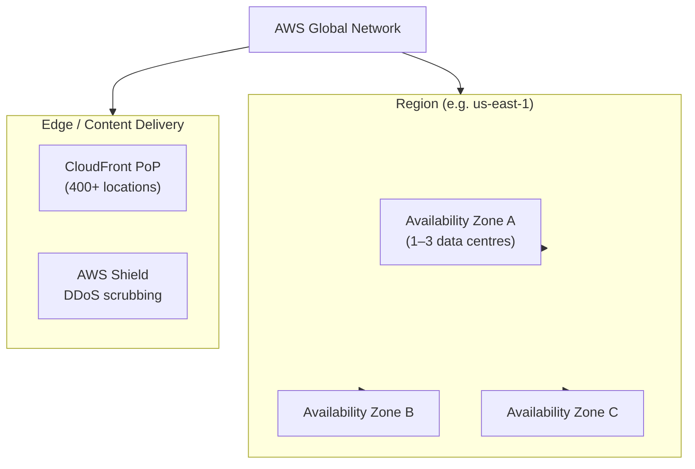
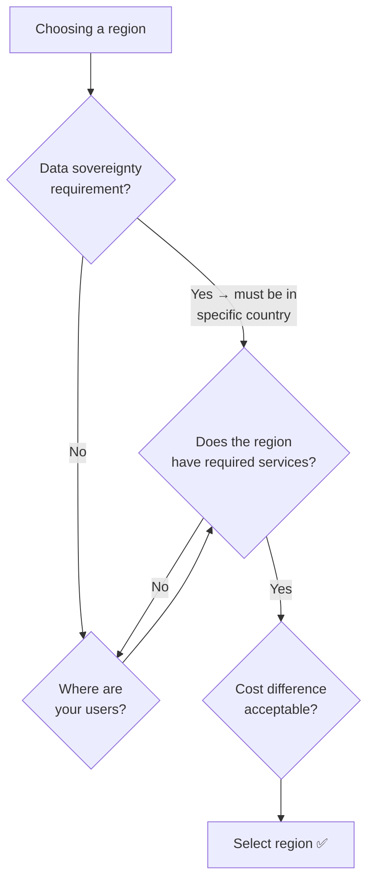
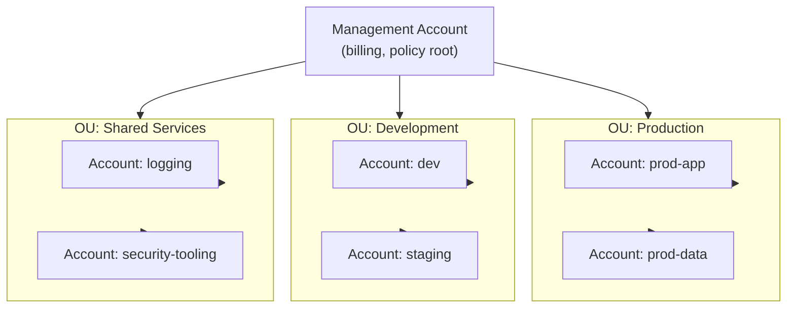
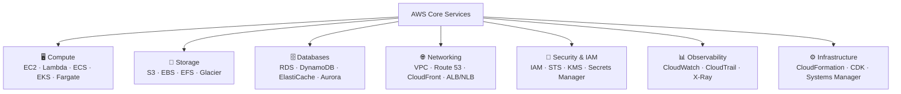
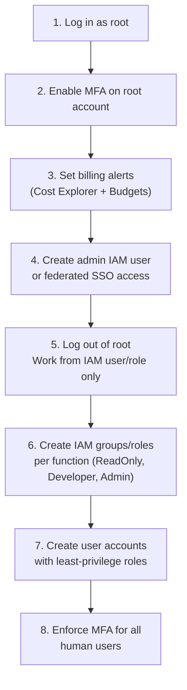

import Callout from '../../../components/mdx/Callout.astro';
import KeyPoints from '../../../components/mdx/KeyPoints.astro';
import Quiz from '../../../components/mdx/Quiz.astro';
import CodeTabs from '../../../components/mdx/CodeTabs.astro';
import List from '../../../components/mdx/List.astro';

Amazon Web Services (AWS) is the world's largest cloud platform, launched publicly in 2006. It offers over 200 fully managed services spanning compute, storage, databases, networking, ML, and security. Before diving into specific services, you need to understand how AWS is structured — both physically (global infrastructure) and logically (accounts, IAM, and CLI).

<Callout type="info">
**Foundation concepts first.** This lesson covers AWS-specific structure. For universal cloud networking concepts (VPC, subnets, routing), see **Cloud Networking Basics**. For identity and access management concepts, see **IAM Foundations** — both are linked above as shared concepts.
</Callout>

<KeyPoints>
- How AWS regions, Availability Zones, and edge locations relate to each other
- The AWS account + Organisation model for isolation and billing
- Core service categories and which services belong to each
- How to configure the AWS CLI and why credential management matters from day one
- The IAM bootstrap sequence every new AWS account should follow
</KeyPoints>

---

## AWS Global Infrastructure

AWS infrastructure is organised in three layers: **Regions** → **Availability Zones** → **Edge Locations**. Understanding this hierarchy determines where your data lives, what your latency will be, and how resilient your architecture is.



| Layer | Count | Purpose |
|---|---|---|
| **Regions** | 34+ | Geographic isolation, data sovereignty, latency |
| **Availability Zones** | 3–6 per region | Fault isolation within a region |
| **Local Zones** | 30+ | Ultra-low latency compute near metro areas |
| **CloudFront PoPs** | 400+ | Static + dynamic content caching, DDoS scrubbing |
| **Wavelength Zones** | Carrier-specific | 5G edge compute (single-digit ms latency) |

### Choosing a Region



<Callout type="tip">
**Not all services exist in all regions.** Some newer services launch in `us-east-1` first and roll out over months. If a service isn't visible in your console, you may be in the wrong region.
</Callout>

---

## The AWS Account and Organisation Model

An **AWS account** is the fundamental unit of isolation — billing, IAM, and resource quotas are all account-scoped. For real workloads you run multiple accounts under **AWS Organizations**.



**Why multiple accounts?**

- **Blast radius** — a compromised dev account cannot touch production resources in a separate account
- **Billing visibility** — cost by workload without tagging gymnastics
- **Service Control Policies (SCPs)** — attach at the OU level to prevent certain actions (e.g. deny `ec2:RunInstances` in `eu-*` regions in the dev OU)
- **Quota separation** — EC2 instance limits are per account; separate accounts avoid production being limited by dev test runs

---

## Core Service Categories

AWS groups its 200+ services into functional categories. These are the categories you'll encounter on every certification exam and in practice:



| Category | You use it to… |
|---|---|
| **Compute** | Run code — VMs, containers, or serverless functions |
| **Storage** | Persist data — object, block, or file storage |
| **Databases** | Store structured/semi-structured data with managed engines |
| **Networking** | Control how traffic flows between resources and the internet |
| **Security / IAM** | Control who can do what, and protect data at rest and in transit |
| **Observability** | Understand what your system is doing and what happened |
| **Infrastructure** | Automate provisioning, configuration, and deployment |

---

## IAM Bootstrap: Your First Actions on a New Account

<Callout type="warning">
**Never use root credentials for daily work.** The root account email/password has unrestricted access to your entire AWS account including billing. Protect it with a strong password + MFA, lock the credentials away, and create an IAM user or role for everything else.
</Callout>

The correct bootstrap sequence for every new AWS account:



For the policy syntax behind this, see the [IAM Foundations](/cloud/common/iam-concepts) lesson.

---

## The AWS CLI

The AWS CLI lets you interact with every AWS service from the command line. It's essential for automation, scripting, and faster iteration than clicking through the console.

**Installation:**

```bash
# macOS (Homebrew)
brew install awscli

# Linux
curl "https://awscli.amazonaws.com/awscli-exe-linux-x86_64.zip" -o "awscliv2.zip"
unzip awscliv2.zip && sudo ./aws/install

# Windows (winget)
winget install -e --id Amazon.AWSCLI

# Verify
aws --version
```

**Configuration — the right way:**

```bash
# Interactive setup (stores in ~/.aws/credentials and ~/.aws/config)
aws configure

# AWS SSO (recommended for organisations using AWS IAM Identity Center)
aws configure sso

# Useful: named profiles for multiple accounts
aws configure --profile prod
aws configure --profile dev

# Switch profiles
export AWS_PROFILE=prod
aws s3 ls  # uses prod profile
```

<Callout type="warning">
**Never hard-code credentials.** Don't put `AWS_ACCESS_KEY_ID` in source code, `.env` files committed to git, or container images. Use IAM roles for EC2/ECS/Lambda (the service gets temporary credentials automatically), and AWS IAM Identity Center for human access.
</Callout>

**Common first commands:**

```bash
# List your S3 buckets
aws s3 ls

# Describe EC2 instances in a region
aws ec2 describe-instances --region us-east-1

# Get current caller identity (useful for debugging auth)
aws sts get-caller-identity

# List IAM users
aws iam list-users
```

---

## Key AWS Console Concepts

| Concept | What to know |
|---|---|
| **Region selector** | Top-right of console — many services show different resources per region. Always check you're in the right region. |
| **Global vs regional services** | IAM, Route 53, CloudFront, Billing are global — no region selector. Everything else is regional. |
| **CloudShell** | Browser-based terminal with AWS CLI pre-configured — useful for quick tasks without local setup |
| **Cost Explorer** | Enable it on day 1. Default billing dashboard shows month-to-date; Cost Explorer shows trends and forecasts. |
| **Service Quotas** | Every service has per-region per-account limits. Check these before production launches. Request increases early. |

---

## Knowledge Check

<Quiz
  question="You deploy an EC2 instance in us-east-1a. The AZ suffers an outage. Your Auto Scaling Group was configured for one AZ only. What is the impact?"
  options={[
    "AWS automatically moves the instance to us-east-1b",
    "The instance is terminated and a replacement launches in us-east-1b only if you specified multi-AZ subnets in the ASG",
    "The instance stays running because EC2 instances survive AZ failures",
    "AWS pauses billing until the AZ recovers"
  ]}
  answer="The instance is terminated and a replacement launches in us-east-1b only if you specified multi-AZ subnets in the ASG"
  explanation="AWS does not automatically move instances between AZs. Auto Scaling Groups launch replacements in healthy AZs — but only in the subnets you specified. If you configured the ASG with only a single AZ subnet, it will try to re-launch in the same failed AZ and keep failing. Always configure ASGs with subnets in at least two AZs."
/>

---

<KeyPoints title="AWS Intro Checklist">
- Root account: MFA enabled, credentials locked away, billing alerts set
- Admin access via IAM user or SSO role — never root for daily work
- AWS CLI configured with named profiles, never hard-coded credentials
- Understand region selection: data residency → latency → service availability → cost
- Familiar with account structure: Org root → OUs → accounts (prod / dev / shared)
- Know the seven core service categories and representative services in each
</KeyPoints>
