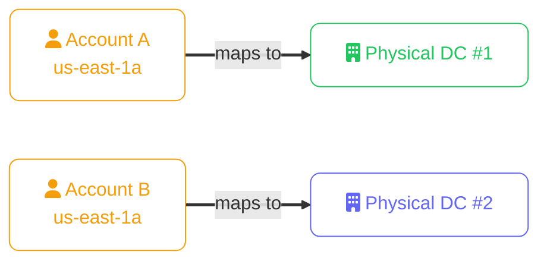
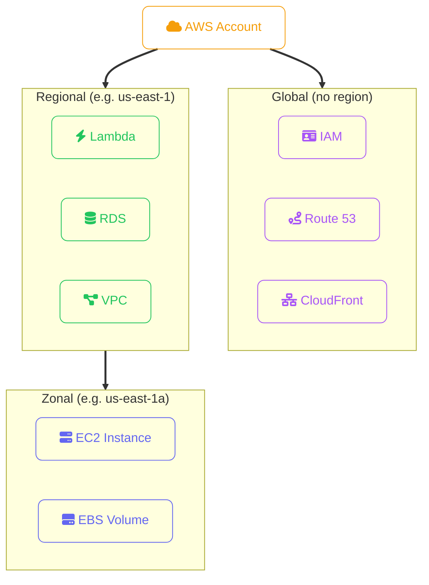

import Callout from '../../../components/mdx/Callout.astro';
import KeyPoints from '../../../components/mdx/KeyPoints.astro';
import Quiz from '../../../components/mdx/Quiz.astro';
import CodeTabs from '../../../components/mdx/CodeTabs.astro';

AWS operates the largest cloud infrastructure in the world — 33+ regions and 105+ Availability Zones as of 2026. Every resource you launch has an exact physical scope, and understanding that scope determines your resilience, latency, compliance posture, and cost.

<KeyPoints>
- How AWS region codes are structured and which regions to use by default
- The AZ naming convention and the account-level randomisation you must know about
- Global vs regional vs zonal service scope — and what it means for your architecture
- AWS Local Zones, Wavelength Zones, and Outposts for edge and on-premises scenarios
- How to list and switch regions with the AWS CLI and configure a default region
</KeyPoints>

---

## Region Naming

AWS region codes follow the pattern `{area}-{direction}-{number}`:

| Region code | Location | Notes |
|---|---|---|
| `us-east-1` | N. Virginia | The original AWS region — largest, most services, lowest price |
| `us-east-2` | Ohio | Often used as a secondary US region |
| `us-west-2` | Oregon | West Coast US default; also large service footprint |
| `eu-west-1` | Ireland | Primary EU region |
| `eu-central-1` | Frankfurt | Germany — GDPR-stringent workloads |
| `ap-southeast-1` | Singapore | Primary Asia-Pacific hub |
| `ap-northeast-1` | Tokyo | Japan |
| `ap-south-1` | Mumbai | India |
| `sa-east-1` | São Paulo | South America |

**Special partitions** — not in the standard commercial partition:

| Partition | Regions | Purpose |
|---|---|---|
| `aws` | All standard regions | Commercial workloads |
| `aws-cn` | `cn-north-1`, `cn-northwest-1` | China — separate accounts required, operated by local partners |
| `aws-us-gov` | `us-gov-east-1`, `us-gov-west-1` | US government — FedRAMP/ITAR; requires AWS GovCloud account |

<Callout type="warning">
`us-east-1` has the most services and the largest public IP address pool, but it is also the most targeted region for API abuse. For new accounts, enable MFA on the root account and set up CloudTrail **before** deploying any resources.
</Callout>

---

## Availability Zone Layout

Each region contains **2–6 Availability Zones**. AZs are named with a letter suffix:

```
us-east-1a
us-east-1b
us-east-1c
us-east-1d
us-east-1e
us-east-1f
```

### Account-Level AZ Randomisation

The letter suffix (`a`, `b`, `c`) is **not consistent across AWS accounts**. AWS physically shuffles the mapping to spread load across data centers. When you say "deploy to `us-east-1a`", what you mean to another account may be a completely different physical data center.



If you need to co-locate resources from two accounts in the same physical AZ (e.g. for VPC Peering with minimal latency), use the **AZ ID** (`use1-az1`, `use1-az2`) instead of the letter name — AZ IDs are consistent across accounts.

```bash
# Get the AZ ID for your account's us-east-1a
aws ec2 describe-availability-zones \
  --region us-east-1 \
  --query 'AvailabilityZones[*].{Name:ZoneName,ID:ZoneId}' \
  --output table
```

---

## Service Scope

Resources in AWS exist at one of three scopes:



| Scope | Service examples | Resilience implication |
|---|---|---|
| **Global** | IAM, Route 53, CloudFront, WAF, Shield | Always available — no AZ or region choice |
| **Regional** | Lambda, S3, RDS, DynamoDB, SQS, SNS, VPC | AWS replicates across AZs internally — you pick the region |
| **Zonal** | EC2 instance, EBS volume, ElastiCache node | You must deploy across multiple AZs manually |

<Callout type="danger">
EBS volumes are zonal — you cannot attach an EBS volume in `us-east-1a` to an EC2 instance in `us-east-1b`. If you need cross-AZ data access, use EFS (regional NFS) or copy the snapshot. This is the most common architectural mistake when designing for AZ resilience.
</Callout>

---

## Edge Infrastructure: Beyond Standard AZs

AWS extends its footprint beyond the 33+ standard regions with three additional infrastructure types:

### Local Zones

Local Zones bring AWS compute, storage, and database services to metro areas closer to end users — without the latency of a full region hop. They are extensions of a parent region.

- Examples: `us-east-1-bos-1` (Boston), `us-east-1-chi-1` (Chicago), `ap-northeast-1-wl1-nrt1a` (Tokyo metro)
- Use cases: media rendering, real-time gaming, interactive live streaming
- What you get: EC2, EBS, VPC, ECS — not the full AWS service catalogue

### Wavelength Zones

Wavelength Zones embed AWS compute at the edge of 5G networks operated by telecom partners (Verizon, Vodafone, KDDI). Traffic from 5G devices reaches your app without leaving the carrier network.

- Use cases: connected vehicles, AR/VR, autonomous devices, live video processing
- Latency: single-digit milliseconds from 5G device to app

### AWS Outposts

Outposts are physical AWS hardware racks you install in your own data center. You get the same EC2, EBS, RDS, ECS, and EKS APIs you use in the cloud — but running on-premises.

- Use cases: data residency requirements that prohibit public cloud, latency-sensitive on-prem workloads, gradual migration
- Connectivity: maintains a persistent connection back to the parent AWS region for control-plane management

---

## Working with Regions in the CLI

```bash
# List all available regions
aws ec2 describe-regions --output table

# Check which region you're currently configured to use
aws configure get region

# Set a default region (persisted to ~/.aws/config)
aws configure set region eu-west-1

# Override the region for a single command
aws s3 ls --region ap-southeast-1

# List AZs in a specific region
aws ec2 describe-availability-zones \
  --region us-west-2 \
  --query 'AvailabilityZones[*].{Zone:ZoneName,State:State}' \
  --output table
```

For multi-region work, use **named profiles** in `~/.aws/config` rather than switching the default:

```ini
[profile prod-eu]
region = eu-west-1
output = json

[profile prod-us]
region = us-east-1
output = json
```

```bash
# Use a specific profile
aws s3 ls --profile prod-eu
export AWS_PROFILE=prod-eu   # or set for the session
```

<Callout type="tip">
Set `AWS_DEFAULT_REGION` as an environment variable in your CI/CD pipeline rather than relying on `~/.aws/config`. This makes the region explicit in every pipeline run and prevents accidental cross-region deployments.
</Callout>

---

<Quiz
  question="You deploy an EC2 instance in `us-east-1a` and create an EBS volume in `us-east-1b`. What happens when you try to attach the volume to the instance?"
  options={[
    { label: "The attachment succeeds — EBS volumes are regional, not zonal" },
    { label: "The attachment fails — EBS volumes can only attach to instances in the same AZ", correct: true },
    { label: "AWS automatically copies the volume to us-east-1a before attaching" },
    { label: "The instance migrates to us-east-1b to match the volume's AZ" },
  ]}
  explanation="EBS volumes are zonal resources, scoped to one specific Availability Zone. You can only attach an EBS volume to an EC2 instance in the same AZ. To attach a volume across AZs, you must take a snapshot of the volume, create a new volume from that snapshot in the target AZ, and then attach the new volume."
/>
