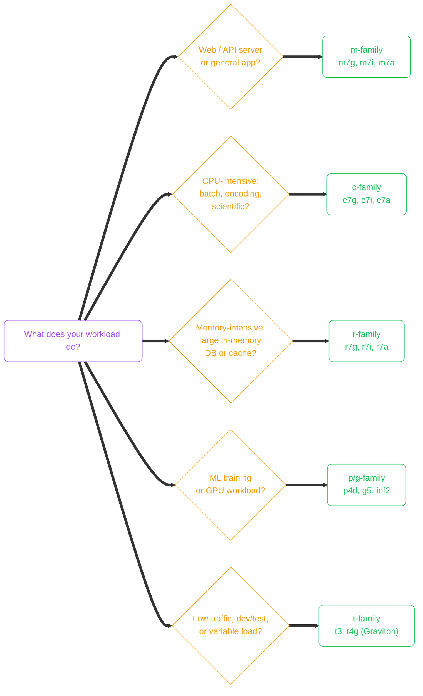
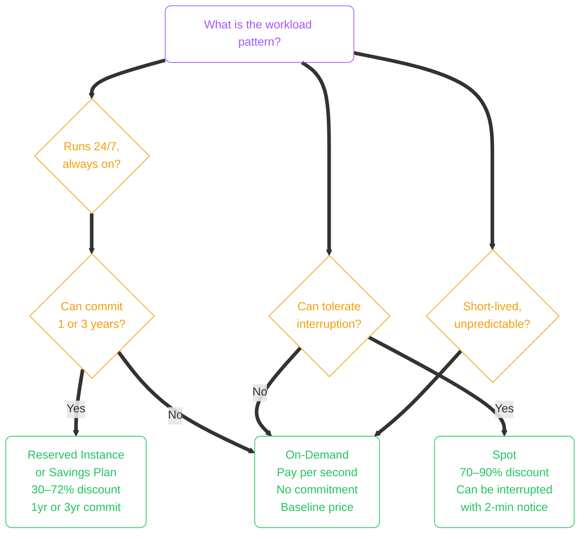
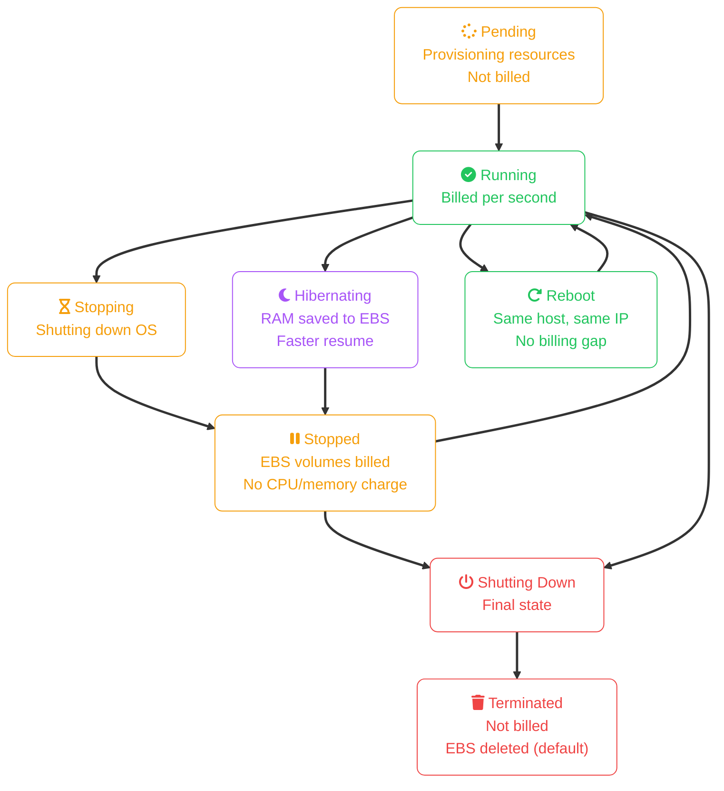
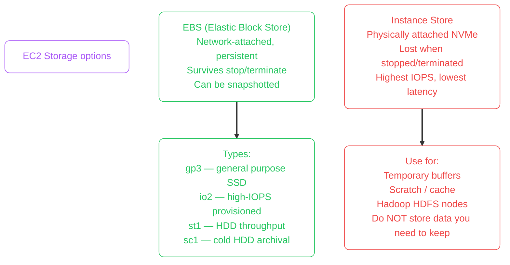
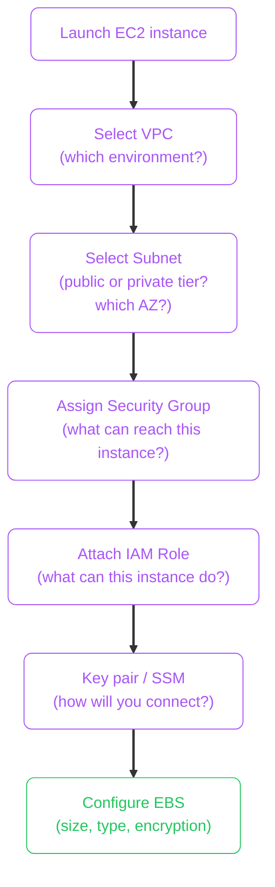
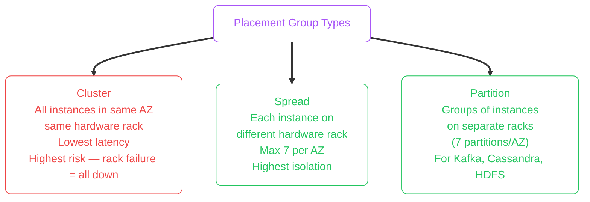

import { Icon } from 'astro-icon/components';
import Callout from '../../../components/mdx/Callout.astro';
import KeyPoints from '../../../components/mdx/KeyPoints.astro';
import Quiz from '../../../components/mdx/Quiz.astro';
import CodeTabs from '../../../components/mdx/CodeTabs.astro';
import SectionHeader from '../../../components/mdx/SectionHeader.astro';

Elastic Compute Cloud (EC2) is AWS's virtual machine service — one of the oldest and most fundamental pieces of the AWS platform. You launch a virtual server, choose the OS, CPU, memory, storage, and network configuration. Everything else in the compute stack (ECS, EKS, Beanstalk) ultimately runs on top of EC2.

<KeyPoints>
- How instance type families map to workload categories
- The naming convention that decodes any instance type at a glance
- The three pricing models and when each is cost-optimal
- The EC2 instance lifecycle and what each state means for billing
- Storage choices: EBS vs instance store, when each is appropriate
- How to launch an instance into the correct VPC subnet and apply a Security Group
</KeyPoints>

---

## Instance Type Naming Convention

Every EC2 instance type name follows a structured format. Once you know the pattern, you can decode any instance type without looking it up.

```
m 7 g . 2 x l a r g e
│ │ │   └── Size: nano, micro, small, medium, large, xlarge, 2xlarge…
│ │ └────── Generation: 7th gen (higher = newer, more cost-efficient)
│ └──────── Attribute: g = AWS Graviton (ARM), i = Intel, a = AMD
└────────── Family: m = general purpose, c = compute, r = memory, etc.
```

**Instance families:**

| Family | Optimised for | Typical use |
|---|---|---|
| **m** (general) | Balanced CPU/memory | Web servers, app servers, small DBs |
| **c** (compute) | High CPU-to-memory | Batch processing, media encoding, HPC |
| **r** (memory) | High memory-to-CPU | In-memory DBs, analytics engines, caches |
| **t** (burstable) | Base CPU + burst credits | Dev/test, low-traffic workloads |
| **i** (storage) | NVMe instance store | High-IOPS DBs, Hadoop, search indexes |
| **p/g** (accelerated) | GPU/FPGA | ML training, rendering, video transcoding |

---

<SectionHeader icon="cloud-icons/amazon-ec2-instance" iconSize={16} 
    level={2}>Choosing the Right Instance Type</SectionHeader>


<Callout type="tip">
**Default to Graviton (g suffix) for new workloads.** AWS Graviton (ARM) instances offer 20–40% better price-performance than equivalent x86 instances for most workloads. Go x86 only if your software has a hard dependency on it.
</Callout>

---

## Pricing Models

EC2 has three main pricing models. Choosing the right one is often the highest-impact cost optimisation you can make.



| Model | Discount vs On-Demand | Best for | Risk |
|---|---|---|---|
| **On-Demand** | — | Unpredictable, new workloads, short bursts | Cost — no savings for steady state |
| **Spot** | 70–90% | Batch jobs, Spark/Hadoop, fault-tolerant apps | Instance can be reclaimed with 2-min notice |
| **Reserved Instance** | 30–72% | Stable 24/7 workloads, predictable baseline | Commitment — you pay whether you use it or not |
| **Savings Plans** | Up to 66% | Flexible — applies to EC2, Lambda, Fargate | Commit to $/hour spend, not specific instance type |

<Callout type="tip">
**Savings Plans over Reserved Instances for most cases.** Compute Savings Plans apply to any instance family, size, region, or OS — you commit to a $/hour spend, not a specific instance. This gives you the discount flexibility to change instance types without losing the commitment benefit.
</Callout>

---

## EC2 Instance Lifecycle

Understanding the lifecycle determines what you're billed for and when.



Key billing facts:
- **Stopped**: EBS storage is still billed. CPU/memory charge stops.
- **Terminated**: Default EBS root volume is deleted. Non-root EBS volumes survive (configurable).
- **Reboot**: Same physical host, same public/private IP, no billing interruption.
- **Stop → Start**: May land on a different physical host. Elastic IP stays; automatic public IP changes.

---

## Storage: EBS vs Instance Store

EC2 instances have two storage options with very different characteristics:



| | EBS | Instance Store |
|---|---|---|
| **Persistence** | Survives stop / terminate | Lost on stop / terminate / failure |
| **Latency** | Sub-millisecond (network) | Microsecond (local NVMe) |
| **Snapshotable** | Yes → S3 → cross-region copy | No |
| **Default for** | Root volume, databases | Scratch, cache, Kafka log dirs |

---

## Launching an Instance: VPC and Security Group Placement

<Callout type="info">
**VPC and Security Group fundamentals** are covered in the [Cloud Networking Basics](/cloud/common/networking-basics) shared lesson. This section focuses on the EC2-specific decisions.
</Callout>

When launching an EC2 instance, the critical network decisions are:



**Instance placement checklist:**

| Decision | Production default |
|---|---|
| Subnet type | Private (app tier) — not public |
| Public IP | Disabled for app/data tier; load balancer gets the public IP |
| Security Group | Explicit inbound from load balancer SG only |
| IAM Role | Least-privilege role for what the instance actually needs |
| Access method | AWS Systems Manager Session Manager — no SSH key required |
| EBS encryption | Enable at launch using CMK from KMS |

<Callout type="warning">
**Stop opening port 22 to the internet.** AWS Systems Manager Session Manager provides browser/CLI shell access without any open inbound ports, without managing SSH keys, and with full audit logs. Use it instead of SSH for any new instance.
</Callout>

---

## Placement Groups

For latency-sensitive or tightly-coupled workloads, EC2 placement groups control how instances are distributed across physical hardware:



| Type | Use when |
|---|---|
| **Cluster** | HPC, distributed ML training, low-latency inter-node communication |
| **Spread** | Small set of critical instances that must survive individual hardware failure |
| **Partition** | Large distributed systems (Kafka, Cassandra) — rack awareness built in |

---

## Knowledge Check

<Quiz
  question="You have a batch processing job that runs for 4 hours each night and can tolerate being interrupted. What pricing model minimises cost?"
  options={[
    "On-Demand — flexibility is more important for batch jobs",
    "Reserved Instances — commit for 1 year to get the maximum discount",
    "Spot Instances — deep discount, and the job can checkpoint and restart if interrupted",
    "Savings Plans — most flexible discount tier"
  ]}
  answer="Spot Instances — deep discount, and the job can checkpoint and restart if interrupted"
  explanation="Spot instances provide 70–90% discount over On-Demand. For batch workloads that can handle interruption (by checkpointing progress to S3 or EFS), Spot is the correct choice. Reserved/Savings plans require commitment and are designed for steady-state 24/7 workloads — a nightly 4-hour job would leave most of the reserved capacity unused during the day."
/>

---

## Cost Implications

EC2 pricing has well-known components (on-demand rate, reserved discount) and several lesser-known ones that quietly inflate bills.

| Cost Source | Detail |
|---|---|
| **On-Demand rates (sample)** | t3.medium $0.0416/hr, m5.xlarge $0.192/hr, c5.4xlarge $0.68/hr, r5.4xlarge $1.008/hr |
| **Stopped (not terminated) instances** | Compute cost stops, but **EBS volumes continue billing**. A 500 GB gp3 root disk costs $40/month even while the instance is stopped. |
| **Unattached Elastic IPs** | $0.005/hr (~$3.60/month) per unused Elastic IP. AWS charges for EIPs allocated but not associated with a running instance. Release unused EIPs immediately. |
| **Data transfer** | EC2 → internet: $0.09/GB. Between AZs in same region: $0.01/GB each way. Same AZ using private IP: free. |

<Callout type="warning" title="Over-Provisioning is the Most Common EC2 Cost Mistake">
It's easy to launch an `m5.4xlarge` because "it might get busy" and leave it running at 5% CPU. **AWS Compute Optimizer** analyses CloudWatch CPU/memory metrics and recommends right-sizing. An `m5.4xlarge` running at 5% average CPU should be an `m5.large` — 8× cheaper. Start one size smaller than you think you need and scale up with real data.
</Callout>

<Callout type="tip" title="Reserved Instances vs Savings Plans">
**EC2 Reserved Instances** commit to a specific instance type and region — more restrictive but up to 72% off. **Compute Savings Plans** commit to a $/hr spend level and apply across any EC2 family, size, or region — more flexible at ~66% off. For stable long-running fleets, Reserved Instances offer the deepest discount. For new workloads with unknown instance shapes, Savings Plans are safer.
</Callout>

---

<KeyPoints title="EC2 Checklist">
- Decode any instance type name: Family + Generation + Attribute + Size
- Default to Graviton (g suffix) for new x86-compatible workloads
- Use On-Demand for unpredictable, Reserved/Savings Plan for steady-state, Spot for fault-tolerant batch
- Stopped instances: EBS still billed, CPU/memory not billed
- EBS for persistent data (databases, root volumes); instance store for ephemeral scratch only
- Launch into private subnet, no public IP on app tier, load balancer in public subnet
- Use IAM Roles on instances — never hard-code credentials
- Use Session Manager instead of SSH — no open port 22 required
</KeyPoints>


