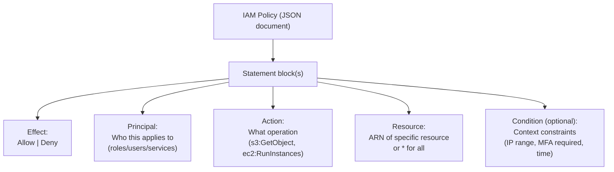
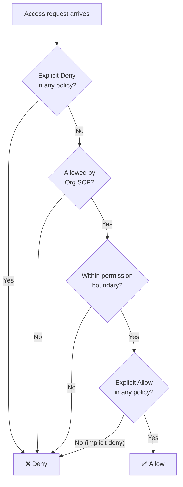
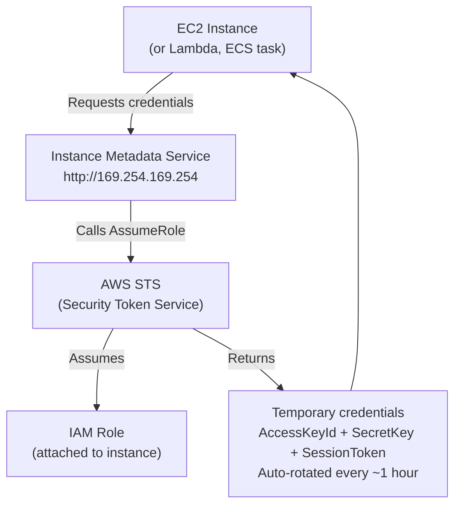
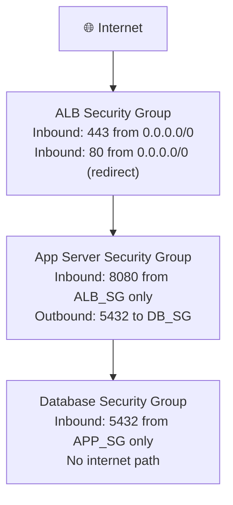
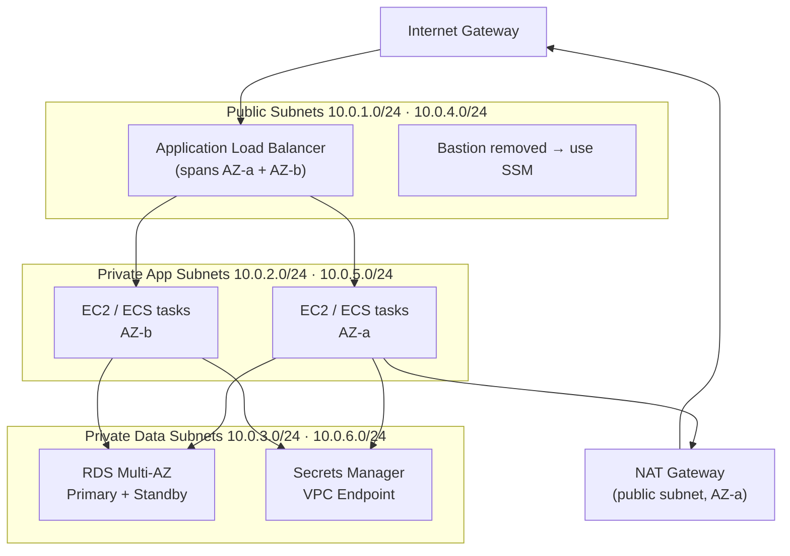
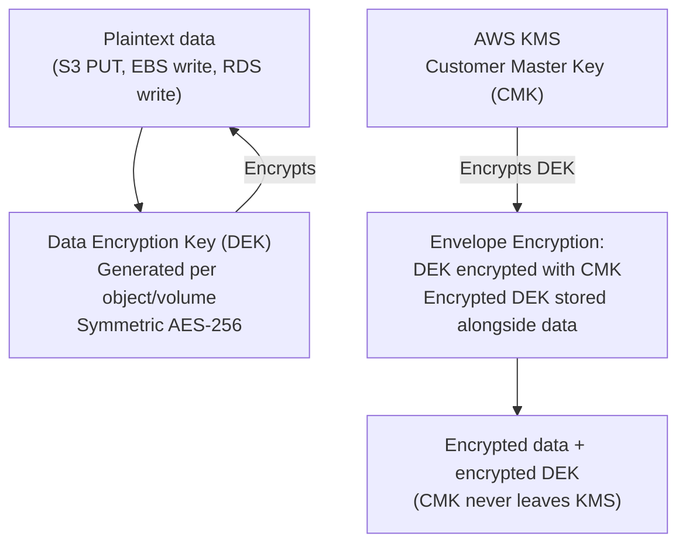
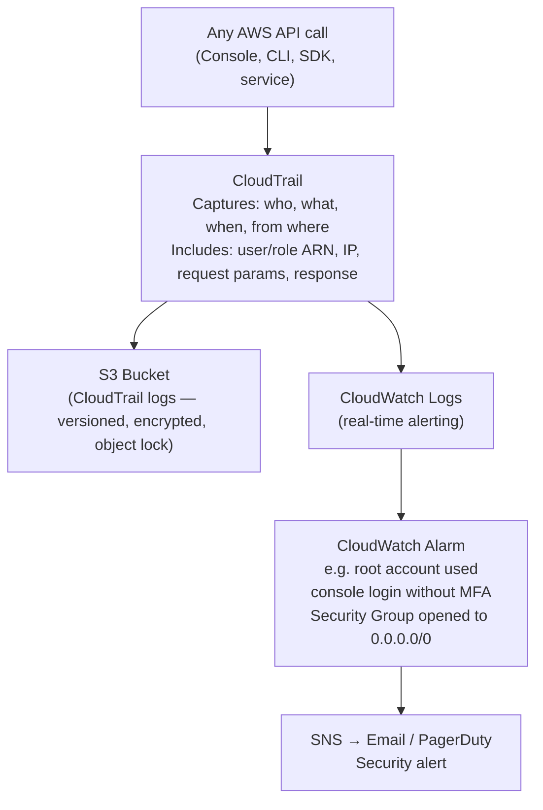

import Callout from '../../../components/mdx/Callout.astro';
import KeyPoints from '../../../components/mdx/KeyPoints.astro';
import Quiz from '../../../components/mdx/Quiz.astro';
import CodeTabs from '../../../components/mdx/CodeTabs.astro';

This lesson maps AWS-specific controls to the security principles in [Security Foundations](/cloud/common/security-foundations). Each section follows the pattern: **principle → the AWS tool that implements it**.

<KeyPoints>
- How IAM policies implement least privilege in AWS (JSON syntax and evaluation logic)
- IAM Roles for service-to-service auth — replacing hard-coded credentials
- Security Group rule chaining as the AWS implementation of default-deny segmentation
- VPC three-tier design: public, private app, private data subnets
- KMS and envelope encryption for data at rest
- CloudTrail + CloudWatch as the AWS traceability layer
</KeyPoints>

---

## IAM: Implementing Least Privilege in AWS

The security-foundations lesson defines **least privilege** as the principle. IAM is the AWS tool that enforces it.

### IAM Policy Anatomy



**Example — least-privilege S3 read for a specific Lambda:**

```json
{
  "Version": "2012-10-17",
  "Statement": [
    {
      "Sid": "AllowLambdaReadSpecificBucket",
      "Effect": "Allow",
      "Action": [
        "s3:GetObject",
        "s3:ListBucket"
      ],
      "Resource": [
        "arn:aws:s3:::my-app-data",
        "arn:aws:s3:::my-app-data/*"
      ]
    }
  ]
}
```

Note what is **not** in this policy: no `s3:PutObject`, no `s3:DeleteObject`, no `*` wildcard on actions, and the resource is scoped to a single bucket — not `arn:aws:s3:::*`.

### IAM Policy Evaluation



**Explicit Deny wins over everything** — even if an Allow exists elsewhere in the policy chain. This is used to enforce guardrails: an SCP that denies `ec2:RunInstances` in non-approved regions cannot be overridden by any IAM policy in a child account.

### IAM Roles: No Credentials on Instances



<Callout type="warning">
**Never put credentials in source code, AMIs, or environment variables committed to git.** Attach an IAM Role to the instance or task — the AWS SDK automatically picks up temporary credentials from the metadata service. There's nothing to rotate, nothing to leak, and the credentials expire automatically.
</Callout>

---

## Security Groups: Default-Deny Network Segmentation

The security-foundations lesson defines **default-deny segmentation** as the principle. Security Groups implement it at the network layer.

### Three-Tier Security Group Chaining



The key property: the App SG **references the ALB SG as the source** — not an IP range. This means:
- If the load balancer's IP changes, the rule still works (it tracks the group, not the IP)
- Even if someone from the internet spoofs an IP, they can't reach the app tier — only the actual ALB can initiate the connection
- The database is completely unreachable from the internet — there is no route or security group rule that permits it

### Security Group Rules Reference

```json
// App tier SG inbound rule — source is another security group
{
  "IpPermissions": [{
    "FromPort": 8080,
    "ToPort": 8080,
    "IpProtocol": "tcp",
    "UserIdGroupPairs": [{
      "GroupId": "sg-0alb12345678",
      "Description": "Allow traffic from ALB only"
    }]
  }]
}
```

---

## VPC Design: Mapping Principles to Subnets

<Callout type="info">
**CIDR, subnet tiers, routing tables, and NAT** are all covered in the [Cloud Networking Basics](/cloud/common/networking-basics) shared lesson. This section shows how to apply that pattern to a production AWS VPC.
</Callout>



**Routing table summary:**

| Subnet | `0.0.0.0/0` target | Internet direction |
|---|---|---|
| Public | Internet Gateway | Fully bidirectional |
| Private App | NAT Gateway | Outbound only (package updates, API calls) |
| Private Data | None | No internet at all |

---

## KMS: Encryption at Rest

The security-foundations principle: **encrypt sensitive data at rest**. KMS is the AWS service that provides managed keys.



**KMS key types:**

| Type | Who manages rotation | Use when |
|---|---|---|
| **AWS managed key** (`aws/s3`, `aws/ebs`) | AWS auto-rotates annually | Low compliance requirements, simple use |
| **Customer managed key (CMK)** | You control rotation, policy, grants | Regulatory requirements, cross-account access, key deletion control |
| **External key material** | You provide and manage | HSM or BYOK compliance requirements |

<Callout type="tip">
**Enable automatic CMK rotation.** AWS rotates the key material annually when enabled, without re-encrypting existing data (uses key versions). Disable rotation only if audit requirements mandate manual rotation.
</Callout>

---

## CloudTrail: Implementing Traceability

The security-foundations principle: **every privileged action must be traceable**. CloudTrail records every API call in your AWS account.



**High-priority CloudTrail alerts to configure on day one:**

| Event | Why alert |
|---|---|
| `ConsoleLogin` without MFA | Credential compromise indicator |
| `Root` account activity | Root should almost never be used |
| `AuthorizationFailure` spike | Scanning or misconfigured automation |
| `DeleteTrail` / `StopLogging` | Attacker covering tracks |
| Security Group `AuthorizeSecurityGroupIngress` `0.0.0.0/0` | Accidental exposure |

---

## AWS Security Checklist

```mermaid
flowchart TD
    ACCT["Account Level"]
    IAM_LAYER["IAM Layer"]
    NET_LAYER["Network Layer"]
    DATA_LAYER["Data Layer"]
    OBS_LAYER["Observability"]

    ACCT --> A1["Root MFA enabled\ncredentials locked"]
    ACCT --> A2["Billing alerts set\nOrg SCPs applied"]
    IAM_LAYER --> I1["No wildcard actions\non sensitive resources"]
    IAM_LAYER --> I2["IAM Roles on instances\nnot access keys"]
    IAM_LAYER --> I3["Access Analyzer enabled\nflags external resource access"]
    NET_LAYER --> N1["3-tier VPC per environment\npublic/private-app/private-data"]
    NET_LAYER --> N2["SGs use source-group chaining\nnot IP ranges"]
    NET_LAYER --> N3["No port 22/3389 open\nSSM Session Manager instead"]
    DATA_LAYER --> D1["EBS + S3 + RDS encrypted\nwith CMK"]
    DATA_LAYER --> D2["S3 Block Public Access\nenabled account-wide"]
    OBS_LAYER --> O1["CloudTrail enabled\nall regions, S3 log archive"]
    OBS_LAYER --> O2["GuardDuty enabled\n(threat detection)"]
    OBS_LAYER --> O3["Security Hub enabled\n(aggregated findings)"]
```



---

## Knowledge Check

<Quiz
  question="A Lambda function needs to read from DynamoDB. What is the correct way to grant access?"
  options={[
    "Set environment variables AWS_ACCESS_KEY_ID and AWS_SECRET_ACCESS_KEY on the Lambda",
    "Create an IAM user for the Lambda function and embed the access key in the deployment package",
    "Attach an IAM execution role to the Lambda with a policy that allows dynamodb:GetItem and dynamodb:Query on the specific table ARN",
    "Enable public access on the DynamoDB table so no credentials are needed"
  ]}
  answer="Attach an IAM execution role to the Lambda with a policy that allows dynamodb:GetItem and dynamodb:Query on the specific table ARN"
  explanation="Lambda functions should use an IAM execution role — not access keys. The AWS SDK running inside Lambda automatically retrieves temporary credentials from the execution role via the metadata service. The policy should be scoped to the minimum required actions (GetItem, Query — not FullAccess) on the specific table ARN, not all DynamoDB resources."
/>

---

<KeyPoints title="AWS Security Checklist">
- IAM policies: explicit Allow on minimum actions + specific resource ARNs; never wildcard on sensitive services
- Explicit Deny wins over all — use SCPs at Org level for hard guardrails
- IAM Roles on EC2/Lambda/ECS — temporary credentials auto-rotated, nothing to leak
- Security Groups: default deny, source-group chaining between tiers (Internet → ALB SG → App SG → DB SG)
- Three-tier VPC: public for LBs, private-app for servers (NAT outbound), private-data for databases (no internet)
- KMS CMK for sensitive data; enable automatic key rotation
- CloudTrail in all regions with S3 archive + CloudWatch alarms on root use, MFA-less logins, trail deletion
- GuardDuty + Security Hub for automated threat detection and compliance posture
</KeyPoints>
