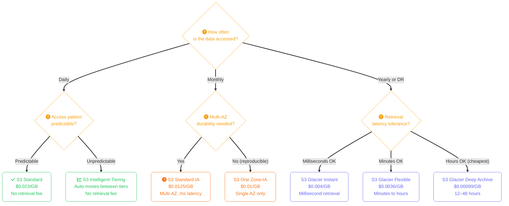
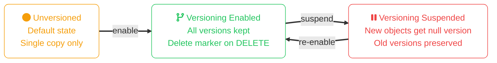
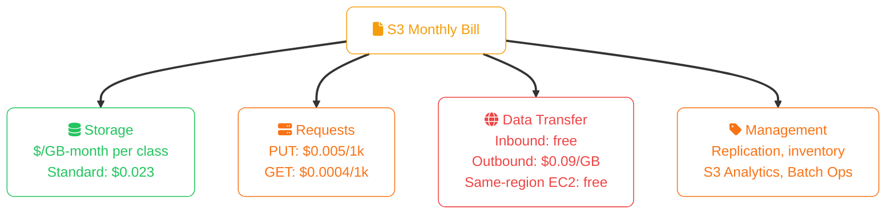

import Callout from '../../../components/mdx/Callout.astro';
import KeyPoints from '../../../components/mdx/KeyPoints.astro';
import Quiz from '../../../components/mdx/Quiz.astro';
import CodeTabs from '../../../components/mdx/CodeTabs.astro';

**Amazon Simple Storage Service (S3)** launched in 2006 and is the archetype every other cloud object storage is measured against. It stores trillions of objects, serves as the backbone of data lakes, static hosting, backup, and application artifact storage, and its pricing model — pay for what you store and what you access — has become the industry standard.

<KeyPoints>
- S3 storage classes with real $/GB numbers and retrieval latency characteristics
- Select the right storage class using the access-frequency decision model
- Create buckets, upload objects, manage prefixes, and configure lifecycle rules with the AWS CLI
- Enable and use versioning for point-in-time recovery and deletion protection
- Write bucket policies that grant least-privilege access while blocking public exposure
- Generate pre-signed URLs to grant temporary, scoped object access without AWS credentials
</KeyPoints>

<Callout type="info" title="Foundation Concepts">
This lesson covers S3-specific operations and pricing. Object storage fundamentals — what buckets and objects are, how 11-nines durability works, storage class trade-offs, and when object storage is the wrong choice — are covered in [Object Storage Concepts](/cloud/common/object-storage-concepts).
</Callout>

---

## S3 Storage Classes

S3 offers seven storage classes optimised for different access patterns. The pricing numbers below are approximate us-east-1 rates:

| Storage Class | $/GB-month | Retrieval Latency | Retrieval Fee | Min Duration | Best For |
|---|---|---|---|---|---|
| **S3 Standard** | $0.023 | ms | None | None | Hot data, active workloads |
| **S3 Intelligent-Tiering** | $0.023 + $0.0025/1k objects | ms–hours | None | None | Unpredictable access patterns |
| **S3 Standard-IA** | $0.0125 | ms | $0.01/GB | 30 days | Monthly-access data, multi-AZ |
| **S3 One Zone-IA** | $0.01 | ms | $0.01/GB | 30 days | Reproducible data, single AZ |
| **S3 Glacier Instant** | $0.004 | ms | $0.03/GB | 90 days | Archive with instant retrieval |
| **S3 Glacier Flexible** | $0.0036 | 1 min–12 hr | $0.01–$0.03/GB | 90 days | Compliance archives |
| **S3 Glacier Deep Archive** | $0.00099 | 12–48 hr | $0.02/GB | 180 days | 7-year retention, DR cold copies |

<Callout type="warning" title="Retrieve Costs Add Up">
Standard-IA and Glacier classes charge a per-GB retrieval fee. A 10 TB restore from Glacier Deep Archive costs ~$204 in retrieval fees alone. Always factor retrieval into TCO before moving data to cheaper tiers.
</Callout>

### Storage Class Decision Flow

---

## Core CLI Operations

<CodeTabs tabs={[
  { label: "AWS CLI", lang: "bash", code: `# Create a bucket (bucket names are globally unique)
aws s3 mb s3://my-company-backups --region us-east-1

# Upload a single file
aws s3 cp report.csv s3://my-company-backups/reports/2024/report.csv

# Upload an entire directory (recursive)
aws s3 cp ./exports/ s3://my-company-backups/exports/ --recursive

# Download a file
aws s3 cp s3://my-company-backups/reports/2024/report.csv ./report.csv

# List objects with a prefix
aws s3 ls s3://my-company-backups/reports/2024/ --human-readable

# Sync a local directory to S3 (only diff)
aws s3 sync ./exports/ s3://my-company-backups/exports/ --delete

# Delete an object
aws s3 rm s3://my-company-backups/reports/2024/report.csv

# Delete all objects with a prefix
aws s3 rm s3://my-company-backups/exports/ --recursive

# Get object metadata
aws s3api head-object \
  --bucket my-company-backups \
  --key reports/2024/report.csv` },
  { label: "Storage Class", lang: "bash", code: `# Upload directly to a specific storage class
aws s3 cp archive.tar.gz s3://my-company-backups/archives/archive.tar.gz \
  --storage-class GLACIER_IR

# Move existing object to Glacier Instant Retrieval
aws s3api copy-object \
  --bucket my-company-backups \
  --copy-source my-company-backups/archives/archive.tar.gz \
  --key archives/archive.tar.gz \
  --storage-class GLACIER_IR

# Check current storage class of an object
aws s3api head-object \
  --bucket my-company-backups \
  --key archives/archive.tar.gz \
  --query StorageClass` },
]} />

---

## Versioning

Versioning keeps every version of every object, making accidental deletes and overwrites recoverable. Once enabled, versioning cannot be disabled — only suspended.

<CodeTabs tabs={[
  { label: "AWS CLI", lang: "bash", code: `# Enable versioning on a bucket
aws s3api put-bucket-versioning \
  --bucket my-company-backups \
  --versioning-configuration Status=Enabled

# List all versions of an object
aws s3api list-object-versions \
  --bucket my-company-backups \
  --prefix reports/2024/report.csv

# Restore a specific version (copy from version to current)
aws s3api copy-object \
  --bucket my-company-backups \
  --copy-source "my-company-backups/reports/2024/report.csv?versionId=abc123xyz" \
  --key reports/2024/report.csv

# Permanently delete a specific version
aws s3api delete-object \
  --bucket my-company-backups \
  --key reports/2024/report.csv \
  --version-id abc123xyz` },
]} />

---

## Lifecycle Rules

Lifecycle rules automate the transition of objects between storage classes and the expiration of old versions. This is the primary mechanism for cost optimisation at scale.

```mermaid
flowchart LR
    accTitle: S3 lifecycle transition flow
    accDescr: How S3 lifecycle rules automatically move objects through storage classes over time, from Standard to Standard-IA to Glacier Instant to Glacier Deep Archive, with optional expiration.
    classDef step fill:none,stroke:#f97316,color:#f97316,rx:8,ry:8
    classDef cold fill:none,stroke:#6366f1,color:#6366f1,rx:8,ry:8
    classDef ok   fill:none,stroke:#22c55e,color:#22c55e,rx:8,ry:8
    classDef fail fill:none,stroke:#ef4444,color:#ef4444,rx:8,ry:8
    linkStyle default stroke-width:2.5px

    UPLOAD["fa:fa-circle-dot Upload<br/>Day 0"]:::ok
    STD["fa:fa-database S3 Standard<br/>Days 0–29<br/>$0.023/GB"]:::ok
    IA["fa:fa-clock Standard-IA<br/>Day 30+<br/>$0.0125/GB"]:::step
    GI["fa:fa-snowflake Glacier Instant<br/>Day 90+<br/>$0.004/GB"]:::cold
    DEEP["fa:fa-archive Glacier Deep Archive<br/>Day 180+<br/>$0.00099/GB"]:::cold
    EXPIRE["fa:fa-trash Expire<br/>Day 365<br/>Object deleted"]:::fail

    UPLOAD --> STD
    STD -->|"+30 days"| IA
    IA -->|"+60 days"| GI
    GI -->|"+90 days"| DEEP
    DEEP -->|"+185 days"| EXPIRE
```

<CodeTabs tabs={[
  { label: "AWS CLI", lang: "bash", code: `# Apply a lifecycle policy from a JSON file
aws s3api put-bucket-lifecycle-configuration \
  --bucket my-company-backups \
  --lifecycle-configuration file://lifecycle.json` },
  { label: "lifecycle.json", lang: "json", code: `{
  "Rules": [
    {
      "ID": "archive-reports",
      "Status": "Enabled",
      "Filter": { "Prefix": "reports/" },
      "Transitions": [
        { "Days": 30,  "StorageClass": "STANDARD_IA" },
        { "Days": 90,  "StorageClass": "GLACIER_IR" },
        { "Days": 180, "StorageClass": "DEEP_ARCHIVE" }
      ],
      "Expiration": { "Days": 365 },
      "NoncurrentVersionExpiration": { "NoncurrentDays": 30 }
    }
  ]
}` },
]} />

---

## Access Control

S3 has two overlapping access control mechanisms. Use **bucket policies** (resource-based, JSON) for cross-account access and service-level rules. Use **IAM policies** (identity-based) for per-user or per-role permissions within your account.

<Callout type="tip" title="Block Public Access First">
Enable S3 Block Public Access at the account level. This is a safety net that overrides any bucket or object ACL that would make data public. It should be on by default for every new account.
</Callout>

<CodeTabs tabs={[
  { label: "Bucket Policy", lang: "json", code: `{
  "Version": "2012-10-17",
  "Statement": [
    {
      "Sid": "AllowAppServerRead",
      "Effect": "Allow",
      "Principal": {
        "AWS": "arn:aws:iam::123456789012:role/AppServerRole"
      },
      "Action": ["s3:GetObject", "s3:ListBucket"],
      "Resource": [
        "arn:aws:s3:::my-company-backups",
        "arn:aws:s3:::my-company-backups/*"
      ]
    },
    {
      "Sid": "DenyUnencryptedPuts",
      "Effect": "Deny",
      "Principal": "*",
      "Action": "s3:PutObject",
      "Resource": "arn:aws:s3:::my-company-backups/*",
      "Condition": {
        "StringNotEquals": {
          "s3:x-amz-server-side-encryption": "aws:kms"
        }
      }
    }
  ]
}` },
  { label: "AWS CLI", lang: "bash", code: `# Apply the bucket policy
aws s3api put-bucket-policy \
  --bucket my-company-backups \
  --policy file://bucket-policy.json

# Enable Block Public Access (account level)
aws s3control put-public-access-block \
  --account-id 123456789012 \
  --public-access-block-configuration \
    BlockPublicAcls=true,\
    IgnorePublicAcls=true,\
    BlockPublicPolicy=true,\
    RestrictPublicBuckets=true

# Check effective permissions on an object
aws s3api get-object-acl \
  --bucket my-company-backups \
  --key reports/2024/report.csv` },
]} />

---

## Pre-Signed URLs

Pre-signed URLs grant time-limited, scoped access to a single object without requiring the recipient to have AWS credentials. The URL embeds the signer's credentials and an expiry timestamp.

<CodeTabs tabs={[
  { label: "AWS CLI", lang: "bash", code: `# Generate a GET pre-signed URL (valid for 1 hour)
aws s3 presign s3://my-company-backups/reports/2024/report.csv \
  --expires-in 3600

# Generate a PUT pre-signed URL (allow upload without credentials)
aws s3api generate-presigned-url \
  --bucket my-company-backups \
  --key uploads/user-123/photo.jpg \
  --method PUT \
  --expires-in 900` },
  { label: "Python (boto3)", lang: "python", code: `import boto3

s3 = boto3.client('s3', region_name='us-east-1')

# GET URL — share a download link
download_url = s3.generate_presigned_url(
    'get_object',
    Params={'Bucket': 'my-company-backups', 'Key': 'reports/2024/report.csv'},
    ExpiresIn=3600
)

# PUT URL — allow client-side direct upload
upload_url = s3.generate_presigned_url(
    'put_object',
    Params={
        'Bucket': 'my-company-backups',
        'Key': 'uploads/user-123/photo.jpg',
        'ContentType': 'image/jpeg',
    },
    ExpiresIn=900
)` },
]} />

<Callout type="warning">
Pre-signed URLs are valid until they expire even if you rotate the signer's IAM credentials. Revoke access by either deactivating the signing IAM key or making the object private before the URL expires.
</Callout>

---

## S3 Pricing Model

S3 billing has four independent components — storage is often the smallest part:

<Callout type="tip" title="Egress is the Hidden Cost">
Data transfer **out** to the internet costs $0.09/GB. A 10 TB dataset served to users costs ~$920/month in egress alone. Use CloudFront to cache objects at edge locations and dramatically reduce egress charges for high-traffic assets.
</Callout>

---

<Quiz
  question="An application uploads 10,000 objects daily. Most are accessed frequently in the first 7 days, then rarely. Which storage class configuration minimises cost without manual transitions?"
  options={[
    { label: "S3 Standard for all objects" },
    { label: "S3 Intelligent-Tiering", correct: true },
    { label: "S3 Standard-IA for all objects" },
    { label: "S3 Glacier Instant Retrieval" },
  ]}
  explanation="S3 Intelligent-Tiering automatically monitors access patterns and moves objects between Standard and IA tiers at no retrieval fee, making it ideal when access patterns shift unpredictably. Standard-IA would charge retrieval fees on the frequent early accesses."
/>

<Quiz
  question="A lifecycle rule transitions objects to Standard-IA after 30 days, then deletes them after 60 days. An object uploaded on Jan 1 is deleted on Jan 50 via the lifecycle expiration. What minimum-duration charge applies?"
  options={[
    { label: "No extra charge — the lifecycle rule deleted it" },
    { label: "Standard-IA 30-day minimum: billed for 10 extra days", correct: true },
    { label: "Standard 30-day minimum applies" },
    { label: "Glacier 90-day minimum applies" },
  ]}
  explanation="Standard-IA has a 30-day minimum storage duration. The object was in Standard-IA for 20 days (days 30–50), so AWS bills for the remaining 10 days. Always account for minimum durations when designing lifecycle policies."
/>
