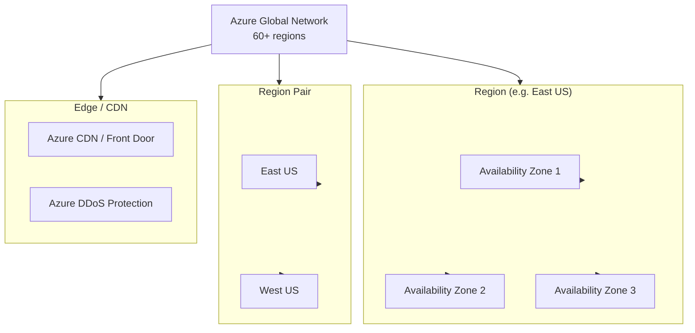
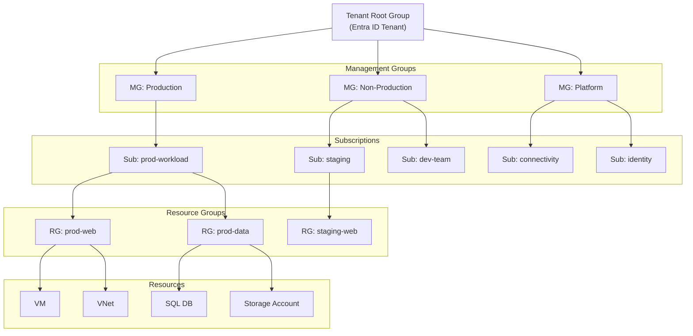
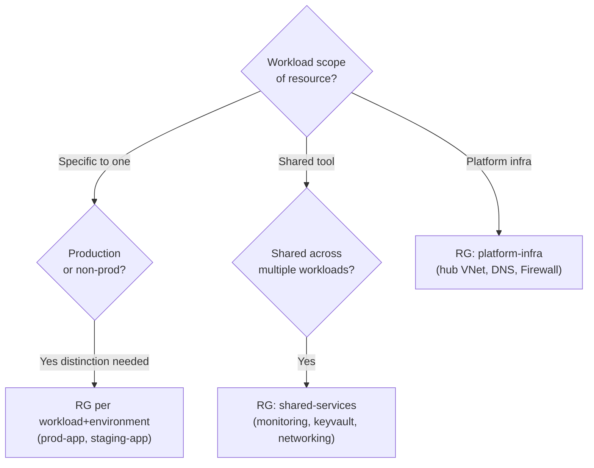
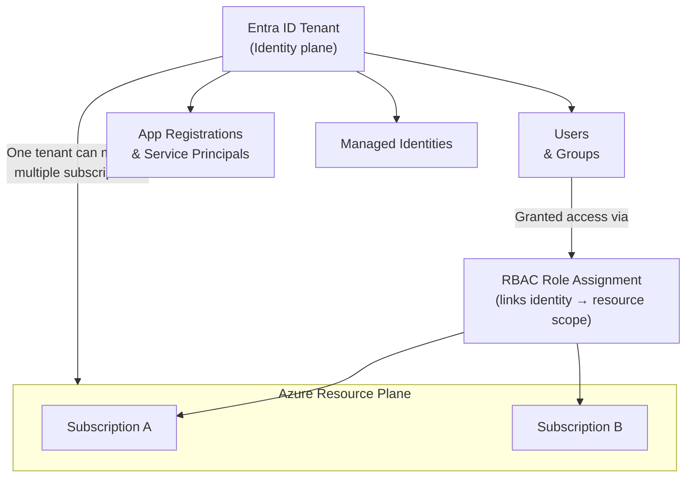
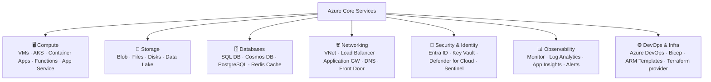
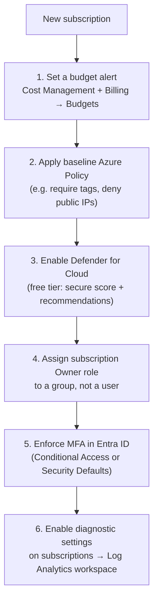

import Callout from '../../../components/mdx/Callout.astro';
import KeyPoints from '../../../components/mdx/KeyPoints.astro';
import Quiz from '../../../components/mdx/Quiz.astro';
import List from '../../../components/mdx/List.astro';

Microsoft Azure is the second largest cloud platform in the world, launched in 2010. It has a particularly strong foothold in enterprise environments due to its deep integration with Microsoft's existing ecosystem — Entra ID (formerly Active Directory), Microsoft 365, Windows Server, and .NET. Understanding Azure's management hierarchy is critical before deploying anything — it's where billing, governance, and access control all intersect.

<Callout type="info">
**Foundation concepts first.** This lesson covers Azure-specific structure. For universal cloud networking concepts (VNet, subnets, routing), see **Cloud Networking Basics**. For identity and access management concepts, see **IAM Foundations** — both are linked above as shared concepts.
</Callout>

<KeyPoints>
- Azure's region, Availability Zone, and region-pair model
- The unique 4-level management hierarchy: Management Groups → Subscriptions → Resource Groups → Resources
- Core Azure service categories and their key services
- Entra ID tenants and why they're separate from subscriptions
- How to configure the Azure CLI and authenticate securely
- The first actions to take on every new Azure subscription
</KeyPoints>

---

## Azure Global Infrastructure

Azure organises infrastructure into regions, Availability Zones, and a unique concept called **region pairs** — two regions that Azure treats as a disaster recovery unit.



| Layer | Count | Purpose |
|---|---|---|
| **Regions** | 60+ | Geographic isolation, data residency, latency |
| **Availability Zones** | 3 per region (where supported) | Fault isolation — separate power/cooling/network |
| **Region Pairs** | ~30 pairs | Sequential update waves, data replication target |
| **Azure Front Door PoPs** | 170+ | Global CDN, anycast routing, DDoS mitigation |

**Region pairs** are an Azure-specific concept. When Microsoft applies platform updates, it updates one region in each pair before the other, so you're never in a state where both are simultaneously under maintenance. Geo-redundant storage (GRS) replicates to the paired region automatically.

---

## The Azure Management Hierarchy

This is where Azure differs significantly from AWS. Azure has a **four-level hierarchy** that controls governance, access, and billing. Every resource lives inside this hierarchy.



| Level | Purpose | Key fact |
|---|---|---|
| **Management Group** | Policy + RBAC at scale | SCP-equivalent = **Azure Policy** applied at MG level |
| **Subscription** | Billing unit + service quota boundary | Every Azure resource belongs to exactly one subscription |
| **Resource Group** | Logical container for a workload | Shared lifecycle — delete the RG and all resources inside are deleted |
| **Resource** | The actual service | VM, VNet, Storage Account, SQL Database, etc. |

<Callout type="tip">
**Resource Groups are mandatory.** Unlike AWS (where most resources exist independently), every Azure resource lives in a Resource Group. This makes lifecycle management clean — but it also means you must design your RG strategy before deploying.
</Callout>

**Resource Group design patterns:**



---

## Entra ID: Identity Is Separate From Resources

Azure's identity system — **Microsoft Entra ID** (formerly Azure Active Directory) — operates as a separate layer from the resource hierarchy. This is a common point of confusion.



Key distinctions:

| Concept | What it is |
|---|---|
| **Entra ID Tenant** | The identity directory — users, groups, app registrations, SSO config |
| **Subscription** | The billing + resource container — attached to a tenant |
| **RBAC Role Assignment** | The link between an identity (user/service principal/managed identity) and a resource scope |
| **Service Principal** | Non-human identity for apps and automation |
| **Managed Identity** | Service principal managed by Azure for a specific resource (VM, Function, etc.) |

For the identity evaluation model (AuthN → AuthZ → Explicit Deny), see the [IAM Foundations](/cloud/common/iam-concepts) lesson.

---

## Core Azure Service Categories



The main difference from AWS in naming:

| Concept | AWS name | Azure name |
|---|---|---|
| Virtual machine | EC2 | Virtual Machine (VM) |
| Object storage | S3 | Blob Storage |
| Managed Kubernetes | EKS | AKS |
| Serverless | Lambda | Azure Functions |
| Identity service | IAM | Entra ID (+ RBAC) |
| Infra-as-code | CloudFormation | Bicep / ARM Templates |
| Monitoring | CloudWatch | Azure Monitor / Log Analytics |

---

## Subscription Bootstrap: Your First Actions



<Callout type="warning">
**Avoid subscription Owner assigned directly to a user.** If that person leaves, you may lose admin access. Assign Owner to a group (e.g. `sub-platform-admins`) and manage membership there. Use Privileged Identity Management (PIM) for just-in-time elevation.
</Callout>

---

## The Azure CLI

```bash
# Install (macOS)
brew install azure-cli

# Install (Linux)
curl -sL https://aka.ms/InstallAzureCLIDeb | sudo bash

# Authenticate (interactive, browser-based)
az login

# Authenticate (service principal — CI/CD)
az login --service-principal \
  --username $APP_ID \
  --password $CLIENT_SECRET \
  --tenant $TENANT_ID

# Set default subscription
az account set --subscription "my-subscription-name"

# Verify identity
az account show
```

**Essential first commands:**

```bash
# List all subscriptions the account can access
az account list --output table

# List resource groups in current subscription
az group list --output table

# List all resources in a resource group
az resource list --resource-group prod-web --output table

# Check your current role assignments
az role assignment list --assignee $(az account show --query user.name -o tsv)
```

<Callout type="tip">
**Use `--output table`** for human-readable CLI output. Use `--output json` combined with `jq` for scripting. The default output is JSON, which is verbose for interactive use.
</Callout>

---

## Knowledge Check

<Quiz
  question="You grant a user the Contributor role at the Management Group level. What resources can the user manage?"
  options={[
    "Only resources in the Management Group itself",
    "All subscriptions, resource groups, and resources that are descendants of that Management Group",
    "Only subscriptions directly under that Management Group, not their resource groups",
    "Only resource groups — subscriptions require separate role assignments"
  ]}
  answer="All subscriptions, resource groups, and resources that are descendants of that Management Group"
  explanation="Azure RBAC role assignments inherit downward through the hierarchy. A Contributor role at the Management Group level propagates to all child Management Groups, subscriptions, resource groups, and resources under it. This is why Management Group-level role assignments must be reserved for trusted principals — the blast radius is the entire subtree."
/>

---

<KeyPoints title="Azure Intro Checklist">
- Subscription bootstrap: budget alert → Azure Policy baseline → Defender for Cloud → MFA enforced
- Management hierarchy memorised: Tenant Root → Management Groups → Subscriptions → Resource Groups → Resources
- RBAC assignments on groups, not individual users; use PIM for elevated access
- Every resource must be in a Resource Group — design the RG strategy by workload + environment
- Entra ID tenant is separate from subscriptions — understand the Service Principal / Managed Identity distinction
- Azure CLI configured: `az login`, default subscription set, identity verified with `az account show`
</KeyPoints>
