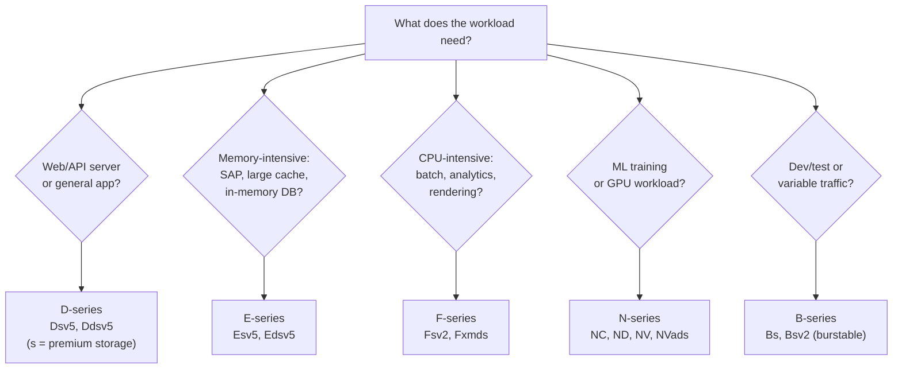
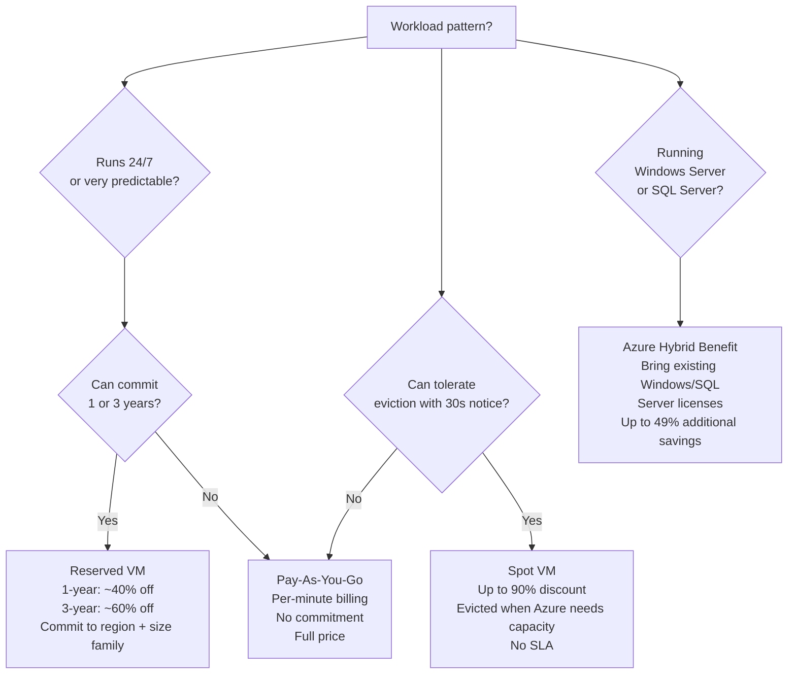
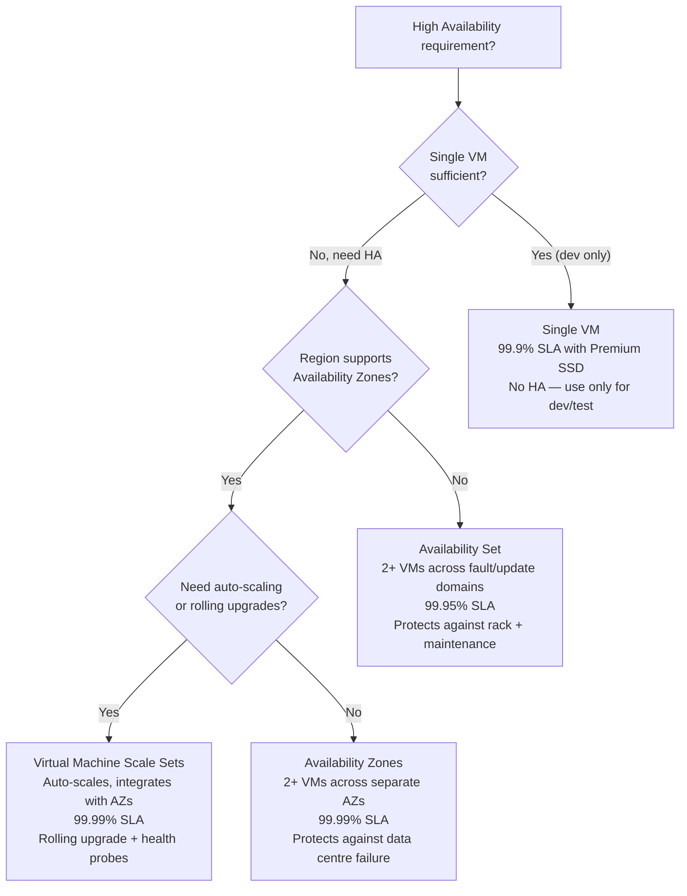
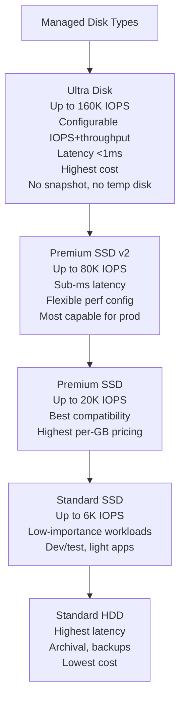
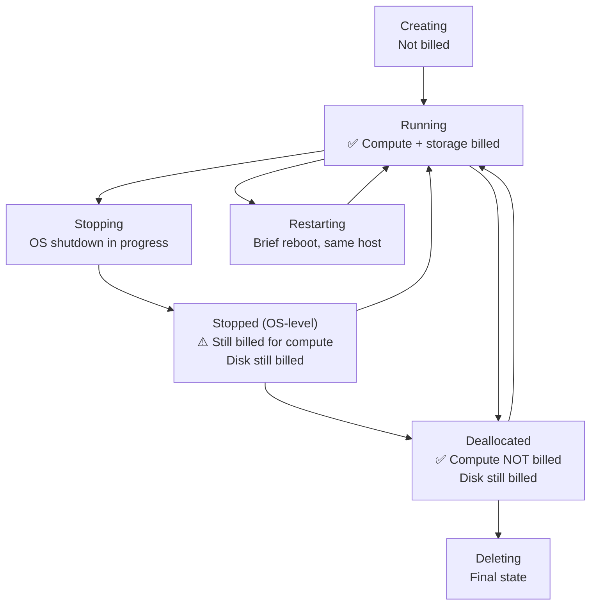
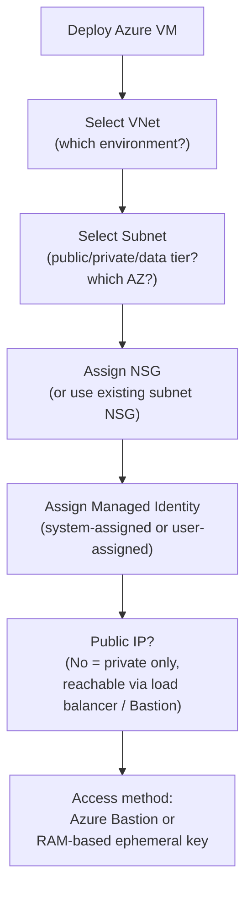

import Callout from '../../../components/mdx/Callout.astro';
import KeyPoints from '../../../components/mdx/KeyPoints.astro';
import Quiz from '../../../components/mdx/Quiz.astro';
import CodeTabs from '../../../components/mdx/CodeTabs.astro';

Azure Virtual Machines are Azure's Infrastructure-as-a-Service compute offering. You get full OS control, your choice of image, CPU/memory configuration, storage type, and network placement — identical in concept to AWS EC2 but with Azure-specific naming, pricing, and availability constructs.

<KeyPoints>
- How the Azure VM size naming convention decodes SKU capabilities
- VM series and which workload categories each serves
- Pricing models: Pay-As-You-Go, Reserved, Spot, and Azure Hybrid Benefit
- Availability options: Availability Sets, Availability Zones, and Virtual Machine Scale Sets
- Storage types: managed disk tiers and their performance characteristics
- Network placement: VNet, subnet selection, NSG, and managed identity attachment
</KeyPoints>

---

## VM Size Naming Convention

Azure VM size names follow a structured format — once you know it, you can decode any SKU without documentation.

```
D   a  s  _  v5  _  Standard
│   │  │       │
│   │  └───────┴── Capabilities: s=premium storage, d=temp NVMe disk, l=low memory
│   └────────────── CPU type: a=AMD, nothing=Intel, p=ARM (Ampere)  
└────────────────── Series: D=general, E=memory, F=compute, N=GPU, B=burstable
                    Version: v5 = 5th generation
```

**VM series:**

| Series | Optimised for | Typical use |
|---|---|---|
| **D** (general) | Balanced CPU/memory | Web/app servers, dev environments |
| **E** (memory) | High memory-to-vCPU ratio | In-memory DBs, SAP HANA, large caches |
| **F** (compute) | High CPU-to-memory | Batch processing, analytics, gaming servers |
| **B** (burstable) | Low baseline + burst | Dev/test, low-traffic apps |
| **N** (GPU) | NVIDIA or AMD GPU | ML training, rendering, VDI |
| **L** (storage) | High local NVMe throughput | Big data, Elasticsearch, Cassandra |

---

## Choosing the Right VM Size



<Callout type="tip">
**Prefer `s` (premium storage) suffix for production.** `Standard_D4s_v5` supports Premium SSD managed disks with guaranteed IOPS. The non-`s` variant doesn't. For databases and stateful workloads, always use the `s` variant.
</Callout>

---

## Pricing Models



| Model | Discount | Best for |
|---|---|---|
| **Pay-As-You-Go** | — | Unpredictable workloads, proof-of-concept |
| **Reserved VM** | 40–60% | Steady 24/7 production workloads |
| **Spot VM** | Up to 90% | Batch processing, fault-tolerant pipelines, dev builds |
| **Azure Hybrid Benefit** | Up to 49% extra | Orgs with Software Assurance Windows/SQL Server licenses |

---

## Availability Options

Azure offers three different mechanisms for VM high availability. Choosing the wrong one is a common architecture mistake.



<Callout type="warning">
**Availability Sets do not protect against AZ failure.** They protect against rack failure and platform maintenance windows within a single data centre. Use Availability Zones for true DC-level fault tolerance. Availability Sets are a legacy option — prefer AZs for any new deployment in a region that supports them.
</Callout>

---

## Managed Disks

Azure Managed Disks are the equivalent of AWS EBS. Azure manages the storage account underneath — you just choose the performance tier.



**Disk placement rules:**
- OS disk: Premium SSD minimum for production
- Data disks: Attached per VM — SKU determines max disk count and IOPS cap
- Temp disk (D: / /dev/sdb): Local ephemeral storage — lost on stop/deallocate; never store persistent data here

---

## VM Lifecycle and Billing



<Callout type="warning">
**Stopped ≠ Deallocated in Azure.** If you stop a VM from inside the OS (e.g. `shutdown -h now`), Azure puts it in **Stopped** state — you are still charged for compute. Use `az vm deallocate` or the Azure portal **Stop** button to fully deallocate and stop compute charges. Managed disk charges always apply.
</Callout>

---

## Network Placement and Security

<Callout type="info">
**VNet, subnet, and NSG fundamentals** are covered in the [Cloud Networking Basics](/cloud/common/networking-basics) shared lesson. This section covers the Azure VM-specific decisions.
</Callout>



**VM network checklist:**

| Decision | Production default |
|---|---|
| Subnet | Private — app tier |
| Public IP | None — load balancer or Application Gateway does the public termination |
| NSG | Deny all inbound by default; allow only from load balancer |
| Identity | System-assigned Managed Identity — no credentials to manage |
| SSH/RDP access | Azure Bastion — no public port 22/3389, full audit trail |

---

## Knowledge Check

<Quiz
  question="You shut down an Azure VM from inside Windows (Start → Shut Down). What happens to billing?"
  options={[
    "Compute and disk billing both stop immediately",
    "Compute billing stops; disk billing continues",
    "Compute billing continues; disk billing stops",
    "Both compute and disk billing continue until you deallocate from the portal or CLI"
  ]}
  answer="Both compute and disk billing continue until you deallocate from the portal or CLI"
  explanation="An OS-level shutdown puts the VM in Stopped state, not Deallocated. In Stopped state, Azure has still reserved the underlying physical hardware for that VM — so compute charges continue. To release the hardware and stop compute billing, you must Deallocate the VM using the Azure portal Stop button, the Azure CLI (az vm deallocate), or Azure PowerShell. Managed disk charges always apply regardless of VM state."
/>

---

<KeyPoints title="Azure VM Checklist">
- Decode VM size names: Series + CPU type + capabilities + generation (`Standard_D4s_v5`)
- Use `s` suffix (premium storage capability) for all production workloads
- Pricing: Pay-As-You-Go → Reserved for steady state, Spot for interruptible batch, Hybrid Benefit for licensed Windows/SQL
- Availability Zones for new deployments (99.99% SLA); Availability Sets only for legacy/regions without AZ support
- Stop vs Deallocate: OS shutdown = Stopped = still billed; portal Stop = Deallocated = compute billing stops
- Managed disks: Premium SSD v2 for prod databases, Standard SSD for non-critical, never use temp disk for persistent data
- Network: private subnet, no public IP on VM, Managed Identity for service credentials, Azure Bastion for access
</KeyPoints>
