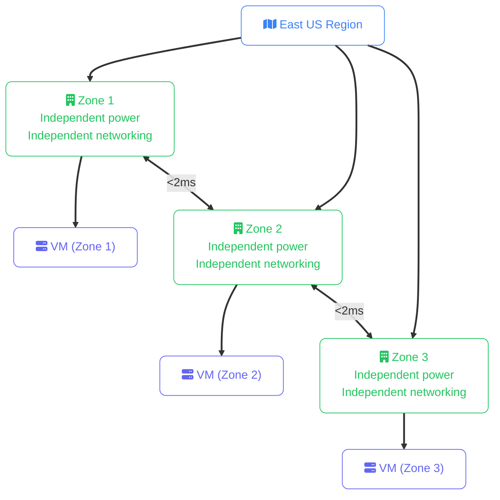
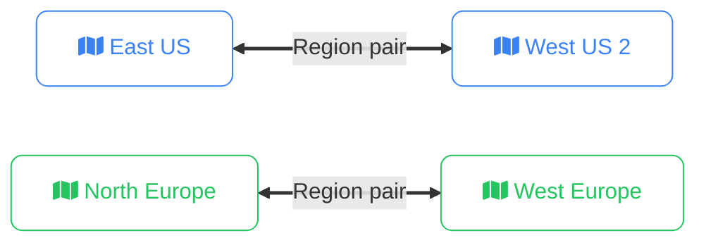

import Callout from '../../../components/mdx/Callout.astro';
import KeyPoints from '../../../components/mdx/KeyPoints.astro';
import Quiz from '../../../components/mdx/Quiz.astro';
import CodeTabs from '../../../components/mdx/CodeTabs.astro';

Azure spans 60+ regions worldwide — more than any other cloud provider — and adds a layer AWS doesn't have: **region pairs**, two regions that Microsoft treats as a coordinated disaster recovery unit. Understanding where Azure puts your resources and what redundancy options exist at each scope is essential before deploying anything.

<KeyPoints>
- How Azure region names map to physical locations and how to find them with the CLI
- The difference between Availability Zones and Availability Sets — and when to use each
- What region pairs are and how Azure uses them for rolling updates and DR
- Which services are global, regional, or zonal — and what resilience work falls on you
- Azure sovereign clouds (Government, China) and when they apply
</KeyPoints>

---

## Region Naming

Azure region names are human-readable, not code-style like AWS. They follow a `{direction}{geography}` pattern:

| Region name | Location | Notes |
|---|---|---|
| `eastus` | Virginia, USA | Primary US East — largest, most services |
| `eastus2` | Virginia, USA | Secondary US East — commonly paired with `eastus` |
| `westus3` | Arizona, USA | US West |
| `westeurope` | Netherlands | Primary West Europe hub |
| `northeurope` | Ireland | Secondary Europe — GDPR-suitable |
| `uksouth` | London | UK data residency |
| `germanywestcentral` | Frankfurt | German compliance workloads |
| `southeastasia` | Singapore | Primary Southeast Asia |
| `japaneast` | Tokyo | Japan |
| `australiaeast` | New South Wales | Australia |
| `brazilsouth` | São Paulo | South America |

<Callout type="tip">
Use `az account list-locations --output table` to see the full region list with their display names, short names, and paired region. The `name` field (e.g. `eastus`) is what you use in CLI commands and ARM templates.
</Callout>

---

## Availability Zones

Azure Availability Zones are **numbered 1, 2, 3** — not letters like AWS. Critically, not every Azure region has Availability Zones — you must verify for your target region.



**Check if a region has AZs before you design your architecture:**

```bash
az vm list-skus \
  --location eastus \
  --zone \
  --query "[?name=='Standard_D4s_v5'].locationInfo[*].zones" \
  --output table
```

### Availability Sets (Legacy Redundancy)

Before AZs, Azure used **Availability Sets** — a logical grouping of VMs that Azure spreads across **fault domains** (separate physical racks with independent power and networking) and **update domains** (groups of VMs updated in sequence during maintenance).

| Feature | Availability Sets | Availability Zones |
|---|---|---|
| Scope | Single data center | Physically separate data centers |
| Protection against | Rack failure, planned maintenance | Data center failure |
| SLA | 99.95% | 99.99% |
| Use today? | Legacy workloads without AZ support | Preferred for new deployments |

<Callout type="warning">
Availability Sets and Availability Zones are **mutually exclusive** — a VM cannot be in both. For new deployments in regions that support AZs, always use Availability Zones. Availability Sets only exist for backward compatibility (or VMs in regions without AZ support).
</Callout>

---

## Region Pairs

Azure pairs each region with a second region in the same geography. Microsoft uses these pairs for **coordinated rolling updates** and as the default target for geo-redundant storage replication.



**What region pairs give you:**

| Guarantee | Detail |
|---|---|
| **Sequential platform updates** | Azure never updates both paired regions at the same time |
| **Data residency** | Paired regions are in the same geography (except Brazil South) |
| **GRS replication target** | Geo-Redundant Storage automatically replicates to the paired region |
| **DR priority** | During a region-wide outage, the paired region gets recovery priority |

<Callout type="info">
Region pairs are defined by Microsoft — you cannot choose your own. If your workload requires a specific secondary region (e.g. for compliance), use **Zone-Redundant Storage** with geo-replication configured to your target, rather than relying on the pair default.
</Callout>

---

## Service Scope

| Scope | Service examples | Resilience work falls on |
|---|---|---|
| **Global** | Entra ID, Azure DNS, Traffic Manager, Azure Front Door | None — Microsoft managed |
| **Regional** | VNet, Blob Storage (LRS), Azure Functions, AKS | Choose region wisely; AZ-redundant options available |
| **Zonal** | VM (pinned to zone), Standard Load Balancer (zone), Managed Disk (zone) | You deploy across zones and use a zone-redundant LB |

Azure Blob Storage has multiple redundancy options you pick at creation time:

| Redundancy | Acronym | Copies | Scope |
|---|---|---|---|
| Locally redundant | LRS | 3 | Single data center |
| Zone-redundant | ZRS | 3 | 3 AZs in same region |
| Geo-redundant | GRS | 6 | Primary region + paired region |
| Geo-zone-redundant | GZRS | 6 | 3 AZs in primary + paired region |

---

## Sovereign Clouds

Azure operates separate, isolated environments for government and regulated markets:

| Cloud | Regions | Operated by | Use case |
|---|---|---|---|
| **Azure Government** | `usgovvirginia`, `usgovarizona` | Microsoft | US federal / state / DoD — FedRAMP, IL5 |
| **Azure China** | `chinanorth3`, `chinaeast3` | 21Vianet | China workloads — separate account, separate portal |
| **Azure Germany** | `germanynorth` | Microsoft | German data trustee requirements |

<Callout type="warning">
Azure Government and Azure China use separate portals and separate Azure CLI login endpoints. You cannot transfer resources between sovereign clouds and the public cloud. Design this into your architecture from day one if it's a requirement.
</Callout>

---

## Working with Regions in the CLI

```bash
# List all regions with display names and paired regions
az account list-locations \
  --query "[].{Name:name,DisplayName:displayName,Pair:metadata.pairedRegion[0].name}" \
  --output table

# Set the default region for all CLI commands
az configure --defaults location=eastus

# Check AZ support for a VM SKU in a region
az vm list-skus \
  --location eastus \
  --size Standard_D4s_v5 \
  --query "[].{Name:name,Zones:locationInfo[0].zones}" \
  --output table

# Deploy a VM pinned to Zone 2
az vm create \
  --resource-group my-rg \
  --name my-vm \
  --image UbuntuLTS \
  --zone 2 \
  --location eastus
```

<Callout type="tip">
Always specify `--location` explicitly in scripts and ARM templates rather than relying on `az configure --defaults`. Explicit is safer in automation — a misconfigured default won't quietly deploy resources to the wrong region.
</Callout>

---

<Quiz
  question="An Azure VM is deployed in `eastus` without specifying an Availability Zone, and a second VM is deployed in `eastus` Zone 2. What level of redundancy do you have?"
  options={[
    { label: "Full multi-zone redundancy — both VMs are in East US" },
    { label: "No redundancy — both VMs are in the same region" },
    { label: "Partial — the non-zonal VM may be in any physical location; a zone outage could take down both if they share infrastructure", correct: true },
    { label: "The non-zonal VM is automatically assigned to Zone 1 by Azure" },
  ]}
  explanation="A VM deployed without a zone specification is placed in a single location chosen by Azure — it is not zone-redundant. It could share physical infrastructure with Zone 2, meaning a zone failure could affect both VMs. For reliable multi-zone redundancy, pin all VMs to explicit, different zones (e.g. Zone 1 and Zone 3) and put them behind a Standard Load Balancer with zone redundancy enabled."
/>
