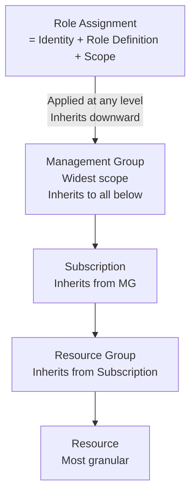
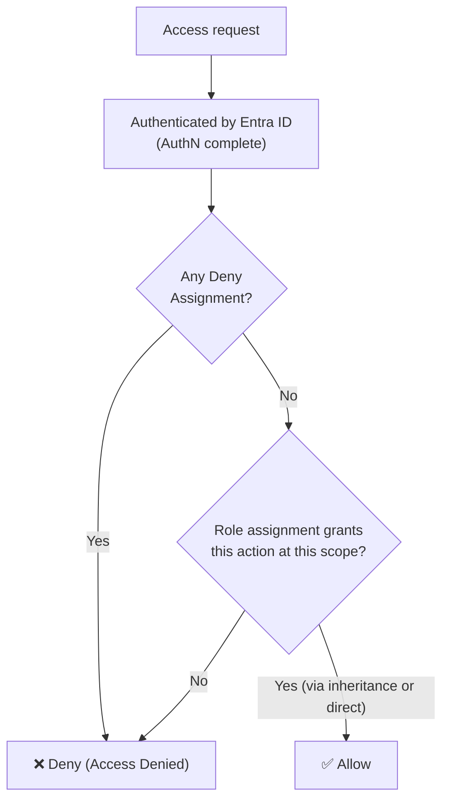
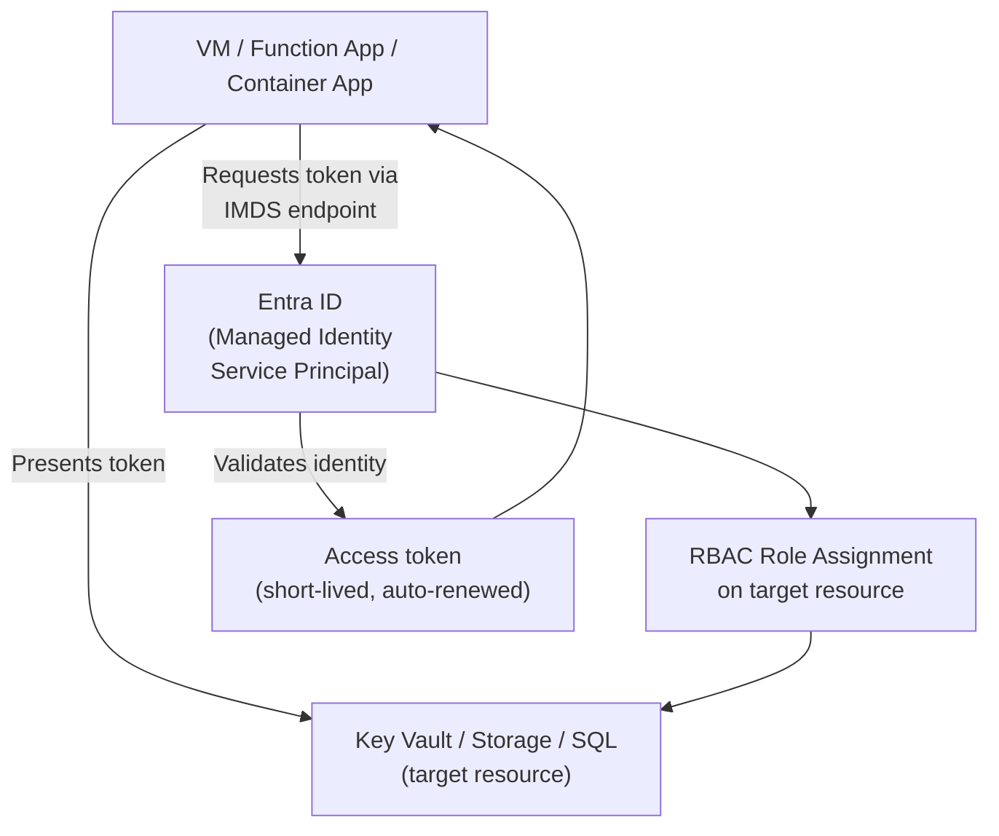
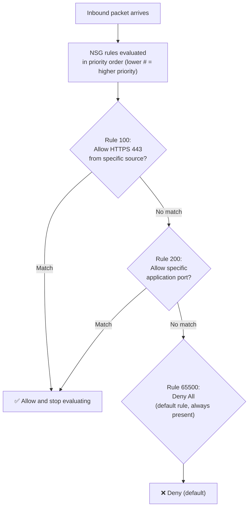
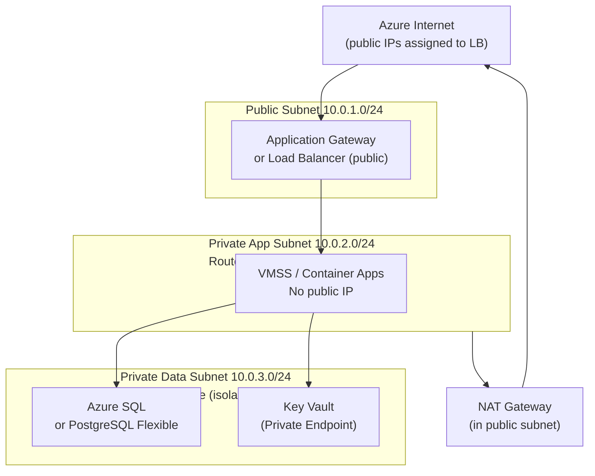
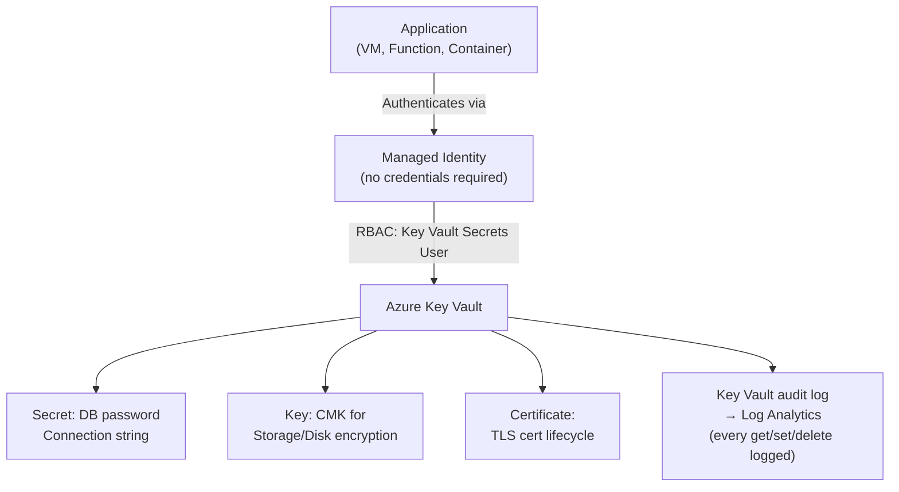
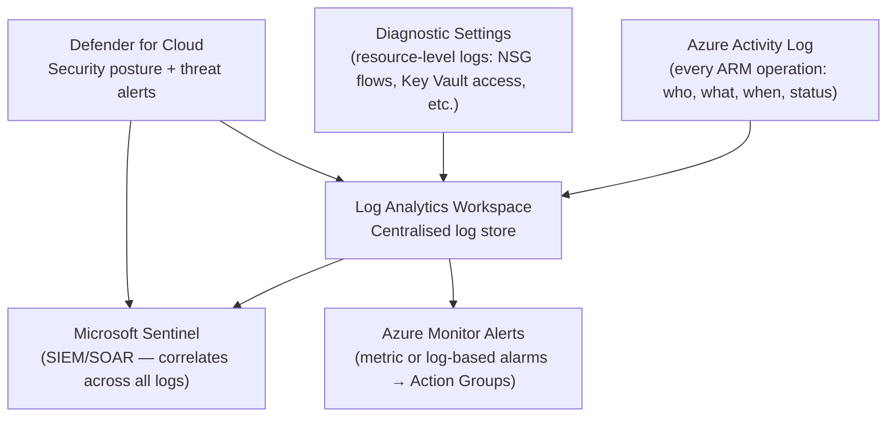

import Callout from '../../../components/mdx/Callout.astro';
import KeyPoints from '../../../components/mdx/KeyPoints.astro';
import Quiz from '../../../components/mdx/Quiz.astro';
import CodeTabs from '../../../components/mdx/CodeTabs.astro';

This lesson maps Azure-specific controls to the security principles in [Security Foundations](/cloud/common/security-foundations). Each section follows the pattern: **principle → the Azure tool that implements it**.

<KeyPoints>
- How Azure RBAC implements least privilege across the management hierarchy
- Managed Identities — the Azure-native way to eliminate credentials on services
- NSG priority evaluation and how to implement default-deny segmentation
- VNet three-tier design: public-facing, private app, and private data subnets
- Azure Key Vault for secrets, keys, and certificates
- Azure Monitor + Defender for Cloud as the Azure traceability and threat detection layer
</KeyPoints>

---

## Azure RBAC: Implementing Least Privilege

The security-foundations lesson defines **least privilege** as the principle. Azure RBAC enforces it via role assignments across the management hierarchy.

### RBAC Scope Hierarchy



**Built-in roles — the ones you'll use most often:**

| Role | What it can do |
|---|---|
| **Owner** | Full control + manages access. Reserve for platform team. |
| **Contributor** | Create/manage resources, cannot manage access |
| **Reader** | Read-only. Assign to auditors, developers needing read access. |
| **User Access Administrator** | Manage access only (assign roles) — rare |
| **Resource-specific built-in** | e.g. `Key Vault Secrets User`, `Storage Blob Data Reader` — always prefer these over Contributor |

<Callout type="warning">
**Avoid assigning Contributor at the Subscription level to individuals.** Use Contributor at the Resource Group level, scoped to specific workloads. For elevated access, use Privileged Identity Management (PIM) for just-in-time activation with approval and time limits.
</Callout>

### RBAC Evaluation Flow



The default is **implicit deny** — a user with no role assignments cannot do anything. Like AWS IAM, explicit deny assignments (deny assignments) override all allows.

---

## Managed Identities: Eliminating Credentials from Services

The security principle: **machine-to-machine authentication should use rotating, short-lived credentials — never stored secrets**.

Azure Managed Identities give every Azure resource a service principal in Entra ID — managed entirely by Azure.



**System-assigned vs user-assigned:**

| | System-assigned | User-assigned |
|---|---|---|
| Lifecycle | Tied to the resource — deleted with it | Independent, can be shared across resources |
| Use when | Single resource, unique identity | Multiple resources sharing same permissions (e.g. all workers in a job) |

```bash
# Assign a role to a managed identity via CLI
az role assignment create \
  --assignee-object-id $(az vm show -g rg-prod -n myvm --query identity.principalId -o tsv) \
  --role "Key Vault Secrets User" \
  --scope "/subscriptions/$SUB_ID/resourceGroups/rg-prod/providers/Microsoft.KeyVault/vaults/prod-kv"
```

---

## NSGs: Default-Deny Network Segmentation

The security-foundations principle: **default-deny segmentation with explicit allows**. NSGs implement this for Azure VNets.

### NSG Priority Evaluation



**NSG rule structure:**

| Field | Example | Notes |
|---|---|---|
| Priority | 100 | 100–4096; lower = evaluated first |
| Direction | Inbound / Outbound | Separate rule sets |
| Source | IP, CIDR, Service Tag, or Application Security Group |
| Port | 443, 8080–8090, * | |
| Protocol | TCP, UDP, Any | |
| Action | Allow / Deny | |

**Application Security Groups (ASGs)** are Azure's equivalent to AWS Security Group source references — instead of IP ranges, you reference a named group of VMs:

```
Load Balancer backend pool → tagged with ASG: asg-web
App servers → tagged with ASG: asg-app  
Databases → tagged with ASG: asg-db

NSG rule: Allow 8080 from asg-web to asg-app
NSG rule: Allow 1433 from asg-app to asg-db
```

<Callout type="info">
Apply NSGs at both the **subnet level** (broad tier enforcement) and the **NIC level** (per-VM fine-grained rules) when compliance requires micro-segmentation. Both NSGs are evaluated — the subnet NSG first, then the NIC NSG.
</Callout>

---

## VNet Three-Tier Design

<Callout type="info">
**CIDR, routing tables, NAT, and AZ placement** are covered in the [Cloud Networking Basics](/cloud/common/networking-basics) shared lesson. This section shows the Azure-specific implementation.
</Callout>



**Private Endpoints** — a key Azure security pattern: instead of accessing Key Vault or Storage over the public internet, deploy a Private Endpoint inside your VNet. The service gets a private IP in your subnet, and DNS resolves to that private IP automatically via Private DNS Zones.

---

## Key Vault: Secrets, Keys, and Certificates

The security principle: **never store secrets in code, config, or environment variables**. Key Vault centralises and audits secret access.



**Key Vault access model:**

```bash
# Grant a managed identity access to read secrets only
az keyvault set-policy \
  --name prod-kv \
  --object-id $MANAGED_IDENTITY_PRINCIPAL_ID \
  --secret-permissions get list

# Preferred: use RBAC model (not vault access policies)
az role assignment create \
  --role "Key Vault Secrets User" \
  --assignee $MANAGED_IDENTITY_PRINCIPAL_ID \
  --scope /subscriptions/$SUB/resourceGroups/rg/providers/Microsoft.KeyVault/vaults/prod-kv
```

<Callout type="tip">
**Use the Key Vault RBAC permission model, not vault access policies.** RBAC integrates with Entra ID PIM (just-in-time elevation), supports audit via activity logs, and is consistent with the rest of Azure's access control model. Vault access policies are the legacy model.
</Callout>

---

## Azure Monitor + Defender for Cloud: Traceability

The security principle: **every privileged action must be traceable and anomalies must trigger alerts**.



**High-priority alerts to configure:**

| Alert | Detection target |
|---|---|
| Subscription Owner assignment | Privilege escalation |
| NSG rule opens `0.0.0.0/0` any port | Accidental exposure |
| Key Vault secret accessed from new IP | Credential harvesting |
| Bulk delete of resources | Destructive action / ransomware |
| MFA-less sign-in to privileged role | Credential compromise |
| `az login` from unusual location | Account takeover indicator |

**Defender for Cloud** (free tier = Secure Score + recommendations; paid = per-resource threat detection):
- Secure Score shows percentage of controls met — use it as a living checklist
- Enable at the subscription level immediately after creation
- Enable enhanced security for any subscription running production workloads

---

## Azure Security Hardening Script

```bash
#!/bin/bash
# Baseline security for a new Azure subscription

SUB_ID=$(az account show --query id -o tsv)

# 1. Enable Defender for Cloud (basic plan)
az security auto-provisioning-setting update \
  --name mma --auto-provision on

# 2. Enable diagnostic settings → Log Analytics
az monitor diagnostic-settings create \
  --name "sub-activity-to-law" \
  --subscription $SUB_ID \
  --workspace $LAW_ID \
  --logs '[{"category":"Administrative","enabled":true},{"category":"Security","enabled":true},{"category":"Alert","enabled":true}]'

# 3. Assign Security Reader to security team group
az role assignment create \
  --role "Security Reader" \
  --assignee $SECURITY_GROUP_ID \
  --scope /subscriptions/$SUB_ID

# 4. Enable soft-delete on Key Vault (prevent accidental permanent deletion)
az keyvault update --name prod-kv \
  --enable-soft-delete true \
  --enable-purge-protection true
```

---

## Knowledge Check

<Quiz
  question="You need to grant a VM read access to secrets in Key Vault without storing any credentials. What is the correct approach?"
  options={[
    "Store the Key Vault client secret in the VM's environment variables and use the SDK to authenticate",
    "Enable a System-assigned Managed Identity on the VM, then grant it the Key Vault Secrets User RBAC role on the vault",
    "Create a service principal, download its certificate, and copy it to the VM's filesystem",
    "Set the Key Vault access policy to Allow All for the VM's subnet CIDR"
  ]}
  answer="Enable a System-assigned Managed Identity on the VM, then grant it the Key Vault Secrets User RBAC role on the vault"
  explanation="Managed Identities give the VM a service principal in Entra ID that Azure manages entirely — no credentials to store, rotate, or leak. The Azure SDK automatically fetches a short-lived token from the Instance Metadata Service. Granting the Key Vault Secrets User role (not Secrets Officer, which can also create/delete) follows least privilege — the VM can only read secrets, not manage them."
/>

---

<KeyPoints title="Azure Security Checklist">
- RBAC on groups at Resource Group scope — not Contributor at Subscription to individuals
- Use PIM for elevated access — just-in-time, time-limited, approval-gated
- Managed Identities on every service — zero stored credentials
- NSGs: Rule 65500 DenyAll always present; explicitly open only what's needed; use ASGs for source/dest references
- Three-tier VNet: public (App GW/LB), private-app (VMSS/containers), private-data (DB + Key Vault via Private Endpoint)
- Key Vault RBAC model (not vault access policies); Managed Identity → Key Vault Secrets User only
- Enable Defender for Cloud on every subscription; target Secure Score improvements weekly
- Activity Log + Diagnostic Settings → Log Analytics workspace; alert on Owner assignments, NSG 0.0.0.0/0 opens, Key Vault access from new IPs
</KeyPoints>
