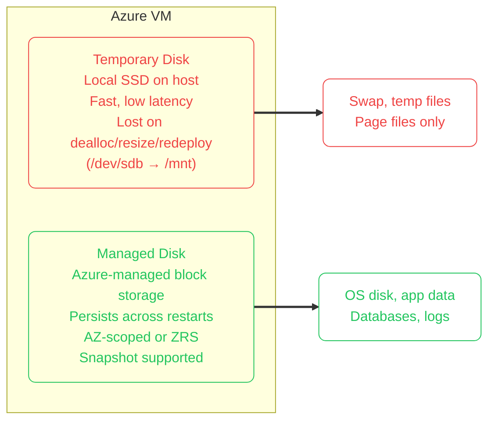
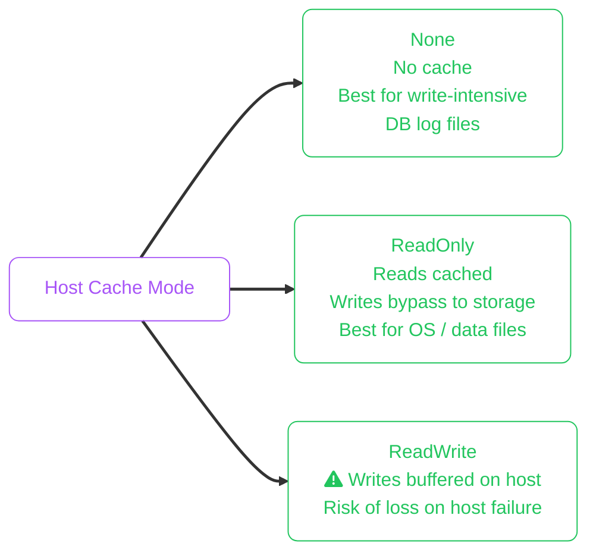
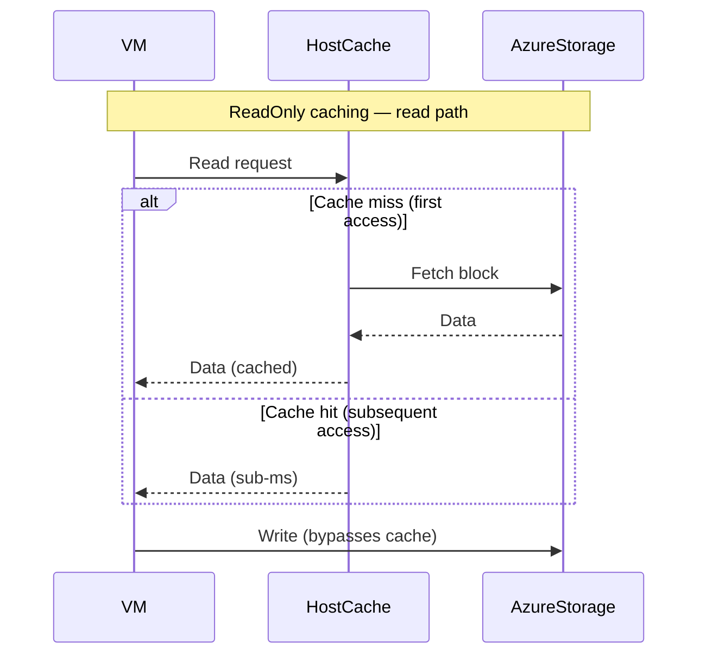
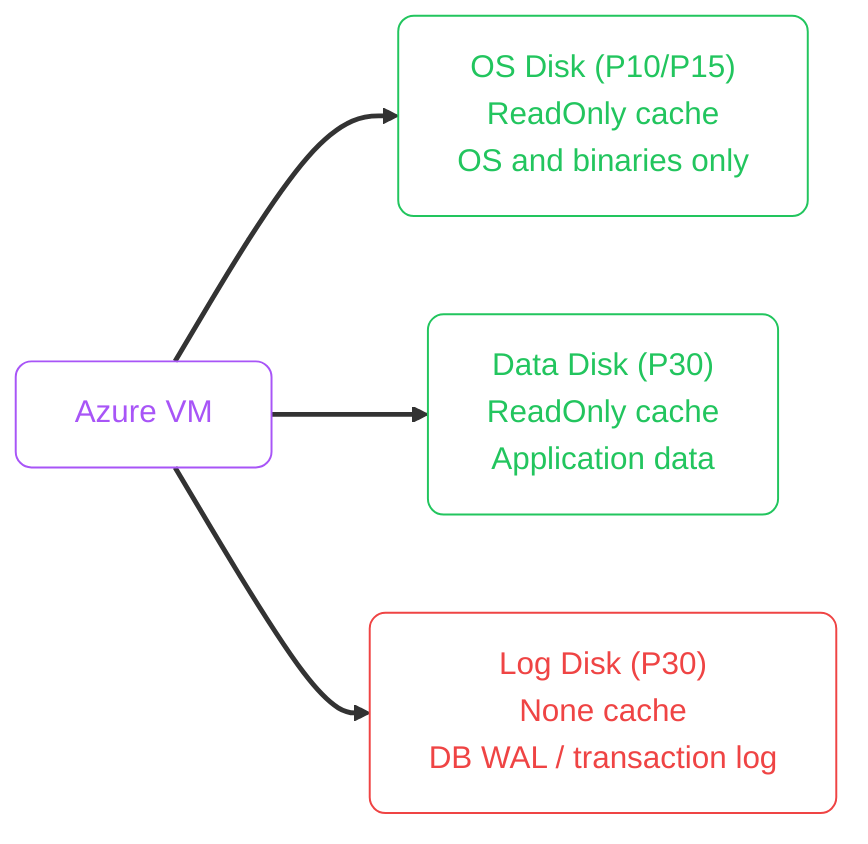

import Callout from '../../../components/mdx/Callout.astro';
import KeyPoints from '../../../components/mdx/KeyPoints.astro';
import Quiz from '../../../components/mdx/Quiz.astro';
import CodeTabs from '../../../components/mdx/CodeTabs.astro';

# Block Storage on Azure: Managed Disks Deep Dive

**Azure Managed Disks** provide persistent block storage for Azure VMs. Azure handles storage account placement and replication; you choose the performance tier, configure caching, tune IOPS and throughput, and manage lifecycle through snapshots and Azure Backup. Choosing and configuring disks correctly determines whether your VM workloads deliver the latency and throughput your SLOs require.

## What You Will Master

By the end of this lesson you will be able to:

- Select the appropriate Managed Disk SKU based on measured workload requirements
- Explain host caching and configure it to improve effective performance
- Use disk bursting to handle spiky workloads without over-provisioning
- Configure Ultra Disks with independently tuned IOPS and throughput
- Set up, mount, and persistently auto-mount a data disk in Linux
- Expand a managed disk online and resize the filesystem
- Design snapshot and Azure Backup policies for durable recovery
- Apply encryption options: platform-managed, customer-managed, and Azure Disk Encryption
- Monitor disk health with Azure Monitor metrics

---

## Managed Disks vs Temporary Disk

Azure VMs come with two storage categories:



| Property | Temporary Disk | Managed Disk |
|---|---|---|
| **Durability** | Lost on deallocation, resize, service heal | Persistent |
| **Latency** | Sub-millisecond (local) | 1–2 ms (Premium SSD) |
| **Throughput** | VM-class dependent | SKU + VM bandwidth |
| **Data safety** | Never store critical data here | Primary storage for app/DB data |
| **Linux path** | `/dev/sdb` → `/mnt/resource` | `/dev/sdc`, `/dev/sdd`, etc. |
| **Best for** | Swap, temp files, page files | OS disk, application data, databases |

<Callout type="warning" title="Temporary Disk Loses Data on Deallocation">
When you stop (deallocate) a VM, resize it, or Azure moves it during service healing, the temporary disk is wiped. **Never store application data, databases, or logs only on the temporary disk.**
</Callout>

---

## Disk SKUs: Numbers That Matter

Azure Managed Disks have four primary SKU families. The table includes actual performance ceilings — the key distinguishers for exam and real-world decisions.

| SKU | Max Size | Max IOPS | Max Throughput | Latency | Durability | Redundancy |
|---|---|---|---|---|---|---|
| **Standard HDD (HDD_LRS)** | 32 TiB | 500 | 60 MiB/s | tens of ms | — | LRS/ZRS |
| **Standard SSD (E-series)** | 32 TiB | 6,000 | 750 MiB/s | single-digit ms | 99.9% | LRS/ZRS |
| **Premium SSD (P-series)** | 32 TiB | 20,000 | 900 MiB/s | < 2 ms | 99.9% | LRS/ZRS |
| **Premium SSD v2** | 64 TiB | 80,000 | 1,200 MiB/s | sub-ms | 99.9% | LRS |
| **Ultra Disk** | 64 TiB | 160,000 | 4,000 MiB/s | sub-ms | 99.9% | LRS/ZRS |

**Key distinctions:**

- **Standard HDD**: cheapest, acceptable for dev/test and cold archival VM workloads
- **Standard SSD**: entry production tier; more consistent latency than HDD
- **Premium SSD (P-tier)**: IOPS and throughput are **tied to disk size** — a P10 (128 GiB) gives 500 IOPS, a P50 (4 TiB) gives 7,500 IOPS. You often overprovision size to get the IOPS you need.
- **Premium SSD v2**: IOPS and throughput are **independently configurable** (not sized-based), like AWS gp3. Finer-grained control at lower cost than P-tier.
- **Ultra Disk**: highest performance; requires compatible VM SKU and the availability zone must support it

### Premium SSD P-tier Size-to-Performance Map (selected)

| Disk Size | Performance Tier | IOPS | Throughput |
|---|---|---|---|
| 128 GiB | P10 | 500 | 100 MiB/s |
| 512 GiB | P20 | 2,300 | 150 MiB/s |
| 1 TiB | P30 | 5,000 | 200 MiB/s |
| 2 TiB | P40 | 7,500 | 250 MiB/s |
| 8 TiB | P60 | 16,000 | 500 MiB/s |
| 32 TiB | P80 | 20,000 | 900 MiB/s |

<Callout type="tip" title="Choose Based on Measured Workload, Not Intuition">
Profile your actual IO pattern with `fio` before selecting a SKU. Oversizing to hit a performance tier on P-tier disks is a common source of wasteful spend. Premium SSD v2 often delivers the same IOPS at lower cost.
</Callout>

---

## Host Caching

Azure VMs can cache disk IO at the **VM host layer** using the host DRAM or local SSD. Caching is configured per disk, not per VM, and dramatically changes effective read or write latency.

| Cache Mode | Reads | Writes | Best for |
|---|---|---|---|
| **None** | No cache | No cache | Write-intensive, DB log files, streaming writes |
| **ReadOnly** | Cached | Bypass cache → direct write | OS disk reads, app binaries, database data files (read-heavy) |
| **ReadWrite** | Cached | Cached (write-back) | Rarely safe for production data disks; risk of write loss on host failure |





<Callout type="warning" title="ReadWrite Caching Risk">
`ReadWrite` caching buffers writes on the host. If the host fails before writes are flushed to Azure storage, those writes are **lost**. Use `ReadOnly` or `None` for data disks in production. Some DBs (SQL Server tempdb) are explicitly documented as safe for `ReadWrite` by Microsoft — follow vendor guidance.
</Callout>

<CodeTabs tabs={[
  {
    label: "Set host caching",
    lang: "bash",
    code: `# Set data disk caching via Azure CLI
az vm update \\
  --resource-group rg-myapp-prod \\
  --name vm-app-01 \\
  --disk-caching 'dataDisk0=ReadOnly'

# Or when attaching a disk
az vm disk attach \\
  --resource-group rg-myapp-prod \\
  --vm-name vm-app-01 \\
  --name disk-app-data \\
  --caching ReadOnly`
  },
]} />

---

## Disk Bursting

Two types of bursting are available depending on the disk SKU:

### Credit-Based Bursting (P1–P20, Standard SSD up to E30)

Small Premium SSD disks accumulate burst credits during idle periods and spend them during traffic spikes. This is automatic — no configuration needed.

```
P20 (512 GiB) base performance:  2,300 IOPS / 150 MiB/s
P20 burst ceiling:                3,500 IOPS / 170 MiB/s

Credits accumulate at 1 credit/second when below baseline
Credits consumed when above baseline
```

<Callout type="tip" title="Credit-Based Bursting Is Automatic But Limited">
Credit bursting works well for workloads with short spiky intervals (e.g., boot storms, batch jobs). For sustained elevated IO, you need a larger disk tier or Premium SSD v2.
</Callout>

### On-Demand Bursting (P30 and above, Premium SSD v2)

Larger Premium SSD disks support **on-demand bursting** which must be explicitly enabled. There is a small hourly charge when bursting is active.

```bash frame="terminal"
# Enable on-demand bursting for a Premium SSD P30+ disk
az disk update \
  --resource-group rg-myapp-prod \
  --name disk-app-data \
  --enable-bursting true
```

---

## Ultra Disk: Full Performance Control

Ultra Disk lets you independently tune IOPS, throughput, and disk size at any time — even without a VM restart.

```
Ultra Disk limits:
  Size: 4 GiB – 64 TiB
  IOPS: 300 – 160,000 (in 100 IOPS increments)
  Throughput: 1 MiB/s – 4,000 MiB/s (in 1 MiB/s increments)
  Latency: < 1 ms guaranteed
```

**Constraints:**
- Availability Zone must support Ultra Disk (check per region)
- VM must be a supported SKU (most E, M, D v3+ series work)
- Cannot be used as OS disk
- Must be LRS (ZRS not available)

```bash frame="terminal"
# Create Ultra Disk with custom IOPS and throughput
az disk create \
  --resource-group rg-myapp-prod \
  --name disk-ultra-db \
  --size-gb 1024 \
  --sku UltraSSD_LRS \
  --disk-iops-read-write 20000 \
  --disk-mbps-read-write 500 \
  --zone 1

# Update performance without VM restart
az disk update \
  --resource-group rg-myapp-prod \
  --name disk-ultra-db \
  --disk-iops-read-write 40000 \
  --disk-mbps-read-write 1000
```

---

## Changing Performance Tier Without Redeployment

Premium SSD disks can have their performance tier **temporarily or permanently changed** without detaching or recreating the disk.

```bash frame="terminal"
# Temporarily upgrade a P10 to P50 performance tier
az disk update \
  --resource-group rg-myapp-prod \
  --name disk-app-data \
  --sku Premium_LRS \
  --tier P50

# Can be done online while attached to a running VM
# Billing changes immediately to the P50 rate
```

This is useful for planned high-load events: upgrade before the event, downgrade afterwards.

---

## Filesystem Setup and Mounting

<CodeTabs tabs={[
  {
    label: "Mount new data disk (Linux)",
    lang: "bash",
    code: `# 1. Identify the new disk (typically /dev/sdc or similar)
lsblk
# or check Azure-assigned LUN alignment
ls -la /dev/disk/azure/scsi1/

# 2. Create partition (GPT recommended for large disks)
sudo parted /dev/sdc --script mklabel gpt
sudo parted /dev/sdc --script mkpart primary 0% 100%

# 3. Create filesystem
sudo mkfs -t xfs /dev/sdc1

# 4. Create mount point
sudo mkdir -p /data

# 5. Mount temporarily
sudo mount /dev/sdc1 /data`
  },
  {
    label: "Persistent /etc/fstab",
    lang: "bash",
    code: `# Get UUID of the new partition
sudo blkid /dev/sdc1
# Output: /dev/sdc1: UUID="a1b2c3d4-xxxx-xxxx-xxxx-xxxxxxxxxxxx" TYPE="xfs"

# Append to /etc/fstab using UUID
echo "UUID=a1b2c3d4-xxxx /data xfs defaults,nofail 0 2" | \\
  sudo tee -a /etc/fstab

# The 'nofail' option prevents boot failure if disk is temporarily absent
# Test the fstab entry
sudo mount -a

# Verify
df -h /data`
  },
  {
    label: "cloud-init disk setup",
    lang: "yaml",
    code: `# cloud-init configuration to format and mount on first boot
# Useful for Terraform/ARM/Bicep deployments
#cloud-config
disk_setup:
  /dev/disk/azure/scsi1/lun0:
    table_type: gpt
    layout: true
    overwrite: false
fs_setup:
  - device: /dev/disk/azure/scsi1/lun0
    partition: 1
    filesystem: xfs
    overwrite: false
mounts:
  - ["/dev/disk/azure/scsi1/lun0-part1", "/data", "xfs", "defaults,nofail", "0", "2"]`
  },
]} />

<Callout type="tip" title="Use Stable Azure Disk Paths">
Azure provides stable device symlinks under `/dev/disk/azure/scsi1/lunN`. Use these in scripts and cloud-init rather than `/dev/sd*` which can change across VM restarts.
</Callout>

---

## Online Disk Expansion

<CodeTabs tabs={[
  {
    label: "Resize disk (Azure CLI)",
    lang: "bash",
    code: `# Resize a managed disk (can be done while attached and running)
az disk update \\
  --resource-group rg-myapp-prod \\
  --name disk-app-data \\
  --size-gb 512

# Note: you can only increase size, never decrease
# The OS filesystem still needs a separate resize step`
  },
  {
    label: "Grow XFS filesystem",
    lang: "bash",
    code: `# After the disk size change is complete in the portal/CLI:

# Notify the kernel about the size change
echo 1 | sudo tee /sys/class/block/sdc/device/rescan

# Check the partition table sees new space
lsblk /dev/sdc

# Expand the partition (if using a partition)
sudo growpart /dev/sdc 1

# Grow the XFS filesystem (works while online/mounted)
sudo xfs_growfs /data

# Verify
df -h /data`
  },
  {
    label: "Grow ext4 filesystem",
    lang: "bash",
    code: `# After disk size change:

echo 1 | sudo tee /sys/class/block/sdc/device/rescan
sudo growpart /dev/sdc 1

# Resize ext4 online (supported on Linux 3.10+)
sudo resize2fs /dev/sdc1

df -h /data`
  },
]} />

---

## Core Operations with Azure CLI

<CodeTabs tabs={[
  {
    label: "Create disk",
    lang: "bash",
    code: `az disk create \\
  --resource-group rg-myapp-prod \\
  --name disk-app-data \\
  --size-gb 512 \\
  --sku Premium_LRS \\
  --zone 1 \\
  --encryption-type EncryptionAtRestWithPlatformKey \\
  --tags env=prod owner=platform-team`
  },
  {
    label: "Attach disk",
    lang: "bash",
    code: `az vm disk attach \\
  --resource-group rg-myapp-prod \\
  --vm-name vm-app-01 \\
  --name disk-app-data \\
  --lun 0 \\
  --caching ReadOnly`
  },
  {
    label: "Detach disk",
    lang: "bash",
    code: `# Unmount within OS first: sudo umount /data
az vm disk detach \\
  --resource-group rg-myapp-prod \\
  --vm-name vm-app-01 \\
  --name disk-app-data`
  },
  {
    label: "Delete disk",
    lang: "bash",
    code: `# Disk must be unattached (not associated with any VM)
az disk delete \\
  --resource-group rg-myapp-prod \\
  --name disk-app-data \\
  --yes`
  },
]} />

---

## Snapshots and Recovery

<CodeTabs tabs={[
  {
    label: "Create snapshot",
    lang: "bash",
    code: `az snapshot create \\
  --resource-group rg-myapp-prod \\
  --name snap-app-data-$(date +%Y%m%d) \\
  --source /subscriptions/<sub-id>/resourceGroups/rg-myapp-prod/providers/Microsoft.Compute/disks/disk-app-data \\
  --sku Standard_LRS \\
  --tags env=prod retention=30d`
  },
  {
    label: "Cross-region snapshot copy",
    lang: "bash",
    code: `# Copy snapshot to a DR region
az snapshot create \\
  --resource-group rg-myapp-dr \\
  --name snap-app-data-dr-$(date +%Y%m%d) \\
  --source /subscriptions/<sub-id>/resourceGroups/rg-myapp-prod/snapshots/snap-app-data \\
  --location westeurope \\
  --copy-start`
  },
  {
    label: "Restore disk from snapshot",
    lang: "bash",
    code: `# Create a new managed disk from a snapshot
az disk create \\
  --resource-group rg-myapp-prod \\
  --name disk-app-data-restored \\
  --source /subscriptions/<sub-id>/resourceGroups/rg-myapp-prod/providers/Microsoft.Compute/snapshots/snap-app-data \\
  --sku Premium_LRS \\
  --zone 1`
  },
]} />

### Azure Backup for Managed Disks

For policy-based backup with longer retention and compliance controls, use **Azure Backup for Azure Disks** (as distinct from snapshots):

```bash frame="terminal"
# Create a Backup vault
az dataprotection backup-vault create \
  --resource-group rg-myapp-prod \
  --vault-name backup-vault-prod \
  --storage-settings datastore-type=VaultStore type=LocallyRedundant

# Apply a backup policy (use ARM/Bicep for full policy definition)
# The policy defines: schedule (hourly/daily), retention (days/weeks/months), snapshot tier
```

<Callout type="warning" title="Test Restores — Not Just Backups">
Azure Backup shows job success but the only measure of actual RPO/RTO is a successful restore to a clean environment. Schedule quarterly restore drills, time them, and track drift from your SLO.
</Callout>

---

## Encryption

Azure offers three encryption models for Managed Disks:

| Model | Key location | Use case |
|---|---|---|
| **Platform-managed key (PMK)** | Azure managed | Default; no config needed |
| **Customer-managed key (CMK)** | Azure Key Vault | Compliance requiring key ownership |
| **Azure Disk Encryption (ADE)** | Azure Key Vault + BitLocker/dm-crypt | Guest OS–level encryption for regulated data |

### When to Use Which

- **PMK**: default for most workloads. Azure rotates keys; encryption is at rest and in transit.
- **CMK**: when auditors or compliance policy require you to own the key lifecycle (HSM-backed keys in Key Vault Premium).
- **ADE**: when the compliance framework specifically requires OS-level encryption (e.g., certain FedRAMP controls). Adds complexity and has VM SKU restrictions.

<CodeTabs tabs={[
  {
    label: "Enable CMK encryption",
    lang: "bash",
    code: `# 1. Create a Key Vault with soft-delete and purge protection
az keyvault create \\
  --name kv-myapp-prod \\
  --resource-group rg-myapp-prod \\
  --location eastus \\
  --enable-soft-delete true \\
  --enable-purge-protection true

# 2. Create a key
az keyvault key create \\
  --vault-name kv-myapp-prod \\
  --name disk-encryption-key \\
  --kty RSA \\
  --size 4096

# 3. Create a disk encryption set
az disk-encryption-set create \\
  --resource-group rg-myapp-prod \\
  --name des-myapp-prod \\
  --key-url "https://kv-myapp-prod.vault.azure.net/keys/disk-encryption-key/<version>" \\
  --source-vault kv-myapp-prod

# 4. Create a disk using the encryption set
az disk create \\
  --resource-group rg-myapp-prod \\
  --name disk-app-data \\
  --size-gb 512 \\
  --sku Premium_LRS \\
  --encryption-type EncryptionAtRestWithCustomerKey \\
  --disk-encryption-set des-myapp-prod`
  },
  {
    label: "Audit unencrypted disks",
    lang: "bash",
    code: `# Find all disks not using CMK in a subscription
az disk list \\
  --query "[?encryptionSettingsCollection == null || encryptionSettingsCollection.enabled == \`false\`].[name, resourceGroup, sku.name]" \\
  --output table`
  },
]} />

---

## Availability and Redundancy

| Option | Description | Use case |
|---|---|---|
| **LRS** | 3 replicas in one datacenter | Default; cost-effective |
| **ZRS** | 3 replicas across AZs | Higher resiliency, no downtime on zone failure |
| **Zone-Pinned** | Disk in a specific AZ | Required for AZ-aware VM placement |

Premium SSD v2 and Ultra Disk only support LRS. For ZRS with consistent performance, use Premium SSD or Standard SSD with ZRS.

<Callout type="info" title="ZRS Disks Survive Zone Outages">
If your VM is in Availability Zone 1 and that zone has an outage, a ZRS disk can be attached to a VM in another zone. This is the foundation of zone-failover architectures for stateful VMs.
</Callout>

---

## Azure Monitor Metrics for Disks

| Metric | What it tells you | Alert threshold |
|---|---|---|
| `Disk Read Bytes/sec` | Actual read throughput | Approaching SKU max |
| `Disk Write Bytes/sec` | Actual write throughput | Approaching SKU max |
| `Disk Read Operations/sec` | Actual IOPS reads | > 90% of provisioned |
| `Disk Write Operations/sec` | Actual IOPS writes | > 90% of provisioned |
| `Disk Queue Depth` | Pending IO ops | > 1 sustained (SSD) |
| `VM Cached / Uncached IOPS Consumed %` | How much of VM's IO budget is used | > 80% |

```bash frame="terminal"
# Create a Disk Queue Depth alert via Azure CLI
az monitor metrics alert create \
  --name "disk-queue-depth-alert" \
  --resource-group rg-myapp-prod \
  --scopes /subscriptions/<sub-id>/resourceGroups/rg-myapp-prod/providers/Microsoft.Compute/virtualMachines/vm-app-01 \
  --condition "avg Disk Queue Depth > 1" \
  --window-size 5m \
  --evaluation-frequency 1m \
  --action /subscriptions/<sub-id>/resourceGroups/rg-myapp-prod/providers/microsoft.insights/actionGroups/ops-alerts \
  --description "VM disk IO is saturated"
```

---

## Architecture Patterns

### OS + Data Disk Separation



Separate disks by function: OS, data, and log. This allows independent snapshot policies, distinct caching strategies, and easier disk replacement without touching unrelated data.

### Shared Disks for Clustering

Premium SSD and Ultra Disk support **maxShares**, enabling a single disk to be attached to multiple VMs simultaneously for clustered workloads (e.g., Windows Server Failover Clustering, SIOS DataKeeper):

```bash frame="terminal"
az disk create \
  --resource-group rg-cluster \
  --name disk-cluster-quorum \
  --size-gb 256 \
  --sku Premium_LRS \
  --max-shares 2
```

The same cluster-aware filesystem requirement applies as in AWS Multi-Attach.

### Ephemeral OS Disk

For stateless workloads (Kubernetes node pools, batch compute, scale sets), **Ephemeral OS Disks** place the OS disk on local VM host storage:

- No managed disk cost for OS disk
- Faster VM boot and re-image
- Loss of data on deallocation (acceptable for stateless nodes)

```bash frame="terminal"
az vmss create \
  --resource-group rg-batch \
  --name vmss-batch-workers \
  --image UbuntuLTS \
  --ephemeral-os-disk true \
  --os-disk-caching ReadOnly
```

---

## Cost Optimisation

| Lever | Action |
|---|---|
| **Right SKU selection** | Profile IO, then choose Standard SSD if Premium IOPS not needed |
| **Premium SSD v2 over P-tier** | Fine-grained IOPS/throughput; avoid oversizing disk to hit P-tier perf |
| **Snapshot lifecycle** | Delete stale snapshots; use Backup policies with retention limits |
| **Deallocated disk audit** | Managed disks still incur cost when not attached; delete unused disks |
| **Performance tier downgrade** | After high-load events, downgrade from elevated performance tier |
| **Ephemeral OS disk** | Eliminate managed disk cost for stateless VM OS disks |

---

## Production Checklist

Before promoting managed disk configurations to production:

1. Disk SKU chosen based on profiled IOPS, throughput, and latency — not guesswork
2. Host caching configured per disk type: `ReadOnly` for data files, `None` for log/write-heavy
3. Encryption model selected and applied (PMK minimum; CMK if compliance requires)
4. OS and data disks are separate; database log on its own disk
5. Snapshot policy created with tested retention count and restore procedure
6. Azure Monitor alerts active for `Disk Queue Depth` and IOPS utilisation
7. ZRS or zone-pinning aligned with VM availability zone strategy
8. RBAC restricts disk/snapshot delete to authorized identities
9. Disk tags include environment, owner, data classification
10. Restore drill completed and RTO documented

---

<Quiz
  question="A relational database VM is running on a P20 Premium SSD disk and experiencing periodic IO latency spikes during end-of-day batch operations, but normal performance otherwise. What is the most cost-effective first step?"
  options={[
    { label: "Upgrade the disk to Ultra Disk" },
    { label: "Enable on-demand bursting or upgrade to a larger P-tier disk to absorb the spike without long-term overspend", correct: true },
    { label: "Set host caching to ReadWrite to speed up all writes" },
    { label: "Switch to a Standard HDD for consistent throughput" },
  ]}
  explanation="Periodic spikes are exactly the pattern that disk bursting handles. Enable on-demand bursting on the P20 (or upsize to P30+ for higher base + burst), which adds burst headroom during the batch window without paying for Ultra Disk full-time. Setting ReadWrite caching is unsafe for DB data and Standard HDD has far lower IOPS."
/>

<KeyPoints>
  - Temporary disk is local and ephemeral — never store durable application data there
  - Premium SSD P-tier IOPS/throughput are tied to disk size; Premium SSD v2 decouples them like AWS gp3
  - Host caching (`ReadOnly`/`None`) is per-disk and can dramatically reduce effective read latency at no extra cost
  - Ultra Disk allows independently tuning IOPS and throughput at any time without VM restart
  - Use stable Azure disk symlinks (`/dev/disk/azure/scsi1/lunN`) and UUID in fstab — not `/dev/sd*` device paths
  - Disk size can only increase; use `xfs_growfs`/`resize2fs` after resizing the managed disk
  - ZRS disks survive zone failures and can be reattached to a VM in another zone
  - CMK encryption requires Key Vault with purge protection; ADE provides OS-level encryption for specific compliance mandates
  - Monitor `Disk Queue Depth` — sustained values above 1 on SSD indicate IO saturation at the VM or disk level
  - Audit and delete unattached managed disks; they continue to incur cost after VM deletion
</KeyPoints>
