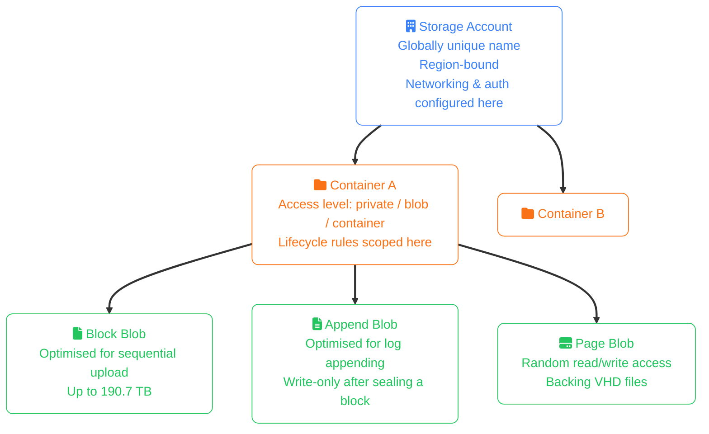
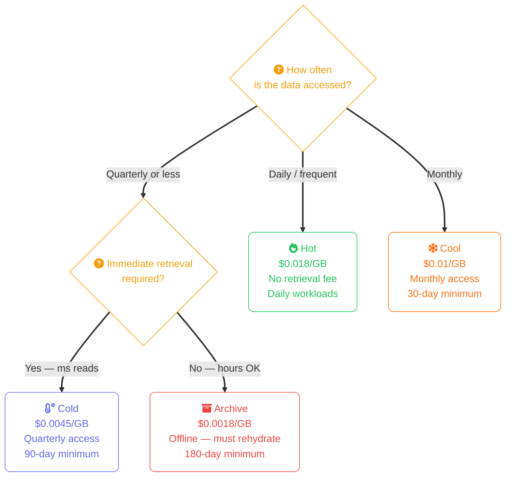
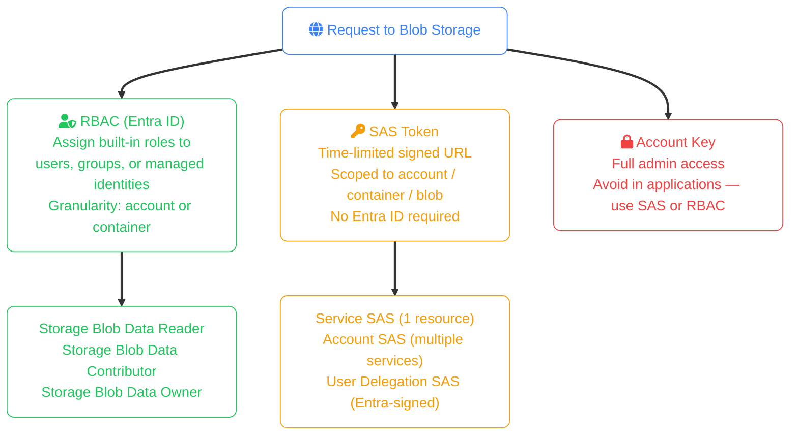
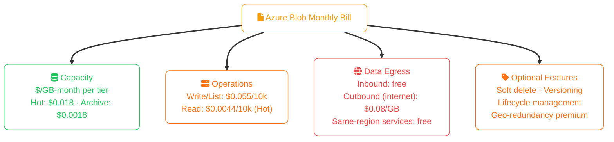

import Callout from '../../../components/mdx/Callout.astro';
import KeyPoints from '../../../components/mdx/KeyPoints.astro';
import Quiz from '../../../components/mdx/Quiz.astro';
import CodeTabs from '../../../components/mdx/CodeTabs.astro';

**Azure Blob Storage** is Azure's massively scalable object store for unstructured data. Text files, images, videos, backups, data lake files, and application packages all live as blobs. Blob Storage sits inside a **Storage Account** — a namespace container that also hosts Azure Files, Queues, and Tables — which means its access control and networking configuration is shared at the account level, not the container level.

<KeyPoints>
- Understand the Storage Account → Container → Blob three-level hierarchy and why it matters for access control
- Select the right access tier (Hot, Cool, Cold, Archive) using the access-frequency cost model
- Create storage accounts and containers, and upload blobs with the Azure CLI
- Automate tier transitions and deletion using Lifecycle Management policies
- Generate SAS tokens to grant time-limited, scoped access without sharing account keys
- Apply RBAC roles to storage accounts and containers for identity-based access control
</KeyPoints>

<Callout type="info" title="Foundation Concepts">
This lesson covers Azure-specific operations and pricing. Object storage fundamentals — bucket/container model, how 11-nines durability works, storage tier trade-offs, and when object storage is the wrong choice — are covered in [Object Storage Concepts](/cloud/common/object-storage-concepts).
</Callout>

---

## Azure Storage Hierarchy

Azure adds an extra level below the storage account that has no direct AWS equivalent:

**Block blobs** are what you use for almost everything — uploads, downloads, backups, data lake files. **Append blobs** are for log ingestion. **Page blobs** back Azure VM disks (Managed Disks abstract them away in most cases).

---

## Access Tiers

Azure Blob Storage has four access tiers. Pricing below is approximate East US rates:

| Tier | $/GB-month | Read Ops (per 10k) | Retrieval Fee | Rehydration Latency | Min Duration |
|---|---|---|---|---|---|
| **Hot** | $0.018 | $0.004 | None | — | None |
| **Cool** | $0.01 | $0.01 | $0.01/GB | — | 30 days |
| **Cold** | $0.0045 | $0.02 | $0.05/GB | — | 90 days |
| **Archive** | $0.0018 | — | $0.02/GB | 1–15 hrs | 180 days |

<Callout type="warning" title="Archive is Offline">
The Archive tier takes objects **offline**. A blob in Archive cannot be read directly — it must first be **rehydrated** to Hot or Cool tier. Rehydration can take up to 15 hours with standard priority, or 1 hour with high priority (at a higher fee). Plan this into any restore workflow.
</Callout>

### Access Tier Decision Flow

---

## Core Azure CLI Operations

<CodeTabs tabs={[
  { label: "Azure CLI", lang: "bash", code: `# Create a storage account (LRS replication, Hot default tier)
az storage account create \
  --name mycompanybackups \
  --resource-group my-rg \
  --location eastus \
  --sku Standard_LRS \
  --kind StorageV2 \
  --access-tier Hot

# Create a container
az storage container create \
  --name reports \
  --account-name mycompanybackups \
  --auth-mode login

# Upload a file as a block blob
az storage blob upload \
  --account-name mycompanybackups \
  --container-name reports \
  --name 2024/q4/report.csv \
  --file ./report.csv \
  --auth-mode login

# Upload a directory (recursive)
az storage blob upload-batch \
  --account-name mycompanybackups \
  --destination reports \
  --source ./exports/ \
  --auth-mode login

# Download a blob
az storage blob download \
  --account-name mycompanybackups \
  --container-name reports \
  --name 2024/q4/report.csv \
  --file ./report-downloaded.csv \
  --auth-mode login

# List blobs with a prefix
az storage blob list \
  --account-name mycompanybackups \
  --container-name reports \
  --prefix 2024/q4/ \
  --output table` },
  { label: "Access Tier", lang: "bash", code: `# Upload directly to Cool tier
az storage blob upload \
  --account-name mycompanybackups \
  --container-name reports \
  --name archive/2022/annual.csv \
  --file ./annual.csv \
  --tier Cool \
  --auth-mode login

# Change tier on an existing blob
az storage blob set-tier \
  --account-name mycompanybackups \
  --container-name reports \
  --name archive/2022/annual.csv \
  --tier Archive \
  --auth-mode login

# Rehydrate a blob from Archive to Hot (standard priority)
az storage blob set-tier \
  --account-name mycompanybackups \
  --container-name reports \
  --name archive/2022/annual.csv \
  --tier Hot \
  --rehydrate-priority Standard \
  --auth-mode login` },
]} />

---

## Lifecycle Management

Lifecycle management policies automatically transition blobs between tiers and delete expired blobs, eliminating manual tier management at scale.

```mermaid
flowchart LR
    accTitle: Azure Blob lifecycle transition pipeline
    accDescr: How Azure Blob Storage lifecycle management automatically moves blobs from Hot to Cool to Cold to Archive and optionally deletes them based on age since last modification.
    classDef ok   fill:none,stroke:#22c55e,color:#22c55e,rx:8,ry:8
    classDef mid  fill:none,stroke:#f97316,color:#f97316,rx:8,ry:8
    classDef cold fill:none,stroke:#6366f1,color:#6366f1,rx:8,ry:8
    classDef arch fill:none,stroke:#ef4444,color:#ef4444,rx:8,ry:8
    linkStyle default stroke-width:2.5px

    UPLOAD["fa:fa-circle-dot Upload<br/>Day 0"]:::ok
    HOT["fa:fa-fire Hot<br/>Days 0–29<br/>$0.018/GB"]:::ok
    COOL["fa:fa-snowflake Cool<br/>Day 30+<br/>$0.01/GB"]:::mid
    COLD["fa:fa-temperature-low Cold<br/>Day 90+<br/>$0.0045/GB"]:::cold
    ARCHIVE["fa:fa-box-archive Archive<br/>Day 180+<br/>$0.0018/GB<br/>Must rehydrate to read"]:::arch
    DELETE["fa:fa-trash Delete<br/>Day 365"]:::arch

    UPLOAD --> HOT
    HOT -->|"+30 days"| COOL
    COOL -->|"+60 days"| COLD
    COLD -->|"+90 days"| ARCHIVE
    ARCHIVE -->|"+185 days"| DELETE
```

<CodeTabs tabs={[
  { label: "Azure CLI", lang: "bash", code: `# Apply a lifecycle policy from a JSON file
az storage account management-policy create \
  --account-name mycompanybackups \
  --resource-group my-rg \
  --policy @lifecycle-policy.json` },
  { label: "lifecycle-policy.json", lang: "json", code: `{
  "rules": [
    {
      "name": "archive-reports",
      "enabled": true,
      "type": "Lifecycle",
      "definition": {
        "filters": {
          "blobTypes": ["blockBlob"],
          "prefixMatch": ["reports/"]
        },
        "actions": {
          "baseBlob": {
            "tierToCool": { "daysAfterModificationGreaterThan": 30 },
            "tierToCold": { "daysAfterModificationGreaterThan": 90 },
            "tierToArchive": { "daysAfterModificationGreaterThan": 180 },
            "delete": { "daysAfterModificationGreaterThan": 365 }
          },
          "snapshot": {
            "delete": { "daysAfterCreationGreaterThan": 30 }
          }
        }
      }
    }
  ]
}` },
]} />

---

## Access Control

Azure Blob Storage supports two access control models that can be used together:

<Callout type="tip" title="Use User Delegation SAS">
Prefer **User Delegation SAS** over Service SAS or Account SAS. It is signed using an Entra ID credential rather than the storage account key, so it can be revoked by revoking the delegating identity. Account keys grant full storage account access if leaked and are expensive to rotate.
</Callout>

<CodeTabs tabs={[
  { label: "RBAC (Azure CLI)", lang: "bash", code: `# Assign Storage Blob Data Contributor to a managed identity
az role assignment create \
  --assignee <managed-identity-object-id> \
  --role "Storage Blob Data Contributor" \
  --scope /subscriptions/<sub-id>/resourceGroups/my-rg/providers/Microsoft.Storage/storageAccounts/mycompanybackups/blobServices/default/containers/reports

# Assign Storage Blob Data Reader at the account level
az role assignment create \
  --assignee <user-or-sp-object-id> \
  --role "Storage Blob Data Reader" \
  --scope /subscriptions/<sub-id>/resourceGroups/my-rg/providers/Microsoft.Storage/storageAccounts/mycompanybackups` },
  { label: "SAS Token (Azure CLI)", lang: "bash", code: `# Generate a User Delegation SAS for a single blob (read, 1 hour)
az storage blob generate-sas \
  --account-name mycompanybackups \
  --container-name reports \
  --name 2024/q4/report.csv \
  --permissions r \
  --expiry $(date -u -v+1H '+%Y-%m-%dT%H:%MZ') \
  --auth-mode login \
  --as-user \
  --full-uri

# Generate a Service SAS for a container (read + list, 24 hours)
az storage container generate-sas \
  --account-name mycompanybackups \
  --name reports \
  --permissions rl \
  --expiry $(date -u -v+24H '+%Y-%m-%dT%H:%MZ') \
  --auth-mode login` },
]} />

---

## Blob Storage Pricing Model

<Callout type="tip" title="LRS vs GRS Cost">
Locally Redundant Storage (LRS) replicates within one datacenter. Geo-Redundant Storage (GRS) replicates to a paired region — roughly 2× the storage cost. For disaster recovery you rarely need GRS for all blobs; use lifecycle policies to move old data to LRS-only Archive instead.
</Callout>

---

<Quiz
  question="A blob is uploaded to Cool tier. It is deleted after 10 days. What is charged?"
  options={[
    { label: "10 days of Cool storage only" },
    { label: "30 days of Cool storage — the minimum retention fee applies", correct: true },
    { label: "10 days of Hot storage as a penalty" },
    { label: "Nothing — Cool tier has no minimum" },
  ]}
  explanation="The Cool tier has a 30-day minimum storage duration. Deleting after 10 days still incurs the full 30-day minimum charge. Cold tier has a 90-day minimum; Archive has 180 days."
/>

<Quiz
  question="Your application needs to upload files directly from user browsers to Azure Blob Storage without proxying through your backend server. What is the recommended approach?"
  options={[
    { label: "Share the storage account key with the frontend" },
    { label: "Make the container publicly accessible" },
    { label: "Generate a short-lived User Delegation SAS URL on the backend and return it to the frontend", correct: true },
    { label: "Assign Storage Blob Data Contributor to anonymous users" },
  ]}
  explanation="Generating a short-lived User Delegation SAS on the backend lets the browser upload directly to Blob Storage with scoped, time-limited permission. The account key must never be exposed client-side, and public containers bypass access control entirely."
/>
