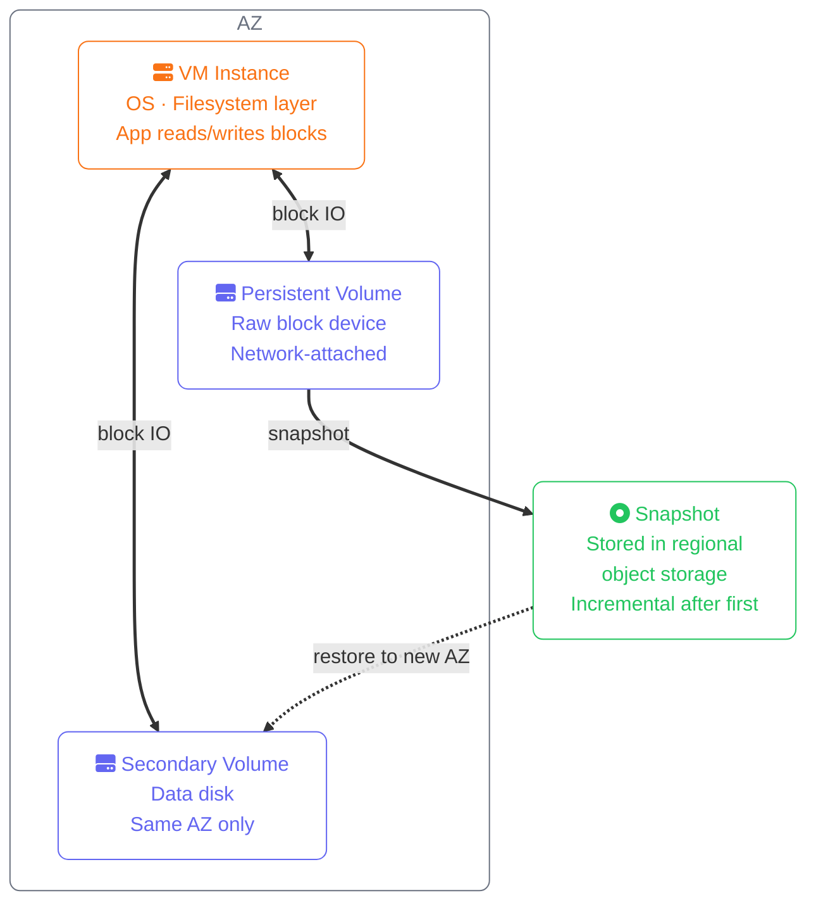
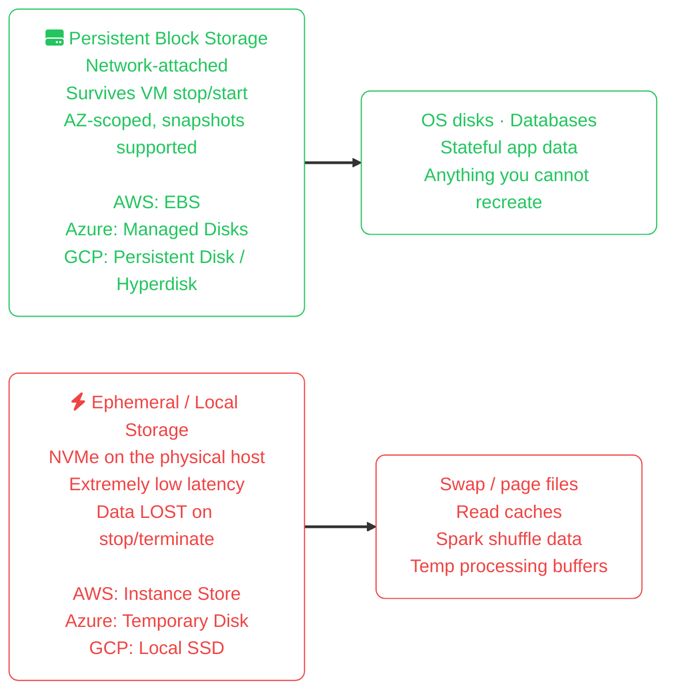
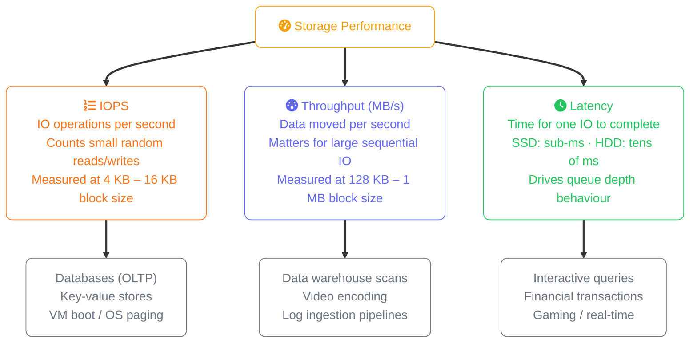
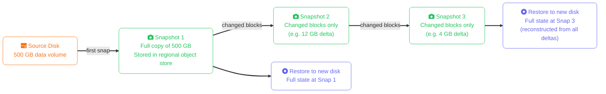

import Callout from '../../../components/mdx/Callout.astro';
import KeyPoints from '../../../components/mdx/KeyPoints.astro';

Block storage provides **raw disk devices** to virtual machines — the cloud equivalent of plugging a physical drive into a server. Every cloud provider offers it, every VM-based architecture depends on it, and the concepts of performance, durability, and cost optimisation are identical across AWS, Azure, and GCP despite different names and APIs.

<KeyPoints>
- Why block storage exists and how it differs from object and file storage
- The persistent vs ephemeral split every provider implements and when each is appropriate
- IOPS, throughput, and latency as independent performance axes — and why all three matter
- How disk type, disk size, and instance shape each impose separate performance ceilings
- The incremental snapshot model shared across all three providers
- Cross-cloud comparison: EBS, Managed Disks, and Persistent Disks side by side
</KeyPoints>

---

## What Block Storage Provides

A block storage volume looks to the operating system like a raw disk drive. The OS is responsible for creating a partition table, formatting a filesystem (`ext4`, `xfs`, `ntfs`), and mounting it. The cloud provider manages:

- Physical hardware, replication, and durability
- Network transport between the storage array and the VM
- Snapshot capture and incremental backup

Block storage is **AZ-scoped** on all three providers — a volume lives in one Availability Zone and can only be attached to VMs in that same zone. Cross-AZ access requires snapshot-and-restore.

---

## Persistent vs Ephemeral Storage

Every cloud provider gives each VM two categories of storage. Confusing them causes data loss.

<Callout type="danger" title="Ephemeral Data is Not a Backup Target">
Local/ephemeral storage on all three providers is permanently destroyed when the VM is stopped, deallocated, or moved to different hardware. AWS instance store, Azure temporary disk (`/dev/sdb`), and GCP Local SSD all follow this rule. Never store databases, logs, or user data here without a replication or flush mechanism.
</Callout>

---

## The Performance Triad: IOPS, Throughput, and Latency

Block storage performance has three independent axes. A workload can be limited by any one of them — and they do not move together.

**Why they're independent:** A single large sequential write uses one IOPS operation but moves 1 MB — maxing throughput while barely touching the IOPS counter. A MySQL database doing 8,000 tiny row lookups per second maxes IOPS at 4 KB blocks but uses very little throughput. Size your disk for the bottleneck axis of your workload, not the others.

---

## Three Concurrent Performance Ceilings

Any block storage operation is subject to three simultaneous limits. The effective performance is the minimum of all three:

```mermaid
flowchart LR
    accTitle: Three concurrent block storage performance ceilings
    accDescr: How a block storage IO operation flows through three sequential ceilings — the disk tier limit, the disk size limit on standard tiers, and the VM instance bandwidth limit — and that the lowest ceiling determines actual throughput.
    classDef step fill:none,stroke:#f97316,color:#f97316,rx:8,ry:8
    classDef ceil fill:none,stroke:#ef4444,color:#ef4444,rx:8,ry:8
    classDef ok   fill:none,stroke:#22c55e,color:#22c55e,rx:8,ry:8
    linkStyle default stroke-width:2.5px

    IO["fa:fa-arrow-right IO Request"]:::step
    DISK_TYPE["fa:fa-hard-drive Disk Tier Limit<br/>Max IOPS/throughput<br/>set by disk type<br/>(e.g. EBS gp3: 16k IOPS)"]:::ceil
    SIZE_CAP["fa:fa-database Disk Size Cap<br/>Standard tiers: IOPS scale<br/>with provisioned GB<br/>(gp2, pd-ssd, Standard HDD)"]:::ceil
    INST["fa:fa-server Instance Bandwidth<br/>VM has a dedicated<br/>block storage bandwidth pool<br/>shared across all volumes"]:::ceil
    RESULT["fa:fa-check Effective Performance<br/>= min(tier limit,<br/>size cap, instance bandwidth)"]:::ok

    IO --> DISK_TYPE --> SIZE_CAP --> INST --> RESULT
```

This three-ceiling model explains the most common block storage performance mistake: upgrading disk tier but leaving the wrong instance type, or provisioning the right disk but not enough GB on a tier where IOPS scale with size.

<Callout type="tip" title="Decouple IOPS from Size on Modern Tiers">
AWS `gp3`, Azure `Premium SSD v2`, and GCP `Hyperdisk` all support independently provisioned IOPS — you pay for what you need without over-sizing the disk. Older tiers (`gp2`, Standard SSD, `pd-ssd`) tie IOPS to disk size, often forcing you to over-provision capacity to get the IOPS you need.
</Callout>

---

## Snapshot Model

All three providers use the same incremental snapshot strategy:

Key behaviours common to all providers:
- Deleting a snapshot does **not** break the chain — the provider redistributes the referenced blocks
- Restoring any snapshot returns the full disk state at that point in time
- Snapshots are stored in object storage (S3, Azure Blob, GCS) at object storage pricing — far cheaper than block storage per GB

---

## Cross-Cloud Comparison

| Concept | AWS | Azure | GCP |
|---|---|---|---|
| **Service name** | Elastic Block Store (EBS) | Managed Disks | Persistent Disk / Hyperdisk |
| **General-purpose SSD** | gp3 | Standard SSD / Premium SSD | pd-balanced |
| **Provisioned IOPS SSD** | io2 / io2 Block Express | Premium SSD v2 / Ultra Disk | pd-extreme / Hyperdisk Extreme |
| **Cold HDD tier** | sc1 | Standard HDD | pd-standard |
| **Ephemeral / local** | Instance Store | Temporary Disk (`/dev/sdb`) | Local SSD |
| **AZ scope** | Single AZ | Single AZ (ZRS option extra) | Single zone |
| **Multi-attach** | io1/io2 only | Ultra Disk / Premium SSD v2 | Multi-writer mode on PD |
| **Online resize** | Yes (no detach) | Yes (no detach) | Yes (no detach) |
| **Snapshot storage** | S3 (incremental) | Azure Blob (incremental) | GCS (incremental) |
| **CMK encryption** | AWS KMS | Azure Key Vault | Cloud KMS |

---

## When Block Storage is the Wrong Choice

Block storage is **not** appropriate when:

- **Your data doesn't fit in one AZ** — replicated distributed data (Cassandra, Kafka, HDFS) should use redundant local storage or object storage, not expensive block volumes
- **You need internet-accessible URLs** — use object storage (S3, Blob, GCS)
- **Multiple VMs need shared read-write access** — use file storage (EFS, Azure Files, Filestore)
- **You're storing logs or backups long-term** — object storage is 5–20× cheaper per GB

The decision comes down to whether your workload needs filesystem semantics, low-latency random IO, and AZ-local durability. If yes: block storage. If any of those requirements is absent: a different storage type is likely better suited and cheaper.

---

## Cost Implications

Block storage follows a **provisioned-capacity billing model** — you pay for the disk size you allocate, not for the data you actually store. All three providers bill this way.

| Disk Tier | AWS (gp3) | Azure (Premium SSD) | GCP (pd-balanced) |
|---|---|---|---|
| **General-purpose SSD** | $0.08/GB/month | $0.12/GB/month | $0.10/GB/month |
| **Provisioned IOPS SSD** | $0.125/GB + $0.065/IOPS (io2) | $0.12/GB + $0.0065/IOPS (Premium SSD v2) | $0.125/GB + $0.0035/IOPS (pd-extreme) |
| **Cold HDD** | $0.025/GB (sc1) | $0.045/GB (Standard HDD) | $0.040/GB (pd-standard) |
| **Snapshot storage** | ~$0.05/GB (S3 incremental) | ~$0.05/GB (incremental) | ~$0.026/GB (incremental) |

<Callout type="warning" title="Provisioned IOPS Billing is Independent of Actual Usage">
When you provision 40,000 IOPS on an AWS io2 or GCP pd-extreme disk, you pay for 40,000 IOPS every hour whether your workload generates 100 or 40,000 IOPS. Profile actual IOPS with `iostat`, CloudWatch, or Cloud Monitoring before provisioning. AWS gp3 already provides 3,000 IOPS at no extra charge — only provision additional IOPS when you have data showing saturation.
</Callout>

<Callout type="warning" title="Snapshot Costs Accumulate Over Time">
Snapshots are incremental — the first snapshot copies the full volume, subsequent ones copy only changed blocks. However, each snapshot references the previous one, so you cannot delete the oldest snapshot alone to reclaim space. Use lifecycle policies (AWS DLM, Azure Backup, GCP Snapshot Schedules) to manage expiry. Retaining 30 daily snapshots of a 1 TB volume can accumulate 200–400 GB of snapshot data depending on write volume.
</Callout>
