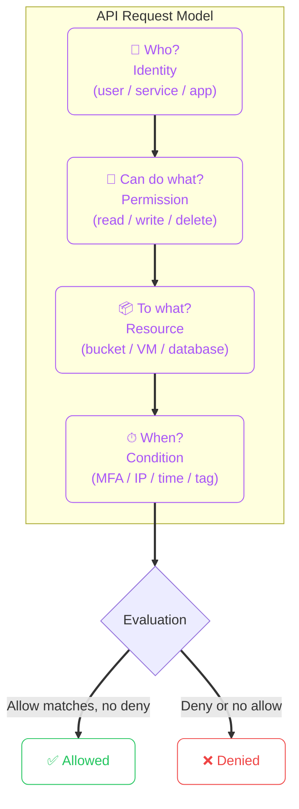
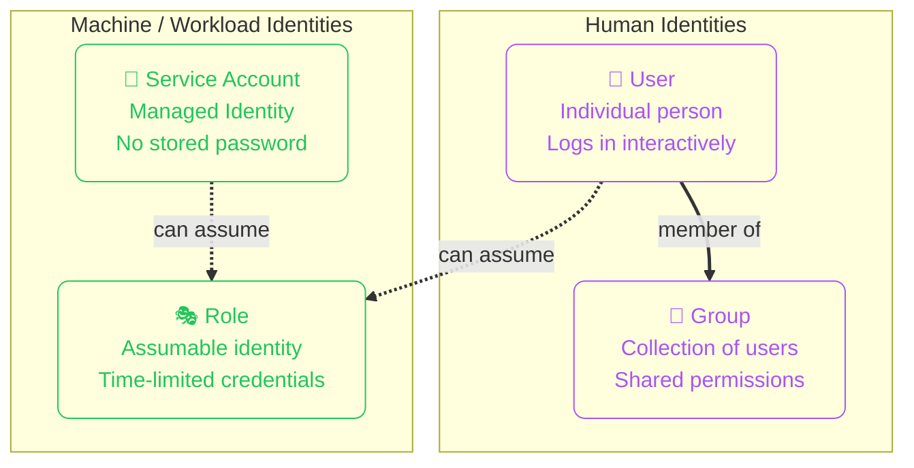
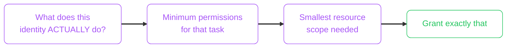
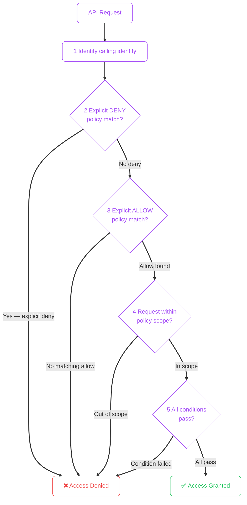
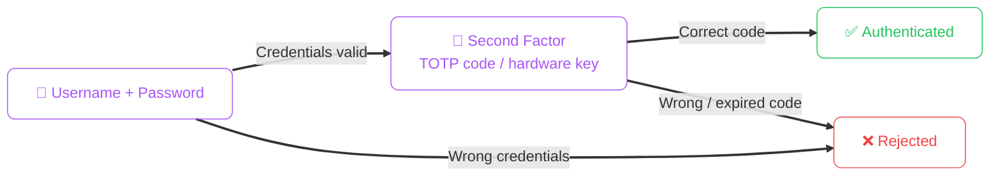
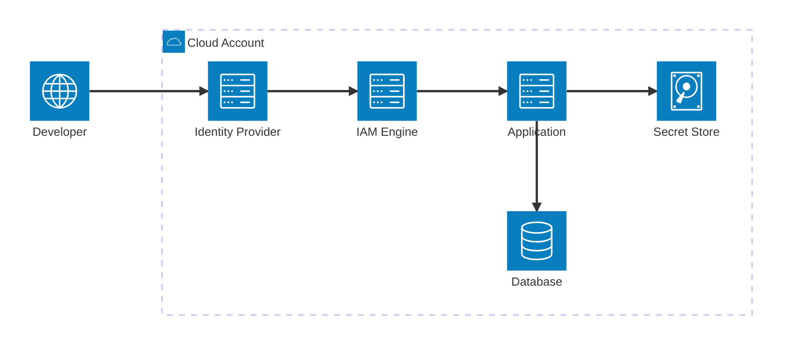

import { Icon } from 'astro-icon/components';
import Callout from '../../../components/mdx/Callout.astro';
import KeyPoints from '../../../components/mdx/KeyPoints.astro';
import Quiz from '../../../components/mdx/Quiz.astro';
import CodeComparison from '../../../components/mdx/CodeComparison.astro';

# IAM Concepts 

Identity and Access Management (IAM) is the foundation of cloud security. Every action in a cloud platform — creating a server, reading a file, sending a message — is authorized through IAM. Getting it right is non-negotiable.

## What You Will Master

By the end of this lesson, you should be able to:

- Model identities for humans and workloads as separate categories
- Design least-privilege access boundaries by role and scope
- Trace the policy evaluation path when access is unexpectedly denied or allowed
- Write well-scoped IAM policies rather than using overly broad permissions
- Identify the most dangerous IAM anti-patterns and explain why they fail

---

## The Core Problem IAM Solves

Cloud platforms expose thousands of powerful operations over APIs. Without IAM, anyone with your account credentials could do anything — delete databases, exfiltrate data, rack up enormous bills.

IAM lets you define precisely **who** can do **what** to **which resources** under **what conditions**.



---

## Identity Types

An **identity** is anything that can be authenticated and authorized. Cloud platforms distinguish two categories: human identities and machine identities.



| Identity type | AWS | Azure | Typical use |
|---|---|---|---|
| Human user | IAM User | Entra ID User | Console access, daily ops |
| Group | IAM Group | Entra ID Group | Team-wide permission bundles |
| Workload identity | IAM Role + STS | Managed Identity | App-to-service, Lambda, ECS tasks |
| Assumable role | IAM Role (AssumeRole) | Entra Service Principal | Cross-account, CI systems |

<Callout type="tip" title="Prefer Managed Identities for All Workloads">
Never hardcode a user's access key or password in application code, a container image, or a CI configuration. Use managed/service identities — they authenticate automatically without storing credentials anywhere.
</Callout>

---

## Policies and Permissions

A **permission** is a single allowed (or denied) action: `s3:GetObject`, `Microsoft.Compute/virtualMachines/start/action`.

A **policy** is a structured document that bundles permissions together and specifies who they apply to, on what resources, and under what conditions.

### AWS IAM Policy structure

```json showLineNumbers
{
  "Version": "2012-10-17",
  "Statement": [
    {
      "Sid": "ReadAppBucketOnly",
      "Effect": "Allow",
      "Action": [
        "s3:GetObject",
        "s3:ListBucket"
      ],
      "Resource": [
        "arn:aws:s3:::my-app-bucket",
        "arn:aws:s3:::my-app-bucket/*"
      ],
      "Condition": {
        "StringEquals": {
          "aws:RequestedRegion": "eu-west-2"
        }
      }
    }
  ]
}
```

**Policy anatomy:**
- `Effect`: `Allow` or `Deny` — explicit denies always win
- `Action`: specific API calls (or `*` for all — avoid in production)
- `Resource`: specific ARNs or patterns (or `*` — avoid in production)
- `Condition`: optional constraints (IP, MFA required, time, tags)

### Azure RBAC role assignment structure

Azure uses Role-Based Access Control (RBAC) rather than inline JSON policies. You assign a **Role Definition** (a bundle of permissions) to an **Identity** at a specific **Scope**.

```
Role Assignment = Identity + Role Definition + Scope

Example:
  Identity:         managed-identity-myapp
  Role Definition:  Storage Blob Data Reader
  Scope:            /subscriptions/.../storageAccounts/mystore
```

---

## The Principle of Least Privilege

Every identity — human or machine — should have only the permissions it actually needs. Nothing more.



**Anti-pattern: Wildcard admin**
```json
{ "Effect": "Allow", "Action": "*", "Resource": "*" }
```

**Correct: Scoped to what the workload actually does**
```json
{
  "Effect": "Allow",
  "Action": ["s3:GetObject"],
  "Resource": "arn:aws:s3:::my-app-bucket/uploads/*"
}
```

Overly permissive access is the leading cause of catastrophic cloud security incidents. An application that only reads from one database directory should never have permission to write to it, delete from it, or access any other bucket.

---

## Access Evaluation — How Cloud IAM Decides

When you debug a permission error, follow this evaluation sequence:



**Key rule: Explicit deny always wins.** Even if an allow policy exists, a deny at any level overrides it.

---

## Authentication vs Authorization

These two terms are distinct and must not be conflated:

| Concept | Question | Mechanism |
|---|---|---|
| **Authentication** | "Are you really who you say you are?" | Password, MFA, certificate, API key, managed identity token |
| **Authorization** | "What are you permitted to do?" | IAM policy, RBAC role assignment, resource policy |

A valid authenticated user may still be unauthorized for a specific action. Both must succeed for access to be granted.

---

## Multi-Factor Authentication (MFA)

MFA requires a second factor beyond a password — typically a time-based one-time code from an authenticator app (TOTP) or a hardware security key.

**Always enable MFA on:**
- Root and global admin accounts
- Any account with billing access
- All human accounts with elevated permissions (DevOps, Security, DBA)
- CI/CD system human operator accounts



---

## AWS vs Azure IAM Comparison

| Concept | AWS | Azure |
|---|---|---|
| Policy document | IAM Policy (JSON) | Azure Policy / Role Definition |
| Human user | IAM User | Entra ID User |
| Machine identity | IAM Role / Service Account | Managed Identity |
| Permission group | IAM Group | Entra ID Group |
| Temporary credentials | AssumeRole (STS) | Workload Identity Federation |
| Built-in policies | AWS Managed Policies | Azure Built-in Roles |
| Permission model | Policy-based (actions/resources) | Role-based (role definitions + assignments) |

<Callout type="info" title="AWS and Azure Use Different Models for the Same Goal">
AWS attaches policies directly to identities (user/role policies). Azure assigns Role Definitions to identities at a scope. Both enforce who can do what — they just express it differently. The underlying evaluation logic is the same: deny wins, explicit allow is required.
</Callout>

---

## Common IAM Anti-Patterns

| Anti-pattern | Risk | Correct approach |
|---|---|---|
| Shared admin account | Zero accountability; one leaked credential = full compromise | Individual accounts for every person |
| Long-lived access keys in CI | Keys rotate rarely; any repo exposure = persistent access | IAM roles with OIDC federation for CI |
| `Action: *` / `Resource: *` in prod | Any breach = full account access | Scope policies to specific actions and ARNs |
| Wildcard permissions for new flags | Drift: "temporary" broad policies linger forever | PoLP from day 1; policy reviews on schedule |
| No periodic access review | Stale privileges from ex-employees, old projects | Quarterly reviews + automated idle identity flagging |
| Skipping MFA on "non-critical" accounts | Any account can be used for lateral movement | MFA policy enforcement, not per-person discretion |

<Callout type="danger" title="Protect the Root / Global Admin Account">
Both AWS and Azure have a root/global admin account with unlimited power over the account. Enable MFA immediately, create a separate daily-use admin account, and lock root credentials away. Never use root for routine tasks — not even initial setup after day one.
</Callout>

---

## Practical Policy Scoping Exercise

When scoping an IAM policy, ask these questions in order:

1. What specific API actions does this workload call? (Not what it *might* call)
2. On which specific resources? (Use exact ARNs where possible)
3. Does it need to span multiple regions or just one?
4. Are there conditions that should restrict access further? (VPC endpoint, tag match, MFA)

Then write the policy to match exactly that — and add a comment in your IaC code explaining why each permission is present.

---

## Foundation Checklist

- Separate identities for humans and for every workload (no shared service accounts)
- MFA enforced on all privileged human accounts
- Least privilege by design — scoped actions + scoped resources  
- Machine workloads use managed/service identities, never hardcoded credentials
- Short-lived credentials preferred over long-lived API keys
- Explicit deny for high-risk actions (cross-account exfiltration, data deletion)
- Quarterly access review process with automated idle-identity alerting
- Alerting on root activity, privilege escalation, and policy changes

---

<Quiz
  question="An application running on an EC2 instance needs to read from an S3 bucket. What is the correct way to provide credentials?"
  options={[
    { label: "Set the AWS_ACCESS_KEY_ID and AWS_SECRET_ACCESS_KEY as environment variables in the instance" },
    { label: "Store the access key in a .env file on the instance" },
    { label: "Attach an IAM role to the EC2 instance with a policy allowing s3:GetObject on that specific bucket", correct: true },
    { label: "Use the root account credentials for simplicity" },
  ]}
  explanation="IAM roles attached to EC2 instances provide temporary, automatically rotated credentials with no secrets stored anywhere. Environment variables and .env files create long-lived secret exposure risk. Root credentials should never be used for workloads."
/>

<KeyPoints>
  - IAM defines who can do what to which resources under what conditions — all four dimensions matter
  - Human identities (users/groups) and machine identities (roles/managed identities) must be kept separate
  - Least privilege: grant only the minimum permissions exactly scoped to the resources needed
  - Explicit DENY always overrides any ALLOW — this is the first check in policy evaluation
  - Authentication confirms identity; authorization confirms permission — both must succeed
  - MFA must be enforced on all privileged accounts — policy enforcement, not individual choice
  - Never use long-lived access keys for workloads — use managed/service identities that rotate automatically
  - Periodic access reviews prevent stale privileges from accumulating over time
  - AWS uses policy-based IAM; Azure uses role-assignment RBAC — same goal, different expression
</KeyPoints>

---

## IAM Architecture Overview

How IAM fits into a real cloud deployment — a developer authenticates through an identity provider, IAM evaluates the request, and the application is granted scoped access to protected resources.


