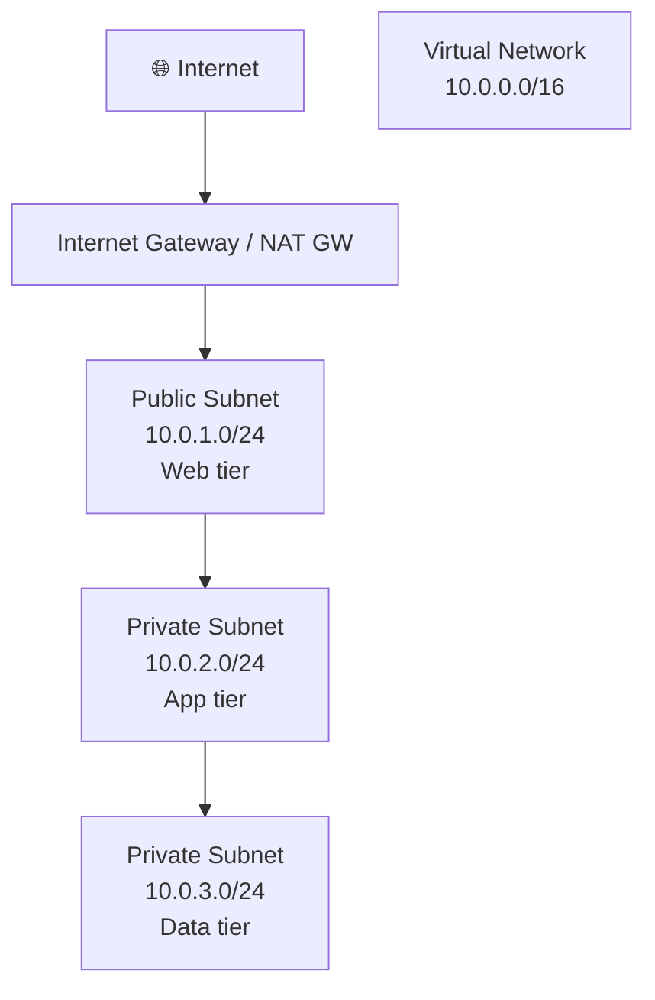
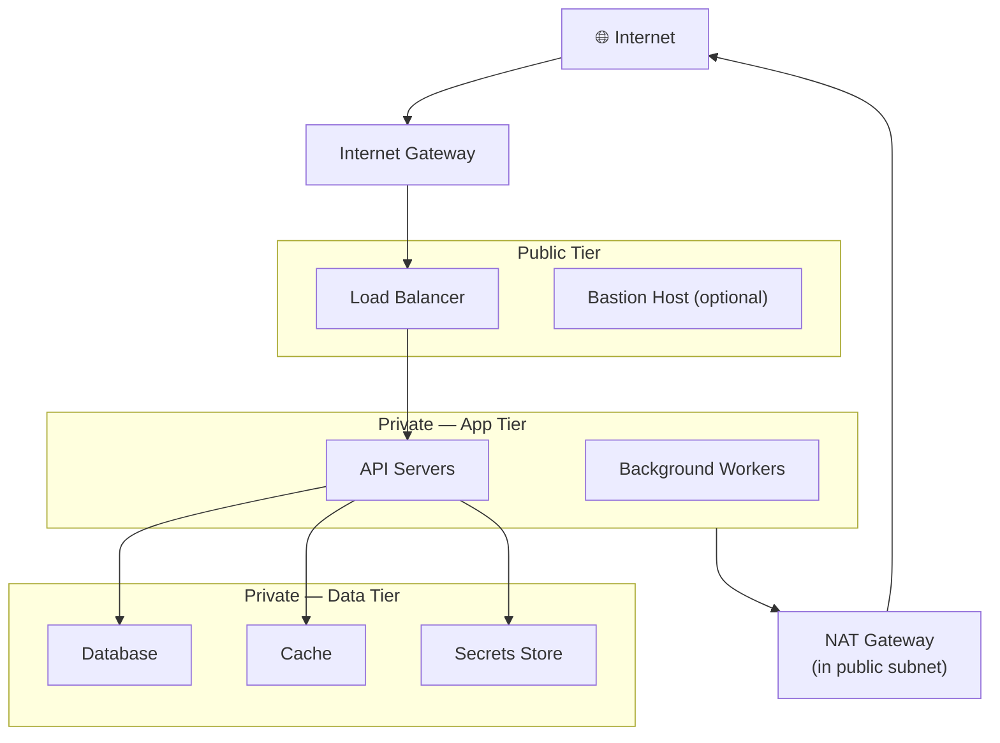
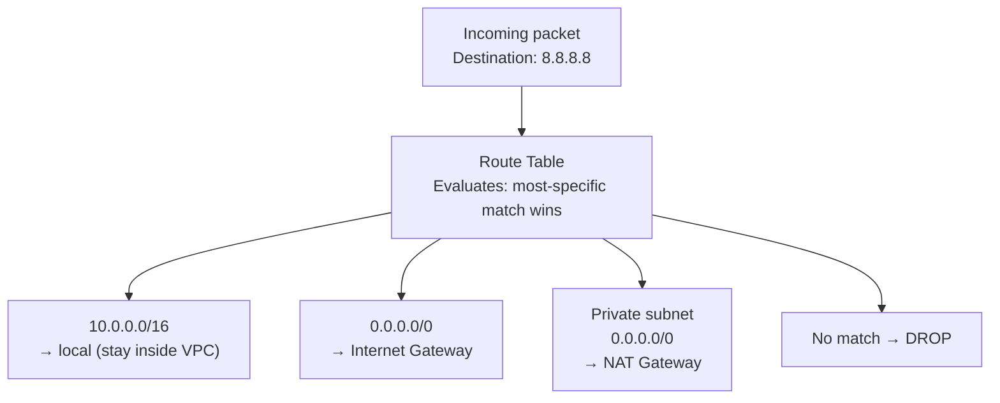
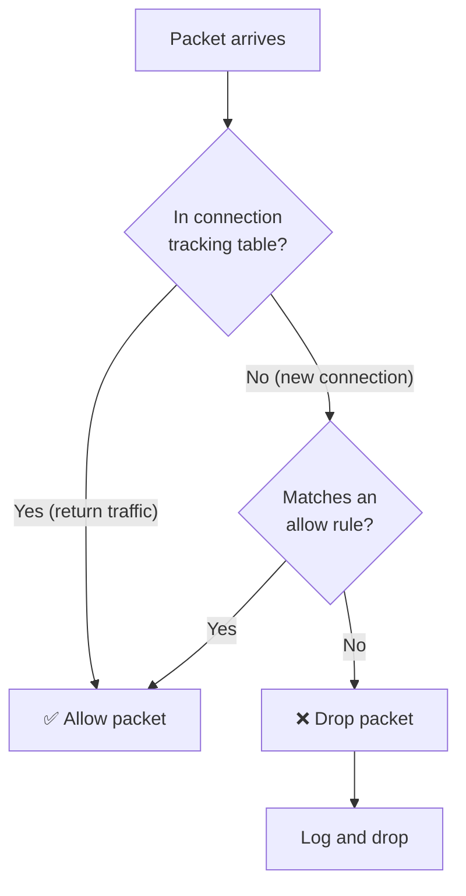
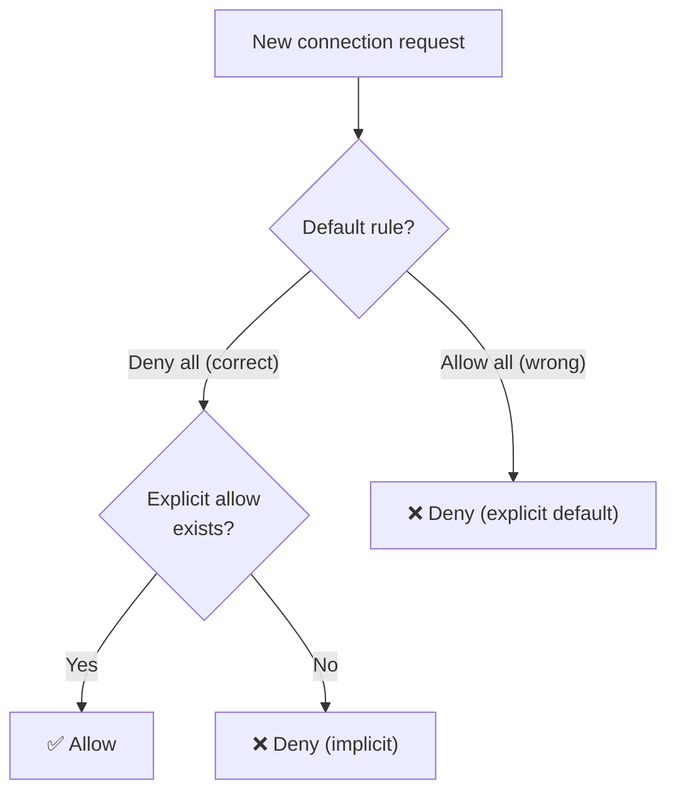
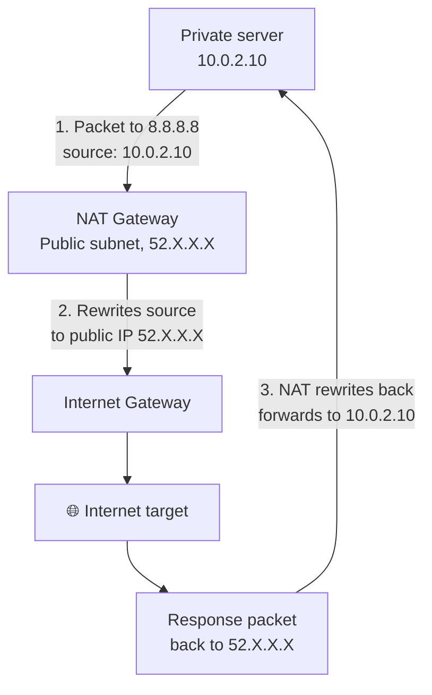
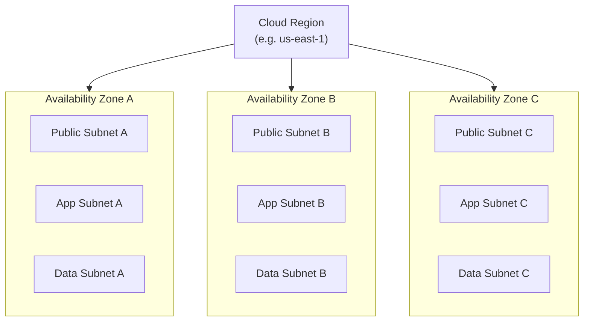

import Callout from '../../../components/mdx/Callout.astro';
import KeyPoints from '../../../components/mdx/KeyPoints.astro';
import Quiz from '../../../components/mdx/Quiz.astro';

# Cloud Networking Basics

Every resource you deploy in the cloud lives inside a network. That network is a software-defined construct — you define it, you control it, and it determines what can talk to what. Understanding these networking fundamentals is essential before deploying anything on AWS or Azure. The concepts on this page are identical across both cloud providers; only the names differ, and those differences are covered in the provider-specific lessons.

<KeyPoints>
- What a Virtual Private Cloud / Virtual Network is and why it exists
- How CIDR notation carves address space into subnets
- The three-tier subnet model that underlies almost every production architecture
- How routing tables control traffic flow between subnets and to the internet
- How stateful firewalls (Security Groups / NSGs) evaluate inbound and outbound rules
- The role of NAT in protecting private subnets while allowing outbound internet access
- Why you distribute resources across multiple Availability Zones for resilience
</KeyPoints>

---

## The Virtual Network: Your Private Space in the Cloud

When you create an account on any cloud provider, your resources don't share a flat public network with every other customer. Instead, each account (or project) gets its own **Virtual Private Cloud** (AWS) or **Virtual Network** (Azure). These are software-defined isolated networks — and you control every aspect of the address space, routing, and firewall rules.



The key properties of a virtual network:

| Property | Description |
|---|---|
| **Address space** | A CIDR block (e.g. `10.0.0.0/16`) that defines the total IP range |
| **Subnets** | Subdivisions of the address space, each mapped to an Availability Zone |
| **Route tables** | Control which traffic goes where — to the internet, between subnets, or to peered networks |
| **Firewall rules** | Stateful rules attached to subnets or individual resources |
| **Region-scoped** | A virtual network lives in one region; subnets live in individual AZs |

---

## CIDR Notation: Carving Up Address Space

CIDR (Classless Inter-Domain Routing) notation specifies a block of IP addresses using a base address and a prefix length. Understanding it is fundamental to subnet design.

```
10.0.0.0/16  →  65,536 addresses  (10.0.0.0 – 10.0.255.255)
10.0.1.0/24  →     256 addresses  (10.0.1.0 – 10.0.1.255)
10.0.1.0/28  →      16 addresses  (10.0.1.0 – 10.0.1.15)
```

The prefix length is the number of fixed bits. The remaining bits are your host range:

- `/16` → 16 bits fixed, 16 bits free → 2¹⁶ = 65,536 addresses
- `/24` → 24 bits fixed, 8 bits free → 2⁸ = 256 addresses
- `/28` → 28 bits fixed, 4 bits free → 2⁴ = 16 addresses (cloud providers reserve 3–5)

<Callout type="tip">
**Subnet sizing rule of thumb.** Allocate subnets generously — you cannot resize a subnet after creation on most cloud platforms. Start with `/24` (256 addresses) for each tier in a VPC with `/16` address space. Use `/28` only for isolated services like NAT gateways.
</Callout>

---

## The Three-Tier Subnet Model

Production architectures almost universally use three subnet tiers per Availability Zone. Each tier has a different exposure level and firewall posture.



| Tier | Direction | What lives here |
|---|---|---|
| **Public** | Inbound + outbound internet | Load balancers, NAT Gateways, Bastion hosts |
| **Private – App** | Outbound only (via NAT) | Web/API servers, workers, container tasks |
| **Private – Data** | No internet, VPC-internal only | Databases, caches, secrets stores |

Resources in the data tier have no route to the internet at all. Resources in the app tier can reach the internet for software updates via NAT — but nothing from the internet can reach them directly.

---

## Routing Tables: Directing Traffic

Every subnet has a **route table** that tells the cloud where to send packets. A route table is an ordered list of destination → target pairs.



**Most-specific prefix wins.** A packet to `10.0.2.50` matches `10.0.0.0/16` (the local route) before `0.0.0.0/0` (the default route). This means VPC-internal traffic always stays inside the network without needing explicit rules per IP.

**Public vs private route tables differ in one critical line:**

| Route table type | Default route target |
|---|---|
| Public subnet | Internet Gateway |
| Private subnet | NAT Gateway (outbound only) |
| Data subnet | None — no default route |

---

## Stateful Firewalls: Security Groups and NSGs

Cloud firewalls are **stateful** — if you allow a connection inbound, the return traffic is automatically allowed without a separate outbound rule. This means you only need to write rules for the *initiating* direction.



**The default-deny firewall pattern** — the production baseline:



<Callout type="warning">
**Never use Allow-All as the default rule.** Some platforms allow you to create a group with `0.0.0.0/0` inbound open for all ports. This is equivalent to no firewall. Production environments should start with deny-all and open only what is explicitly needed.
</Callout>

**Rule chaining between tiers** — firewalls in cloud environments support referencing another security group as a source, not just an IP range. This is how you lock down the app tier so only the load balancer (not the whole internet) can reach it:

```
Load balancer SG     → allows 443 from anywhere (0.0.0.0/0)
App tier SG          → allows 8080 from [load-balancer-SG only]  ← source is group, not IP
Data tier SG         → allows 5432 from [app-tier-SG only]       ← same pattern
```

This pattern means even if a rule is misconfigured on the LB, the app tier is still unreachable from the internet.

---

## NAT: Outbound-Only Internet Access for Private Subnets

Servers in private subnets need outbound internet access for things like package updates, external API calls, and certificate validation — but they must be unreachable from the internet. **Network Address Translation (NAT)** achieves this.



The internet target sees the NAT Gateway's public IP, not the private server's IP. The private server's address is never exposed externally. Responses are tracked by the NAT's connection table and routed back correctly.

| Resource | Can initiate outbound? | Reachable from internet? |
|---|---|---|
| Public subnet resource | Yes (via IGW) | Yes (if public IP assigned) |
| Private subnet + NAT | Yes (via NAT) | No |
| Private subnet, no NAT | No | No |

---

## Availability Zones: Building for Fault Tolerance

A **region** is a geographic area (e.g. "US East Virginia"). Each region contains multiple **Availability Zones** — physically separate data centres with independent power, cooling, and networking, connected by low-latency private fibre.



You deploy **one subnet per tier per AZ**. A load balancer spans all three, routing only to healthy instances. If an AZ fails, load is automatically shifted to the remaining zones.

<Callout type="info">
**AZ names are account-specific.** `us-east-1a` in your account is not necessarily the same physical data centre as `us-east-1a` in another account. Cloud providers shuffle the mapping to distribute load evenly across customers.
</Callout>

---

## Private Connectivity: VPN and Peering

Public internet connectivity isn't always acceptable. Two alternatives:

**VPC Peering / VNet Peering** — a private, low-latency connection between two virtual networks in the same cloud. Traffic stays on the cloud backbone. Used to connect separate environments (e.g. shared services VPC ↔ application VPC).

**VPN / Private connectivity** — an encrypted tunnel from a corporate on-premises data centre to your cloud VPC. Required for hybrid architectures where some services stay on-premises. Implemented via a VPN gateway on the cloud side and a hardware/software VPN appliance on-premises.

<Callout type="tip">
**AWS-specific:** Direct Connect | **Azure-specific:** ExpressRoute. Both are dedicated private fibre circuits that bypass the public internet entirely. The concepts are covered in the respective introduction lessons.
</Callout>

---

## Common Networking Failures

| Failure | Root cause | Detection |
|---|---|---|
| Resource unreachable from internet | No public IP assigned or no `0.0.0.0/0` route in public subnet | Check route table + security group |
| Private server can't fetch packages | Missing NAT Gateway or route table doesn't point to it | Ping outbound from server; check route table |
| DB reachable from wrong tier | Security group references wrong source | Audit SG rules; enforce source-group pattern |
| Cross-AZ latency surprises | App servers in AZ-A calling DB in AZ-C | Deploy databases in each AZ or use multi-AZ replicas |
| CIDR overlap on peering | Two VPCs have overlapping address spaces | Plan CIDR at account inception; peering fails on overlap |

---

## Knowledge Check

<Quiz
  question="A private subnet server cannot download package updates despite having correct security group rules. What is the most likely cause?"
  options={[
    "The route table for the private subnet has no route to a NAT Gateway",
    "The security group for the server is missing an outbound allow rule",
    "The server has no public IP address",
    "The internet gateway is not attached"
  ]}
  answer="The route table for the private subnet has no route to a NAT Gateway"
  explanation="Security groups are stateful — if outbound traffic is initiated by the server, the firewall allows it (stateful return). The packet still needs a route to reach the internet. Private subnets reach the internet via a NAT Gateway, but only if the route table has a 0.0.0.0/0 → NAT Gateway entry. No route = packet dropped at the routing layer before the firewall even sees it."
/>

---

<KeyPoints title="Networking Foundations Checklist">
- One VPC/VNet per environment, non-overlapping CIDR blocks
- Three tiers per AZ: Public (LB/NAT), Private App (servers), Private Data (database)
- Public subnets route `0.0.0.0/0` to an Internet Gateway
- Private app subnets route `0.0.0.0/0` to a NAT Gateway in a public subnet
- Data subnets have no default route — no internet access at all
- Security groups use source-group chaining between tiers (LB → App → DB)
- Resources deployed across at least two Availability Zones
- VPC CIDR `/16`, tier subnets `/24` minimum, enough space for future AZs
</KeyPoints>
