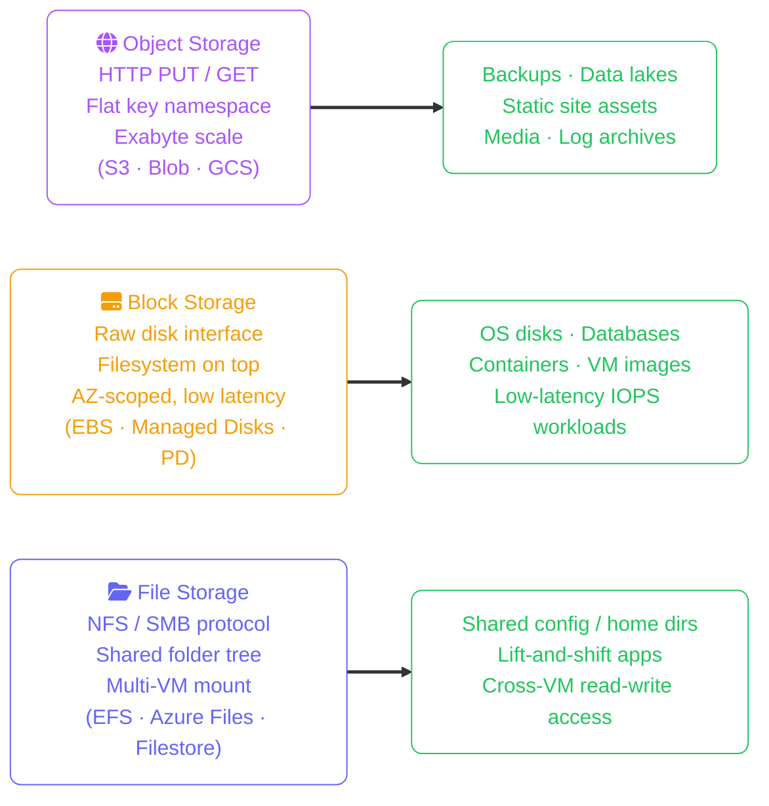
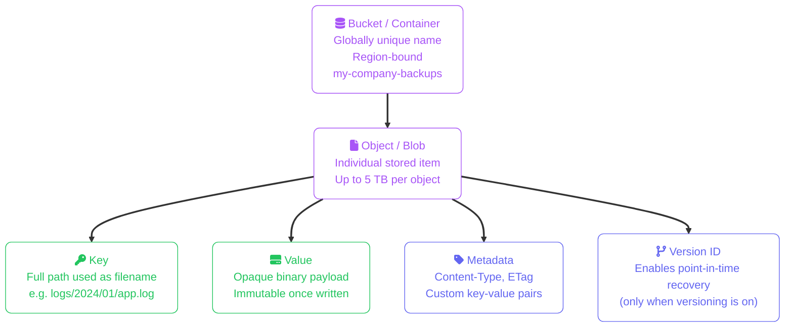

import Callout from '../../../components/mdx/Callout.astro';
import KeyPoints from '../../../components/mdx/KeyPoints.astro';

Object storage emerged in the early 2000s to solve a problem that block and file storage couldn't: storing billions of arbitrary files at internet scale without a central metadata server becoming the bottleneck. Every major cloud provider offers object storage as a first-class service — Amazon S3, Azure Blob Storage, and Google Cloud Storage — and they all share the same fundamental model despite different APIs and pricing structures.

<KeyPoints>
- Why object storage exists and what problems it solves that block and file storage cannot
- The flat namespace model: bucket + key = any object, any size, any type
- Object anatomy: key, value, metadata, and version ID
- How 11-nines durability is achieved through cross-AZ replication
- Storage class tiers: the cost-vs-retrieval-latency trade-off that every provider implements
- When object storage is the wrong choice
</KeyPoints>

---

## Object vs Block vs File Storage

The three cloud storage categories serve fundamentally different access patterns and scale differently:

The key insight: object storage has **no filesystem**. There are no directories, no inodes, no rename operations. What looks like `reports/2024/q4.csv` is a single flat key — the slash is just a character.

---

## Object Anatomy

Every object in every cloud provider shares the same four-part structure:

Objects are **immutable** — you cannot append bytes to an existing object or update part of it. An update is always a full replacement, which is why object storage is ideal for write-once, read-many data, and a poor fit for databases or anything requiring in-place writes.

---

## Durability and Replication

Every major cloud provider advertises **11 nines (99.999999999%) durability** for standard storage. This number means a single object has a 1-in-100-billion chance of being lost in a given year. That guarantee is achieved by transparently replicating every object across at least three physical Availability Zones within the chosen region.

<Callout type="info" title="Durability vs Availability">
Durability and availability are different guarantees. Durability (11 nines) means your data won't be permanently lost. Availability (99.9%–99.99% depending on tier) means the service will respond to read requests. Standard tiers offer both; archive tiers sacrifice availability (hours to retrieve) while keeping durability.
</Callout>

Durability does **not** protect against:
- Accidental deletion (enable versioning or soft delete)
- Ransomware overwriting your objects (enable MFA delete or immutable storage)
- Misconfigured lifecycle rules deleting data too early

---

## Storage Classes / Access Tiers

All three providers implement the same fundamental trade-off: you pay less to store data that you access rarely, but you pay more (in retrieval fees and latency) to get it back. The tier names differ, but the model is identical:

| Access Pattern | AWS S3 | Azure Blob | Google Cloud Storage |
|---|---|---|---|
| Daily reads/writes | Standard | Hot | Standard |
| Monthly access | Standard-IA / Intelligent-Tiering | Cool | Nearline |
| Quarterly access | Glacier Instant Retrieval | Cold | Coldline |
| Annual / DR only | Glacier Deep Archive | Archive | Archive |

<Callout type="warning" title="Minimum Storage Duration">
Archive tiers charge you for a minimum retention period even if you delete early. AWS Glacier Deep Archive: 180 days. Azure Archive: 180 days. GCS Archive: 365 days. Accidentally moving short-lived objects to archive tiers is a common billing mistake.
</Callout>

---

## When Not to Use Object Storage

Object storage is the wrong tool when your workload requires:

- **Random in-place writes** — any database (use block storage instead)
- **Sub-millisecond latency on small objects** — HTTP overhead adds 5–50ms per request
- **POSIX filesystem semantics** — no atomic rename, no hard links, no locks (use file storage)
- **Streaming writes to an open file** — use file storage or streaming pipelines

The right mental model: object storage is a durable, infinitely scalable HTTP key-value store. Every use case that maps cleanly to "PUT once, GET many" is an excellent fit.

---

## Cost Implications

Object storage billing has **three independent meters**: storage capacity, retrieval/egress fees, and API request counts. Optimising only storage capacity while ignoring retrieval and API costs is a common mistake.

| Billing Component | AWS S3 | Azure Blob | GCP Cloud Storage |
|---|---|---|---|
| **Storage (Standard/Hot)** | $0.023/GB/month | $0.018/GB/month | $0.020/GB/month |
| **Storage (Archive)** | $0.00099/GB/month | $0.00099/GB/month | $0.0012/GB/month |
| **Retrieval fee (Archive)** | $0.03/GB (Glacier IR), $0.01/GB (Glacier DA) | $0.02/GB | $0.05/GB |
| **Minimum storage duration (Archive)** | 90 days (Glacier IR), 180 days (Glacier DA) | 180 days | 365 days |
| **PUT/COPY/POST requests** | $0.005/1k | $0.0065/10k | $0.005/1k |
| **GET requests** | $0.0004/1k | $0.0005/10k | $0.0004/1k |
| **Egress to internet** | $0.09/GB | $0.08/GB | $0.08–$0.12/GB |

<Callout type="warning" title="Early Deletion Fees Apply to Archive Tiers">
If you move an object to Glacier Deep Archive and delete it after 30 days, you are still charged for the remaining 150 days of the 180-day minimum. Lifecycle rules that aggressively archive and delete frequently-changing objects can generate more in minimum-duration penalties than they save in storage costs. Only archive objects that have reached a stable, rarely-changing state.
</Callout>

<Callout type="tip" title="Egress is the Largest Cost for Public-Facing Workloads">
Serving 1 TB/month of objects directly to end users costs $80–$90 in egress fees alone. Put a CDN in front (CloudFront, Azure CDN, Cloud CDN) — CDN origin pull costs $0.02–0.04/GB (charged once per object cache miss), and edge cache hits generate zero further egress charges. For workloads with >50% cache hit rate, CDN egress is typically 60–80% cheaper than direct object storage egress.
</Callout>
