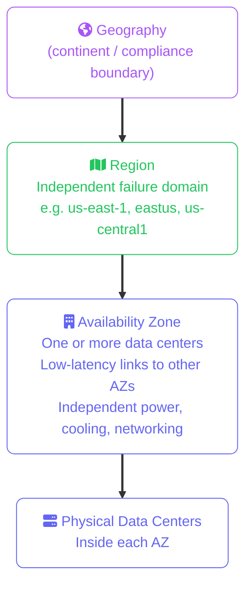
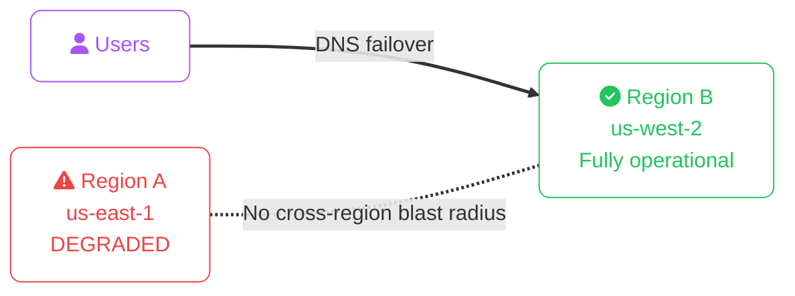
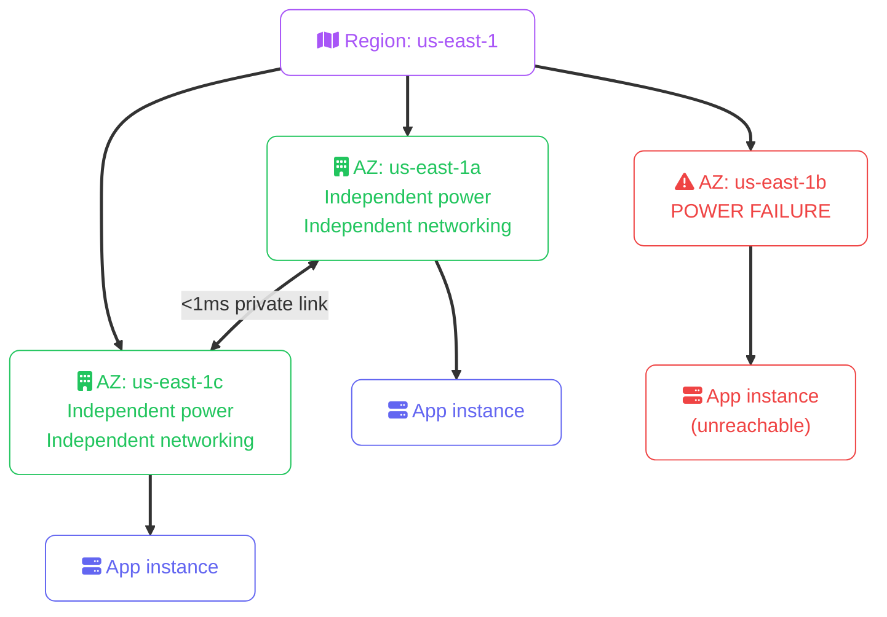
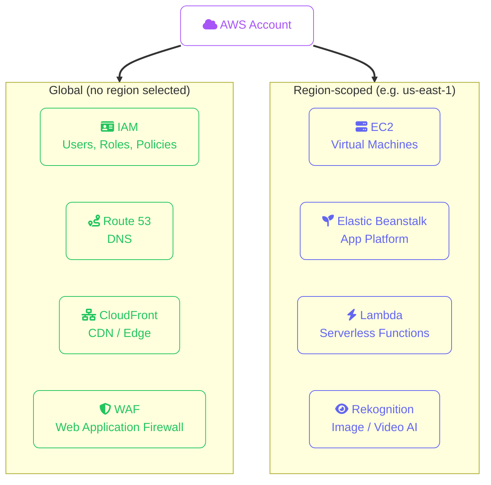
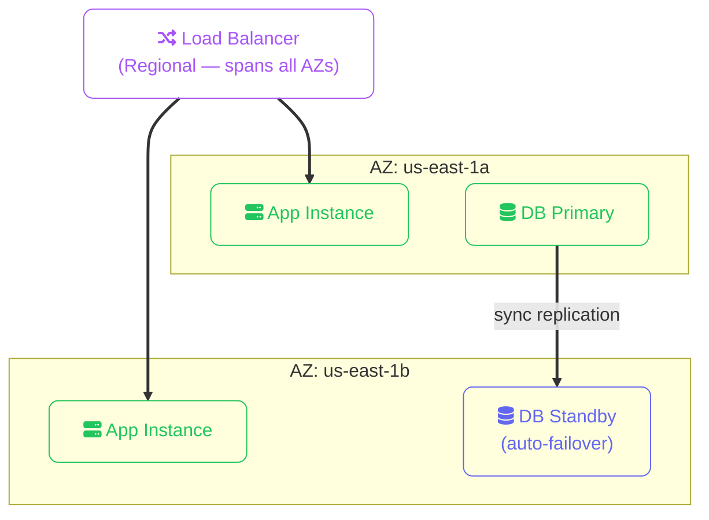

import Callout from '../../../components/mdx/Callout.astro';
import KeyPoints from '../../../components/mdx/KeyPoints.astro';
import Quiz from '../../../components/mdx/Quiz.astro';

Every resource you deploy in the cloud has a physical location. That location isn't arbitrary — it determines latency, compliance boundaries, fault isolation, and cost. Before you launch a single VM or store a single file, you need to understand how the cloud is physically organised.

<KeyPoints>
- What a Region is and how providers carve the world into them
- What an Availability Zone is and why the distinction from a Region matters
- How multi-AZ deployment eliminates single points of failure
- The difference between regional, zonal, and global services
- How to choose a region for latency, compliance, and cost
</KeyPoints>

---

## The Physical Hierarchy

Cloud infrastructure is organised into three levels of physical scope:

| Level | AWS | Azure | GCP |
|---|---|---|---|
| **Geography** | Partition (standard, China, GovCloud) | Geography | Multi-region |
| **Region** | `us-east-1` | `eastus` | `us-central1` |
| **Zone** | `us-east-1a`, `us-east-1b` | `eastus-1`, `eastus-2` | `us-central1-a`, `us-central1-b` |

---

## Regions

A **region** is a geographically isolated cluster of data centers. Traffic between regions crosses the public internet (or provider backbone), and each region operates independently — a total region failure does not affect other regions.

**How to choose a region:**

| Factor | Guidance |
|---|---|
| **Latency** | Closest region to your users — test with [cloudping.info](https://cloudping.info) |
| **Compliance** | Data residency laws (GDPR → EU regions; financial data → specific jurisdictions) |
| **Service availability** | Not all services are available in all regions — newer regions have fewer services |
| **Cost** | Prices vary region to region — `us-east-1` and `us-central1` are typically cheapest |

<Callout type="warning">
**Services are not replicated across regions automatically.** Copying an EBS snapshot to another region is a manual (or scripted) operation. S3 Cross-Region Replication requires explicit configuration. Never assume your data is multi-region by default.
</Callout>

---

## Availability Zones

An **availability zone (AZ)** is one or more physically separate data centers within a region, connected by low-latency (sub-millisecond) private fibre. AZs share the same region but have independent power, cooling, and networking.

**Single AZ = single point of failure.** A rack failure, power outage, or network event in one AZ can take down every resource you've deployed there.

**Multi-AZ = high availability.** Deploy your resources across at least two AZs and route traffic with a load balancer. If one AZ fails, the load balancer stops sending traffic there and the surviving AZ handles all requests.

---

## Zonal vs Regional vs Global Services

Not all cloud services are bound to a single AZ. Understanding scope tells you what you need to do for resilience:

| Scope | Examples | Resilience implication |
|---|---|---|
| **Zonal** | EC2 instance, EBS volume, GCP Persistent Disk | You must deploy in multiple AZs manually |
| **Regional** | S3 bucket, Elastic Beanstalk, Lambda, Rekognition | Provider replicates across AZs automatically |
| **Global** | IAM, Route 53, CloudFront, WAF, Azure AD | No region or AZ to choose — always available |

### AWS Service Scope in Practice

Most AWS services are **region-scoped** — you pick a region when you create a resource and it lives there. Only a small set of services operate globally:

**Global services** — IAM, Route 53, CloudFront, WAF — have no concept of "which region". You configure them once and they work everywhere. You won't be prompted to select a region in the AWS Console when you visit these service pages.

**Region-scoped services** — EC2, Lambda, Elastic Beanstalk, Rekognition, and the vast majority of AWS services — are tied to the region you're currently viewing in the console. If you launch an EC2 instance in `us-east-1` and then switch the console to `eu-west-1`, it won't appear in the list.

<Callout type="warning">
**Console region confusion is a common trap.** New AWS users often think their EC2 instances, Lambda functions, or RDS databases have disappeared. They haven't — you're looking at a different region. Always check the region selector in the top-right corner of the AWS Console.
</Callout>

<Callout type="tip">
**EBS volumes are zonal — always check.** An EBS volume created in `us-east-1a` can only attach to EC2 instances in `us-east-1a`. This is one of the most common gotchas when scaling or recovering from an AZ outage. Always snapshot across AZs if you need portability.
</Callout>

---

## Multi-AZ Architecture Pattern

The standard high-availability pattern for any stateful workload:

This pattern appears in every cloud provider as a managed offering:
- **AWS**: Multi-AZ RDS, ALB, Auto Scaling Groups
- **Azure**: Availability Sets / Zones, Azure SQL geo-redundancy
- **GCP**: Regional Managed Instance Groups, Cloud SQL HA

---

## Provider-Specific Names

All three providers use the same concepts with slightly different terminology and feature sets:

| Concept | AWS | Azure | GCP |
|---|---|---|---|
| Region | Region (33 launched) | Region (60+) | Region (40+) |
| Isolation unit | Availability Zone (2–6 per region) | Availability Zone (3 per region) | Zone (3 per region) |
| Edge locations | CloudFront PoPs (600+) | Azure CDN PoPs | Cloud CDN PoPs |
| Local deployment | Local Zones, Wavelength | Edge Zones | Distributed Cloud |
| On-premises extension | Outposts | Arc | Anthos |

<Callout type="info">
**AZ names are physical, not logical — sometimes.** AWS deliberately remaps AZ names per account so that `us-east-1a` in your account may be a different physical AZ than `us-east-1a` in another account. This prevents everyone defaulting to the same AZ and overloading it. For cross-account coordination, use the AZ ID (e.g. `use1-az1`) not the name.
</Callout>

---

## Knowledge Check

<Quiz
  question="You deploy an application on a single EC2 instance in us-east-1a. The AZ suffers a power outage. What is the impact?"
  options={[
    "The instance automatically migrates to us-east-1b",
    "The entire us-east-1 region fails over to us-west-2",
    "The instance is unavailable until the AZ recovers — there is no automatic failover for a single instance",
    "AWS restarts the instance in a different AZ automatically"
  ]}
  answer="The instance is unavailable until the AZ recovers — there is no automatic failover for a single instance"
  explanation="A single EC2 instance has no automatic failover. It stays in the AZ where it was launched. Multi-AZ resilience requires you to deploy multiple instances across AZs behind a load balancer, or use managed services (like RDS Multi-AZ) that handle replication and failover for you."
/>

---

## Cost Implications

| Cost Source | Detail |
|---|---|
| **Data transfer between AZs** | $0.01/GB each way on AWS and GCP. Free within the same AZ using private IPs. Design to minimise cross-AZ traffic in hot paths. |
| **Multi-AZ managed services** | RDS Multi-AZ is ~2× the cost of single-AZ (standby replica running continuously). Worth it for production; not for dev/test. |
| **Region selection** | `us-east-1` (AWS) and `us-central1` (GCP) are consistently 10–20% cheaper than EU/APAC regions for equivalent services. |
| **Redundant NAT Gateways** | For true AZ independence you need one NAT Gateway per AZ ($0.045/hr each on AWS). A single NAT Gateway is a single point of failure. |

<Callout type="tip" title="Dev/test vs production topology">
It's fine to run dev/test workloads single-AZ to save cost. Gate the difference: use Infrastructure as Code (Terraform, Pulumi) with a variable like `var.multi_az = true` for production and `false` for dev. Never rely on manually remembering to add the second AZ when promoting to production.
</Callout>

---

<KeyPoints title="Regions and AZs Checklist">
- Every resource lives in a specific region — data does not leave that region unless you explicitly replicate it
- AZs within a region have independent power, cooling, and networking — a failure in one AZ doesn't affect others
- Zonal services (EC2, EBS) require you to multi-AZ manually; regional services (S3, Blob) replicate automatically
- Always deploy stateful workloads across at least 2 AZs in production
- Cross-AZ data transfer is billable — minimise hot-path traffic between AZs
- AWS AZ names are account-scoped — use AZ IDs for cross-account coordination
</KeyPoints>
