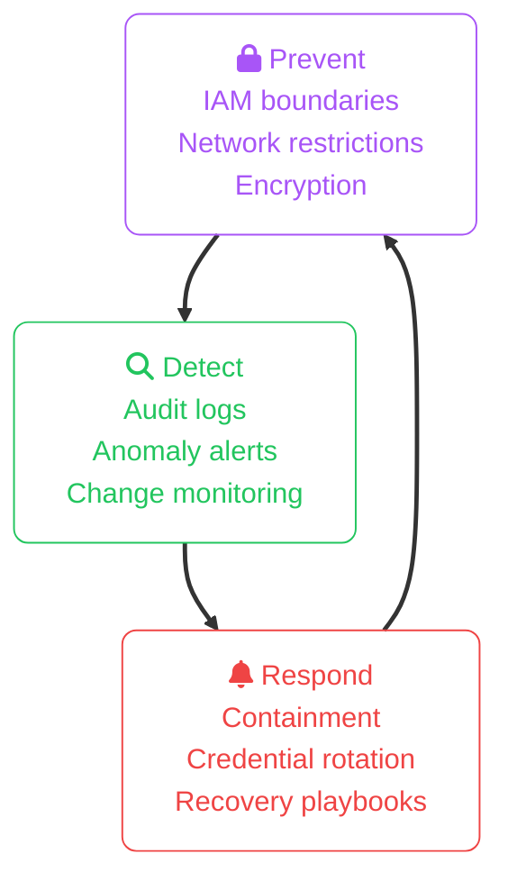
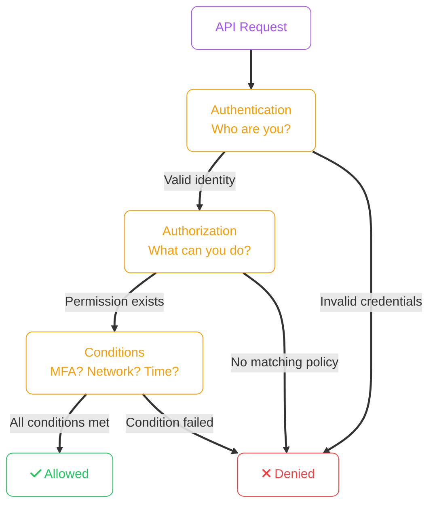
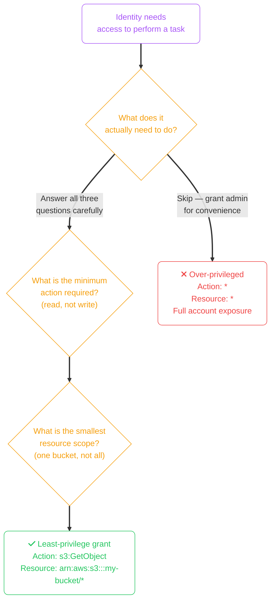
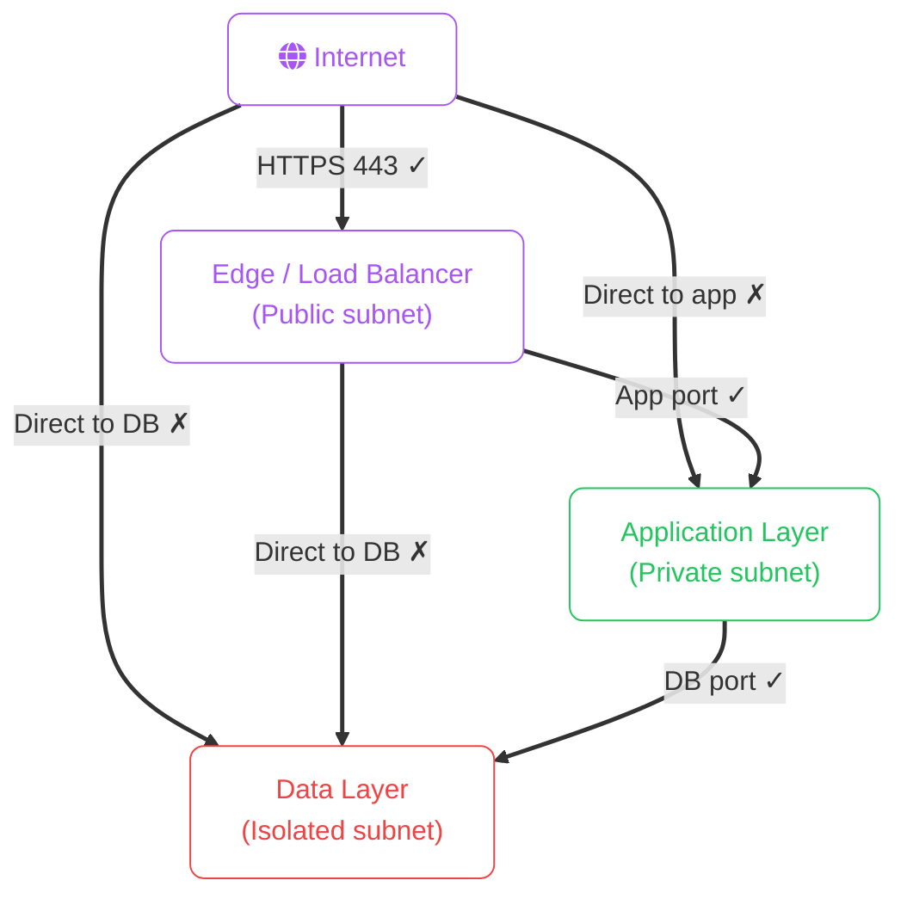
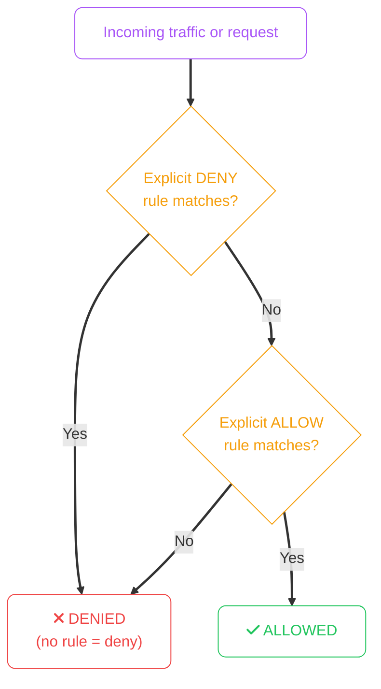
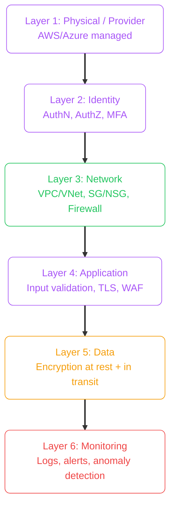
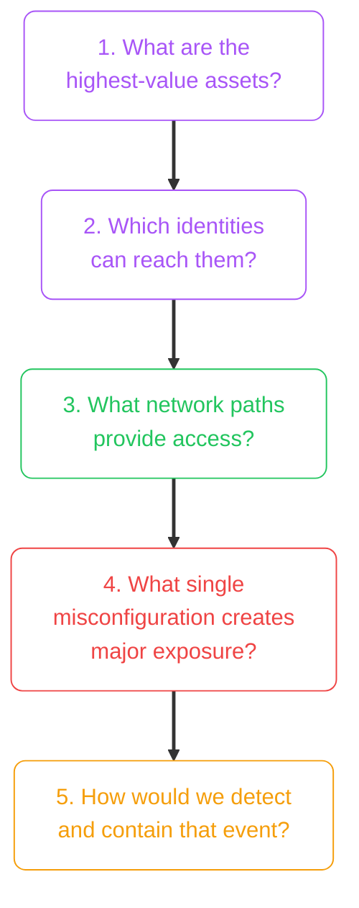
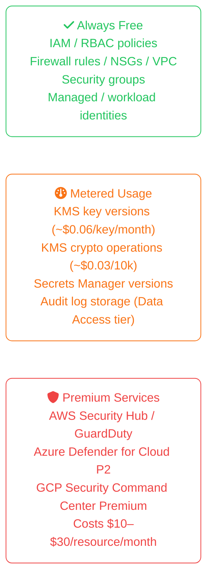

import Callout from '../../../components/mdx/Callout.astro';
import KeyPoints from '../../../components/mdx/KeyPoints.astro';
import Quiz from '../../../components/mdx/Quiz.astro';

These principles apply across cloud platforms — AWS, Azure, and GCP all follow the same security model. Learn them once and map them to any provider.

<KeyPoints>
- How to distinguish control-plane vs data-plane security responsibilities
- How to apply least privilege and segmentation as default architecture decisions
- How to build layered controls for prevention, detection, and response
- A practical threat-modeling checklist for evaluating baseline cloud security posture
- The most common cloud security failure patterns and why they occur
</KeyPoints>

---

## Security Design Mental Model

Think in three continuous loops. All three must be active at all times:



A system that only prevents but never detects is blind the moment prevention fails. A system that detects but never has playbooks is paralysed under pressure.

---

## 1. Identity and Access Control

Every secure system starts with controlling **who** can do **what** and **when**. Identity is the first line of defence in cloud architecture.



### Key identity principles

- **Least privilege**: grant only the minimum permissions actually needed — nothing more
- **Short-lived credentials**: prefer temporary tokens over long-lived secrets
- **Separation of duties**: admin and daily-use identities must be separate accounts
- **Machine identities**: applications must authenticate with managed/service identities, never with user passwords

<Callout type="danger" title="Shared Accounts Are Not Accounts — They Are Audit Gaps">
A shared admin account used by multiple engineers provides zero accountability. When an incident occurs, you cannot determine who did what. Every engineer needs their own identity with appropriate permissions.
</Callout>

---

## 2. The Principle of Least Privilege

This is the single most impactful rule in cloud security. Overly permissive access is the leading cause of cloud data breaches.



**Anti-pattern: Wildcard admin for convenience**
```json
{
  "Effect": "Allow",
  "Action": "*",
  "Resource": "*"
}
```

**Correct pattern: Scoped to the task**
```json
{
  "Effect": "Allow",
  "Action": ["s3:GetObject", "s3:ListBucket"],
  "Resource": "arn:aws:s3:::my-app-bucket/*"
}
```

If a workload only reads from a database, it should never have write or delete permissions. If it reads from one bucket, it should not have access to all buckets.

---

## 3. Network Segmentation and Trust Boundaries

Not all components should communicate with each other. Network segmentation limits what an attacker can reach once they breach one service.



**Segmentation rules:**
- Edge services are internet-facing; everything else is private
- Each tier can only be reached from the tier directly above it
- East-west traffic (service-to-service within a tier) should also be controlled
- Restrict egress from sensitive tiers — outbound calls should be intentional

<Callout type="warning" title="Lateral Movement Is the Goal of Most Breaches">
Attackers rarely target the most sensitive system first. They compromise a low-value entry point and use lateral movement to escalate. Network segmentation and service-to-service authentication stops lateral movement dead.
</Callout>

---

## 4. Default-Deny Architecture

Secure architectures deny everything by default and explicitly allow only what is required. This applies to both network firewalls and identity policies.



Start closed. Open only what is required. Review and remove stale access regularly. An access rule that was temporary but never expired is an uncontrolled exposure.

---

## 5. Defense in Depth

No single control is sufficient. Layered controls ensure that if one layer fails, others contain the damage.



An attacker who bypasses identity controls still faces network barriers. An attacker who breaches the network still faces data encryption. An attacker who exfiltrates encrypted data still triggers anomaly alerts.

---

## 6. Traceability and Incident Readiness

If you cannot answer *"who changed what, when, from where, and why"* — your system is not operationally secure.

**Audit log requirements:**
- Every identity action (login, privilege escalation, policy change)
- Every API call that modifies infrastructure
- Every access to sensitive data
- Logs must be tamper-protected and stored outside the blast radius

**Retention policy:** determine minimum retention based on compliance requirements (often 90 days to 1 year), then enforce it with automated lifecycle rules.

**Alerting on high-risk events:**
- Root/admin account activity
- IAM policy changes
- Security group rule modifications
- Data exfiltration volume anomalies
- Failed authentication spikes

---

## Practical Threat Modeling Starter

For every new system or significant change, work through these five questions before deploying:



These questions do not require a formal threat modelling methodology. They just require disciplined thinking before each deployment.

<Callout type="info" title="Security Is an Ongoing Practice">
Security is not a one-time checklist. It is continuous hardening, monitoring, and review as architecture and threats evolve. The threat landscape of 12 months ago is not the same as today.
</Callout>

---

## Common Cloud Security Failure Patterns

| Failure | Root cause | Prevention |
|---|---|---|
| Credential leak in code/repo | Long-lived static keys committed to git | Managed/service identities, pre-commit scanning |
| Open S3 bucket / Blob container | Public ACL or policy misconfiguration | Block public access at account level; enforce via policy |
| Overly permissive IAM | "Grant admin to unblock" shortcuts | PoLP from day 1; periodic right-sizing review |
| Unpatched internet-facing service | Manual patching, unmanaged dependencies | Automated patching, vulnerability scanning in CI |
| No MFA on privileged accounts | Friction of setup overlooked | Conditional Access / MFA policy enforcement |
| No alerting on changes | Unknown unknowns stay unknown | CloudTrail + CloudWatch Alerts / Azure Monitor, day 1 |

---

## Cost Implications of Security Controls

Security is not free — but the cost of not investing in it is orders of magnitude higher. Understanding where security services are free vs metered helps you prioritise coverage without bill shock.



**Free controls deliver most of the risk reduction.** Properly configured IAM, network segmentation, and default-deny firewall rules prevent the majority of cloud security incidents at zero incremental cost. Premium threat detection services add detection and posture management value but should come after foundational controls are in place.

<Callout type="warning" title="The High-Cost Trap: Verbose Audit Logs">
Data Access audit logs (reading/writing individual objects or rows) generate enormous volume in active systems. Routing all audit logs to a pay-per-GB logging service without filtering can cost hundreds of dollars per month per service. Enable Data Access logs selectively on the highest-risk resources (production data stores, secrets) and archive to object storage for the rest.
</Callout>

---

## Foundation Checklist

Before calling any cloud environment production-ready:

- Administrative and workload identities are separated
- MFA and conditional access enforced for all privileged human users
- High-risk services isolated in private network tiers with no direct public ingress
- Sensitive data encrypted in transit (TLS 1.2+) and at rest (KMS/Key Vault managed keys)
- Centralised logs with retention policy and active alert coverage on high-risk events
- Threat model reviewed for highest-value assets
- Incident runbooks documented and stored outside the environment
- Regular access review process (quarterly minimum)

---

<Quiz
  question="A web application uses an IAM role with full admin permissions because that was 'easiest to set up'. An attacker finds a code injection vulnerability. What is the immediate risk?"
  options={[
    { label: "Same risk as a least-privilege role — identity controls don't affect exploits" },
    { label: "The attacker can only access the application database" },
    { label: "The attacker can use the admin role to access any resource in the account, exfiltrate data, or cause destruction", correct: true },
    { label: "The risk is contained to the application server" },
  ]}
  explanation="An over-privileged identity turns a limited application vulnerability into an account-wide compromise. With admin permissions, the attacker can exfiltrate data from all storage, create backdoor users, delete resources, or move laterally to other services — all from one injection point."
/>

<KeyPoints>
  - Security requires three active loops: Prevent, Detect, and Respond — all three must operate continuously
  - Least privilege is the single highest-impact security control: grant only what is needed, to the smallest scope
  - Network segmentation (public → private → isolated) limits lateral movement after a breach
  - Default-deny means everything is blocked unless explicitly allowed — no implicit trust
  - Defense in depth layers identity, network, application, data, and monitoring controls
  - Audit logs must be tamper-protected, retained per policy, and actively alerted on high-risk events
  - Shared accounts eliminate accountability — every identity must be individual and traceable
  - Threat model every significant system: assets → identities → paths → single-point-of-failure → detection
</KeyPoints>

