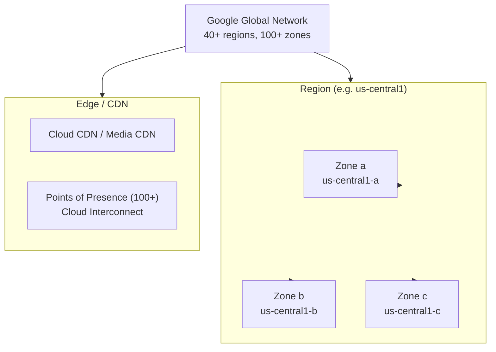
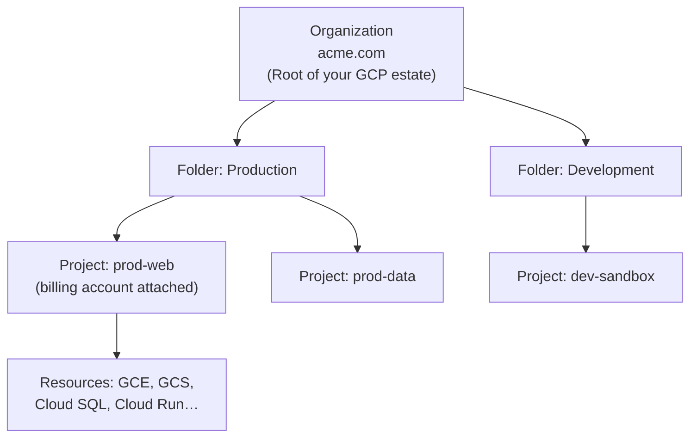

import Callout from '../../../components/mdx/Callout.astro';
import KeyPoints from '../../../components/mdx/KeyPoints.astro';
import Quiz from '../../../components/mdx/Quiz.astro';
import CodeTabs from '../../../components/mdx/CodeTabs.astro';
import List from '../../../components/mdx/List.astro';

Google Cloud Platform (GCP) is the third major hyperscaler, built on the same infrastructure that powers Google Search, YouTube, and Gmail. Launched publicly in 2011, it distinguishes itself with its global private fiber network, products pioneered internally at Google (Bigtable, Spanner, Kubernetes), and a strong data/ML service portfolio. Before touching any service, you need to understand how GCP is organised — both physically and through its unique resource hierarchy.

<Callout type="info">
**Foundation concepts first.** This lesson covers GCP-specific structure. For universal cloud networking concepts (VPC, subnets, routing), see **Cloud Networking Basics**. For identity and access management concepts, see **IAM Foundations** — both are linked above as shared concepts.
</Callout>

<KeyPoints>
- How GCP regions, zones, and the global network relate to each other
- The 4-level resource hierarchy: Organization → Folder → Project → Resource
- Why Projects are GCP's billing and API enablement boundary
- Core GCP service categories and their flagship services
- How to configure the gcloud CLI and authenticate with Application Default Credentials
- The Cloud Identity and IAM bootstrap sequence for a new GCP organization
</KeyPoints>

---

## GCP Global Infrastructure

GCP runs on Google's private global fiber network — the same network that carries YouTube traffic. This gives GCP a lower-latency backbone between regions compared to routing over the public internet.



| Layer | Count | Purpose |
|---|---|---|
| **Regions** | 40+ | Geographic isolation, data residency, latency |
| **Zones** | 3+ per region | Independent failure domains (separate power, cooling, network) |
| **Points of Presence** | 100+ | CDN edge, low-latency peering, Cloud Interconnect locations |
| **Submarine cables** | Several owned | Private global backbone, lower inter-region latency |

**Key difference from AWS and Azure:** GCP's zones are named with letters (`us-central1-a`, `us-central1-b`) rather than numbered. A single region typically has 3 zones minimum. For high availability, distribute across at least 2 zones; for regional HA, use a **regional resource** (e.g. a regional Persistent Disk or a regional managed instance group).

<Callout type="tip">
GCP offers **multi-region** and **dual-region** storage classes for Cloud Storage and some databases — data is automatically replicated across geographically separated regions for disaster recovery without you managing replication.
</Callout>

---

## GCP Resource Hierarchy

GCP uses a strict 4-level hierarchy. Every resource lives inside a Project, which lives inside Folders, which live inside an Organization. IAM policies set at any level **inherit downward** — a role granted at the Organization level applies to everything beneath it.



### The Project: GCP's Core Unit

Unlike AWS (accounts) and Azure (subscriptions), GCP's **Project** is the atomic unit of organisation:

- Every API must be **explicitly enabled** per project — no service is available by default
- Billing is attached at the **project level** — you assign a billing account to a project
- IAM policies are scoped to a project (or higher)
- Every resource lives in exactly one project
- Projects have both a **project ID** (globally unique, immutable, you choose it) and a **project number** (assigned by GCP, used in service accounts and API calls)

<Callout type="warning">
Project IDs are globally unique across all GCP customers and cannot be changed after creation. Choose them deliberately — `prod-api-v2` ages better than `my-first-project-12345`.
</Callout>

### Folders

Folders group projects and are optional but recommended for multi-team organizations. Common patterns:

| Pattern | Structure |
|---|---|
| By environment | `production/` → `staging/` → `development/` |
| By team | `platform-team/` → `data-team/` → `frontend-team/` |
| By compliance boundary | `pci-scope/` → `out-of-scope/` |

---

## Core GCP Service Categories

| Category | Key GCP Services |
|---|---|
| **Compute** | Compute Engine (VMs), Cloud Run (containers), GKE (Kubernetes), App Engine, Cloud Functions |
| **Storage** | Cloud Storage (object), Persistent Disk (block), Filestore (NFS) |
| **Databases** | Cloud SQL (managed MySQL/Postgres/SQLServer), Cloud Spanner (global RDBMS), Bigtable (wide-column NoSQL), Firestore (document), Memorystore (Redis/Memcached) |
| **Networking** | VPC, Cloud Load Balancing, Cloud CDN, Cloud DNS, Cloud NAT, Interconnect |
| **Security** | Cloud IAM, Secret Manager, Cloud KMS, Security Command Center, Chronicle |
| **Data & ML** | BigQuery (data warehouse), Dataflow (streaming), Pub/Sub (messaging), Vertex AI, Looker |
| **Developer Tools** | Cloud Build, Artifact Registry, Cloud Deploy, Cloud Source Repositories |
| **Management** | Cloud Monitoring, Cloud Logging, Cloud Trace, Error Reporting |

---

## Cloud Identity and IAM Bootstrap

### Understanding Principals

In GCP IAM, there are several types of **principals** (identities):

| Principal Type | Description | Example |
|---|---|---|
| **Google Account** | A single user (consumer or Workspace) | `user@gmail.com` |
| **Service Account** | A non-human identity for workloads | `my-app@project-id.iam.gserviceaccount.com` |
| **Google Group** | Collection of Google Accounts | `devs@company.com` |
| **Cloud Identity / Workspace domain** | All users in a domain | `domain:company.com` |
| **allUsers** | Anyone on the internet | (use only for public resources) |
| **allAuthenticatedUsers** | Any authenticated Google account | (rarely appropriate) |

<Callout type="warning">
Never grant roles to `allUsers` or `allAuthenticatedUsers` on resources that contain sensitive data. `allAuthenticatedUsers` is not the same as "employees" — it means any Google account globally.
</Callout>

### IAM Role Types

| Type | Description | When to Use |
|---|---|---|
| **Basic (Primitive)** | `roles/viewer`, `roles/editor`, `roles/owner` | Never in production — overly broad |
| **Predefined** | `roles/storage.objectViewer`, `roles/compute.instanceAdmin.v1` | Default choice |
| **Custom** | You define the permissions | When predefined roles are too broad |

### First Actions on a New GCP Organization

```bash
# 1. Create your admin group, grant Organization Admin
gcloud organizations add-iam-policy-binding ORG_ID \
  --member="group:gcp-admins@company.com" \
  --role="roles/resourcemanager.organizationAdmin"

# 2. Create a folder structure
gcloud resource-manager folders create \
  --display-name="Production" \
  --organization=ORG_ID

# 3. Create projects with billing
gcloud projects create prod-web-001 \
  --folder=FOLDER_ID \
  --name="Production Web"

gcloud billing projects link prod-web-001 \
  --billing-account=BILLING_ACCOUNT_ID

# 4. Enable required APIs (explicit per project)
gcloud services enable compute.googleapis.com \
  storage.googleapis.com \
  iam.googleapis.com \
  --project=prod-web-001
```

---

## gcloud CLI Setup

```bash
# Install via package manager or download the SDK
# macOS with Homebrew:
brew install --cask google-cloud-sdk

# Initialize (sets up config, logs in, selects project)
gcloud init

# Explicit auth (generates Application Default Credentials for local dev)
gcloud auth application-default login

# Set a default project and region so you don't repeat them
gcloud config set project prod-web-001
gcloud config set compute/region us-central1
gcloud config set compute/zone us-central1-a

# Check current config
gcloud config list
```

<Callout type="tip">
**Application Default Credentials (ADC)** is the credential chain used by GCP client libraries. Running `gcloud auth application-default login` puts your credentials in `~/.config/gcloud/application_default_credentials.json`. In production (GCE, Cloud Run, GKE), ADC automatically uses the attached Service Account — you don't need a credentials file.
</Callout>

### gcloud Config Profiles

For multi-project workflows, use **named configurations** so you can switch contexts instantly:

```bash
# Create a named config for each project/environment
gcloud config configurations create prod
gcloud config set project prod-web-001
gcloud config set compute/region us-central1

gcloud config configurations create staging
gcloud config set project staging-web-001

# Switch between them
gcloud config configurations activate prod
```

<Quiz
  question="Which GCP construct is the primary billing and API-enablement boundary?"
  options={[
    { label: "Organization" },
    { label: "Folder" },
    { label: "Project", correct: true },
    { label: "Resource" },
  ]}
  explanation="Every GCP project has exactly one billing account attached, and APIs must be enabled per project. Organizations and Folders provide governance and grouping, but billing and API access are controlled at the project level."
/>

<Quiz
  question="What happens to an IAM policy bound at the Folder level?"
  options={[
    { label: "It applies only to that folder's direct child projects" },
    { label: "It applies to all projects and resources in that folder and all subfolders", correct: true },
    { label: "It must be replicated manually to each project" },
    { label: "It applies only if the project explicitly opts in" },
  ]}
  explanation="GCP IAM policies are additive and inherit downward through the hierarchy. A role granted at a Folder applies to all projects inside that folder and any nested subfolders — there is no way to block inheritance from a parent."
/>
