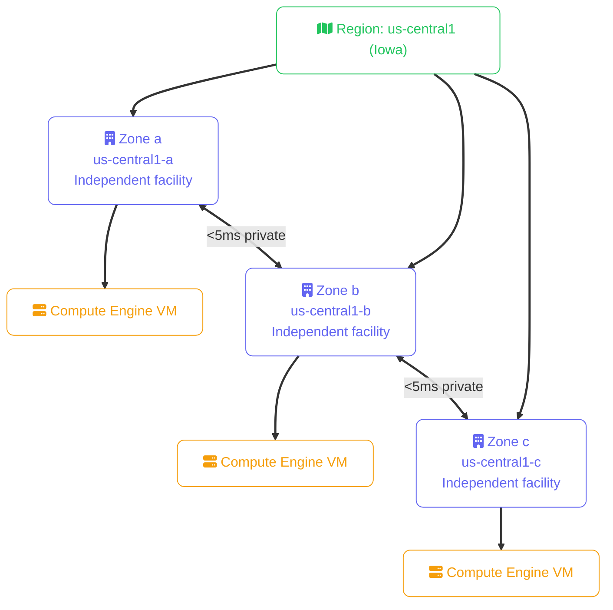
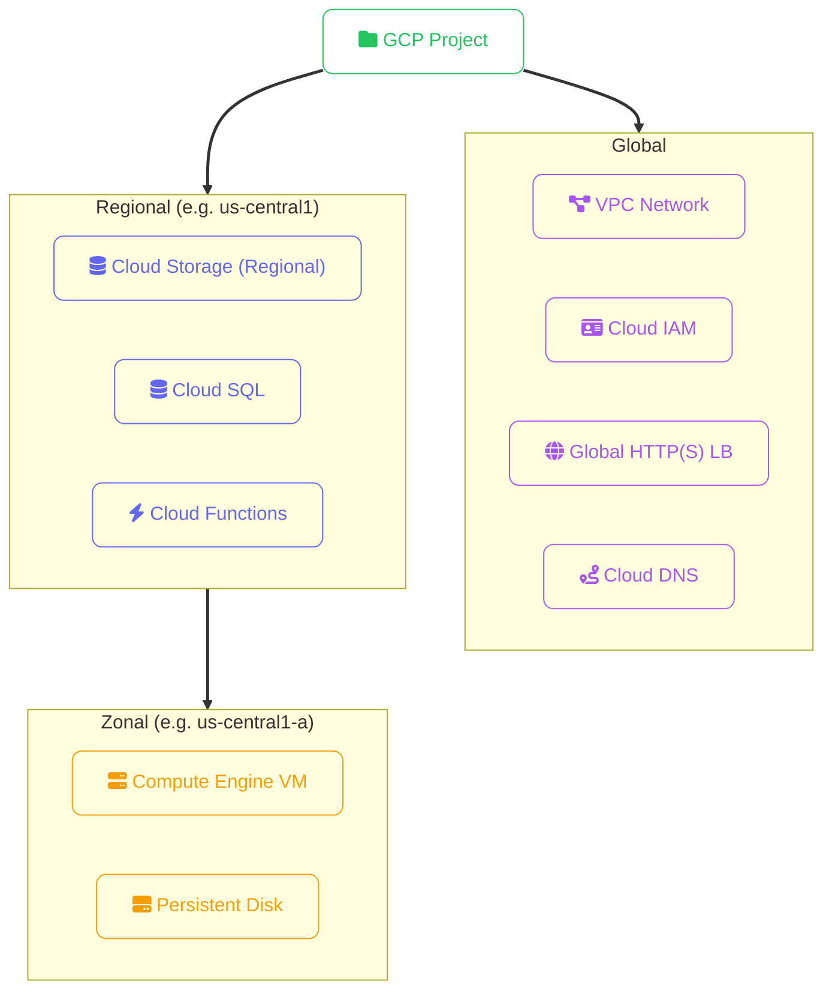
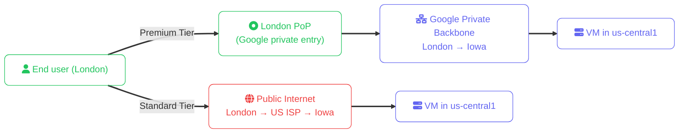

import Callout from '../../../components/mdx/Callout.astro';
import KeyPoints from '../../../components/mdx/KeyPoints.astro';
import Quiz from '../../../components/mdx/Quiz.astro';
import CodeTabs from '../../../components/mdx/CodeTabs.astro';

GCP runs on Google's private global fiber network — the same backbone that carries YouTube and Google Search traffic. This gives GCP a structural advantage in inter-region bandwidth and latency. But to exploit that infrastructure, you need to understand GCP's geography model: **regions**, **zones**, and the uniquely GCP concepts of **multi-region** and **global VPC**.

<KeyPoints>
- How GCP region and zone names are structured and which regions are most commonly used
- Why GCP "zones" correspond to AWS/Azure Availability Zones — not regions
- Global vs regional vs zonal service scope and the implications for resilience
- Multi-region and dual-region storage concepts for geo-redundancy without manual replication
- Premium vs Standard Network Tier and how they affect routing
- How to list, set, and switch regions with gcloud
</KeyPoints>

---

## Region and Zone Naming

GCP uses a code-based naming scheme similar to AWS:

- **Region:** `{area}-{direction}{number}` → `us-central1`, `europe-west1`, `asia-southeast1`
- **Zone:** `{region}-{letter}` → `us-central1-a`, `us-central1-b`, `us-central1-c`

| Region | Location | Notes |
|---|---|---|
| `us-central1` | Iowa | Default US region — most services, lowest price |
| `us-east1` | South Carolina | US East |
| `us-east4` | N. Virginia | US East, close to AWS us-east-1 |
| `us-west1` | Oregon | US West |
| `europe-west1` | Belgium | Primary EU region |
| `europe-west3` | Frankfurt | German data residency |
| `europe-west4` | Netherlands | Netherlands |
| `asia-southeast1` | Singapore | Southeast Asia hub |
| `asia-northeast1` | Tokyo | Japan |
| `asia-south1` | Mumbai | India |
| `australia-southeast1` | Sydney | Australia |
| `southamerica-east1` | São Paulo | South America |

Each region contains **three or more zones**. GCP guarantees at least 3 zones per region — you should treat zones the same way you treat AWS Availability Zones.

<Callout type="tip">
`us-central1` is the de facto default for most new GCP projects — it has the widest service coverage and the lowest per-unit cost. `us-east4` is useful when you're comparing directly with AWS services running in `us-east-1` (both are in Virginia).
</Callout>

---

## Zones vs Availability Zones

GCP calls them **zones** — not Availability Zones — but the concept is identical:



For high availability, deploy VMs in **at least two zones** within the same region and put them behind a **Regional Load Balancer**. For compute groups, GCP's **Managed Instance Groups (MIGs)** handle this automatically when configured as regional.

---

## Service Scope

GCP has a unique characteristic: its **VPC is global** — a single VPC spans all regions by default, unlike AWS and Azure where a VPC is regional. This changes how you think about network segmentation.



| Scope | Service examples | Notes |
|---|---|---|
| **Global** | VPC, Cloud IAM, Global LB, Cloud CDN, Cloud DNS | VPC spanning all regions is unique to GCP |
| **Regional** | Cloud Storage (regional), Cloud SQL, GKE (regional cluster), Cloud Functions | Provider manages zone replication |
| **Zonal** | Compute Engine VM, Persistent Disk, GPU node | You must deploy across zones manually |

<Callout type="warning">
Even though GCP's VPC is global, **subnets are regional**. A subnet in `us-central1` only contains resources in that region. The global VPC means you don't need VPC peering between regions for the same project — but you still need to design subnets per region intentionally.
</Callout>

---

## Multi-Region and Dual-Region Storage

Cloud Storage offers storage classes that span multiple regions — automatically. This is different from AWS S3 Cross-Region Replication (which is opt-in and explicit).

| Storage type | Scope | Use case |
|---|---|---|
| **Regional** | Single region, replicated across zones | Low-latency access from that region |
| **Dual-region** | Two specific regions (e.g. `us-central1` + `us-east1`) | Geo-redundancy with defined regions |
| **Multi-region** | Large geography (US, EU, ASIA) | Globally distributed reads, highest availability |

Dual-region buckets with **Turbo Replication** (10 Gbps+ replication) meet an RPO of 15 minutes — relevant for BCDR requirements that mandate specific secondary locations.

---

## Network Tier: Premium vs Standard

GCP is the only major cloud provider with a user-selectable global network tier:



| Tier | Routing | Latency | Cost | Use case |
|---|---|---|---|---|
| **Premium** | Google's private backbone from the nearest PoP | Lower, more consistent | Higher | Production apps, latency-sensitive workloads |
| **Standard** | Public internet to a regional entry point | Higher, variable | Lower | Dev/test, non-latency-sensitive batch workloads |

---

## Working with Regions in the CLI

```bash
# List all regions
gcloud compute regions list

# List all zones
gcloud compute zones list

# List zones in a specific region
gcloud compute zones list --filter="region:us-central1"

# Set a default region and zone for the project config
gcloud config set compute/region us-central1
gcloud config set compute/zone us-central1-a

# Check your current config
gcloud config list

# Create a VM in a specific zone
gcloud compute instances create my-vm \
  --zone=us-central1-b \
  --machine-type=n2-standard-4 \
  --image-family=debian-12 \
  --image-project=debian-cloud
```

For multi-region work, use **gcloud configurations** to manage different region defaults:

```bash
# Create a named configuration
gcloud config configurations create prod-eu
gcloud config set compute/region europe-west1
gcloud config set core/project my-eu-project

# Switch between configurations
gcloud config configurations activate prod-eu
gcloud config configurations activate default
```

<Callout type="tip">
Set `CLOUDSDK_COMPUTE_REGION` and `CLOUDSDK_COMPUTE_ZONE` as environment variables in CI/CD pipelines. This makes region selection explicit and auditable in pipeline logs, rather than relying on a local gcloud config that might not be present in the runner.
</Callout>

---

<Quiz
  question="You create a Compute Engine Persistent Disk in zone `us-central1-a`. Which of the following statements is true?"
  options={[
    { label: "You can attach it to a VM in us-central1-b — disks are regional" },
    { label: "You can attach it to any VM in the us-central1 region automatically" },
    { label: "You can only attach it to VMs in us-central1-a — Persistent Disks are zonal", correct: true },
    { label: "You must convert it to a Regional Disk before attaching to any VM" },
  ]}
  explanation="Standard Persistent Disks are zonal resources, scoped to a single zone. They can only be attached to VMs in the same zone. If you need a disk accessible from multiple zones for read replicas or failover, use a Regional Persistent Disk — it replicates synchronously between two zones in the same region and can be forcibly attached to a VM in the replica zone if the primary zone fails."
/>
