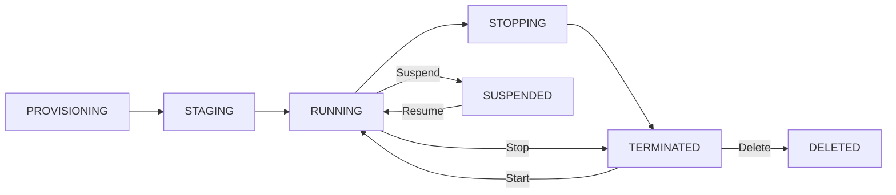

import Callout from '../../../components/mdx/Callout.astro';
import KeyPoints from '../../../components/mdx/KeyPoints.astro';
import Quiz from '../../../components/mdx/Quiz.astro';
import CodeTabs from '../../../components/mdx/CodeTabs.astro';
import { Icon } from 'astro-icon/components';

Google Compute Engine (GCE) is GCP's virtual machine service. Like EC2 and Azure VMs, you get full OS control with your choice of machine type, image, storage, and network placement. GCE has two distinctive features that set it apart: **custom machine types** (pick any CPU count and memory combination) and **sustained use discounts** that apply automatically without reservation.

<KeyPoints>
- How the GCE machine type naming convention decodes families, series, and sizes
- Machine family choices: E2 (cost), N2/N2D (balanced), C2/C2D (compute), M2/M3 (memory), A2/G2 (GPU)
- Custom machine types — how to right-size without over-paying for preset shapes
- The three pricing models: on-demand, committed use discounts, and Spot VMs
- Sustained use discounts — automatic discounts that apply with no reservation needed
- Storage options: persistent disk types, local SSD, and what "ephemeral" means for local SSD
- Network placement: VPC, subnet selection, firewall rules, and service account attachment
</KeyPoints>

---

## Machine Type Naming Convention

GCE machine type names encode the family, series, CPU/memory ratio, and size:

```
e2  -  standard  -  8
│       │             └── vCPU count
│       └─────────────── CPU:memory ratio profile:
│                          standard (3.75 GB/vCPU)
│                          highmem  (6.5–8 GB/vCPU)
│                          highcpu  (0.9 GB/vCPU)
└─────────────────────── Machine series (family + generation)
```

For custom types:
```
n2-custom-8-16384
│         │  └── Memory in MB (16 GB)
│         └───── vCPU count (8)
└─────────────── Series (n2)
```

---

## Machine Families

### E2 — Cost-Optimised (General Purpose)

Best first choice for most workloads where cost matters and consistent performance isn't critical.

| Type | vCPU | Memory | Use |
|---|---|---|---|
| e2-micro | 0.25 | 1 GB | Free tier, dev/test |
| e2-small | 0.5 | 2 GB | Lightweight services |
| e2-medium | 1 | 4 GB | Web servers, internal tools |
| e2-standard-8 | 8 | 32 GB | Mid-tier apps |
| e2-standard-32 | 32 | 128 GB | Larger workloads |

E2 supports shared-core types (`e2-micro`, `e2-small`, `e2-medium`) — these use a fractional vCPU and burst when needed, similar to AWS T-series or Azure B-series.

### N2 / N2D — Balanced (General Purpose)

N2 uses Intel processors; N2D uses AMD EPYC. Higher baseline performance than E2, suitable for production web, databases, and business applications.

```
n2-standard-8   → Intel, 8 vCPU, 32 GB RAM
n2d-standard-8  → AMD EPYC, typically ~10% cheaper than N2
```

### C2 / C2D — Compute-Optimised

Highest single-threaded performance. For HPC, game servers, CPU-bound simulation, and analytics.

```
c2-standard-4   → 4 vCPU, 16 GB RAM, 3.8 GHz Intel
c2d-standard-4  → AMD EPYC, higher memory bandwidth
```

### M2 / M3 — Memory-Optimised

For in-memory databases (SAP HANA, Redis at scale), large analytics workloads, and data warehousing.

| Series | Max Memory | Use |
|---|---|---|
| m2-ultramem-416 | 12 TB | SAP HANA, in-memory analytics |
| m3-ultramem-128 | 1.9 TB | Large in-memory workloads |

### A2 / G2 — Accelerator-Optimised

For ML training, inference, and GPU-accelerated workloads.

| Series | GPU | Count |
|---|---|---|
| a2-highgpu-1g | NVIDIA A100 40GB | 1–8 |
| g2-standard-4 | NVIDIA L4 | 1 |

---

## Custom Machine Types

Any N1, N2, N2D, or E2 instance can be configured with a custom vCPU count and memory amount — you're not locked to preset sizes.

**Rules:**
- Memory must be a multiple of **256 MB**
- Memory per vCPU: 0.9 GB minimum, 6.5 GB maximum (standard); up to 8 GB with `custom-EXTENDED`
- vCPU count must be even (or 1)

```bash
# Custom: 6 vCPU, 24 GB RAM on N2
gcloud compute instances create my-vm \
  --machine-type=n2-custom-6-24576 \
  --zone=us-central1-a

# Extended memory: 6 vCPU, 48 GB RAM (beyond the 6.5 GB/vCPU standard limit)
gcloud compute instances create my-vm \
  --machine-type=n2-custom-6-49152-ext
```

<Callout type="tip">
Custom machine types are priced per vCPU and per GB of memory independently. Use them when the nearest preset shape wastes significant resources — for example, if your app needs 6 vCPU and 18 GB RAM, a custom type beats the nearest preset (`n2-standard-8` = 32 GB) and saves ~40% on memory.
</Callout>

---

## Pricing Models

### On-Demand (Pay-as-you-go)

Full per-second pricing (after a 1-minute minimum) with no commitment.

### Sustained Use Discounts (Automatic)

**Unique to GCP.** If you run an N1, N2, or C2 instance for more than 25% of a month, GCP automatically applies a discount — no reservation needed.

| % of Month Running | Effective Discount |
|---|---|
| 25% | 0% |
| 50% | ~10% |
| 75% | ~20% |
| 100% | ~30% |

<Callout type="info">
Sustained use discounts are calculated per machine type, per region, and are applied retroactively at the end of the billing cycle. They work across **all** N1/N2/C2 VMs in the same project — even if you run different instance sizes.
</Callout>

### Committed Use Discounts (CUD)

Up-front commitment for 1 or 3 years in exchange for significant discounts.

| Commitment | Discount vs On-Demand |
|---|---|
| 1-year | ~37% |
| 3-year | ~55% |

Two types:
- **Resource-based CUD** — commit to a specific amount of vCPU and memory. Flexible — applies to any machine type that fits.
- **Spend-based CUD** — commit to a monthly spend amount. Applies to Cloud SQL, Cloud Run, and some other services.

### Spot VMs

GCP's equivalent of AWS Spot Instances. Uses spare GCE capacity at up to **91% discount**. Can be preempted with a 30-second shutdown signal when GCP needs capacity back.

```bash
gcloud compute instances create my-spot-vm \
  --machine-type=n2-standard-4 \
  --provisioning-model=SPOT \
  --instance-termination-action=STOP \
  --zone=us-central1-a
```

<Callout type="warning">
Spot VMs have a **24-hour maximum runtime** — GCP will stop them after 24 hours even if not preempted. Design workloads to checkpoint state regularly. Use Managed Instance Groups with `--instance-redistribution-type=NONE` for batch jobs.
</Callout>

---

## Instance Lifecycle



**Billing by state:**

| State | billed? |
|---|---|
| RUNNING | Yes — compute + attached disks |
| TERMINATED (stopped) | No compute, **yes disk** |
| SUSPENDED | No compute, **yes disk + memory snapshot** |
| DELETED | Nothing |

---

## Storage Options

### Boot Disk

Every GCE instance has a persistent disk attached as the boot disk. Default size is 10 GB (image-minimum). The disk persists after instance deletion by default — set `--no-boot-disk-auto-delete` to retain it.

### Additional Persistent Disks

Attach up to 128 additional persistent disks per instance. Persistent disks are network-attached and **zone-scoped** — you can't attach a disk from `us-central1-a` to an instance in `us-central1-b`.

See the next lesson for persistent disk performance tuning.

### Local SSD

NVMe drives physically attached to the server. 375 GB per slice, up to 24 slices (9 TB) per instance.

| | Persistent Disk | Local SSD |
|---|---|---|
| Survives stop/restart | <Icon name="mdi:check-circle" class="inline w-4 h-4 align-middle text-green-500" /> | <Icon name="mdi:close-circle" class="inline w-4 h-4 align-middle text-red-500" /> (ephemeral) |
| Survives live migration | <Icon name="mdi:check-circle" class="inline w-4 h-4 align-middle text-green-500" /> | <Icon name="mdi:check-circle" class="inline w-4 h-4 align-middle text-green-500" /> |
| Survives host failure | <Icon name="mdi:check-circle" class="inline w-4 h-4 align-middle text-green-500" /> | <Icon name="mdi:close-circle" class="inline w-4 h-4 align-middle text-red-500" /> |
| Max IOPS | 120,000 (pd-extreme) | 2.4M (NVMe, 24 slices) |
| Latency | ~1 ms | ~100 µs |

<Callout type="danger">
Local SSD data is **permanently lost** when an instance is stopped, deleted, or if the underlying hardware fails. Use local SSD only for ephemeral data: caches, temp files, scratch space for data processing pipelines.
</Callout>

---

## Network Placement

Every GCE instance requires:

1. **VPC network** — attach to a VPC (default VPC exists per project; do not use in production)
2. **Subnet** — pick a regional subnet within the VPC; determines the instance's internal IP range
3. **Firewall rules** — defined at the VPC level, applied via network tags or service accounts
4. **Service account** — the identity the instance uses to call GCP APIs (defaults to the Compute Engine default SA — scoped it down)

```bash
gcloud compute instances create prod-web-01 \
  --machine-type=n2-standard-4 \
  --zone=us-central1-a \
  --image-family=debian-12 \
  --image-project=debian-cloud \
  --boot-disk-size=50GB \
  --boot-disk-type=pd-balanced \
  --network=prod-vpc \
  --subnet=prod-subnet-us-central1 \
  --no-address \
  --service-account=web-sa@prod-web-001.iam.gserviceaccount.com \
  --scopes=cloud-platform \
  --tags=web-server
```

<Callout type="tip">
Use `--no-address` to launch instances without an external IP. Use **Cloud NAT** for outbound internet access and **Identity-Aware Proxy (IAP)** or a bastion host for inbound SSH — never expose SSH via a public IP in production.
</Callout>

<Quiz
  question="Which GCE feature applies a discount automatically without any reservation?"
  options={[
    { label: "Committed Use Discounts" },
    { label: "Spot VM pricing" },
    { label: "Sustained Use Discounts", correct: true },
    { label: "Custom machine type pricing" },
  ]}
  explanation="Sustained Use Discounts are automatically applied by GCP when an N1, N2, or C2 instance runs for more than 25% of a billing month — no reservation or commitment required. They scale up to ~30% off for full-month usage."
/>

---

## Cost Implications

GCE pricing has well-documented headline rates, with a few subtle components that inflate costs in production environments.

| Cost Source | Detail |
|---|---|
| **Sustained Use Discount** | Auto-applied for N1/N2/C2 running >25% of a month; up to ~30% off at 100% usage. Does NOT apply to E2 or Spot VMs. |
| **Committed Use Discount** | 1-year: ~37% off, 3-year: ~55% off on vCPU + memory. CUDs do NOT stack with SUDs — the larger one applies. |
| **Reserved external IP (unused)** | $0.010/hr (~$7.30/month) per IP reserved but not attached to a running resource. Delete unused reserved IPs. |
| **Custom machine types** | Billed per vCPU ($0.033/hr) + per GB memory ($0.0044/hr). No surcharge vs standard types of the same vCPU/memory spec. |
| **GPU instances** | NVIDIA T4: +$0.35/hr. A100 (80 GB): +$3.67/hr. GPU costs typically exceed the VM base cost — verify utilisation with `nvidia-smi`. |

<Callout type="warning" title="Spot VMs Can Be Preempted Without Prior Notice">
GCP **Spot VMs** are up to 91% cheaper than On-Demand but can be preempted with a 30-second shutdown notice — or with no notice in some regions. In high-demand regions or for large machine types, Spot capacity may simply not be available. Design Spot workloads to checkpoint state to GCS and recover automatically, and always configure an On-Demand fallback in your Managed Instance Group.
</Callout>

<Callout type="tip" title="Right-Size Before Committing a CUD">
Committed Use Discounts lock you into a vCPU + memory commitment for 1 or 3 years. Committing to n2-standard-16 resources when actual usage is n2-standard-8 wastes 50% of the commitment. Run workloads for at least one full month using SUD savings first, profile with Cloud Monitoring, then apply CUDs to the stable baseline. Leave ~20% on-demand headroom for growth.
</Callout>
