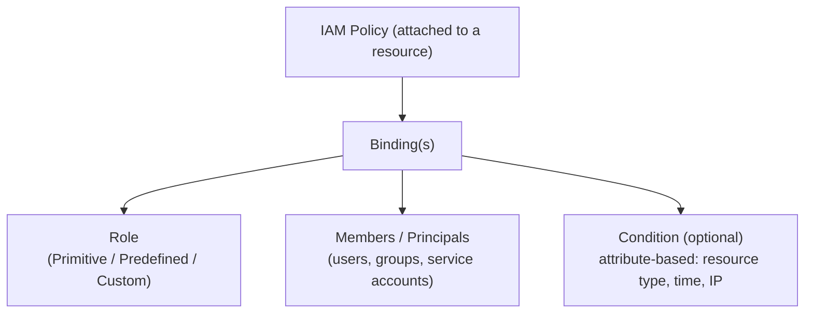
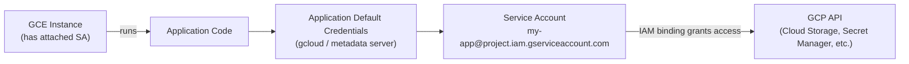
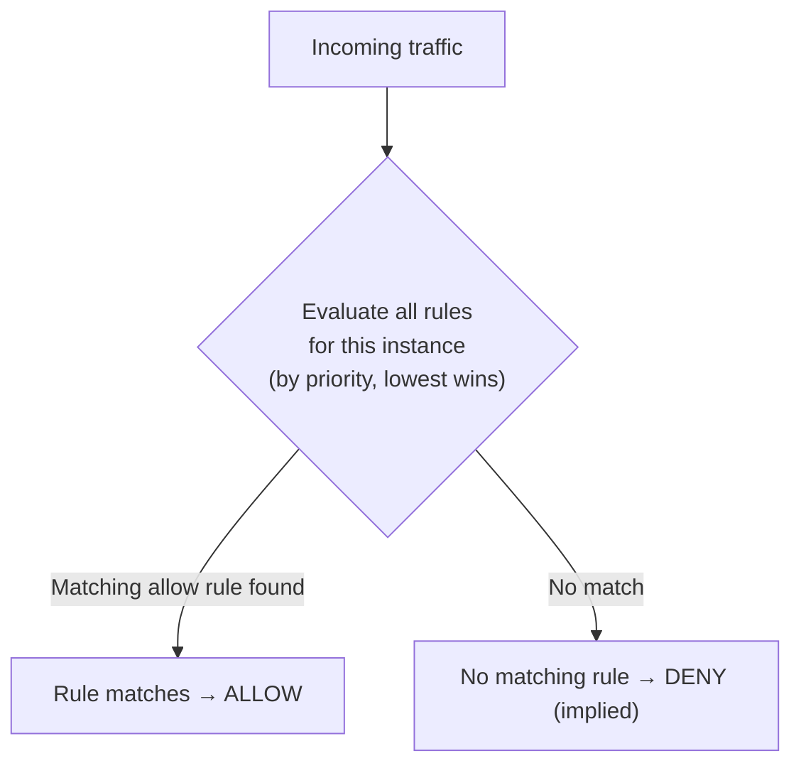
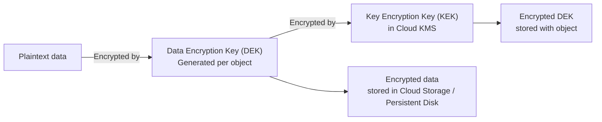

import Callout from '../../../components/mdx/Callout.astro';
import KeyPoints from '../../../components/mdx/KeyPoints.astro';
import Quiz from '../../../components/mdx/Quiz.astro';
import CodeTabs from '../../../components/mdx/CodeTabs.astro';
import { Icon } from 'astro-icon/components';

This lesson maps GCP-specific controls to the security principles in [Security Foundations](/cloud/common/security-foundations). Each section follows the pattern: **principle → the GCP tool that implements it**.

<KeyPoints>
- How GCP IAM roles and policy bindings implement least privilege
- Service Accounts as workload identity — replacing credential files with attached identities
- VPC firewall rules: priority evaluation, ingress vs egress, target mechanisms
- VPC Service Controls for perimeter-based protection of sensitive projects
- Cloud KMS and envelope encryption for data at rest
- Cloud Audit Logs + Security Command Center as the GCP traceability and threat detection layer
</KeyPoints>

---

## Cloud IAM: Implementing Least Privilege

The security-foundations lesson defines **least privilege** as the principle. Cloud IAM enforces it by binding a principal (who), to a role (what permissions), at a scope (which resource).

### IAM Policy Structure



**IAM policy bindings are additive** — there's no explicit "Deny" in basic IAM (unlike AWS). GCP evaluates:
1. Collect all roles granted to the principal at all scopes (resource + ancestors)
2. If any role includes the requested permission → **ALLOW**
3. Otherwise → **DENY**

<Callout type="warning">
Because policies are additive and inherit from parent resources, a role granted at the Organization level cannot be blocked at the Project level. Use **Deny policies** (a separate feature from role bindings) to create explicit exceptions when you need to restrict permissions inherited from a parent.
</Callout>

### Predefined Roles — the Right Default

Predefined roles follow the pattern `roles/{service}.{noun}{Verb}`:

| Role | Grants |
|---|---|
| `roles/storage.objectViewer` | Read objects in Cloud Storage |
| `roles/storage.objectCreator` | Create objects (not list/delete) |
| `roles/compute.instanceAdmin.v1` | Full GCE instance control (not network/IAM) |
| `roles/bigquery.dataViewer` | Query datasets, not create/delete |
| `roles/iam.serviceAccountUser` | Impersonate a service account |
| `roles/iam.serviceAccountTokenCreator` | Generate tokens for a service account (more powerful) |

```bash
# Grant a role at project scope
gcloud projects add-iam-policy-binding prod-web-001 \
  --member="group:developers@company.com" \
  --role="roles/compute.instanceAdmin.v1"

# Grant at resource scope (more granular)
gcloud storage buckets add-iam-policy-binding gs://prod-assets \
  --member="serviceAccount:cdn-sa@prod-web-001.iam.gserviceaccount.com" \
  --role="roles/storage.objectViewer"
```

### Custom Roles

When predefined roles are too broad, create a custom role with exactly the permissions needed:

```bash
# Create from a YAML definition
cat > custom-role.yaml <<EOF
title: "App Secrets Reader"
description: "Read secrets for app workloads — not admin access"
stage: GA
includedPermissions:
  - secretmanager.versions.access
  - secretmanager.secrets.get
EOF

gcloud iam roles create AppSecretsReader \
  --project=prod-web-001 \
  --file=custom-role.yaml
```

---

## Service Accounts: Workload Identity

Service accounts are GCP's mechanism for giving non-human identities (applications, VMs, Cloud Functions) access to GCP APIs — without embedding credentials in code or config files.



**Attaching a service account to a GCE instance:**

```bash
# Create purpose-scoped service account
gcloud iam service-accounts create web-app-sa \
  --display-name="Web App Service Account" \
  --project=prod-web-001

# Grant only what the app needs
gcloud projects add-iam-policy-binding prod-web-001 \
  --member="serviceAccount:web-app-sa@prod-web-001.iam.gserviceaccount.com" \
  --role="roles/secretmanager.secretAccessor"

# Attach when creating the instance
gcloud compute instances create prod-web-01 \
  --service-account=web-app-sa@prod-web-001.iam.gserviceaccount.com \
  --scopes=cloud-platform \
  --zone=us-central1-a
```

<Callout type="danger">
Service account **keys** (JSON files) are a major security risk — they're long-lived credentials that can be exfiltrated. Prefer attaching service accounts to compute resources (GCE, Cloud Run, GKE Workload Identity) over downloading key files. Disable key creation in your organization policy if you don't need it.
</Callout>

### Service Account Impersonation

A human or another service account can impersonate a service account at runtime — useful for testing permissions without exporting keys:

```bash
# Impersonate to run a command as the SA
gcloud storage ls gs://prod-assets \
  --impersonate-service-account=web-app-sa@prod-web-001.iam.gserviceaccount.com
```

---

## VPC Firewall Rules: Default-Deny Segmentation

GCP VPC firewall rules are **stateful** and evaluated against all traffic to/from instances. Every VPC has an implied deny-all rule at the lowest priority (65535). You add allow rules on top.

### Rule Evaluation



**Priority is a number 0–65535 — lower number = higher priority.**

### Targeting Mechanisms

GCP firewall rules apply to instances via two mechanisms (or both):

| Mechanism | How it works |
|---|---|
| **Network tags** | Assign string tags to instances; rule targets that tag |
| **Service account** | Rule targets instances attached to a specific SA |

Service-account targeting is more secure — network tags can be set by anyone with `compute.instances.setTags` permission, while SA assignment requires `iam.serviceAccounts.actAs`.

```bash
# Allow ingress HTTPS only to instances tagged "web-server"
gcloud compute firewall-rules create allow-https \
  --network=prod-vpc \
  --action=ALLOW \
  --rules=tcp:443 \
  --source-ranges=0.0.0.0/0 \
  --target-tags=web-server \
  --priority=1000

# Allow instances with app SA to reach database SA (no public IP involved)
gcloud compute firewall-rules create allow-app-to-db \
  --network=prod-vpc \
  --action=ALLOW \
  --rules=tcp:5432 \
  --source-service-accounts=web-app-sa@prod-web-001.iam.gserviceaccount.com \
  --target-service-accounts=db-sa@prod-web-001.iam.gserviceaccount.com \
  --priority=1000
```

### Hierarchical Firewall Policies

For organization-wide rules (e.g. always-block certain IP ranges, always-allow health check IPs), use **hierarchical firewall policies** at the Organization or Folder level. These evaluate before per-VPC rules and can enforce rules that projects cannot override.

---

## Cloud KMS: Data at Rest Encryption

GCP encrypts all data at rest by default using Google-managed keys. For workloads requiring customer control, use **Cloud KMS** for Customer-Managed Encryption Keys (CMEK).

### Envelope Encryption Pattern



```bash
# Create a key ring and key
gcloud kms keyrings create prod-keyring \
  --location=us-central1

gcloud kms keys create prod-storage-key \
  --location=us-central1 \
  --keyring=prod-keyring \
  --purpose=encryption

# Grant Cloud Storage SA permission to use the key
gcloud kms keys add-iam-policy-binding prod-storage-key \
  --location=us-central1 \
  --keyring=prod-keyring \
  --member="serviceAccount:$(gcloud storage service-agent --project=prod-web-001)" \
  --role="roles/cloudkms.cryptoKeyEncrypterDecrypter"

# Create a CMEK-encrypted bucket
gcloud storage buckets create gs://prod-encrypted-assets \
  --default-encryption-key=projects/prod-web-001/locations/us-central1/keyRings/prod-keyring/cryptoKeys/prod-storage-key
```

---

## Cloud Audit Logs: Traceability Layer

Cloud Audit Logs record every action taken against GCP APIs in three log types:

| Log Type | What it records | Default enabled? |
|---|---|---|
| **Admin Activity** | Configuration changes (create/delete/modify resources) | <Icon name="mdi:check-circle" class="inline w-4 h-4 align-middle text-green-500" /> Always |
| **Data Access** | Read/write to data (reading a Cloud Storage object, querying BigQuery) | <Icon name="mdi:close-circle" class="inline w-4 h-4 align-middle text-red-500" /> Must enable |
| **System Event** | GCP-internal events (live migration, auto-scaling) | <Icon name="mdi:check-circle" class="inline w-4 h-4 align-middle text-green-500" /> Always |

```bash
# Enable Data Access logs for Cloud Storage at project level
gcloud projects get-iam-policy prod-web-001 > policy.yaml
# Add auditConfigs section to policy.yaml, then:
gcloud projects set-iam-policy prod-web-001 policy.yaml

# Query audit logs with gcloud
gcloud logging read \
  'logName="projects/prod-web-001/logs/cloudaudit.googleapis.com%2Factivity"' \
  --freshness=24h \
  --format=json
```

<Callout type="tip">
Export audit logs to **Cloud Storage** or **BigQuery** for long-term retention — log storage in Cloud Logging has a default 30-day retention. Use **Log Sinks** to export: they stream new log entries to the destination in near-real-time.
</Callout>

### Security Command Center

Security Command Center (SCC) is GCP's centralised security posture management service — equivalent to AWS Security Hub or Azure Defender for Cloud.

| SCC Finding Category | Example |
|---|---|
| **Vulnerability** | VM running outdated OS, CIS benchmark violation |
| **Misconfiguration** | Public bucket, firewall rule open to 0.0.0.0/0 |
| **Threat** | Suspicious login pattern, cryptomining detected |
| **Compliance** | PCI DSS or CIS control failure |

Enable **Security Health Analytics** and **Web Security Scanner** in SCC to get automatic misconfiguration detection across your organization.

<Quiz
  question="A GCE instance needs to read secrets from Secret Manager. What is the most secure approach?"
  options={[
    { label: "Download a service account JSON key and store it on the instance" },
    { label: "Attach a service account with secretmanager.secretAccessor role to the instance", correct: true },
    { label: "Grant the Compute Engine default service account roles/editor" },
    { label: "Set the secret as an environment variable in the instance startup script" },
  ]}
  explanation="Attaching a service account directly to the GCE instance lets the application use Application Default Credentials (ADC) via the metadata server — no key file needed. JSON key files are long-lived credentials that can be exfiltrated. Never use roles/editor and never embed secrets in startup scripts."
/>
