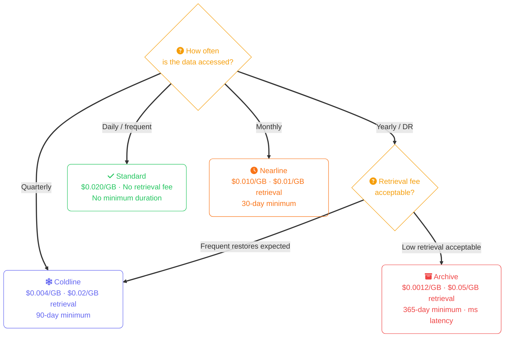
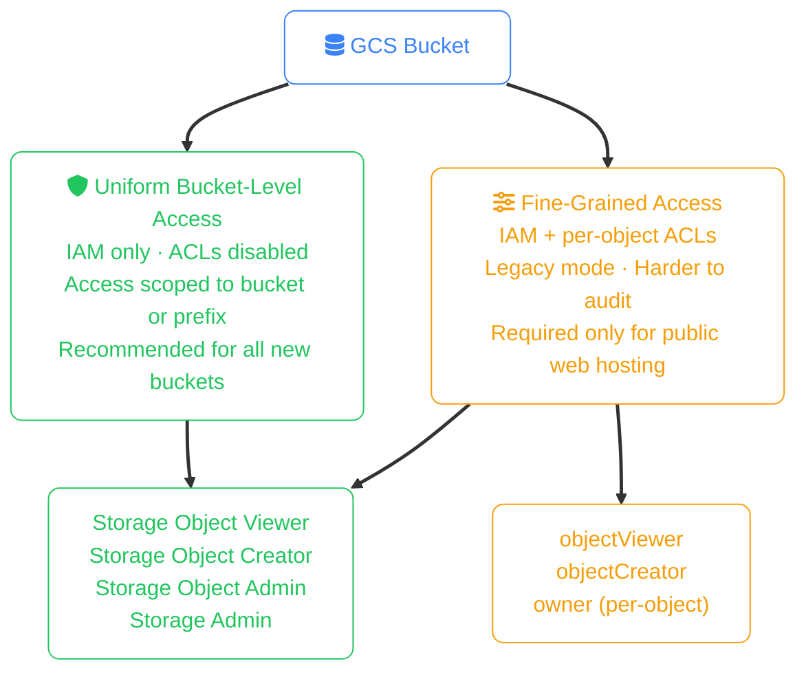
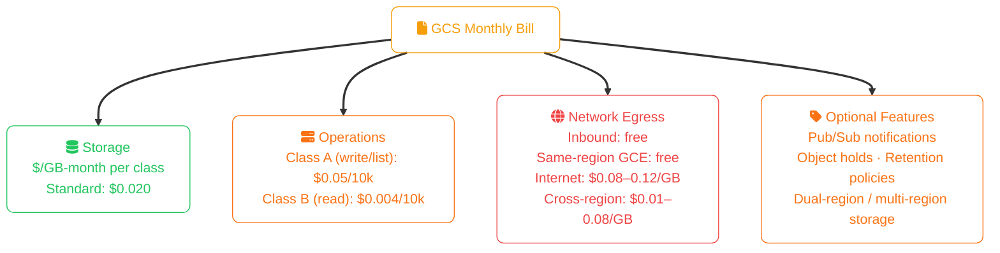

import Callout from '../../../components/mdx/Callout.astro';
import KeyPoints from '../../../components/mdx/KeyPoints.astro';
import Quiz from '../../../components/mdx/Quiz.astro';
import CodeTabs from '../../../components/mdx/CodeTabs.astro';

**Google Cloud Storage (GCS)** is GCP's unified object store — a single service that handles standard hot data, infrequent access archives, and long-term cold storage through storage classes rather than separate products. GCS integrates tightly with BigQuery, Dataflow, and Vertex AI, making it the natural landing zone for data pipelines. Its **strong consistency** model (read-after-write globally, since November 2020) removes a class of bugs that plagued S3-style eventually consistent systems.

<KeyPoints>
- GCS storage classes with real $/GB numbers and retrieval cost characteristics
- Select the right storage class using the access-frequency decision model
- Create buckets and upload objects with `gcloud storage` and `gsutil` CLI
- Write Object Lifecycle Management rules to automate tier transitions and expiration
- Apply IAM roles for identity-based access and understand uniform vs fine-grained ACLs
- Generate signed URLs to grant temporary, scoped object access without GCP credentials
</KeyPoints>

<Callout type="info" title="Foundation Concepts">
This lesson covers GCS-specific operations and pricing. Object storage fundamentals — what buckets and objects are, how 11-nines durability works, storage class trade-offs, and when object storage is the wrong choice — are covered in [Object Storage Concepts](/cloud/common/object-storage-concepts).
</Callout>

---

## GCS Storage Classes

GCS uses four storage classes optimised for different access frequencies. Unlike AWS S3, storage class is set at the **bucket level** (with per-object override support). Pricing below is approximate us-central1 rates:

| Storage Class | $/GB-month | Retrieval Fee | Min Duration | Retrieval Latency | Best For |
|---|---|---|---|---|---|
| **Standard** | $0.020 | None | None | ms | Hot data, active workloads |
| **Nearline** | $0.010 | $0.01/GB | 30 days | ms | Monthly-access data |
| **Coldline** | $0.004 | $0.02/GB | 90 days | ms | Quarterly archives |
| **Archive** | $0.0012 | $0.05/GB | 365 days | ms | Long-term DR, regulatory retention |

<Callout type="tip" title="GCS Archive Has Millisecond Retrieval">
Unlike AWS Glacier (hours) and Azure Archive (up to 15 hours), **GCS Archive retrieves in milliseconds**. You pay a high per-GB retrieval fee ($0.05/GB), but there is no restore-then-wait step. This makes it usable for genuine cold backup retrieval without pre-planning a multi-hour rehydration window.
</Callout>

### Storage Class Decision Flow

---

## Core CLI Operations

GCP offers two CLI tools for GCS: the newer `gcloud storage` (recommended) and the legacy `gsutil`. Both work; `gcloud storage` has a faster transfer engine.

<CodeTabs tabs={[
  { label: "gcloud storage", lang: "bash", code: `# Create a bucket (bucket names are globally unique)
gcloud storage buckets create gs://my-company-backups \
  --location=us-central1 \
  --default-storage-class=STANDARD \
  --uniform-bucket-level-access

# Upload a single file
gcloud storage cp report.csv gs://my-company-backups/reports/2024/report.csv

# Upload an entire directory (recursive)
gcloud storage cp --recursive ./exports/ gs://my-company-backups/exports/

# Download a file
gcloud storage cp gs://my-company-backups/reports/2024/report.csv ./report.csv

# List objects with a prefix
gcloud storage ls --long gs://my-company-backups/reports/2024/

# Sync a local directory (only copies changed/new files)
gcloud storage rsync --recursive ./exports/ gs://my-company-backups/exports/

# Delete an object
gcloud storage rm gs://my-company-backups/reports/2024/report.csv

# Delete all objects with a prefix
gcloud storage rm --recursive gs://my-company-backups/exports/

# Get object metadata
gcloud storage objects describe gs://my-company-backups/reports/2024/report.csv` },
  { label: "gsutil (legacy)", lang: "bash", code: `# Upload a file
gsutil cp report.csv gs://my-company-backups/reports/2024/report.csv

# Upload directory (recursive)
gsutil -m cp -r ./exports/ gs://my-company-backups/exports/

# Sync (parallel, recursive)
gsutil -m rsync -r -d ./exports/ gs://my-company-backups/exports/

# Change storage class of an existing object
gsutil rewrite -s NEARLINE \
  gs://my-company-backups/reports/2023/annual.csv

# Check storage class and metadata
gsutil stat gs://my-company-backups/reports/2023/annual.csv` },
  { label: "Storage Class", lang: "bash", code: `# Upload directly to a specific storage class
gcloud storage cp archive.tar.gz \
  gs://my-company-backups/archives/archive.tar.gz \
  --storage-class=NEARLINE

# Change storage class of an existing object in-place
gcloud storage objects update \
  gs://my-company-backups/archives/archive.tar.gz \
  --storage-class=COLDLINE` },
]} />

---

## Object Versioning

GCS versioning preserves all previous versions of an object. When enabled, a DELETE creates a **noncurrent** (archived) version rather than destroying data. Unlike AWS S3's delete marker model, noncurrent versions in GCS are accessed by their `generation` number.

<CodeTabs tabs={[
  { label: "gcloud storage", lang: "bash", code: `# Enable versioning on a bucket
gcloud storage buckets update gs://my-company-backups \
  --versioning

# List all versions of an object (including noncurrent)
gcloud storage ls --all-versions \
  gs://my-company-backups/reports/2024/report.csv

# Download a specific generation (version)
gcloud storage cp \
  gs://my-company-backups/reports/2024/report.csv#1709800000000000 \
  ./report-old.csv

# Permanently delete a specific generation
gcloud storage rm \
  gs://my-company-backups/reports/2024/report.csv#1709800000000000` },
]} />

---

## Object Lifecycle Management

Lifecycle rules automate storage class transitions and object deletion. Rules match by age, storage class, version status, or a combination.

```mermaid
flowchart LR
    accTitle: GCS lifecycle transition pipeline
    accDescr: How GCS Object Lifecycle Management automatically moves objects from Standard to Nearline to Coldline to Archive and optionally deletes them based on object age.
    classDef ok   fill:none,stroke:#22c55e,color:#22c55e,rx:8,ry:8
    classDef mid  fill:none,stroke:#f97316,color:#f97316,rx:8,ry:8
    classDef cold fill:none,stroke:#6366f1,color:#6366f1,rx:8,ry:8
    classDef arch fill:none,stroke:#ef4444,color:#ef4444,rx:8,ry:8
    linkStyle default stroke-width:2.5px

    UPLOAD["fa:fa-circle-dot Upload<br/>Day 0"]:::ok
    STD["fa:fa-database Standard<br/>Days 0–29<br/>$0.020/GB"]:::ok
    NEAR["fa:fa-clock Nearline<br/>Day 30+<br/>$0.010/GB"]:::mid
    COLD["fa:fa-snowflake Coldline<br/>Day 90+<br/>$0.004/GB"]:::cold
    ARCH["fa:fa-box-archive Archive<br/>Day 365+<br/>$0.0012/GB"]:::arch
    DELETE["fa:fa-trash Delete<br/>Day 730"]:::arch

    UPLOAD --> STD
    STD -->|"+30 days"| NEAR
    NEAR -->|"+60 days"| COLD
    COLD -->|"+275 days"| ARCH
    ARCH -->|"+365 days"| DELETE
```

<CodeTabs tabs={[
  { label: "gcloud storage", lang: "bash", code: `# Apply a lifecycle configuration from a JSON file
gcloud storage buckets update gs://my-company-backups \
  --lifecycle-file=lifecycle.json` },
  { label: "lifecycle.json", lang: "json", code: `{
  "lifecycle": {
    "rule": [
      {
        "action": { "type": "SetStorageClass", "storageClass": "NEARLINE" },
        "condition": {
          "age": 30,
          "matchesStorageClass": ["STANDARD"]
        }
      },
      {
        "action": { "type": "SetStorageClass", "storageClass": "COLDLINE" },
        "condition": {
          "age": 90,
          "matchesStorageClass": ["NEARLINE"]
        }
      },
      {
        "action": { "type": "SetStorageClass", "storageClass": "ARCHIVE" },
        "condition": {
          "age": 365,
          "matchesStorageClass": ["COLDLINE"]
        }
      },
      {
        "action": { "type": "Delete" },
        "condition": { "age": 730 }
      },
      {
        "action": { "type": "Delete" },
        "condition": {
          "isLive": false,
          "numNewerVersions": 3
        }
      }
    ]
  }
}` },
]} />

---

## Access Control

GCS has two access control modes. The mode is set at the **bucket level** and cannot be changed back once set to uniform.

<Callout type="tip" title="Always Use Uniform Bucket-Level Access">
Enable **Uniform Bucket-Level Access** on every new bucket. It disables per-object ACLs, forcing all access through IAM — which means a single `iam get-policy` shows you exactly who can access what. Fine-grained ACLs can leave objects accessible even when bucket IAM denies access, creating hard-to-audit permission gaps.
</Callout>

<CodeTabs tabs={[
  { label: "IAM (gcloud)", lang: "bash", code: `# Grant Storage Object Viewer to a service account on a specific bucket
gcloud storage buckets add-iam-policy-binding gs://my-company-backups \
  --member=serviceAccount:app-server@my-project.iam.gserviceaccount.com \
  --role=roles/storage.objectViewer

# Grant Storage Object Creator (upload only, cannot read)
gcloud storage buckets add-iam-policy-binding gs://my-company-backups \
  --member=serviceAccount:upload-agent@my-project.iam.gserviceaccount.com \
  --role=roles/storage.objectCreator

# View current IAM policy on a bucket
gcloud storage buckets get-iam-policy gs://my-company-backups

# Remove a binding
gcloud storage buckets remove-iam-policy-binding gs://my-company-backups \
  --member=serviceAccount:app-server@my-project.iam.gserviceaccount.com \
  --role=roles/storage.objectViewer` },
  { label: "Public access block", lang: "bash", code: `# Prevent any public access at the project level (recommended)
gcloud resource-manager org-policies set-policy \
  --project=my-project \
  constraints/storage.uniformBucketLevelAccess

# Check if a bucket has public access
gcloud storage buckets describe gs://my-company-backups \
  --format="value(iamConfiguration.publicAccessPrevention)"

# Enforce public access prevention on a single bucket
gcloud storage buckets update gs://my-company-backups \
  --public-access-prevention` },
]} />

---

## Signed URLs

Signed URLs grant time-limited access to a single object without requiring the requester to have a GCP account. The URL is signed by a service account key or a short-lived token.

<CodeTabs tabs={[
  { label: "gcloud storage", lang: "bash", code: `# Generate a signed URL valid for 1 hour (GET)
gcloud storage sign-url gs://my-company-backups/reports/2024/report.csv \
  --duration=1h \
  --impersonate-service-account=signer@my-project.iam.gserviceaccount.com

# Generate a signed URL for PUT (allow upload without credentials)
gcloud storage sign-url gs://my-company-backups/uploads/user-123/photo.jpg \
  --duration=15m \
  --http-verb=PUT \
  --headers=content-type:image/jpeg \
  --impersonate-service-account=signer@my-project.iam.gserviceaccount.com` },
  { label: "Python (google-cloud-storage)", lang: "python", code: `from google.cloud import storage
from datetime import timedelta

client = storage.Client()
bucket = client.bucket("my-company-backups")
blob = bucket.blob("reports/2024/report.csv")

# GET signed URL — valid for 1 hour
download_url = blob.generate_signed_url(
    version="v4",
    expiration=timedelta(hours=1),
    method="GET",
)

# PUT signed URL — allow direct browser upload
upload_blob = bucket.blob("uploads/user-123/photo.jpg")
upload_url = upload_blob.generate_signed_url(
    version="v4",
    expiration=timedelta(minutes=15),
    method="PUT",
    content_type="image/jpeg",
)` },
]} />

<Callout type="warning">
Signed URLs created with a **service account key** remain valid until expiry even if the key is rotated or the service account is deleted. Prefer the `--impersonate-service-account` flag with `gcloud` (which uses short-lived credentials) over long-lived key-based signing in production.
</Callout>

---

## GCS Pricing Model

<Callout type="tip" title="Use Cloud CDN for High-Egress Public Assets">
Serving large files (videos, installers, datasets) directly from GCS costs $0.08–0.12/GB in egress. Fronting with **Cloud CDN** caches objects at edge PoPs — only cache misses hit GCS egress, reducing costs significantly for high-traffic assets.
</Callout>

---

<Quiz
  question="A GCS bucket uses the Archive storage class. An object uploaded on Jan 1 is deleted on Feb 15 (day 45). What minimum-duration charge applies?"
  options={[
    { label: "45 days of Archive storage" },
    { label: "365 days of Archive storage — the minimum retention fee applies", correct: true },
    { label: "90 days of Coldline storage" },
    { label: "No charge — the lifecycle rule deleted it" },
  ]}
  explanation="GCS Archive has a 365-day minimum storage duration. Deleting on day 45 still incurs the full 365-day minimum. This is the longest minimum duration of any GCS class — far longer than AWS Glacier Deep Archive (180 days) or Azure Archive (180 days)."
/>

<Quiz
  question="You need to grant a partner company read access to specific objects in your GCS bucket without giving them a Google account. What is the correct approach?"
  options={[
    { label: "Set the bucket access control to Fine-Grained and add an objectViewer ACL for allUsers" },
    { label: "Share your service account key with the partner" },
    { label: "Generate a signed URL scoped to the objects, valid for the required time window", correct: true },
    { label: "Grant the partner's IP address Storage Object Viewer in IAM" },
  ]}
  explanation="Signed URLs embed scoped, time-limited credentials that work without any GCP account. Making objects public exposes them to everyone on the internet. Sharing a service account key grants broad, hard-to-revoke access. IAM grants cannot be scoped to an IP address."
/>
