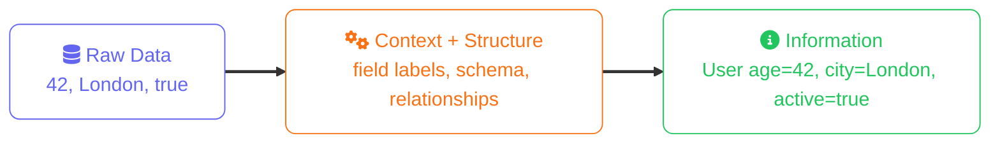
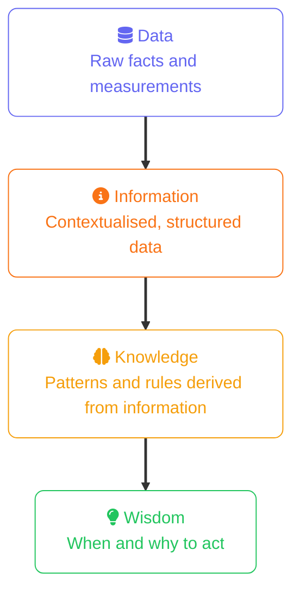

import Callout from '../../../components/mdx/Callout.astro';
import CodeComparison from '../../../components/mdx/CodeComparison.astro';
import KeyPoints from '../../../components/mdx/KeyPoints.astro';
import Quiz from '../../../components/mdx/Quiz.astro';

**Data** and **information** are used interchangeably in everyday speech, but in data engineering they mean distinct things with real consequences for how you model, store, and query. Getting this distinction right is the foundation of every design decision that follows — from schema choices to query patterns.

<KeyPoints>
- What distinguishes raw data from information (and why it matters for storage design)
- The three structural categories of data: structured, semi-structured, and unstructured
- How data types (quantitative vs qualitative) influence the databases you choose
- Why context transforms data into information — and what that means for schema design
- How the DIKW hierarchy frames data's journey from raw facts to actionable decisions
- How data is encoded on disk and over the wire — from CSV and XML to Parquet and Arrow
</KeyPoints>

---

## What Is Data?

**Data** is a raw fact — a symbol, measurement, or observation with no inherent meaning on its own.

```
42
"2026-03-07"
"London"
true
0xff3a9b
```

Each value above is data. Individually, none of them communicate anything useful. `42` could be a temperature, an age, a product ID, or a line count. The value carries no context.

Data has two primary classifications based on its nature:

**Quantitative data** — numerical and measurable. Can be further split into:
- *Discrete*: countable integers (number of orders, user IDs)
- *Continuous*: measurements on a real-number scale (temperature, revenue, latency)

**Qualitative data** — descriptive and categorical. Can be:
- *Nominal*: categories with no order (country, product type, status enum)
- *Ordinal*: categories with a defined order (T-shirt sizes, severity levels, star ratings)

This classification matters immediately: quantitative data suits `INT`, `FLOAT`, `DECIMAL` columns; ordinal qualitative data often suits `ENUM` or a lookup table; nominal categories may need full-text search or flexible document storage.

## What Is Information?

**Information** is data that has been given **context, structure, and meaning**. The transformation looks like this:



The same value `42` becomes **information** the moment it is associated with a column named `user_age` in a row that also contains a `user_id`. The schema is what provides context.

<Callout type="info" title="Schema as the context layer">
  In relational databases, the schema *is* the mechanism that transforms stored bytes into information. A column name, data type, and foreign key constraint collectively say "this number is a user's age, it's always a positive integer, and it belongs to this user record." Without the schema, you just have numbers.
</Callout>

## The DIKW Hierarchy

The relationship between data and information sits inside a broader model called the **DIKW hierarchy** — Data, Information, Knowledge, Wisdom.



As a data engineer, your primary job operates between **Data** and **Information** — getting raw data into storage systems and making it queryable in meaningful ways. The Knowledge and Wisdom layers live in the application logic, analytics models, and business processes built on top.

## Structural Categories of Data

How data is structured determines which storage engine fits it best.

| Category | Definition | Examples | Typical storage |
|---|---|---|---|
| **Structured** | Predefined schema, tabular rows and columns | Orders, transactions, user accounts | Relational DBs (PostgreSQL, MySQL) |
| **Semi-structured** | Self-describing schema, flexible fields | JSON API responses, logs, config files | Document DBs (MongoDB), columnar stores |
| **Unstructured** | No schema; binary or free-form text | Images, videos, emails, PDF documents | Object storage (S3, GCS), search engines |

<Callout type="warning" title="Semi-structured is not schema-free">
  Document databases let each record carry different fields, but that flexibility makes **querying across records harder** — you lose the guarantee that `order.customer_id` exists on every document. Schema-on-write (relational) trades flexibility for query safety. Schema-on-read (document) does the opposite. Neither is universally better.
</Callout>

## Data Formats in Practice

How data is **encoded on disk or over the wire** maps directly to its structural category. Structured tabular data suits CSV or row-binary formats; semi-structured data travels as XML or JSON; analytical workloads use columnar binary formats like Parquet. The encoding determines schema enforcement, verbosity, type fidelity, and read/write performance.

### Text Formats

**CSV / TSV** is the simplest possible format — values separated by commas or tabs, one row per line, optional header. It has no type system: every value is a string until the consumer parses it. Nulls, booleans, and dates have no standard representation, and commas inside values require quoting rules that vary across implementations. CSV is universal for data exchange with spreadsheet tools and quick exports, but it's fragile at scale.

**SGML** (Standard Generalized Markup Language, ISO 8879:1986) is the meta-language that defines the grammar for creating markup languages. Both HTML and XML are SGML applications. SGML introduced Document Type Definitions (DTDs) — machine-readable schemas that declare what elements and attributes are valid in a document. It is still the formal basis of publishing workflows (DITA, DocBook) and some government/legal document standards.

**XML** (1998) is a strict, well-formed subset of SGML designed for machine-to-machine data interchange. It dropped SGML's optional tag omission and ambiguous parsing rules in exchange for a simpler, unambiguous grammar.

<CodeComparison leftLabel="XML" rightLabel="JSON" leftColor="orange" rightColor="blue">
  <Fragment slot="left">
  ```xml
  <?xml version="1.0" encoding="UTF-8"?>
  <users>
    <user id="1">
      <name>Alice</name>
      <age>32</age>
      <active>true</active>
      <joined>2024-03-01</joined>
    </user>
  </users>
  ```
  </Fragment>
  <Fragment slot="right">
  ```json
  {
    "users": [
      {
        "id": 1,
        "name": "Alice",
        "age": 32,
        "active": true,
        "joined": "2024-03-01"
      }
    ]
  }
  ```
  </Fragment>
</CodeComparison>

XML is still dominant in financial messaging (FIX, SWIFT, ISO 20022), healthcare (HL7 v2/v3, CDA), enterprise integration (SOAP, WSDL), and build tooling (Maven, Android manifests). Its strengths are namespace support (elements from different schemas coexist without collision), XSD type validation, and XPath/XSLT for querying and transformation. Its weakness is verbosity — the same record is typically 3–5× larger than its JSON equivalent.

**JSON** (2001, standardised RFC 8259) replaced XML as the dominant web API format after roughly 2010. It maps directly to native data structures in most programming languages and has built-in types for strings, numbers, booleans, arrays, objects, and null. It has no standard for dates, binary data, or decimal precision. **JSON Schema** (draft standard) fills the schema gap for validation. **JSON5** and **JSONC** are informal extensions that add comments and trailing commas for config files.

<Callout type="info" title="When XML still wins over JSON">
  XML's namespaces and XSD schema validation make it the right choice when multiple organisations exchange documents that must each conform to their own published schema — e.g. a bank sending a payment message that must simultaneously satisfy both the sender's internal schema and the SWIFT network schema. JSON Schema lacks namespace support.
</Callout>

### Binary and Columnar Formats

Binary formats trade human-readability for compactness and performance. They dominate in high-volume pipelines, service-to-service communication, and analytical storage.

**Protocol Buffers (protobuf)** — Google's schema-first binary serialisation format. A `.proto` file defines the message structure; generated code in any language handles serialisation. Field numbers (not names) are used in the binary encoding, which enables schema evolution — you can add or deprecate fields without breaking existing consumers.

```proto
message User {
  int32 id = 1;
  string name = 2;
  int32 age = 3;
  bool active = 4;
}
```

Protobuf payloads are typically 3–10× smaller than equivalent JSON. It is the default serialisation format for gRPC. **FlatBuffers** and **Cap'n Proto** are alternatives that go further by enabling zero-copy reads without a deserialisation step.

**Apache Avro** — schema-embedded binary format from the Hadoop ecosystem. The Avro schema (itself written in JSON) is bundled alongside the data, making files self-describing. Schema evolution is explicit: schemas have compatibility modes (backward, forward, full) that define which changes are safe. Avro is the standard format for Kafka message schemas when used with a Schema Registry.

**Apache Parquet** — columnar binary format optimised for analytical reads. Instead of writing row 1 then row 2, Parquet writes all values of column A, then all values of column B. This means a query like `SELECT SUM(revenue)` reads only the `revenue` column off disk — not every field of every row.

```
Row-oriented (CSV / JSON):      Columnar (Parquet):
──────────────────────────      ──────────────────────────────────
[1, Alice,  32, 450.00]         id:      [1,      2,      3     ]
[2, Bob,    28, 310.00]   →     name:    [Alice,  Bob,    Carol ]
[3, Carol,  41, 720.00]         age:     [32,     28,     41    ]
                                revenue: [450.00, 310.00, 720.00]
```

Similar column values also compress extremely well — a `country` column with mostly `"US"` entries compresses to near nothing with run-length encoding. Parquet is the de-facto standard for data lakes (S3 + Athena, GCS + BigQuery, ADLS + Synapse) and is natively understood by Spark, DuckDB, Polars, and Pandas.

**Apache Arrow** is an **in-memory** columnar format (not a file format, though it can be serialised via IPC). Its purpose is zero-copy data sharing between query engines and language runtimes. A Pandas DataFrame, a DuckDB result set, and a Polars DataFrame can all expose Arrow buffers — passing data between them without serialisation or copying. Arrow is increasingly the lingua franca of the modern analytics stack.

### Format Selection at a Glance

| Format | Schema | Human-readable | Relative size | Primary use case |
|---|---|---|---|---|
| CSV | None | ✓ | 1× baseline | Exports, spreadsheets, simple ETL |
| XML | Optional (XSD/DTD) | ✓ | ~3–5× | Enterprise integration, financial/healthcare messaging |
| JSON | Optional (JSON Schema) | ✓ | ~1.5–2× | REST APIs, config, document storage |
| Protobuf | Required (.proto) | ✗ | ~0.2–0.4× | gRPC services, mobile, IoT, high-throughput APIs |
| Avro | Embedded | ✗ | ~0.3–0.5× | Kafka event streaming, data pipelines |
| Parquet | Embedded | ✗ | ~0.1–0.3× | Data lakes, analytical queries, columnar storage |
| Arrow | Embedded | ✗ | ~0.5–1× | In-memory analytics, cross-engine data sharing |

## Why This Distinction Drives Design Decisions

The reason this lesson exists at the start of every data track is that every subsequent design decision traces back to it:

- **Choosing a database** — structured transactional data → relational; semi-structured event streams → document or columnar; unstructured media → object storage
- **Designing schemas** — deciding which raw measurements deserve their own column, and which context (foreign keys, enums, constraints) turns them into information
- **Query patterns** — aggregating quantitative data (`SUM`, `AVG`) vs filtering qualitative data (`WHERE status = 'active'`) vs full-text search over unstructured content
- **Data quality** — a database full of data with no schema constraints is not a database of information; it's a pile of bytes that happens to be queryable

<Quiz
  question="A database table stores a column called `score` with values like 87, 42, 95. On its own, the number 42 is best described as:"
  options={[
    { label: "Information, because it is stored in a structured table" },
    { label: "Data, because it has no meaning without the surrounding context", correct: true },
    { label: "Knowledge, because it was measured and recorded" },
    { label: "Qualitative data, because it describes a property" },
  ]}
  explanation="A raw number is data. It becomes information when paired with context — the column name 'score', the row's subject identifier, and the schema's constraints that define what a valid score is."
/>

<Quiz
  question="Which structural category best describes a collection of customer support emails?"
  options={[
    { label: "Structured — each email has a sender, subject, and body" },
    { label: "Semi-structured — emails use a defined header format but free-form body text" },
    { label: "Unstructured — the body content has no predefined schema", correct: true },
    { label: "Quantitative — emails can be counted and measured" },
  ]}
  explanation="Email headers are semi-structured (defined fields like From, To, Subject), but the body is free-form natural language — unstructured. In practice, a full email is usually treated as unstructured content requiring search indexing rather than a relational schema."
/>
