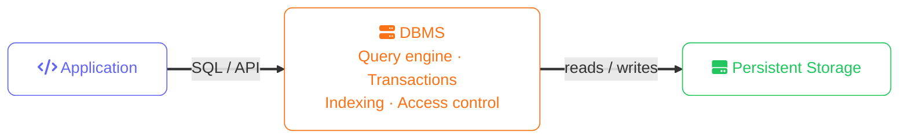
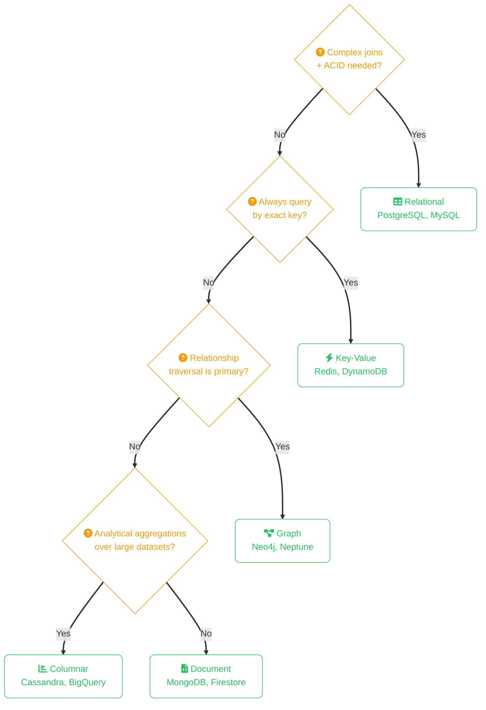

import Callout from '../../../components/mdx/Callout.astro';
import KeyPoints from '../../../components/mdx/KeyPoints.astro';
import Quiz from '../../../components/mdx/Quiz.astro';

A **Database Management System (DBMS)** is the software layer between your application and stored data — handling persistence, querying, transactions, and concurrent access so you don't have to. Choosing the wrong DBMS for a workload is one of the most expensive architectural mistakes to reverse, because data migrations are slow and risky. This lesson maps the major DBMS categories to the workloads they're built for.

<KeyPoints>
- What a DBMS does and why it exists as a separate layer from application code
- The five major DBMS categories and the data model each one is optimised for
- How to match a workload's access patterns to a database engine
- Why ACID transactions matter for relational workloads — and what BASE means for distributed systems
- How the major categories differ in consistency, scalability, and query flexibility
</KeyPoints>

---

## What a DBMS Does

Without a DBMS, every application would need to implement:

- **Storage** — writing bytes to disk in a format that survives crashes
- **Indexing** — finding records without reading the entire file
- **Query execution** — interpreting queries and producing results
- **Concurrency control** — preventing two writes from corrupting the same record
- **Transaction management** — ensuring partial writes don't leave data in an inconsistent state
- **Access control** — enforcing who can read or write what

A DBMS packages all of this into a single, tested, and optimised system. Your SQL query or API call is translated into a query plan, executed against indexed storage, and returned consistently — regardless of how many other clients are writing at the same time.

## The Five DBMS Categories

### Relational (RDBMS)

Stores data in **tables with rows and columns**. Relationships are expressed through foreign keys and enforced by the schema. The query language is SQL.

**Best for:** Transactional workloads with complex joins, strong consistency requirements, and well-defined schemas — user accounts, orders, financial records, inventory.

**Key engines:** PostgreSQL, MySQL, SQLite, Oracle, SQL Server

**ACID guarantees:**
- **Atomicity** — a transaction completes fully or not at all
- **Consistency** — the database moves from one valid state to another
- **Isolation** — concurrent transactions don't see each other's in-progress changes
- **Durability** — committed data survives crashes

### Document

Stores data as **JSON-like documents** (objects with nested fields). No fixed schema — each document can have different fields. Queried by field values or indexes on nested paths.

**Best for:** Content with variable structure, rapid iteration when schema is still evolving, hierarchical data that would require many joins in a relational model — product catalogues, user profiles, CMS content, event logs.

**Key engines:** MongoDB, Firestore, CouchDB, Amazon DocumentDB

<Callout type="warning" title="Flexible schema has a cost">
  Schema-on-read means the database won't stop you writing `{ age: "forty-two" }` when you meant `{ age: 42 }`. Validation logic moves into the application layer, which makes inconsistencies harder to catch at the database level.
</Callout>

### Key-Value

The simplest model: a **dictionary** of keys mapped to opaque values. No query language for filtering by value content — you look up by exact key.

**Best for:** Caching, session storage, feature flags, leaderboards, rate limiting — any workload where you always know the exact key and need sub-millisecond reads.

**Key engines:** Redis, DynamoDB (in key-value mode), Memcached, etcd

### Columnar (Column-Family)

Stores data **grouped by column** rather than by row. This makes reading a single column across millions of rows extremely fast, but makes reading a full row slower.

**Best for:** Analytical queries that aggregate across large datasets, time-series data, write-heavy append-only workloads — analytics pipelines, telemetry, IoT sensor data.

**Key engines:** Apache Cassandra, HBase, Google Bigtable, Amazon Keyspaces

<Callout type="info">
  Data warehouses (Redshift, BigQuery, Snowflake) also use columnar storage internally — it's why `SELECT SUM(revenue) FROM orders` is fast even over billions of rows.
</Callout>

### Graph

Stores data as **nodes and edges**, where relationships are first-class citizens with their own properties. Traversing relationships is a native operation, not an expensive join.

**Best for:** Highly connected data where the relationships are as important as the entities — social networks, recommendation engines, fraud detection, knowledge graphs, dependency trees.

**Key engines:** Neo4j, Amazon Neptune, ArangoDB, TigerGraph

## Picking the Right Engine

The single most important input is your **access pattern** — how your application reads and writes data, not just what the data looks like.

<Callout type="info" title="Polyglot persistence">
  Production systems routinely use multiple DBMS categories simultaneously. A typical e-commerce app might use PostgreSQL for orders, Redis for session caching, Elasticsearch for product search, and a data warehouse for analytics — each engine doing what it's optimised for.
</Callout>

## ACID vs BASE

Relational databases guarantee **ACID**. Many distributed NoSQL databases trade strict consistency for availability and partition tolerance, instead offering **BASE**:

- **Basically Available** — the system responds even when some nodes are unavailable
- **Soft state** — data may be temporarily inconsistent across replicas
- **Eventually consistent** — all replicas will converge to the same value, given enough time

BASE is not worse than ACID — it's a deliberate tradeoff that enables horizontal scaling across many nodes. A social media "like" count that is briefly off by one is acceptable. A bank transfer that debits one account without crediting another is not.

<Quiz
  question="A product catalogue where each product can have a different set of attributes (a TV has resolution and panel type; a book has ISBN and author) is best served by:"
  options={[
    { label: "A relational database with nullable columns for all possible attributes" },
    { label: "A document database where each product is a self-describing JSON document", correct: true },
    { label: "A key-value store with the product ID as the key" },
    { label: "A graph database modelling products as nodes" },
  ]}
  explanation="Variable-structure data with optional fields per record is a classic document database use case. Nullable columns in a relational model work but become unwieldy as the number of attributes grows — a product table with 200 optional columns is a maintenance problem."
/>

<Quiz
  question="Which ACID property ensures that a bank transfer which debits account A but crashes before crediting account B is automatically rolled back?"
  options={[
    { label: "Consistency" },
    { label: "Isolation" },
    { label: "Atomicity", correct: true },
    { label: "Durability" },
  ]}
  explanation="Atomicity guarantees that a transaction is all-or-nothing. If any step fails, the entire transaction is rolled back, leaving the database as if the transaction never started."
/>
