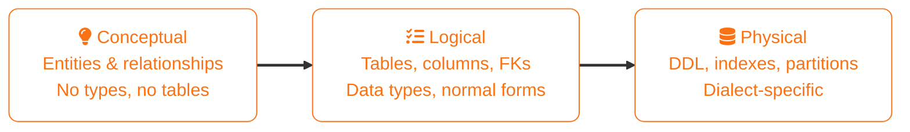
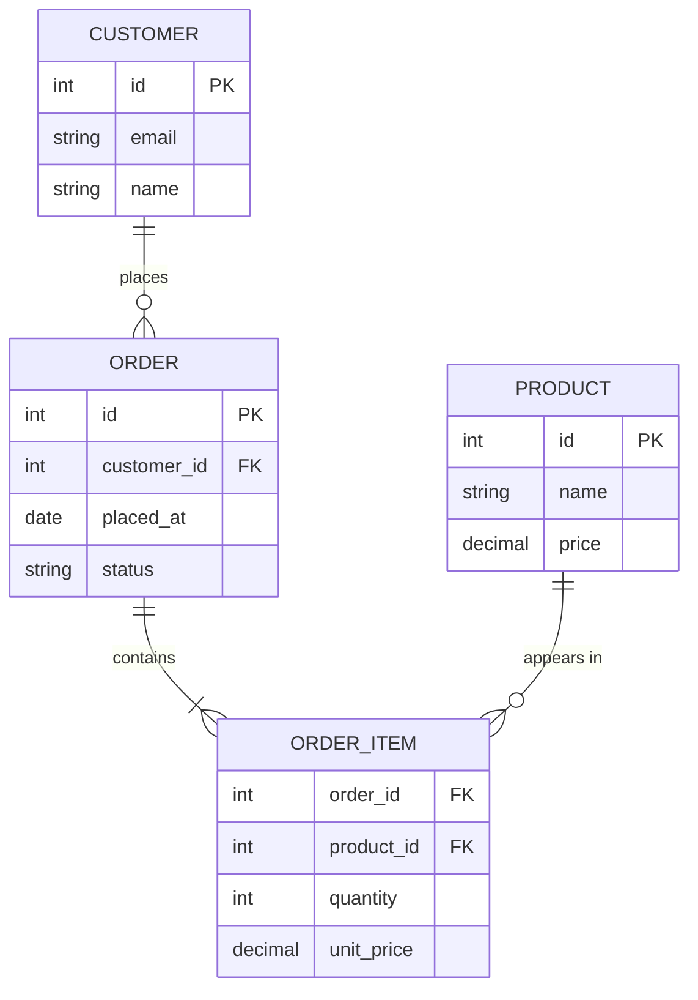
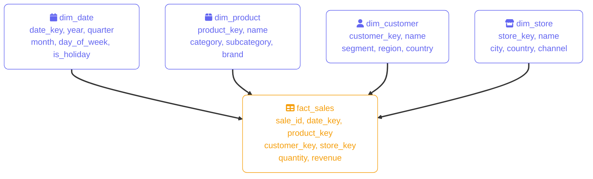

import Callout from '../../../components/mdx/Callout.astro';
import CodeComparison from '../../../components/mdx/CodeComparison.astro';
import KeyPoints from '../../../components/mdx/KeyPoints.astro';
import Quiz from '../../../components/mdx/Quiz.astro';

Data modeling is the practice of defining how data is organised, stored, and related — before any code is written. A good model aligns with the application's query patterns, reducing joins, preventing anomalies, and scaling predictably. A poor model is one of the most expensive architectural problems to fix once data is live.

<KeyPoints>
- How the three modeling tiers (conceptual, logical, physical) divide responsibilities and why each exists
- How to read and draw Entity-Relationship (ER) diagrams with correct cardinality
- What the normal forms (1NF through BCNF) prevent, and how normalization eliminates anomalies step by step
- When and why to denormalize — and what consistency guarantees you give up
- The difference between embedding and referencing in document databases, and when to choose each
- How dimensional modeling (star and snowflake schemas) structures analytical data for warehouse queries
</KeyPoints>

---

## The Three Modeling Tiers

Data modeling happens at three levels of abstraction. Each tier has a different audience and a different set of decisions.

**Conceptual model** — captures the business domain in plain terms: what entities exist and how they relate. No tables, no columns, no data types. Stakeholders and architects use this tier to agree on scope before any technical decisions.

**Logical model** — translates the conceptual model into a database-agnostic structure: entities become tables, relationships become foreign keys, and attributes get data types. Normalization happens here.

**Physical model** — the actual DDL: specific SQL dialect, index definitions, partition strategies, storage engines. This is what gets deployed.



Each tier is reversible upward but costly to change downward. Changing a conceptual entity late in the process requires rebuilding the logical and physical model beneath it.

## Entity-Relationship Modeling

**Entities** are the things the domain tracks — `Customer`, `Order`, `Product`. **Attributes** are facts about an entity — `Customer.email`, `Order.placed_at`. **Relationships** describe how entities associate — a `Customer` *places* many `Orders`.

**Cardinality** defines how many instances participate on each side of a relationship:
- **One-to-one (1:1)** — one `User` has exactly one `Profile`
- **One-to-many (1:N)** — one `Customer` places many `Orders`
- **Many-to-many (M:N)** — many `Products` appear in many `Orders`, resolved via a junction table (`OrderItem`)



<Callout type="info" title="Why unit_price lives on ORDER_ITEM, not PRODUCT">
  Storing price on the junction table captures the price *at the time of purchase*. If the product price changes later, historical orders retain their original pricing. Referencing only a FK to `PRODUCT.price` makes historical accuracy dependent on a separate price history table — a far more complex model.
</Callout>

## Normalization

Normalization structures tables to eliminate **data anomalies**:
- **Update anomaly** — the same fact is stored in multiple rows; updating it partially leaves the data inconsistent
- **Insertion anomaly** — you can't insert a partial record without fabricating unrelated data
- **Deletion anomaly** — deleting a row unintentionally destroys an unrelated fact

The normal forms build on each other. A table in 3NF is also in 2NF and 1NF.

### Running Example

Start with a single denormalized orders table:

```sql
-- Unnormalized: all_order_details
order_id | customer_id | customer_email    | product_id | product_name | quantity | unit_price
---------|-------------|-------------------|------------|--------------|----------|------------
1001     | 42          | alice@example.com | 7          | Widget Pro   | 2        | 29.99
1001     | 42          | alice@example.com | 9          | Gadget Plus  | 1        | 49.99
1002     | 55          | bob@example.com   | 7          | Widget Pro   | 3        | 29.99
```

`customer_email` repeats per customer. `product_name` repeats per product. Updating Alice's email requires touching every row in her orders — an update anomaly.

### First Normal Form (1NF)

A table is in 1NF when every column holds **atomic** (indivisible) values, every row is uniquely identifiable, and column names are unique.

A common 1NF violation is storing a comma-separated list in a single cell — `tags = "electronics,sale,new"`. The fix is a separate `product_tags` table with one row per tag.

### Second Normal Form (2NF)

A table is in 2NF when it is in 1NF **and** every non-key attribute depends on the **whole** primary key, not just part of it.

This only matters when the primary key is composite. In the example, `(order_id, product_id)` is the composite key. But `product_name` depends only on `product_id` — a **partial dependency**. Fix: extract `product_id + product_name + price` into a `Product` table.

### Third Normal Form (3NF)

A table is in 3NF when it is in 2NF **and** every non-key attribute depends **directly** on the primary key — not on another non-key attribute.

A classic violation: a `customer` table stores `zip_code`, `city`, and `state`. Since `zip_code → city, state`, `city` and `state` depend on `zip_code`, not directly on `customer_id` — a **transitive dependency**. Fix: extract `(zip_code, city, state)` into a `ZipCode` lookup table.

### Boyce-Codd Normal Form (BCNF)

BCNF strengthens 3NF: every **determinant** must be a candidate key. BCNF violations are rare and only appear in tables with multiple overlapping candidate keys. For most production schemas, 3NF is the practical target.

### After Normalization

The denormalized table becomes four clean tables:

```sql
Customer(id PK, email, name)
Product(id PK, name, price)
Order(id PK, customer_id FK, placed_at, status)
OrderItem(order_id FK, product_id FK, quantity, unit_price)
```

Each fact lives in exactly one place. Updating Alice's email is a single row update.

<Callout type="tip" title="3NF is the target for OLTP">
  Most transactional schemas target 3NF. Pursuing BCNF is only warranted when you've identified a concrete anomaly that 3NF doesn't prevent. Over-normalizing for its own sake increases join complexity without a meaningful benefit.
</Callout>

## Denormalization

Denormalization intentionally breaks normal form to reduce join overhead for read-heavy workloads. Common patterns:

- **Precomputed columns** — storing `order_total` on `Order` instead of summing `OrderItem` on every read
- **Duplicated columns** — copying `customer_email` into `Order` to avoid a join on the hot read path
- **Flattened tables** — merging `Order` and `OrderItem` into a single wide table for analytical exports

The tradeoff is explicit: write complexity increases and inconsistency risk rises. Denormalization is justified when:

1. A specific query is demonstrably slow due to joins (profiled, not assumed)
2. The duplicated data is updated infrequently or is append-only
3. The consistency risk is handled by application logic or accepted as a deliberate product decision

<Callout type="warning" title="Denormalize last, not first">
  Premature denormalization is one of the most common data modeling mistakes. Start normalized — the query optimizer often handles joins better than you'd expect, and a normalized schema is far easier to evolve. Denormalize when you have measurements, not intuitions.
</Callout>

## Document Modeling: Embedding vs Referencing

In document databases (MongoDB, Firestore), the equivalent of the normalization decision is **embedding vs referencing**. There is no schema enforcement or query planner for joins — the structural choice is made at modeling time.

**Embedding** stores related data inside the same document. Reads are fast and atomic — one document fetch returns the parent and all its sub-documents without a second query.

**Referencing** stores a foreign ID and requires a second query (or MongoDB's `$lookup`) to fetch the related document. This is the document equivalent of a JOIN.

<CodeComparison leftLabel="Embedded (denormalized)" rightLabel="Referenced (normalized)" leftColor="orange" rightColor="blue">
  <Fragment slot="left">
  ```json
  {
    "_id": "order_1001",
    "customer": {
      "id": 42,
      "email": "alice@example.com",
      "name": "Alice"
    },
    "items": [
      { "product_name": "Widget Pro", "qty": 2, "unit_price": 29.99 },
      { "product_name": "Gadget Plus", "qty": 1, "unit_price": 49.99 }
    ]
  }
  ```
  </Fragment>
  <Fragment slot="right">
  ```json
  {
    "_id": "order_1001",
    "customer_id": 42,
    "item_ids": ["item_a1", "item_b2"]
  }
  ```
  </Fragment>
</CodeComparison>

Use **embedding** when:
- The related data is always read with the parent (order always fetches its items)
- The embedded array is bounded in size (items per order rarely exceed ~100)
- The embedded data doesn't change independently (historical `unit_price` in an order shouldn't follow the product's current price)

Use **referencing** when:
- The related entity is shared by many parents (a product is referenced by thousands of orders)
- The sub-document can grow without bound (comments on a post, events on a session)
- The related data is updated frequently and must stay consistent across all references

## Dimensional Modeling

Analytical data warehouses use a fundamentally different modeling paradigm: **dimensional modeling**, introduced by Ralph Kimball. The goal flips from OLTP normalization — instead of eliminating redundancy, the model is optimised for analytical reads across very wide, very long tables.

The two building blocks are:

**Fact tables** record events or measurements — a sale, a page view, a transaction. They grow continuously (new rows, rarely updates), hold numeric measures (`quantity`, `revenue`, `duration`), and reference dimension tables via surrogate keys.

**Dimension tables** describe the context of facts — who, what, where, when. They are intentionally denormalized: `product_name`, `category`, and `subcategory` all sit in the same `dim_product` table even though that violates 3NF. Analytic queries need to `GROUP BY category` without additional joins.

### Star Schema

All dimension tables connect directly to the fact table — joins are one hop. Simple, fast, and universally supported by BI tools (Tableau, Looker, Power BI).



### Snowflake Schema

Dimension tables are normalized — `dim_product` references `dim_category`, which references `dim_department`. More joins, less storage redundancy. Preferred when dimension cardinality is very high or when dimensions are reused across multiple fact tables in the same warehouse.

<Callout type="info" title="Star vs snowflake in cloud warehouses">
  BigQuery, Snowflake, and Redshift all use columnar storage that makes joins over fact tables efficient. Star schemas are the default recommendation for most analytical workloads — the extra joins in a snowflake schema add query latency without meaningful storage savings at modern warehouse scale. Snowflake schemas are worth considering when dimension reuse across fact tables is a primary concern.
</Callout>

<Quiz
  question="A table has composite primary key (order_id, product_id). The column product_name depends only on product_id, not the full composite key. Which normal form does this violate?"
  options={[
    { label: "First Normal Form (1NF)" },
    { label: "Second Normal Form (2NF)", correct: true },
    { label: "Third Normal Form (3NF)" },
    { label: "Boyce-Codd Normal Form (BCNF)" },
  ]}
  explanation="A partial dependency — where a non-key column depends on only part of a composite primary key — violates 2NF. Fixing it means extracting product_name into a separate Product table keyed by product_id alone."
/>

<Quiz
  question="In a MongoDB order document, when should you prefer referencing a product_id over embedding the full product name and price?"
  options={[
    { label: "When each order contains more than one product" },
    { label: "When product details are always read alongside every order" },
    { label: "When the product is referenced by many orders and its details can change independently", correct: true },
    { label: "When the document size approaches MongoDB's 16 MB limit" },
  ]}
  explanation="Referencing avoids updating thousands of order documents every time a product name or price changes. Embedding is the right choice when the data is always read together with the parent and doesn't need to stay in sync with an independent source of truth."
/>
