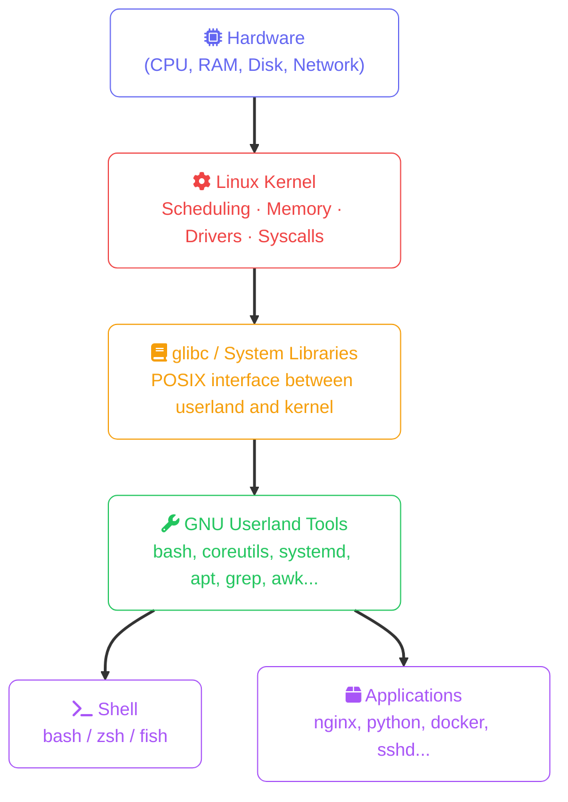

import Callout from '../../components/mdx/Callout.astro';
import KeyPoints from '../../components/mdx/KeyPoints.astro';

Linux runs more than 96% of the world's web servers, every major cloud provider's infrastructure, Android devices, and the International Space Station. If you're building software professionally, you're running on Linux whether you see it or not.

<KeyPoints>
- What Linux is and how it differs from an operating system vs a kernel
- The anatomy of a Linux system: kernel, shell, userland
- How distributions work and which to choose for different purposes
- Why Linux literacy is an essential skill for developers, sysadmins, and cloud engineers
</KeyPoints>

---

## Linux: Kernel vs Operating System

"Linux" technically refers to the **kernel** — the core software that manages hardware resources: CPU scheduling, memory allocation, device drivers, and system calls. The full operating system you install and use is more accurately called a **GNU/Linux** distribution, which bundles the Linux kernel with a collection of system tools, libraries, and applications.



When you type `ls` in a terminal, you're calling a GNU coreutils binary, which calls a glibc function, which issues a kernel system call (`getdents64`), which reads from the filesystem driver, which talks to the disk hardware. Every command is a trip through these layers.

---

## Distributions

A **distribution** (distro) packages the Linux kernel with a specific set of software, a package manager, and an init system. They serve different purposes:

| Distribution | Base | Package manager | Typical use |
|---|---|---|---|
| **Ubuntu** | Debian | `apt` | Servers, desktops, cloud VMs — beginner-friendly |
| **Debian** | Independent | `apt` | Stability-first servers; ultra-conservative release cycle |
| **RHEL / Rocky Linux** | Red Hat | `rpm` / `dnf` | Enterprise servers; RHCSA/RHCE certifications |
| **Fedora** | Red Hat | `dnf` | Developer workstations; bleeds-edge before RHEL |
| **Amazon Linux 2023** | Fedora-derived | `dnf` | AWS EC2 default; optimised for AWS services |
| **Alpine Linux** | Independent | `apk` | Containers; 5 MB base image |
| **Arch Linux** | Independent | `pacman` | Rolling release; learn-by-doing |

<Callout type="tip">
For learning Linux fundamentals, **Ubuntu LTS** or **Debian** are the best choices — huge community, well-documented, and the closest to what you'll find on cloud VMs. For certification prep: Ubuntu/Debian for LFCS, Rocky Linux or RHEL for RHCSA.
</Callout>

---

## The Shell

The **shell** is a command-line interpreter — you type commands, it parses and runs them. The most common shells:

| Shell | Default on | Notes |
|---|---|---|
| **bash** | Most Linux distros | POSIX-compliant, scripting standard |
| **zsh** | macOS (since Catalina) | Bash-compatible with better interactive features |
| **sh** | All POSIX systems | Minimal; scripts should target `sh` for portability |
| **fish** | None by default | User-friendly but not POSIX; avoid for scripts |

Throughout this course, examples use `bash`. Everything shown works in `zsh` too.

```bash
# Check which shell you're using
echo $SHELL

# Check the bash version
bash --version

# List available shells on the system
cat /etc/shells
```

---

## Why Linux Matters for Developers

- **Cloud runs on Linux.** AWS EC2, Azure VMs, GCP Compute Engine — the default is always a Linux image. Understanding the OS your code runs on is essential for performance tuning, security hardening, and debugging.
- **Containers are Linux.** Docker containers are Linux kernel namespaces and cgroups. A container is not a VM — it's a process on a Linux host with restricted visibility.
- **CI/CD pipelines run on Linux.** GitHub Actions, GitLab CI, Jenkins agents — all Linux by default.
- **The tools are POSIX.** `grep`, `awk`, `sed`, `find`, `curl`, `ssh` — these solve real problems in one line that would take dozens in a GUI.

<Callout type="info">
**You don't need to leave macOS or Windows to learn Linux.** Options: WSL2 on Windows (full Linux kernel), multipass/UTM VMs on macOS, or a free cloud VM (AWS/GCP/Azure all have free tiers). The lessons in this course work on any of these.
</Callout>

<KeyPoints title="What to carry forward">
- Linux = kernel; GNU/Linux = full OS; "Linux" in practice = the whole thing
- Distributions package the kernel with tools and a package manager — pick Ubuntu for learning
- The shell is your primary interface: bash is the scripting standard
- Every cloud VM, container, and CI runner is Linux — this knowledge pays back immediately
</KeyPoints>
