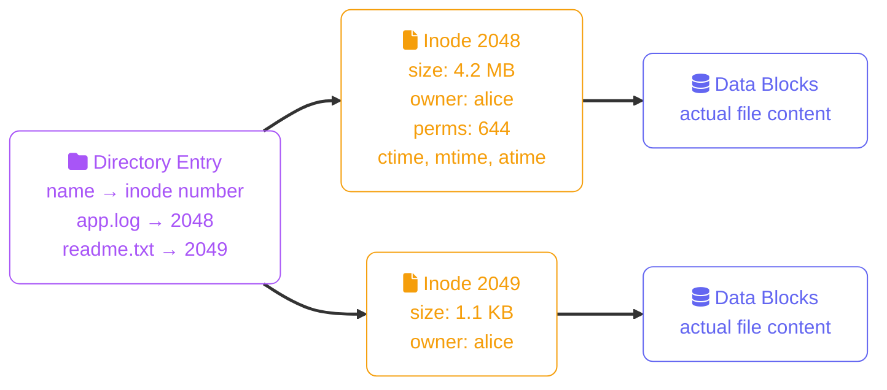

import Callout from '../../components/mdx/Callout.astro';
import KeyPoints from '../../components/mdx/KeyPoints.astro';
import Quiz from '../../components/mdx/Quiz.astro';

The Linux filesystem is not a collection of drives with letters — it is a single tree rooted at `/`. Everything, including hardware devices, network sockets, and running processes, is exposed as a file somewhere in that tree.

<KeyPoints>
- The Filesystem Hierarchy Standard (FHS) — what lives where and why
- Navigating the tree: `pwd`, `cd`, `ls` and their most useful flags
- Absolute vs relative paths and the `.` / `..` shorthands
- How inodes work and why copying differs from moving
- Hard links vs symbolic links — when to use each
</KeyPoints>

---

## The Filesystem Hierarchy Standard

The FHS defines where software and data live on every Linux system. Knowing these directories saves you time every time you need to find a config file, a binary, or a log.

```mermaid
flowchart TD
    accTitle: Linux Filesystem Hierarchy
    accDescr: Tree diagram showing the root directory and its major subdirectories with their purposes.
    classDef root fill:none,stroke:#ef4444,color:#ef4444,rx:8,ry:8
    classDef sys  fill:none,stroke:#6366f1,color:#6366f1,rx:8,ry:8
    classDef usr  fill:none,stroke:#f59e0b,color:#f59e0b,rx:8,ry:8
    classDef var  fill:none,stroke:#22c55e,color:#22c55e,rx:8,ry:8
    classDef home fill:none,stroke:#a855f7,color:#a855f7,rx:8,ry:8
    linkStyle default stroke-width:2.5px

    ROOT["/  root of the filesystem"]:::root

    BIN["/bin  Essential binaries<br/>ls, cp, bash"]:::sys
    SBIN["/sbin  System binaries<br/>fdisk, ifconfig"]:::sys
    ETC["/etc  Configuration files<br/>sshd_config, fstab"]:::sys
    PROC["/proc  Virtual: kernel<br/>and process info"]:::sys
    SYS["/sys  Virtual: device<br/>and driver info"]:::sys
    DEV["/dev  Device files<br/>sda, tty, null, zero"]:::sys
    USR["/usr  User programs<br/>and libraries"]:::usr
    VAR["/var  Variable data<br/>logs, spool, cache"]:::var
    TMP["/tmp  Temporary files<br/>cleared on boot"]:::var
    HOME["/home  User home dirs<br/>/home/alice"]:::home
    ROOT2["/root  root user's home"]:::home
    BOOT["/boot  Bootloader<br/>and kernel images"]:::sys

    ROOT --> BIN & SBIN & ETC & PROC & SYS & DEV & USR & VAR & TMP & HOME & ROOT2 & BOOT
```



| Directory | What you'll actually find there |
|---|---|
| `/etc` | Every config file on the system — `sshd_config`, `nginx/nginx.conf`, `cron.d/`, `passwd` |
| `/var/log` | System and application logs — `syslog`, `auth.log`, `nginx/access.log` |
| `/usr/bin` | Installed program binaries — `python3`, `git`, `vim`, `curl` |
| `/usr/lib` | Shared libraries (`.so` files) used by programs |
| `/home/user` | Your personal files, shell config (`.bashrc`, `.ssh/`) |
| `/proc` | Live kernel data — `/proc/meminfo`, `/proc/cpuinfo`, `/proc/PID/cmdline` |
| `/dev/null` | The bit bucket — write to it, data disappears; read from it, get EOF |

---

## Essential Navigation Commands

```bash
# Where am I?
pwd
# /home/alice

# List contents (common flags together)
ls -lah
# -l  long format (permissions, size, timestamps)
# -a  include hidden files (starting with .)
# -h  human-readable sizes (K, M, G)

# Change directory
cd /var/log         # absolute path
cd logs             # relative to current dir
cd ..               # one level up
cd ~                # your home directory
cd -                # previous directory (toggle)

# Show directory tree
tree /etc -L 2      # 2 levels deep
find /etc -name "*.conf"

# Quick peek at a file
cat /etc/os-release
less /var/log/syslog    # paginate; q to quit
head -20 /var/log/syslog
tail -f /var/log/syslog  # follow live output
```

<Callout type="tip">
`tail -f` is essential for watching logs in real-time while debugging. Use `Ctrl+C` to stop following. For multiple files at once: `tail -f /var/log/nginx/access.log /var/log/nginx/error.log`.
</Callout>

---

## Absolute vs Relative Paths

| Type | Starts with | Example |
|---|---|---|
| **Absolute** | `/` | `/home/alice/.bashrc` |
| **Relative** | anything else | `../config/app.yaml` |

Special path components:
- `.` — current directory (`./script.sh` runs `script.sh` in the current dir)
- `..` — parent directory (`cd ../..` goes up two levels)
- `~` — your home directory (expands to `/home/alice` or `/root`)
- `~username` — another user's home (`~bob` = `/home/bob`)

```bash
# These two commands do the same thing from /home/alice
cat /etc/hostname
cat ../../etc/hostname
```

---

## Inodes: What Files Really Are

On disk, a file is not "a named blob". It is an **inode** (index node) containing metadata, plus the data blocks the inode points to. The **directory entry** maps a human-readable name to an inode number.



```bash
# See inode numbers
ls -i /etc/hosts
# 131073 /etc/hosts

# See inode details (stat)
stat /etc/hosts
# File: /etc/hosts
# Size: 221       Blocks: 8    IO Block: 4096
# Inode: 131073   Links: 1
# Access: 2024-01-15 09:23:11
# Modify: 2024-01-10 08:00:00
```

This matters because:
- **`mv` within the same filesystem** just changes the directory entry — no data is copied. Instant regardless of file size.
- **`cp`** always copies data blocks. Slow for large files.
- **`mv` across filesystems** is actually a copy + delete. Can be slow.

---

## Hard Links vs Symbolic Links

### Hard Links

A hard link is a **second directory entry pointing to the same inode**. Both names are equal — deleting one doesn't delete the file until the last link is removed.

```bash
# Create a hard link
ln original.txt backup.txt

# Both point to the same inode
ls -li original.txt backup.txt
# 2048 -rw-r--r-- 2 alice alice 42 Jan 15 original.txt
# 2048 -rw-r--r-- 2 alice alice 42 Jan 15 backup.txt
#                ^ link count = 2
```

Constraints: hard links cannot span filesystems and cannot point to directories.

### Symbolic Links (Symlinks)

A symlink is a **file whose content is a path** to another file or directory. It can span filesystems and point to directories. If the target is deleted, the symlink breaks.

```bash
# Create a symlink
ln -s /etc/nginx/nginx.conf nginx.conf

ls -la nginx.conf
# lrwxrwxrwx 1 alice alice 22 Jan 15 nginx.conf -> /etc/nginx/nginx.conf

# Check if symlink target exists
readlink -f nginx.conf   # resolves all symlinks

# Find broken symlinks
find /etc -type l ! -exec test -e {} \; -print
```

<Callout type="tip">
Symlinks are used constantly in Linux: `/bin` is a symlink to `/usr/bin` on modern distros, `/etc/alternatives` manages multiple versions of tools, and package managers use them to swap active versions of Python, Java, etc.
</Callout>

---

## Disk Usage Commands

```bash
# Disk space used by a directory
du -sh /var/log          # s: summarise, h: human-readable
du -sh /var/log/*        # all items in /var/log

# Filesystem usage (all mounted filesystems)
df -h

# Find the largest directories
du -h /var | sort -rh | head -20

# Find large files
find / -type f -size +100M -exec ls -lh {} \;
```

---

<Quiz
  question="You run `mv report.csv /mnt/backup/report.csv`. The source is on `/dev/sda1` and the destination is on `/dev/sdb1`. What happens internally?"
  options={[
    "The directory entry is updated instantly — no data is copied",
    "The file's inode number is changed to a free inode on the destination filesystem",
    "The file is copied to the destination and then deleted from the source",
    "Linux creates a hard link on /mnt/backup pointing back to the original inode"
  ]}
  answer="The file is copied to the destination and then deleted from the source"
  explanation="Hard links (and therefore cheap inode remapping) only work within the same filesystem. Moving across filesystems requires copying all data blocks to the target, then unlinking the source. For large files, this is the same cost as cp followed by rm."
/>
