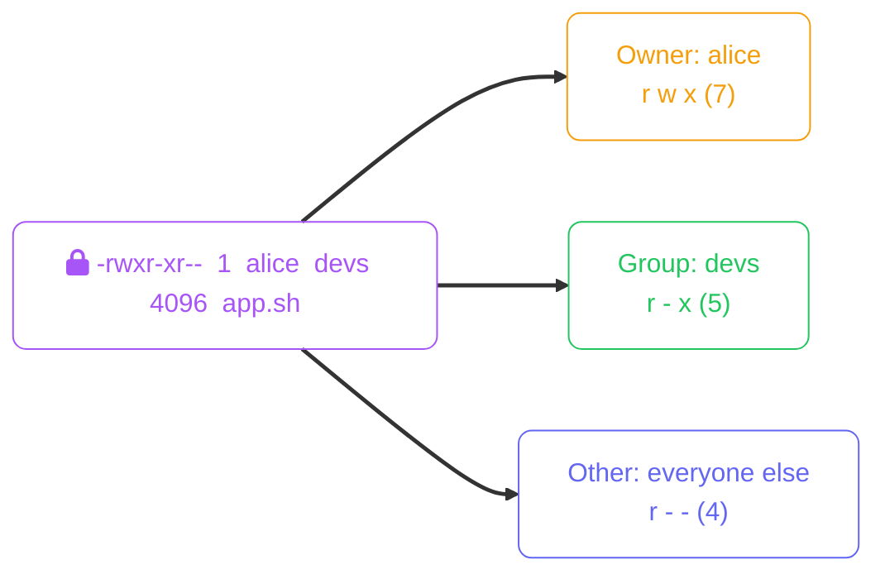
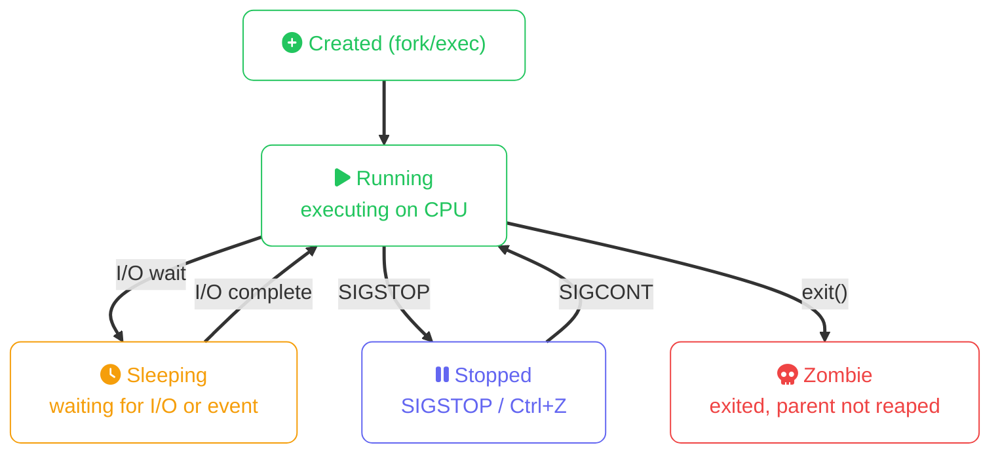

import Callout from '../../components/mdx/Callout.astro';
import KeyPoints from '../../components/mdx/KeyPoints.astro';
import Quiz from '../../components/mdx/Quiz.astro';

Everything in Linux runs as a user. Every file is owned by a user and a group. Every process runs with a specific user's privileges. Understanding the permission model is the foundation of Linux security — misconfigurations here are the root cause of most privilege escalation vulnerabilities.

<KeyPoints>
- How UIDs, GIDs, users, and groups are stored and resolved
- The three permission sets (owner, group, other) and how to read/set them
- `chmod`, `chown`, `chgrp` — changing permissions and ownership
- Special bits: setuid, setgid, and the sticky bit
- `sudo` — escalating privileges safely
- Process management: `ps`, `top`, `kill`, signals, and `systemd`
</KeyPoints>

---

## Users and Groups

Linux identifies users and groups by integer IDs, not names. Names are just human-readable mappings stored in `/etc/passwd` and `/etc/group`.

```bash
# See current user
whoami       # alice
id           # uid=1000(alice) gid=1000(alice) groups=1000(alice),27(sudo),999(docker)

# /etc/passwd format: username:x:UID:GID:comment:home:shell
grep alice /etc/passwd
# alice:x:1000:1000:Alice Smith:/home/alice:/bin/bash

# /etc/group format: groupname:x:GID:members
grep docker /etc/group
# docker:x:999:alice,bob
```

**UIDs have special meaning:**

| UID range | Meaning |
|---|---|
| `0` | root — unrestricted superuser |
| `1–999` | System/service accounts (no login shell) |
| `1000+` | Regular human users |

```bash
# Create a user
sudo useradd -m -s /bin/bash -G sudo bob   # -m: create home, -G: supplementary groups
sudo passwd bob                             # set password

# Add existing user to a group
sudo usermod -aG docker alice              # -a: append (don't replace groups)

# Delete a user
sudo userdel -r bob                        # -r: remove home directory too
```

<Callout type="warning">
`usermod -G` without `-a` **replaces** all supplementary groups. Always use `-aG` to append. Accidentally removing a user from `sudo` locks them out of privilege escalation.
</Callout>

---

## File Permissions

Every file has three permission sets — owner (user), group, and other (everyone else) — each with three bits: read (`r`), write (`w`), execute (`x`).



**Reading the long listing:**

```
-rwxr-xr--  1  alice  devs  4096  Jan 15  app.sh
│└──┴──┴──  │    │      │
│  │  │  │  │    │      └─ Group owner
│  │  │  │  │    └─ User owner
│  │  │  │  └─ Hard link count
│  │  │  └─ Other permissions (r--)
│  │  └─ Group permissions (r-x)
│  └─ Owner permissions (rwx)
└─ File type: - file, d directory, l symlink, c char device, b block device
```

**Octal notation:**

| Symbol | Octal | Meaning |
|---|---|---|
| `rwx` | 7 | read + write + execute |
| `rw-` | 6 | read + write |
| `r-x` | 5 | read + execute |
| `r--` | 4 | read only |
| `---` | 0 | no permissions |

```bash
# Change permissions
chmod 755 script.sh          # rwxr-xr-x  (owner: all; group+other: r+x)
chmod 644 config.yaml        # rw-r--r--  (owner: rw; group+other: r)
chmod 600 ~/.ssh/id_rsa      # rw-------  (owner only — SSH requires this)
chmod u+x script.sh          # add execute for owner only
chmod g-w config.yaml        # remove write from group
chmod o= secrets.env         # clear all other permissions

# Change ownership
sudo chown alice:devs app.sh  # set owner and group
sudo chown -R alice /var/app  # recursive
sudo chgrp devs logs/         # group only
```

<Callout type="danger">
**Never use `chmod 777`.** It gives the entire system write and execute access. If you're using it to fix a permission error, you're masking the actual problem — find and fix the real permission boundary instead.
</Callout>

---

## Special Permission Bits

Beyond the standard `rwx` bits, three special bits modify execution behaviour:

| Bit | Octal | When set on a file | When set on a directory |
|---|---|---|---|
| **setuid** (SUID) | 4000 | Process runs as the file's owner (e.g. `passwd` runs as root) | No effect |
| **setgid** (SGID) | 2000 | Process runs as the file's group | New files inherit directory's group |
| **sticky** | 1000 | Ignored on modern Linux | Users can only delete their own files (used on `/tmp`) |

```bash
# /usr/bin/passwd has setuid — it needs to write /etc/shadow as root
ls -la /usr/bin/passwd
# -rwsr-xr-x  root  root  /usr/bin/passwd
#    ^ s = setuid + execute

# Set SGID on a shared directory so new files inherit group
sudo chmod g+s /shared/team

# Check /tmp sticky bit
ls -la / | grep tmp
# drwxrwxrwt  ... tmp
#          ^ t = sticky + execute
```

---

## sudo: Controlled Privilege Escalation

`sudo` (superuser do) allows permitted users to run commands as root or another user, with the full command logged.

```bash
# Run a single command as root
sudo systemctl restart nginx

# Open a root shell (use sparingly)
sudo -i        # root login shell
sudo su -      # equivalent

# Run as a specific user
sudo -u postgres psql

# Edit the sudoers file safely (never edit /etc/sudoers directly)
sudo visudo
```

**`/etc/sudoers` grants:**

```
# Format: WHO  WHERE=(AS_WHOM) COMMAND
alice  ALL=(ALL:ALL) ALL             # full sudo access
deploy ALL=(ALL) /usr/bin/systemctl  # only systemctl

# Group-based (% prefix = group)
%sudo  ALL=(ALL:ALL) ALL
%devs  ALL=(ALL) NOPASSWD: /usr/bin/docker
```

<Callout type="tip">
Use `NOPASSWD:` sparingly — and only for specific, safe commands like restarting known services. Never `NOPASSWD: ALL`. Each `NOPASSWD` entry is a potential privilege escalation vector if that binary has shell escape functionality.
</Callout>

---

## Process Management

Every running program is a **process** with a unique PID (process ID), a parent PID, and the UID of the user who started it.



```bash
# Snapshot of processes
ps aux             # all processes, user-readable
ps aux | grep nginx  # find specific process

# Interactive process viewer
top                # press q to quit, k to kill, M to sort by memory
htop               # better version (install separately)

# Process tree
pstree -p

# Find a process by name
pgrep nginx        # prints PIDs
pidof nginx        # same, different format
```

### Signals

Signals are the IPC mechanism for controlling processes:

| Signal | Number | Default action | Common use |
|---|---|---|---|
| `SIGTERM` | 15 | Terminate gracefully | `kill PID` — ask process to clean up and exit |
| `SIGKILL` | 9 | Kill immediately | `kill -9 PID` — cannot be caught or ignored |
| `SIGHUP` | 1 | Reload config | `kill -HUP PID` — nginx/sshd reload config |
| `SIGSTOP` | 19 | Pause | `Ctrl+Z` in terminal |
| `SIGCONT` | 18 | Resume | `fg` or `bg` |
| `SIGINT` | 2 | Interrupt | `Ctrl+C` |

```bash
# Graceful terminate
kill 1234
kill -SIGTERM 1234

# Force kill (last resort)
kill -9 1234
kill -SIGKILL 1234

# Kill by name
pkill nginx          # SIGTERM to all nginx processes
killall -9 python3   # force kill all python3

# Background and foreground
sleep 300 &          # start in background; shell prints job number and PID
jobs                 # list background jobs
fg %1                # bring job 1 to foreground
bg %1                # resume stopped job in background
```

---

## systemd: Service and System Management

Modern Linux distributions use **systemd** as the init system (PID 1). It manages services (units), boot ordering, timers, and logging.

```bash
# Service management
sudo systemctl start nginx
sudo systemctl stop nginx
sudo systemctl restart nginx
sudo systemctl reload nginx          # reload config without downtime
sudo systemctl status nginx          # shows state + recent log tail

# Enable/disable at boot
sudo systemctl enable nginx
sudo systemctl disable nginx

# Check what failed
sudo systemctl --failed
sudo journalctl -u nginx -n 50       # last 50 log lines for nginx
sudo journalctl -u nginx -f          # follow live
sudo journalctl --since "1 hour ago"

# List all units
systemctl list-units --type=service --state=running
```

<Callout type="tip">
`systemctl status nginx` is your first stop when a service is misbehaving — it shows the active/failed state and the last few log lines. If that's not enough, `journalctl -u nginx -n 100` gives you more history. Always check the logs before restarting a service.
</Callout>

---

<Quiz
  question="A file has permissions `rwxr-x---`. Which users can execute it?"
  options={[
    "Only the owner",
    "The owner and members of the file's group",
    "Everyone on the system",
    "Nobody — execute requires 111 in octal"
  ]}
  answer="The owner and members of the file's group"
  explanation="The three sets are owner (rwx), group (r-x), other (---). The owner has read+write+execute. Group members have read+execute. Others have no permissions at all. Only the owner and users who belong to the file's group can execute it."
/>

<Callout type="tip" title="This is the foundation of cloud IAM">
Every major cloud platform builds its identity and access model on the same user/group principles you just learned. When you see "principals", "roles", and "least privilege" in a cloud IAM doc, you are reading the same concepts — just with a cloud-native API on top.

- [**AWS IAM**](/cloud/aws/04-securing-your-system) — IAM Users, Groups, and Roles map directly to Linux UIDs/GIDs; policies define what each principal can do
- [**Azure RBAC via Entra ID**](/cloud/azure/04-securing-your-system) — Entra ID Users and Security Groups are assigned Roles at a resource scope; Managed Identities replace service accounts
- [**GCP Cloud IAM**](/cloud/gcp/04-securing-your-system) — Google Accounts and Groups are "members"; predefined and custom Roles bundle permissions the same way Linux groups bundle file access
</Callout>
