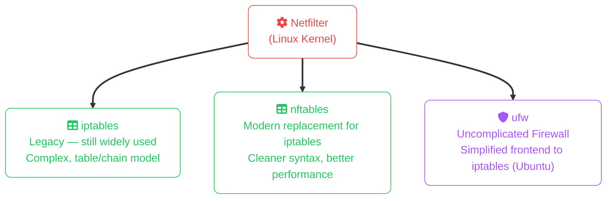

import Callout from '../../components/mdx/Callout.astro';
import KeyPoints from '../../components/mdx/KeyPoints.astro';
import Quiz from '../../components/mdx/Quiz.astro';

Linux is the operating system of the internet. Every major web server, load balancer, firewall, and cloud VM runs Linux. Understanding how Linux exposes and manages network state is essential for debugging connectivity, hardening services, and operating infrastructure.

<KeyPoints>
- Inspect active connections and listening sockets with `ss` and `netstat`
- Manage network interfaces with `ip` (the modern replacement for `ifconfig`)
- Control the Linux firewall with `iptables` / `nftables` / `ufw`
- Write and manage systemd service units
- Use `ssh` effectively: key auth, config file, tunnels, and agent forwarding
</KeyPoints>

---

## Inspecting Network State

### `ss` — The Modern Socket Inspector

`ss` (socket statistics) replaces `netstat` on modern Linux. It reads directly from the kernel, making it faster and more accurate.

```bash
# All listening TCP ports
ss -tlnp
# -t  TCP only
# -l  listening sockets only
# -n  numeric (don't resolve hostnames/service names)
# -p  show process name and PID

# Example output:
# State   Recv-Q  Send-Q  Local Address:Port  Peer Address:Port  Process
# LISTEN  0       128     0.0.0.0:22          0.0.0.0:*          users:(("sshd",pid=1024,fd=3))
# LISTEN  0       511     0.0.0.0:80          0.0.0.0:*          users:(("nginx",pid=2048,fd=6))

# All established connections
ss -tnp

# UDP sockets
ss -ulnp

# Summary of socket states
ss -s
```

### Interfaces — `ip`

```bash
# Show all interfaces and their addresses
ip addr show
ip a                  # shorthand

# Show a specific interface
ip addr show eth0

# Show routing table
ip route show
ip r

# Add/remove an IP (temporary — lost on restart)
sudo ip addr add 192.168.1.100/24 dev eth0
sudo ip addr del 192.168.1.100/24 dev eth0

# Bring interface up/down
sudo ip link set eth0 up
sudo ip link set eth0 down

# Show ARP / neighbour table
ip neigh show
```

<Callout type="tip">
`ifconfig` and `route` are deprecated — `ip` is the replacement. The mapping: `ifconfig` → `ip addr`, `route` → `ip route`, `arp` → `ip neigh`. Some minimal containers still only have `ifconfig`, but prefer `ip` everywhere you can.
</Callout>

---

## DNS Resolution

```bash
# Query DNS (all record types)
dig example.com
dig example.com A
dig example.com MX
dig @8.8.8.8 example.com   # use a specific DNS server

# Quick hostname lookup
nslookup example.com
host example.com

# Trace the full resolution chain
dig +trace example.com

# See what resolver the system uses
cat /etc/resolv.conf

# getent uses NSS (respects /etc/hosts)
getenv hosts example.com
```

### Connectivity Testing

```bash
# Basic reachability
ping -c 4 8.8.8.8

# Trace the route (identifies where packets drop)
traceroute 8.8.8.8
tracepath 8.8.8.8    # no root needed

# Test a TCP connection to a port
nc -zv 10.0.1.5 5432     # -z: scan, -v: verbose
curl -v telnet://10.0.1.5:5432   # alternative

# HTTP reachability
curl -I https://example.com   # headers only
curl -sf https://example.com/health && echo OK

# Capture live traffic
sudo tcpdump -i eth0 -n port 80
sudo tcpdump -i eth0 -n host 10.0.1.5 and port 443
```

---

## Firewall: iptables / nftables / ufw

Linux packet filtering runs in the kernel via `netfilter`. Three interfaces to it:



### `ufw` — Ubuntu/Debian Quick Reference

```bash
# Enable
sudo ufw enable
sudo ufw status verbose

# Allow / deny
sudo ufw allow ssh               # by service name
sudo ufw allow 80/tcp            # by port/protocol
sudo ufw allow from 10.0.0.0/8 to any port 5432  # scoped rule
sudo ufw deny 23/tcp

# Delete a rule
sudo ufw delete allow 80/tcp

# Reset everything
sudo ufw reset
```

### `iptables` Fundamentals

```bash
# List all rules with line numbers
sudo iptables -L -n -v --line-numbers

# Allow established/related traffic (always add this first)
sudo iptables -A INPUT -m state --state ESTABLISHED,RELATED -j ACCEPT

# Allow SSH
sudo iptables -A INPUT -p tcp --dport 22 -j ACCEPT

# Allow HTTP/HTTPS
sudo iptables -A INPUT -p tcp -m multiport --dports 80,443 -j ACCEPT

# Allow from specific IP range
sudo iptables -A INPUT -s 10.0.0.0/8 -j ACCEPT

# Default deny on INPUT
sudo iptables -P INPUT DROP

# Persist rules (Debian/Ubuntu)
sudo apt install iptables-persistent
sudo netfilter-persistent save
```

<Callout type="warning">
If you're managing an SSH session, **always add an ACCEPT rule for port 22 before setting the default policy to DROP.** Setting `iptables -P INPUT DROP` without an SSH allow rule will lock you out immediately.
</Callout>

---

## systemd Services

A systemd **unit file** describes how to start, stop, and monitor a service. Unit files live in:
- `/etc/systemd/system/` — your own units (highest priority)
- `/usr/lib/systemd/system/` — package-installed units (don't edit)
- `~/.config/systemd/user/` — user-scope units

### Writing a Service Unit

```ini
# /etc/systemd/system/myapp.service

[Unit]
Description=My Application Server
After=network.target postgresql.service
Requires=postgresql.service

[Service]
Type=simple
User=deploy
Group=deploy
WorkingDirectory=/opt/myapp
ExecStart=/opt/myapp/bin/server --port 8080
ExecReload=/bin/kill -HUP $MAINPID
Restart=on-failure
RestartSec=5s
StandardOutput=journal
StandardError=journal
Environment=APP_ENV=production
EnvironmentFile=/etc/myapp/env

[Install]
WantedBy=multi-user.target
```

```bash
# After creating/editing the unit file
sudo systemctl daemon-reload          # re-read unit files
sudo systemctl enable --now myapp     # enable at boot + start now
sudo systemctl status myapp
journalctl -u myapp -f                # tail logs
```

### Key Unit Directives

| Directive | Purpose |
|---|---|
| `After=` | Start order (soft dependency — doesn't require it) |
| `Requires=` | Hard dependency — fails if dependency fails |
| `Type=simple` | Process stays in foreground (`forking` for daemonising processes) |
| `Restart=on-failure` | Restart if exit code non-zero. Also: `always`, `on-abnormal` |
| `RestartSec=` | Delay between restarts |
| `EnvironmentFile=` | Load environment variables from a file |
| `LimitNOFILE=` | File descriptor limit (important for high-connection services) |

---

## SSH: Secure Shell

```bash
# Connect
ssh user@hostname
ssh -p 2222 user@hostname    # non-default port
ssh -i ~/.ssh/mykey user@hostname   # specific key

# Verbose (debug connection issues)
ssh -v user@hostname
ssh -vvv user@hostname       # maximum verbosity

# Execute a single command
ssh user@hostname "sudo systemctl status nginx"

# Copy files
scp local.txt user@hostname:/remote/path/
scp -r localdir/ user@hostname:/remote/
rsync -avz localdir/ user@hostname:/remote/   # better than scp for large transfers
```

### `~/.ssh/config` — Aliases and Options

```
Host jump
  HostName 1.2.3.4
  User ec2-user
  IdentityFile ~/.ssh/aws-key.pem

Host prod-web-01
  HostName 10.0.1.10
  User deploy
  ProxyJump jump
  IdentityFile ~/.ssh/prod-key

Host *
  ServerAliveInterval 60
  ServerAliveCountMax 3
  AddKeysToAgent yes
```

Now `ssh prod-web-01` automatically connects through the jump host with the right key, no flags needed.

### Port Forwarding / Tunnels

```bash
# Local forward: access a remote service locally
# e.g. access a remote Postgres (5432) as localhost:5433
ssh -L 5433:localhost:5432 user@db-host

# Remote forward: expose a local port on the remote server
ssh -R 8080:localhost:3000 user@remote-host

# Dynamic SOCKS proxy (route browser traffic through a remote host)
ssh -D 1080 user@remote-host
```

---

<Quiz
  question="You run `ss -tlnp` and see port 5432 listening on `127.0.0.1:5432`. A remote application on another host cannot connect to the database. What is the most likely cause?"
  options={[
    "Port 5432 is not open in the firewall",
    "PostgreSQL is bound to loopback only (127.0.0.1) — it only accepts connections from localhost",
    "ss -tlnp shows UDP sockets, not TCP",
    "The -n flag prevents remote connections from being shown"
  ]}
  answer="PostgreSQL is bound to loopback only (127.0.0.1) — it only accepts connections from localhost"
  explanation="When a service listens on 127.0.0.1, it only accepts connections from the same host. Remote clients connect via the host's network interface (e.g. 10.0.1.5) — those connections are rejected before they even reach the application. The fix is to change listen_addresses in postgresql.conf to the server's external IP or 0.0.0.0, then restart. The firewall check is also valid but secondary — the binding issue is the direct cause visible in the ss output."
/>
