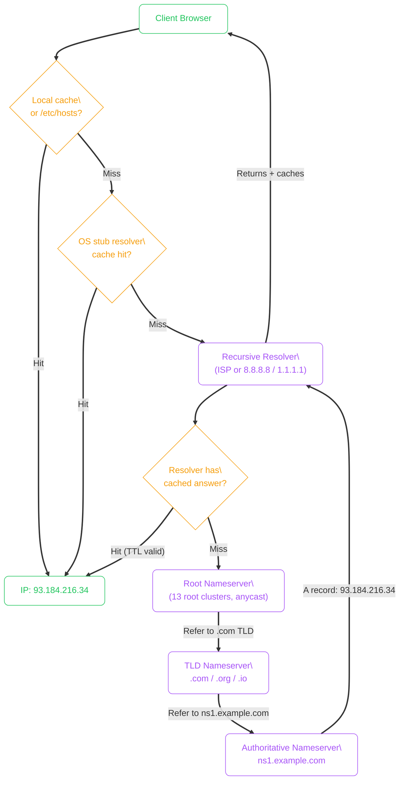
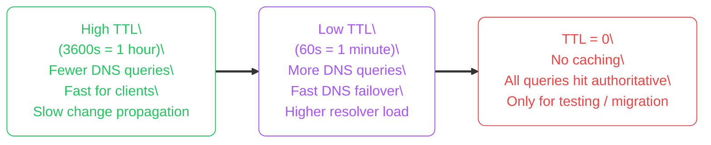
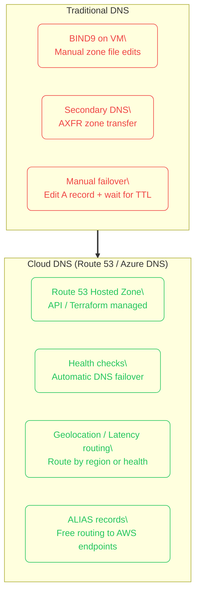
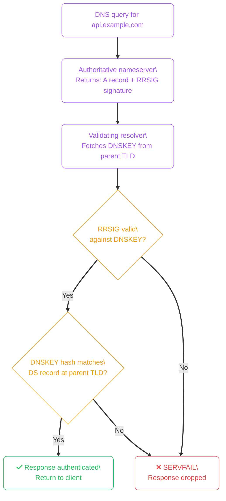
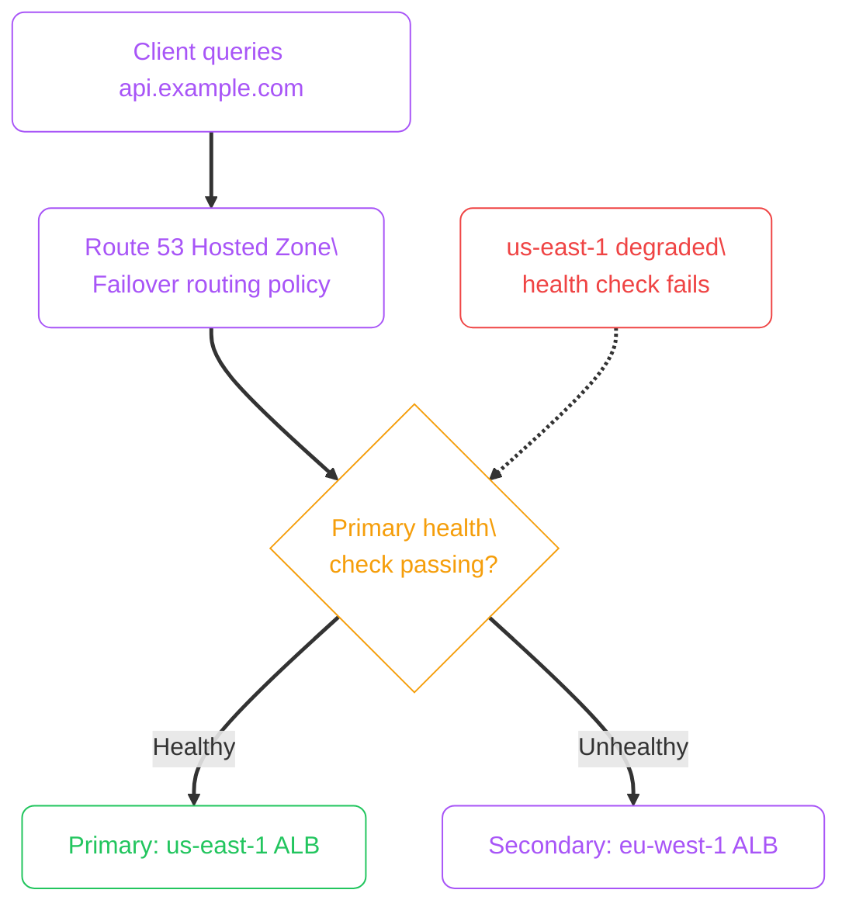

import Callout from '../../../components/mdx/Callout.astro';
import KeyPoints from '../../../components/mdx/KeyPoints.astro';
import CodeTabs from '../../../components/mdx/CodeTabs.astro';
import Quiz from '../../../components/mdx/Quiz.astro';

DNS is the distributed database that translates `api.example.com` into `93.184.216.34`. Without it, every application would have to hardcode IP addresses. Understanding DNS resolution, TTLs, and failure modes is essential for debugging connectivity issues and designing resilient cloud architectures.

<KeyPoints>
- How recursive DNS resolution works from client to authoritative nameserver
- The difference between recursive resolver, root, TLD, and authoritative nameservers
- How TTL controls caching and impacts deployment velocity
- Common record types and when to use A, CNAME, ALIAS, and MX
- How cloud DNS services (Route 53, Azure DNS) differ from self-hosted DNS
- How DNSSEC prevents cache poisoning and response spoofing
</KeyPoints>

---

## Recursive DNS Resolution

When a client asks "what is the IP for `api.example.com`?", the resolution follows a hierarchical chain.

The resolver does the heavy lifting — root servers respond with referrals, not final answers. A typical lookup traverses 3–4 hops and completes in under 100 ms for uncached queries.

### Why Root Servers Don't Get Overwhelmed

There are only 13 root server *addresses*, but each maps to hundreds of physical machines globally using **anycast** — your query goes to the closest instance. Root servers are also rarely hit because resolvers cache `.com`/`.org` TLD delegation records for 48 hours.

---

## DNS Record Types

| Type | Purpose | Example |
|---|---|---|
| **A** | IPv4 address for a hostname | `api.example.com → 93.184.216.34` |
| **AAAA** | IPv6 address for a hostname | `api.example.com → 2606:2800::1` |
| **CNAME** | Alias for another domain | `www.example.com → example.com` |
| **ALIAS / ANAME** | CNAME-like but usable at zone apex (`@`) | `example.com → alb-123.us-east-1.elb.amazonaws.com` |
| **MX** | Mail exchange servers for the domain | `example.com → mailserver.google.com` (priority 10) |
| **TXT** | Arbitrary text — SPF, DKIM, ownership verification | `example.com → "v=spf1 include:_spf.google.com ~all"` |
| **NS** | Nameservers authoritative for the zone | `example.com → ns1.awsdns-01.com` |
| **SOA** | Zone metadata: primary NS, serial, refresh/retry/expire | One per zone |
| **PTR** | Reverse DNS: IP → hostname | `34.216.184.93.in-addr.arpa → api.example.com` |
| **SRV** | Service location with port and priority | Used by Kubernetes, SIP, XMPP |

<Callout type="warning" title="CNAME Cannot Be Used at Zone Apex">
`CNAME` records cannot coexist with `SOA` or `NS` records — you can't point `example.com` itself (the zone apex) to a CNAME. Use **ALIAS** (Route 53) or **ANAME** (Azure DNS) records at the apex instead — these resolve the target at DNS query time and return A records.
</Callout>

---

## TTL: Time to Live

**TTL** is the number of seconds resolvers and clients should cache a DNS record. It directly controls how quickly changes propagate.

**Pre-migration TTL strategy:**
1. Lower TTL to 60s at least 48 hours before a migration (allow existing long-TTL caches to expire)
2. Perform the IP change
3. Monitor traffic shifting to the new IP
4. Raise TTL back to 3600s after confirming the migration

---

## Traditional DNS vs Cloud DNS

Traditional DNS relied on self-managed authoritative nameservers — `bind9` on a Linux VM, often with limited health checking and manual failover.

| Feature | Traditional BIND | Route 53 / Azure DNS |
|---|---|---|
| Anycast points | 1–2 DCs | 100+ PoPs worldwide |
| Health-based failover | Manual script / nagios | Native, sub-60s |
| Traffic policy | None | Weighted, latency, geo, failover |
| Change workflow | Edit flat file, `rndc reload` | API call / Terraform |
| Availability SLA | Self-managed | 100% (Route 53), 100% (Azure DNS) |

---

## Cloud DNS in Practice

<CodeTabs tabs={[
  {
    label: "Route 53 (AWS CLI)",
    lang: "bash",
    code: `# Create a hosted zone
aws route53 create-hosted-zone \\
  --name api.example.com \\
  --caller-reference "$(date +%s)"

# Create an A record pointing to an ALB
aws route53 change-resource-record-sets \\
  --hosted-zone-id Z1234567890 \\
  --change-batch '{
    "Changes": [{
      "Action": "UPSERT",
      "ResourceRecordSet": {
        "Name": "api.example.com",
        "Type": "A",
        "AliasTarget": {
          "HostedZoneId": "Z35SXDOTRQ7X7K",
          "DNSName": "my-alb-123.us-east-1.elb.amazonaws.com",
          "EvaluateTargetHealth": true
        }
      }
    }]
  }'`
  },
  {
    label: "Azure DNS (CLI)",
    lang: "bash",
    code: `# Create a DNS zone
az network dns zone create \\
  --resource-group rg-shared \\
  --name api.example.com

# Create an A record
az network dns record-set a add-record \\
  --resource-group rg-shared \\
  --zone-name api.example.com \\
  --record-set-name "@" \\
  --ipv4-address 93.184.216.34

# Create a CNAME
az network dns record-set cname set-record \\
  --resource-group rg-shared \\
  --zone-name example.com \\
  --record-set-name www \\
  --cname example.com`
  },
  {
    label: "Dig debugging",
    lang: "bash",
    code: `# Query A record
dig api.example.com A

# Trace full resolution path (shows each delegation)
dig +trace api.example.com

# Query a specific nameserver directly
dig @8.8.8.8 api.example.com A

# Check NS delegation
dig example.com NS

# Reverse lookup
dig -x 93.184.216.34

# Check TTL on a cached response
dig api.example.com A | grep -E "ANSWER|TTL"`
  },
]} />

---

## DNSSEC: Preventing Cache Poisoning

Without DNSSEC a malicious resolver can return forged A records and send clients to phishing servers. **DNSSEC** adds cryptographic signatures to DNS responses.

DNSSEC does **not** encrypt DNS traffic — it only authenticates that responses came from the legitimate zone owner. Use **DNS over HTTPS (DoH)** or **DNS over TLS (DoT)** for query privacy.

<Callout type="info" title="DNS over HTTPS (DoH)">
DoH sends DNS queries inside HTTPS to a DoH resolver (Cloudflare's `1.1.1.1`, Google's `8.8.8.8`). ISPs cannot see or intercept your DNS lookups. Most modern browsers support DoH natively and can be configured to use it regardless of OS settings.
</Callout>

---

## Health-Based Failover with Route 53

Route 53's health checks poll your endpoint every 30s (or 10s for premium). If an endpoint fails, Route 53 removes it from DNS responses automatically.

<Quiz
  question="You set a DNS A record TTL of 3600 seconds. You update the IP and confirm it in Route 53. A colleague reports they're still hitting the old server 30 minutes later. What is most likely happening?"
  options={[
    { label: "Route 53 has not propagated the change yet (propagation takes 2+ hours)" },
    { label: "The colleague's resolver cached the old TTL and must wait up to 3600s", correct: true },
    { label: "The A record update requires a hosted zone reset" },
    { label: "The old server's DNS record is blocking the update" },
  ]}
  explanation="TTL tells resolvers how long to cache the record. A 3600s TTL means any resolver that fetched the old IP can serve it for up to one hour. Route 53 propagates changes in seconds — the caching is in intermediate resolvers. To minimise this, lower the TTL to 60s well before a planned IP change."
/>
