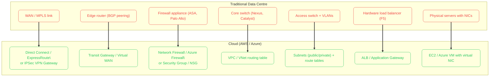
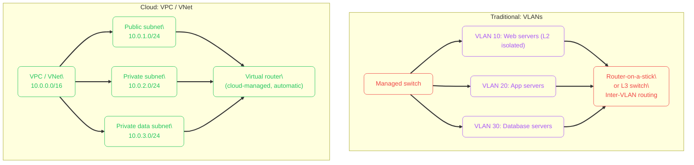
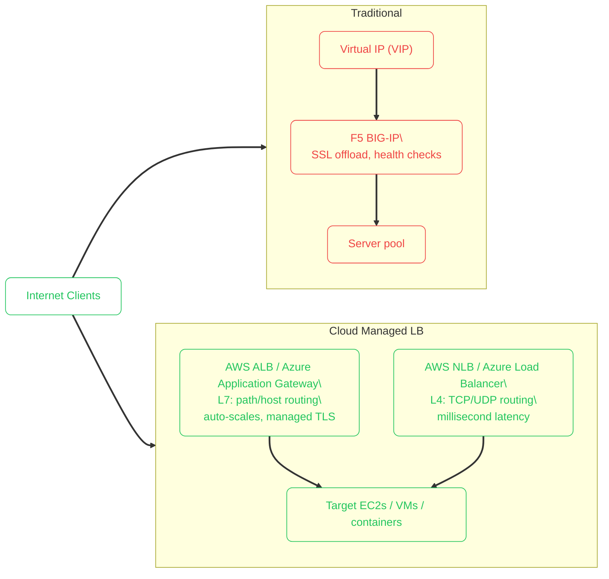
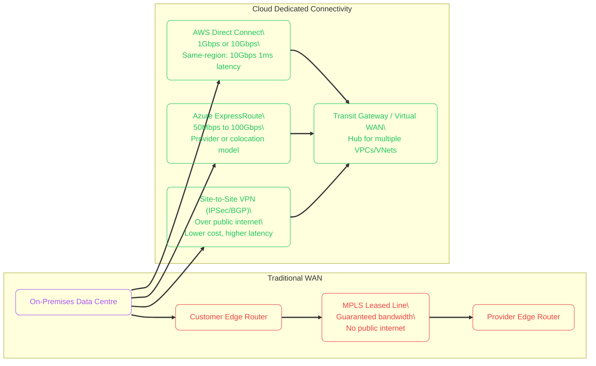
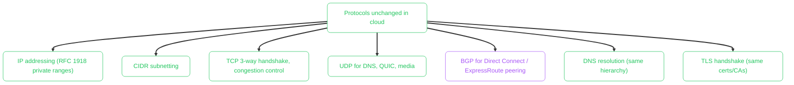

import Callout from '../../../components/mdx/Callout.astro';
import KeyPoints from '../../../components/mdx/KeyPoints.astro';
import CodeTabs from '../../../components/mdx/CodeTabs.astro';

Traditional data centre networking is built around physical hardware: switches, routers, firewalls, and load balancers that you rack, cable, and configure with CLI commands. Cloud networking replaces every one of those boxes with a software abstraction exposed via API. The underlying physics still exists — electrons still flow through fibre — but you never touch it. This lesson maps the physical world to the cloud world so the abstractions make sense.

<KeyPoints>
- How VLANs map to VPCs and subnets in cloud networking
- How hardware firewalls and ACLs map to Security Groups and NSGs
- How physical load balancers map to cloud ALB/Application Gateway
- How MPLS and leased-line WAN links map to Direct Connect / ExpressRoute / VPN
- Why software-defined networking changes provisioning from days to seconds
- What remains the same: IP addressing, routing, TCP/IP, and BGP
</KeyPoints>

---

## Physical to Virtual: The Full Stack

---

## VLANs → VPCs and Subnets

In a physical network, **VLANs** (IEEE 802.1Q) separate traffic into isolated Layer 2 broadcast domains. A trunk port carries multiple VLANs between switches; access ports connect endpoints to one VLAN.

Cloud networking lifts isolation to Layer 3: a **VPC** (AWS) or **VNet** (Azure) is an isolated IP address space. Subnets within it are analogous to VLANs, but routing between them is handled by the cloud's virtual router — no spanning tree, no broadcast storms, no trunk negotiation.

**Key differences:**
- VLANs are Layer 2 — hosts in the same VLAN share a broadcast domain. Subnets are Layer 3 — every host routes, no broadcasts.
- VLAN IDs (1–4094) are local to the switch fabric. VPCs are globally isolated by default — no traffic crosses between them without peering or a gateway.
- Changing VLAN membership requires switch CLI access. Changing subnet routes is an API call.

---

## ACLs and Firewalls → Security Groups and NSGs

Traditional networks rely on **stateless ACLs** on routers and **stateful firewalls** as a separate appliance. Cloud replaces both with a distributed, hypervisor-level construct.

```mermaid
flowchart TD
    accTitle: ACLs and Firewalls → Security Groups and NSGs
    accDescr: Flowchart (td) showing Checkpoint, Palo Alto, runs in hypervisor, not a box, AWS
    classDef step fill:none,stroke:#a855f7,color:#a855f7,rx:8,ry:8
    classDef ok   fill:none,stroke:#22c55e,color:#22c55e,rx:8,ry:8
    classDef fail fill:none,stroke:#ef4444,color:#ef4444,rx:8,ry:8
    linkStyle default stroke-width:2.5px

    subgraph TRAD_FW["Traditional Firewall"]
        EXT_PKT["Inbound packet"]:::fail
        FW_HW["Hardware firewall\<br/>(Checkpoint, Palo Alto)\<br/>Stateful inspection"]:::step
        ACL["Router ACL\<br/>Stateless per-interface"]:::step
        VLAN_FW["VLAN boundary"]:::step
        SERVER["Server"]:::ok
        EXT_PKT --> FW_HW --> ACL --> VLAN_FW --> SERVER
    end

    subgraph CLOUD_FW["Cloud Security Groups / NSG"]
        PKT["Inbound packet"]:::fail
        SG["Security Group / NSG\<br/>(runs in hypervisor, not a box)\<br/>Stateful: return traffic auto-allowed"]:::step
        NACL["Network ACL (AWS)\<br/>or Subnet NSG (Azure)\<br/>Stateless subnet-level filter"]:::step
        VM["VM / ECS task"]:::ok
        PKT --> SG --> NACL --> VM
    end
```

| Aspect | Physical Firewall | Security Group / NSG |
|---|---|---|
| Form factor | Dedicated appliance | Distributed hypervisor rule engine |
| Rules | Ordered ACL (first match) | Allow-only, last-deny-all, evaluated all rules |
| State | Stateful (hardware) | Stateful (return traffic auto-permitted) |
| Scope | Perimeter or zone boundary | Per resource (SG) or per subnet (NSG) |
| Update lag | Seconds–minutes via CLI/GUI | Milliseconds via API |
| Failure mode | Appliance failure = network down | Distributed — no single point |

<Callout type="tip" title="Security Groups Are Not Firewalls at the Perimeter">
Security groups apply at the instance/NIC level. Every VM in a VPC has its own SG evaluation. There is no packet flow between VMs on the same subnet that bypasses security group evaluation — the hypervisor enforces it on every NIC.
</Callout>

---

## Load Balancers: Hardware to Managed Service

Physical load balancers like the **F5 BIG-IP** or **Citrix ADC** are expensive, capacity-limited appliances. Cloud load balancers are managed services that scale automatically.

| Feature | Hardware LB (F5) | Cloud ALB |
|---|---|---|
| TLS/SSL offload | Yes (hardware crypto) | Yes (managed certs via ACM/Key Vault) |
| Horizontal scaling | Buy bigger hardware | Auto-scales behind the scenes |
| Health checks | Configurable per pool | Configurable; affects DNS/routing |
| Cost model | CapEx + licensing | Pay-per-LCU (usage) |
| WAF integration | Separate module | Native (AWS WAF, Azure WAF) |

---

## WAN: MPLS → Direct Connect / ExpressRoute

Corporate networks traditionally used **MPLS** (Multiprotocol Label Switching) leased lines or Frame Relay for guaranteed bandwidth between sites. Cloud connectivity offers equivalent dedicated links managed by the cloud provider.

| Connectivity | Latency | Bandwidth | Cost | Use case |
|---|---|---|---|---|
| Site-to-Site VPN | ~20–50ms | Up to ~1.25 Gbps | Low | Non-latency-sensitive, lower traffic |
| AWS Direct Connect | ~1–10ms | 1–100 Gbps | Higher | Production workloads, database replication |
| Azure ExpressRoute | ~1–10ms | 50Mbps–100Gbps | Higher | Hybrid production workloads |
| SD-WAN | Variable | Aggregate multiple links | Medium | Branch offices, flexible routing |

---

## Routing: Static Config to Programmable Tables

In physical networks, routing is configured statically (`ip route add`) or via dynamic protocols (`OSPF`, `BGP`) on individual routers. Cloud networking uses **route tables** — per-subnet routing policies controlled via API.

<CodeTabs tabs={[
  {
    label: "Traditional (Linux router)",
    lang: "bash",
    code: `# Add a static route on a Linux router
ip route add 10.20.0.0/16 via 192.168.1.1 dev eth0

# Set default gateway
ip route add default via 192.168.1.1

# View routing table
ip route show

# OSPF config snippet (quagga/FRR)
# router ospf
#   network 10.0.0.0/8 area 0
#   redistribute connected`
  },
  {
    label: "AWS Route Table",
    lang: "bash",
    code: `# Create a route table
aws ec2 create-route-table --vpc-id vpc-0abc123

# Add a default route via Internet Gateway (public subnets)
aws ec2 create-route \\
  --route-table-id rtb-0abc123 \\
  --destination-cidr-block 0.0.0.0/0 \\
  --gateway-id igw-0abc123

# Add a private route via NAT Gateway (private subnets)
aws ec2 create-route \\
  --route-table-id rtb-0private \\
  --destination-cidr-block 0.0.0.0/0 \\
  --nat-gateway-id nat-0abc123

# Associate route table with subnet
aws ec2 associate-route-table \\
  --route-table-id rtb-0abc123 \\
  --subnet-id subnet-0abc123`
  },
  {
    label: "Azure Route Table (UDR)",
    lang: "bash",
    code: `# Create a user-defined route table
az network route-table create \\
  --resource-group rg-network \\
  --name rt-private-subnet

# Force all traffic through Azure Firewall (NVA)
az network route-table route create \\
  --resource-group rg-network \\
  --route-table-name rt-private-subnet \\
  --name DefaultViaFirewall \\
  --address-prefix 0.0.0.0/0 \\
  --next-hop-type VirtualAppliance \\
  --next-hop-ip-address 10.0.0.4

# Associate with subnet
az network vnet subnet update \\
  --resource-group rg-network \\
  --vnet-name vnet-hub \\
  --name snet-private \\
  --route-table rt-private-subnet`
  },
]} />

---

## What Stays the Same

Cloud networking abstracts the hardware but does **not** change the fundamental protocols:

<Callout type="info" title="Cloud Is Automation, Not New Protocols">
A VPC is a virtual router + switch + firewall combined and exposed as an API. The packets inside still use Ethernet, IP, TCP, and all the same protocols as in a physical data centre. What cloud changes is the operational model: provisioning, changes, and scaling happen in milliseconds via code rather than hours via change management tickets.
</Callout>
