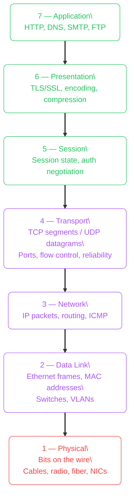
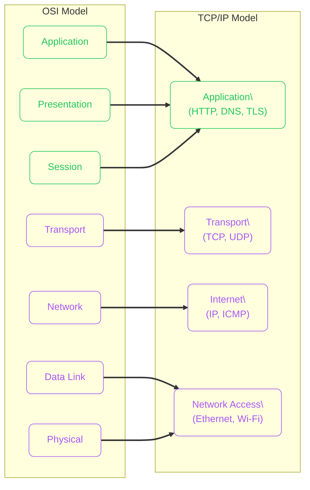
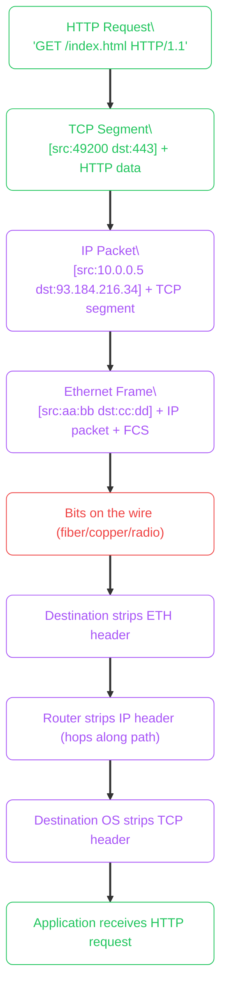
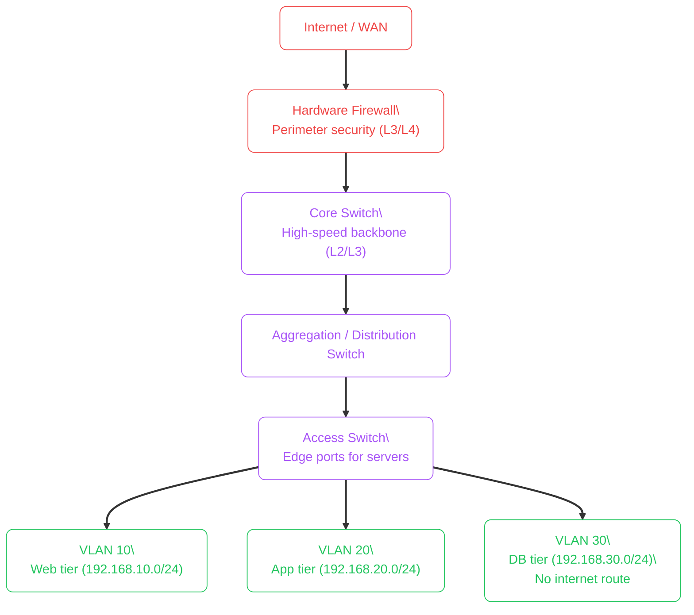
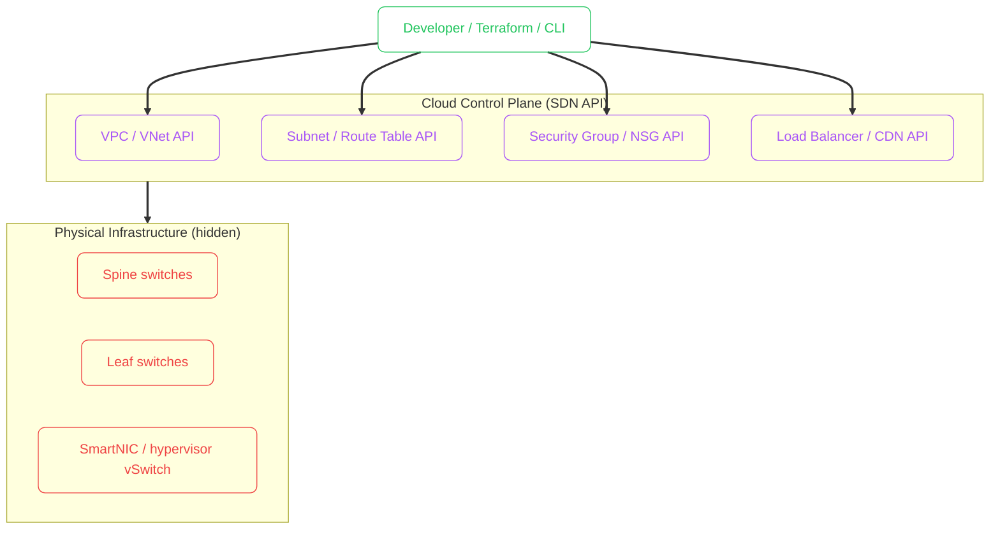
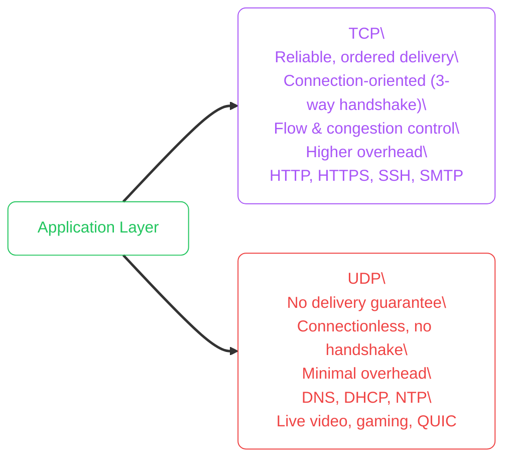
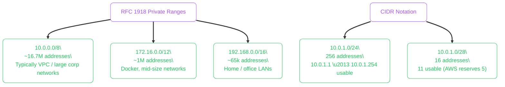

import Callout from '../../../components/mdx/Callout.astro';
import KeyPoints from '../../../components/mdx/KeyPoints.astro';
import CodeTabs from '../../../components/mdx/CodeTabs.astro';
import Quiz from '../../../components/mdx/Quiz.astro';

Computer networking is the set of rules, hardware, and software that allows machines to exchange data. Every API call, database query, and CDN-cached image travels through a layered stack of protocols — understanding those layers is what separates developers who guess from developers who diagnose.

<KeyPoints>
- How the 7-layer OSI model maps to the 4-layer TCP/IP model
- What happens at each layer when a browser loads a webpage
- The difference between physical network hardware and software-defined networking (SDN)
- How cloud providers abstract physical infrastructure into programmable APIs
- How to read `traceroute` and `tcpdump` output using the layer model
</KeyPoints>

---

## The OSI Model

The **OSI (Open Systems Interconnection) model** is a conceptual framework that splits network communication into seven layers. Each layer has a single responsibility and communicates only with the layers directly above and below it.

**A helpful mnemonic (top-down):** _All People Seem To Need Data Processing_

Layer numbers matter because error messages reference them: "Layer 3 issue" means routing/IP, "Layer 4 issue" means TCP/UDP ports.

### What Each Layer Does

| Layer | Name | PDU | Key protocols | Hardware |
|---|---|---|---|---|
| 7 | Application | Data | HTTP, DNS, SMTP | — |
| 6 | Presentation | Data | TLS, MIME, gzip | — |
| 5 | Session | Data | NetBIOS, RPC | — |
| 4 | Transport | Segment/Datagram | TCP, UDP | — |
| 3 | Network | Packet | IP, ICMP, BGP | Router |
| 2 | Data Link | Frame | Ethernet, Wi-Fi | Switch |
| 1 | Physical | Bit | 802.3, 802.11 | NIC, cable |

The **Protocol Data Unit (PDU)** is what a layer calls its unit of data. An Ethernet frame wraps an IP packet, which wraps a TCP segment, which wraps your HTTP request. This nesting is **encapsulation**.

---

## TCP/IP vs OSI

In practice, the **TCP/IP model** (4 layers) is what networks actually implement. OSI is the reference model for reasoning about problems.

---

## Encapsulation: A Packet's Journey

When a browser sends an HTTP request, each layer wraps the payload with its own header. The receiver strips each header as data travels back up.

---

## Traditional Physical Networks

In a traditional data centre, each layer maps to physical hardware:

**Problems with physical networks:**
- Provisioning a new VLAN or route requires physical access or CLI access to the switch
- Configuration drift between devices is common and hard to detect
- Scaling means buying, racking, and cabling new hardware
- Human error on complex ACL/VLAN configs is a frequent source of outages

---

## Software-Defined Networking (SDN) and Cloud

Cloud providers implement the entire network stack in software. Physical hardware exists, but you never touch it — you interact with an API.

| Traditional | Cloud (SDN equivalent) |
|---|---|
| Physical switch VLAN | VPC / VNet subnet |
| Router ACL | Security Group / NSG rule |
| Hardware load balancer | AWS ALB / Azure Application Gateway |
| MPLS WAN | AWS Direct Connect / Azure ExpressRoute |
| Physical firewall | AWS Network Firewall / Azure Firewall |
| DHCP server | Cloud-managed private IP assignment |
| Physical DNS server | Route 53 / Azure DNS |

<Callout type="tip" title="Cloud Is Not Magic — It Is Automated Hardware">
Every VPC, subnet, and security group translates to configuration pushed to physical switches, SmartNICs, or hypervisor-level virtual switches. The API just makes the provisioning and change management programmable and auditable.
</Callout>

---

## Reading Network Diagnostics

Understanding the layer model makes CLI tools much more useful.

<CodeTabs tabs={[
  {
    label: "traceroute (L3 path)",
    lang: "bash",
    code: `# Map the Layer 3 (IP) path to a destination
# Each hop is a router that decrements the TTL
traceroute 8.8.8.8

# Sample output:
#  1  192.168.1.1 (gateway)     0.6 ms
#  2  10.0.0.1 (ISP router)     4.2 ms
#  3  72.14.209.65 (Google)    10.1 ms
#  4  8.8.8.8                  11.2 ms`
  },
  {
    label: "ss / netstat (L4 sockets)",
    lang: "bash",
    code: `# List established TCP connections and their ports (L4)
ss -tnp

# Sample output:
# State   Recv-Q Send-Q  Local Address:Port   Peer Address:Port
# ESTAB   0      0       10.0.0.5:49200       93.184.216.34:443

# Check what process owns port 443
sudo ss -tlnp | grep :443`
  },
  {
    label: "tcpdump (L2–L7)",
    lang: "bash",
    code: `# Capture HTTP traffic on eth0 (shows raw frames/packets)
sudo tcpdump -i eth0 -nn 'port 80' -A

# Capture only DNS queries (UDP port 53)
sudo tcpdump -i eth0 'udp port 53'

# Write to file for Wireshark analysis
sudo tcpdump -i eth0 -w /tmp/capture.pcap`
  },
  {
    label: "ip / ifconfig (L2–L3)",
    lang: "bash",
    code: `# Show interfaces, IPs, and MAC addresses
ip addr show

# Show routing table (L3)
ip route show

# Show ARP cache (L2 MAC-to-IP mappings)
ip neigh show

# Show interface statistics
ip -s link show eth0`
  },
]} />

---

## TCP vs UDP

The two dominant Layer 4 protocols have opposite trade-offs:

<Callout type="info" title="QUIC Blurs the Line">
HTTP/3 uses QUIC, which is built on UDP but implements reliability, ordering, and congestion control in user space — giving UDP's low overhead with TCP-like guarantees. Cloud load balancers like AWS CloudFront and Azure Front Door support HTTP/3 natively.
</Callout>

---

## IP Addressing Essentials

Every device on a network has an **IP address** — a Layer 3 identifier. CIDR notation (`/24`) describes the network boundary.

<Callout type="warning" title="Cloud Providers Reserve Addresses">
AWS reserves 5 IP addresses per subnet (network, router, DNS, future, broadcast). Azure reserves 5 as well. A `/28` (16 total) gives you only 11 usable IPs. Plan CIDR ranges generously — expanding them later requires rebuilding the VPC.
</Callout>

---

<Quiz
  question="A developer reports 'connection refused' on port 5432. Which OSI layer is most relevant to diagnose this?"
  options={[
    { label: "Layer 1 — Physical (check the cable)" },
    { label: "Layer 3 — Network (ping the host)" },
    { label: "Layer 4 — Transport (TCP port open/closed)", correct: true },
    { label: "Layer 7 — Application (check HTTP headers)" },
  ]}
  explanation="'Connection refused' is a TCP reset (RST) — the host is reachable (L3 is fine) but nothing is listening on that port. This is a Layer 4 issue: check that PostgreSQL is running (`ss -tlnp | grep 5432`) and that the security group / firewall allows the port."
/>
