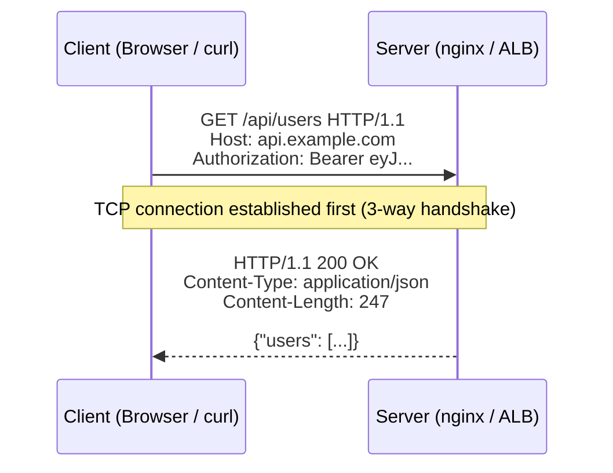
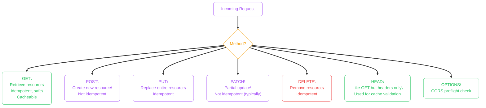
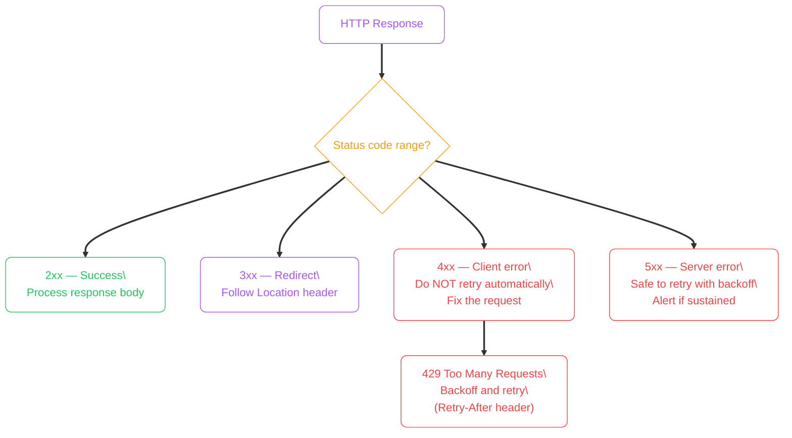
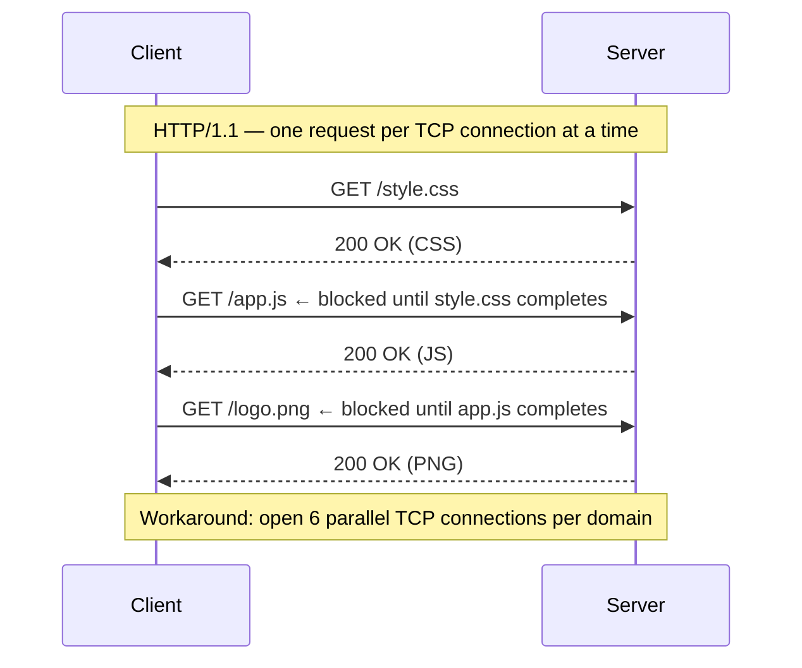
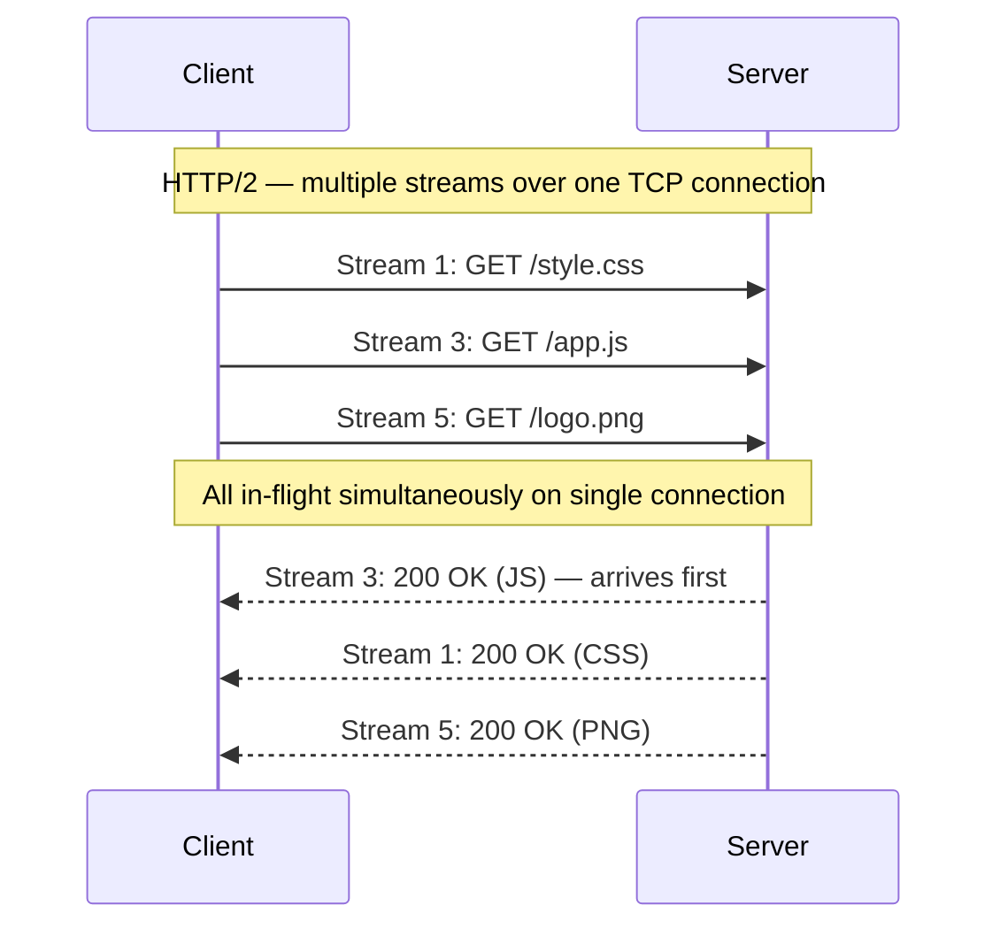
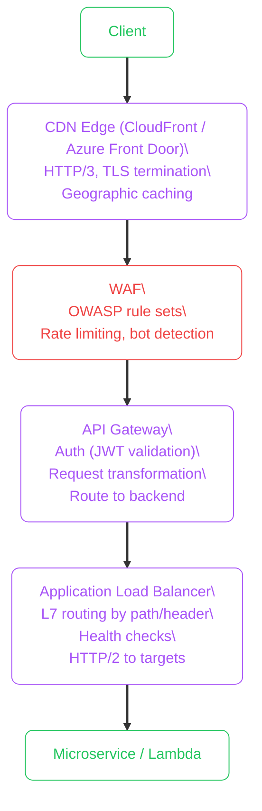

import Callout from '../../../../components/mdx/Callout.astro';
import KeyPoints from '../../../../components/mdx/KeyPoints.astro';
import CodeTabs from '../../../../components/mdx/CodeTabs.astro';
import Quiz from '../../../../components/mdx/Quiz.astro';

**HTTP (Hypertext Transfer Protocol)** is the application-layer protocol that drives the web and virtually every REST API. Every microservice call, DNS-over-HTTPS query, and S3 presigned URL uses HTTP. Understanding it in detail — not just the basics — is what enables you to debug connection issues, tune performance, and design correct API contracts.

<KeyPoints>
- How HTTP request/response structure maps to real wire bytes
- The difference between HTTP/1.1 head-of-line blocking and HTTP/2 multiplexing
- When to use each HTTP method and what idempotency means in practice
- How status codes communicate success, client error, and server error semantics
- How cloud API gateways, load balancers, and CDNs sit in front of HTTP services
- How connection keep-alive and pipelining affect performance
</KeyPoints>

---

## Request–Response Model

HTTP is a **stateless, text-based** application protocol. A client sends a request; the server returns a response. Each exchange is independent — no notion of ongoing session at the protocol level (cookies and JWTs add session state above HTTP).



### Request Anatomy

```
GET /api/users?page=2 HTTP/1.1       ← Request line: method + path + version
Host: api.example.com                 ← Required header in HTTP/1.1
Authorization: Bearer eyJhbGc...      ← Auth header
Accept: application/json              ← Content negotiation
Connection: keep-alive                ← Reuse TCP connection
                                      ← Blank line separates headers from body
                                      ← (GET has no body)
```

### Response Anatomy

```
HTTP/1.1 200 OK                       ← Status line: version + code + reason
Content-Type: application/json        ← Body format
Content-Length: 247                   ← Exact byte count
Cache-Control: no-cache               ← Caching directive
X-Request-ID: a1b2c3d4               ← Correlation ID (custom header)
                                      ← Blank line
{"users": [...]}                      ← Response body
```

---

## HTTP Methods

Methods describe the **intent** of the request. The RFC defines semantics that clients, proxies, and caches rely on.



**Idempotency:** calling the same request multiple times produces the same result. `PUT /users/42` always ends with the same user state. `POST /users` creates a new user each time. This matters for retry logic — retrying an idempotent request is always safe.

---

## Status Codes

Status codes communicate outcome. Client code should branch on code ranges, not individual values.

| Range | Category | Key codes |
|---|---|---|
| **1xx** | Informational | `100 Continue`, `101 Switching Protocols` |
| **2xx** | Success | `200 OK`, `201 Created`, `204 No Content` |
| **3xx** | Redirection | `301 Moved Permanently`, `302 Found`, `304 Not Modified` |
| **4xx** | Client error | `400 Bad Request`, `401 Unauthorized`, `403 Forbidden`, `404 Not Found`, `429 Too Many Requests` |
| **5xx** | Server error | `500 Internal Server Error`, `502 Bad Gateway`, `503 Service Unavailable`, `504 Gateway Timeout` |



<Callout type="warning" title="Never Retry 4xx Blindly">
Retrying a `400 Bad Request` or `403 Forbidden` will never succeed — the request itself is malformed or unauthorized. Automatic retries should only target `5xx` responses and `429` (with the `Retry-After` delay respected).
</Callout>

---

## HTTP/1.1 vs HTTP/2: Connection Model

### HTTP/1.1 Head-of-Line Blocking



### HTTP/2 Multiplexing



**HTTP/2 improvements over HTTP/1.1:**
- **Multiplexing** — multiple requests over one connection, no head-of-line blocking at the HTTP level
- **Header compression (HPACK)** — repeated headers (like `Authorization`) are sent as references
- **Server push** — server proactively sends resources client will need (rarely used in practice)
- **Binary framing** — more efficient parsing than text

<Callout type="info" title="HTTP/3 and QUIC">
HTTP/3 replaces TCP with QUIC (UDP-based). QUIC solves HTTP/2's remaining head-of-line blocking at the TCP layer — a single dropped packet in TCP blocks all HTTP/2 streams, but QUIC handles each stream independently. AWS CloudFront and Azure Front Door support HTTP/3 natively.
</Callout>

---

## Caching Headers

HTTP has a rich caching model. Getting it right reduces origin load and improves user-perceived latency.

| Header | Direction | Purpose |
|---|---|---|
| `Cache-Control: max-age=3600` | Response | Cache for 3600s |
| `Cache-Control: no-cache` | Response | Revalidate with server before using cache |
| `Cache-Control: no-store` | Response | Never cache (sensitive data) |
| `Cache-Control: private` | Response | Only browser cache, not shared CDN cache |
| `ETag: "abc123"` | Response | Content fingerprint for conditional requests |
| `If-None-Match: "abc123"` | Request | Revalidation — 304 if not changed |
| `Last-Modified` | Response | Timestamp version for conditional requests |

---

## Cloud API Gateway and Load Balancer Integration

In cloud deployments, HTTP requests pass through multiple layers before reaching your application:



**What each layer adds:**

| Layer | Adds |
|---|---|
| CDN | Geographic caching, HTTP/3, TLS edge termination |
| WAF | OWASP rules, rate limiting, IP-based allow/deny |
| API Gateway | JWT/OAuth validation, request throttling, routing, versioning |
| ALB | Path-based routing, host-based routing, health check–aware balancing |
| Service | Application logic |

<CodeTabs tabs={[
  {
    label: "curl HTTP debugging",
    lang: "bash",
    code: `# Full verbose: see actual request and response headers
curl -v https://api.example.com/users

# Show only headers, discard body
curl -I https://api.example.com/users

# Time the connection breakdown
curl -o /dev/null -s -w "\\n\\
DNS:         %{time_namelookup}s\\n\\
Connect:     %{time_connect}s\\n\\
TLS:         %{time_appconnect}s\\n\\
TTFB:        %{time_starttransfer}s\\n\\
Total:       %{time_total}s\\n" \\
https://api.example.com/users`
  },
  {
    label: "HTTP/2 testing",
    lang: "bash",
    code: `# Confirm server supports HTTP/2
curl -I --http2 https://api.example.com/

# With nghttp2 — inspect streams
nghttp -v https://api.example.com/

# Check via openssl
openssl s_client -connect api.example.com:443 -alpn h2 2>&1 | grep ALPN`
  },
  {
    label: "Headers for security",
    lang: "bash",
    code: `# Check security headers on a site
curl -I https://api.example.com | grep -Ei \\
  "strict-transport|content-security|x-frame|x-content-type|referrer-policy"

# Expected production headers:
# Strict-Transport-Security: max-age=31536000; includeSubDomains
# Content-Security-Policy: default-src 'self'
# X-Frame-Options: DENY
# X-Content-Type-Options: nosniff
# Referrer-Policy: strict-origin-when-cross-origin`
  },
]} />

---

<Quiz
  question="A client retries a POST /orders request after a 504 Gateway Timeout. The server had actually processed the first request before the gateway timed out. What is the result?"
  options={[
    { label: "The retry is safe because POST is idempotent" },
    { label: "Nothing — the server rejects the duplicate automatically" },
    { label: "A duplicate order may be created because POST is not idempotent", correct: true },
    { label: "The 504 means the server never received the first request" },
  ]}
  explanation="POST is not idempotent. A 504 means the gateway gave up waiting — the upstream server may have already processed the request. The retry creates a second order. The correct fix is to use an idempotency key header (e.g., Stripe's `Idempotency-Key`) so the server can detect and deduplicate the retry."
/>
