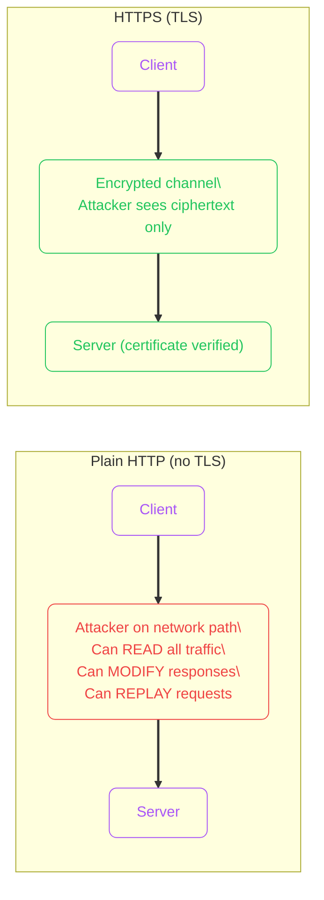
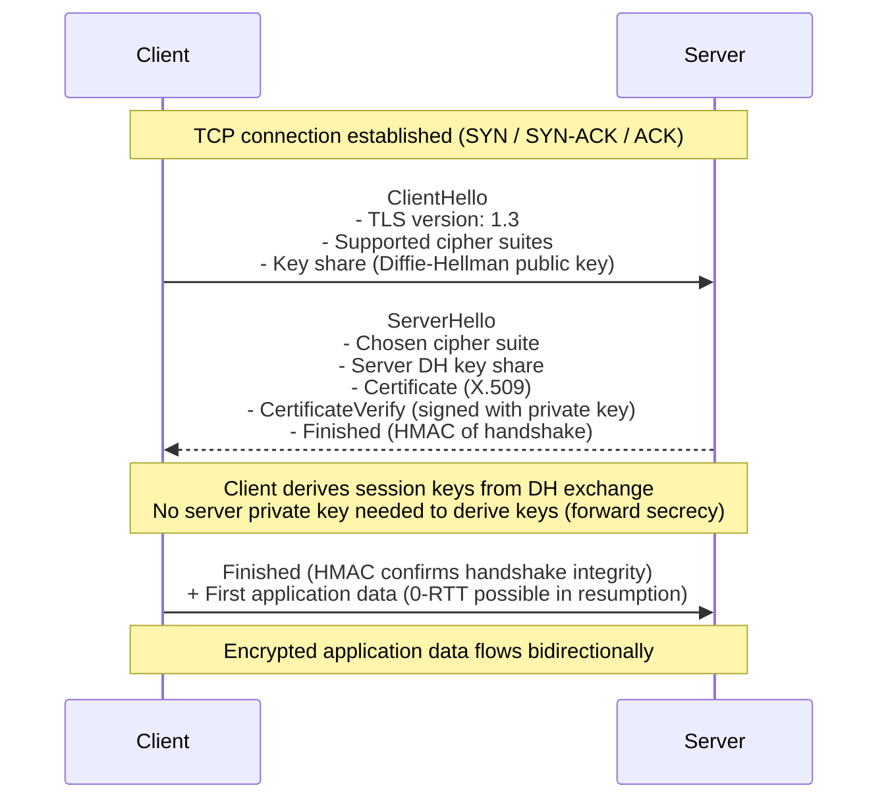
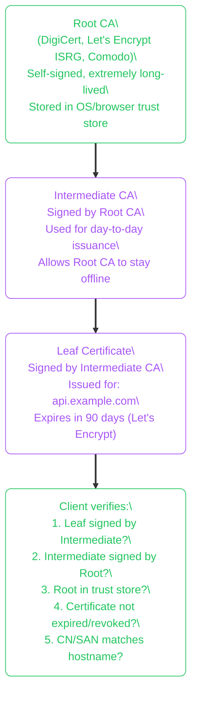
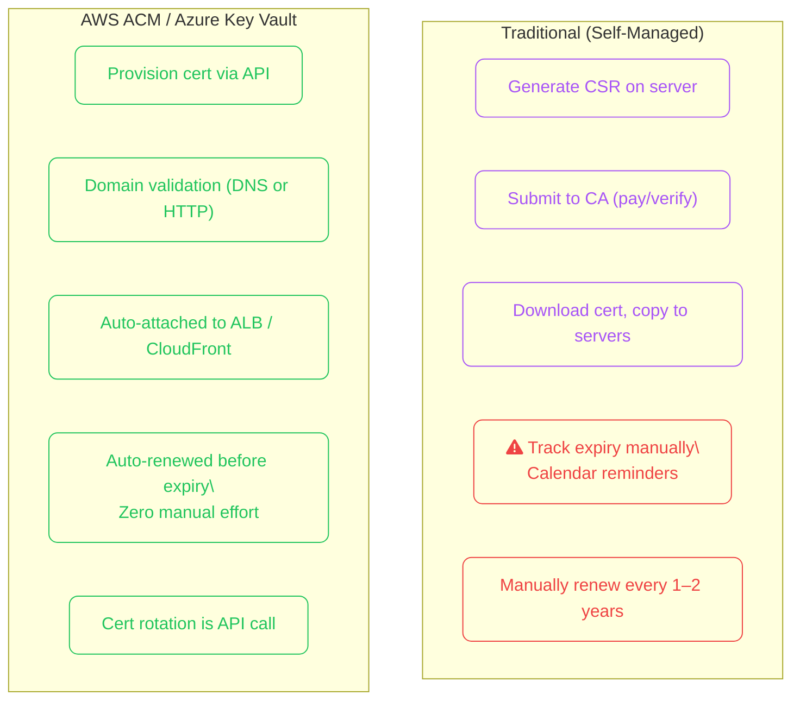
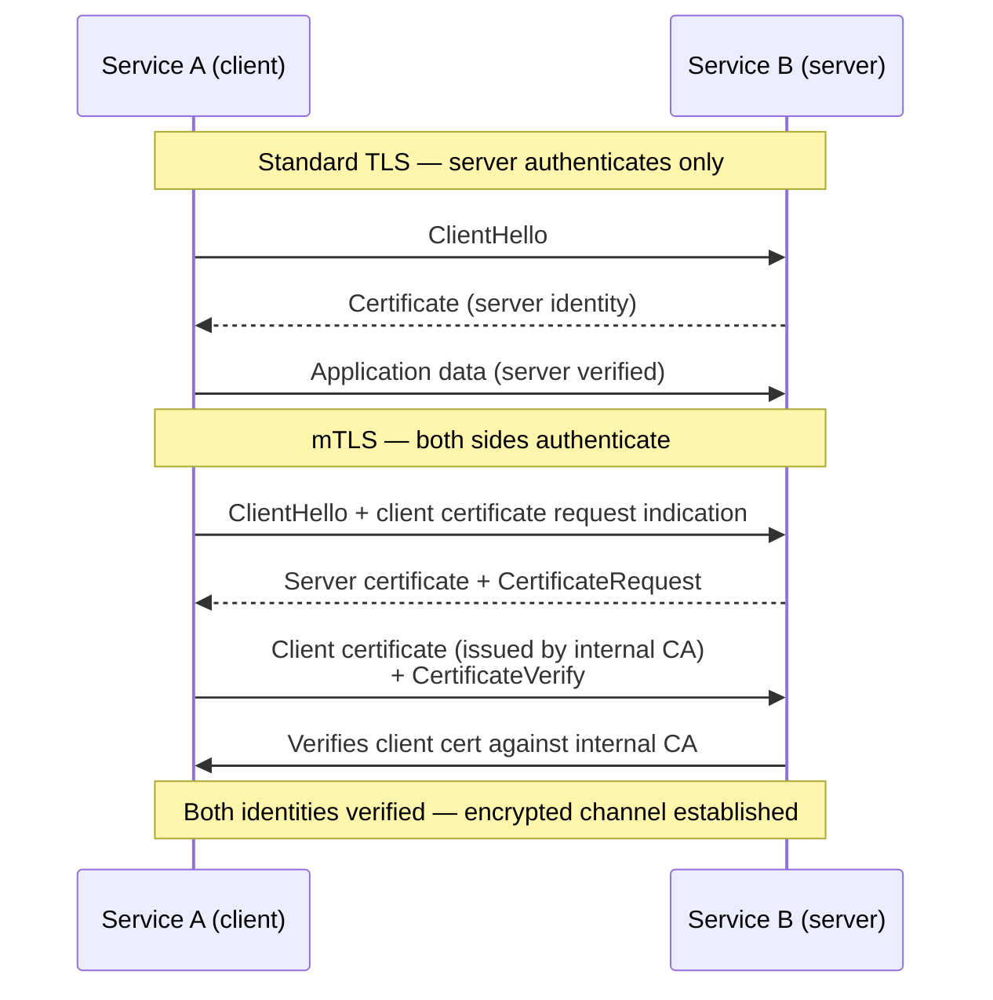

import Callout from '../../../components/mdx/Callout.astro';
import KeyPoints from '../../../components/mdx/KeyPoints.astro';
import CodeTabs from '../../../components/mdx/CodeTabs.astro';
import Quiz from '../../../components/mdx/Quiz.astro';
import { Icon } from 'astro-icon/components';

**TLS (Transport Layer Security)** is the cryptographic protocol that secures virtually all networked communication today — HTTPS, SMTPS, database connections, mTLS between microservices, and VPN tunnels. Every time a browser shows the padlock icon, TLS is doing three things simultaneously: **encrypting** the channel, **authenticating** the server's identity, and **verifying integrity** of every byte transferred.

<KeyPoints>
- What TLS solves and why plain TCP is insufficient for sensitive traffic
- The TLS 1.3 handshake steps and what happens cryptographically at each stage
- How the X.509 certificate chain of trust works from leaf to root CA
- What cipher suites are and how to choose secure vs deprecated ones
- How cloud certificate services (AWS ACM, Azure Key Vault) eliminate manual cert management
- How mTLS adds client-side authentication for service-to-service communication
</KeyPoints>

---

## Why TLS?

Without TLS, any network path between client and server — ISP, corporate proxy, coffee shop Wi-Fi — can read, modify, or replay your traffic.



TLS solves:
- **Confidentiality** — symmetric encryption prevents eavesdropping
- **Integrity** — HMAC/AEAD detects any modification in transit
- **Authentication** — certificates prove the server is who it claims to be

---

## The TLS 1.3 Handshake

TLS 1.3 (2018) reduced the handshake from 2 round trips (TLS 1.2) to 1 round trip. It removed weak cipher suites and made forward secrecy mandatory.



**Key properties of TLS 1.3:**
- **1-RTT handshake** — one round trip vs two in TLS 1.2
- **Forward secrecy mandatory** — session keys derived via ephemeral Diffie-Hellman; compromising the server's private key later cannot decrypt past sessions
- **Removed weak algorithms** — no RSA key exchange, no RC4, no SHA-1, no CBC mode
- **0-RTT resumption** — previously-connected clients can send data in the first flight (with replay-attack caveats)

---

## Certificate Chain of Trust

Browsers and operating systems ship with a list of **trusted root CAs**. A TLS certificate must chain up to one of these roots to be trusted.



**What the client checks:**
1. Signature chain (cryptographic verification)
2. Expiry (`notBefore` and `notAfter`)
3. Revocation (OCSP or CRL)
4. Subject Alternative Name (SAN) matches the hostname you connected to

<Callout type="warning" title="Always Send the Intermediate Certificate">
If your server does not send the intermediate certificate in the TLS handshake, some clients will fail to verify the chain even if your leaf certificate is valid. Configure your web server to include the full chain (`fullchain.pem` in Let's Encrypt, or the bundle from your CA).
</Callout>

---

## Cipher Suites

A **cipher suite** specifies the combination of algorithms used for key exchange, authentication, encryption, and message authentication in a TLS session.

```
TLS_AES_256_GCM_SHA384       (TLS 1.3 cipher suite — simplified format)

TLS 1.2 format: TLS_ECDHE_RSA_WITH_AES_256_GCM_SHA384
  ECDHE       → Key exchange (Elliptic Curve Diffie-Hellman Ephemeral)
  RSA         → Authentication (server cert type)
  AES_256_GCM → Bulk encryption (AEAD)
  SHA384      → HMAC for message authentication
```

| Cipher suite | Status | Notes |
|---|---|---|
| `TLS_AES_128_GCM_SHA256` | <Icon name="mdi:check-circle" class="inline w-4 h-4 align-middle text-green-500" /> Recommended (TLS 1.3) | Fast on hardware without AES-NI |
| `TLS_AES_256_GCM_SHA384` | <Icon name="mdi:check-circle" class="inline w-4 h-4 align-middle text-green-500" /> Recommended (TLS 1.3) | Higher security margin |
| `TLS_CHACHA20_POLY1305_SHA256` | <Icon name="mdi:check-circle" class="inline w-4 h-4 align-middle text-green-500" /> Recommended (TLS 1.3) | Best for mobile (software crypto) |
| `TLS_ECDHE_RSA_WITH_AES_128_GCM_SHA256` | <Icon name="mdi:check-circle" class="inline w-4 h-4 align-middle text-green-500" /> TLS 1.2 OK | Forward secret |
| `TLS_RSA_WITH_AES_128_CBC_SHA` | <Icon name="mdi:close-circle" class="inline w-4 h-4 align-middle text-red-500" /> Deprecated | No forward secrecy, CBC padding oracle |
| `TLS_RSA_WITH_RC4_128_MD5` | <Icon name="mdi:close-circle" class="inline w-4 h-4 align-middle text-red-500" /> Forbidden | RC4 broken, MD5 broken |

---

## Certificate Lifecycle: Traditional vs Cloud



| Aspect | Self-Managed | AWS ACM | Azure Key Vault TLS |
|---|---|---|---|
| Cost | CA fees | Free for ACM certs | Per-cert/operation costs |
| Renewal | Manual | Automatic | Automatic (managed cert) |
| Rotation | SSH + copy | API / automatic | API call |
| Private key | On server disk | Never leaves AWS | Key Vault HSM |
| Scope | Anywhere | AWS endpoints only | Azure endpoints + export |

<Callout type="tip" title="ACM Certs Cannot Be Exported">
AWS ACM certificates are managed by AWS and cannot be exported as PEM files. They can only be used with AWS services (ALB, CloudFront, API Gateway). For non-AWS use (e.g., on-premises, EC2 with nginx), request a cert from Let's Encrypt or purchase from a CA and manage it yourself.
</Callout>

---

## Mutual TLS (mTLS)

Standard TLS authenticates the **server** to the client. **mTLS** adds the reverse — the server also verifies that the client holds a valid certificate. This is the foundation of zero-trust service mesh authentication.



mTLS is used by:
- **Service meshes** (Istio, Linkerd) — automatic mTLS between every pod
- **Internal microservices** — `sidecar proxy` handles cert issuance via SPIFFE/SPIRE
- **Zero-trust network access** — device certificates for corporate resources

---

## TLS in Practice

<CodeTabs tabs={[
  {
    label: "Inspect certificate",
    lang: "bash",
    code: `# Check what certificate a server presents
openssl s_client -connect api.example.com:443 -servername api.example.com 2>/dev/null \\
  | openssl x509 -noout -text | grep -E "Subject:|Issuer:|Not After|DNS:"

# Check certificate expiry only
echo | openssl s_client -connect api.example.com:443 2>/dev/null \\
  | openssl x509 -noout -dates

# Check if TLS 1.3 is supported
openssl s_client -connect api.example.com:443 -tls1_3 2>&1 | grep -i "TLSv"`
  },
  {
    label: "Test cipher suites (nmap)",
    lang: "bash",
    code: `# Enumerate supported cipher suites and TLS versions
nmap --script ssl-enum-ciphers -p 443 api.example.com

# Check for weak protocols (should show no TLS 1.0/1.1)
openssl s_client -connect api.example.com:443 -tls1 2>&1 | grep "handshake"
# Expected: "handshake failure" — TLS 1.0 disabled`
  },
  {
    label: "AWS ACM (CLI)",
    lang: "bash",
    code: `# Request a public certificate (DNS validation)
aws acm request-certificate \\
  --domain-name api.example.com \\
  --subject-alternative-names "*.example.com" \\
  --validation-method DNS \\
  --region us-east-1

# List certs and check expiry
aws acm list-certificates \\
  --query 'CertificateSummaryList[*].[DomainName,Status,RenewalSummary.RenewalStatus]' \\
  --output table`
  },
  {
    label: "Let's Encrypt (certbot)",
    lang: "bash",
    code: `# Install certbot
sudo apt-get install certbot python3-certbot-nginx

# Issue cert + auto-configure nginx
sudo certbot --nginx -d api.example.com -d www.example.com

# Test renewal (dry run)
sudo certbot renew --dry-run

# Check cert stored on disk
sudo openssl x509 -in /etc/letsencrypt/live/example.com/cert.pem -noout -dates`
  },
]} />

---

<Quiz
  question="A microservice returns a certificate error: 'certificate has expired'. The certificate was issued by an internal CA. What is the fastest safe fix that doesn't bypass security?"
  options={[
    { label: "Set `verify: false` in the HTTP client to skip validation" },
    { label: "Reissue the certificate from the internal CA and update the service", correct: true },
    { label: "Switch to HTTP for internal service calls" },
    { label: "Extend the certificate validity by editing the PEM file" },
  ]}
  explanation="Disabling certificate verification (`verify: false`) defeats TLS authentication and creates a man-in-the-middle vulnerability. PEM files cannot be edited to change validity. The correct fix is to reissue via your internal CA and rotate the cert on the service — automate this with SPIFFE/SPIRE or cert-manager in Kubernetes to prevent the problem recurring."
/>
