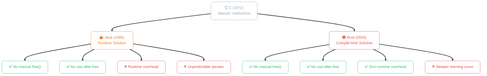
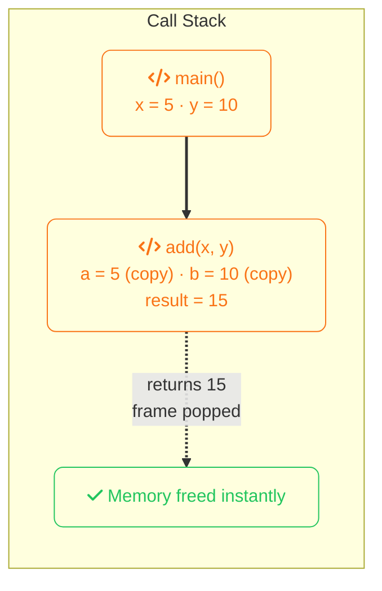
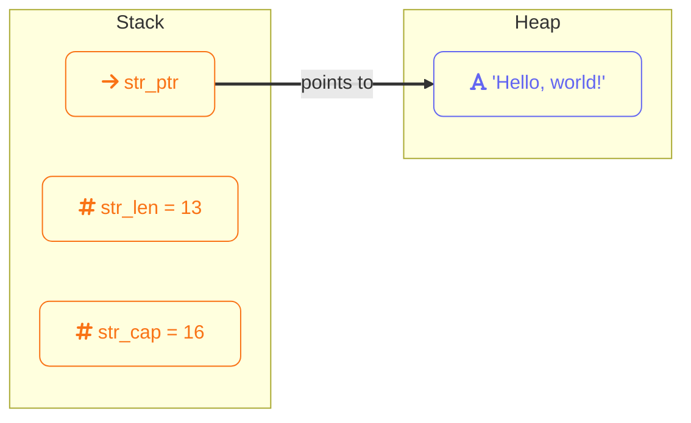
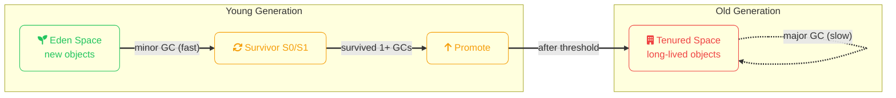

import Callout from '../../../components/mdx/Callout.astro';
import KeyPoints from '../../../components/mdx/KeyPoints.astro';
import Quiz from '../../../components/mdx/Quiz.astro';
import CodeTabs from '../../../components/mdx/CodeTabs.astro';
import List from '../../../components/mdx/List.astro';

Every variable, object, and data structure your program creates needs memory. Memory management is how your program acquires that memory, uses it, and gives it back. Get it wrong and you get crashes, security vulnerabilities, or programs that slowly consume all available RAM until the OS kills them.

Different languages take fundamentally different approaches to this problem. Java uses a garbage collector — an automatic system that tracks and frees unused memory for you. Rust uses a compile-time ownership system that proves memory is safe without any runtime overhead. Understanding both approaches will make you a better developer in either language.

## The Evolution: From C to Modern Languages

To understand why Java and Rust manage memory the way they do, we need to start with C — the language that forced programmers to manage memory manually.

### C: Manual Memory Management

In C (1972), you are the memory manager. You explicitly request memory with `malloc()` and release it with `free()`:

```c
// C — you manage everything
char* create_greeting(const char* name) {
    // Request heap memory manually
    char* greeting = malloc(strlen(name) + 10);
    if (greeting == NULL) {
        return NULL;  // allocation failed — you handle it
    }
    
    sprintf(greeting, "Hello, %s!", name);
    return greeting;
    // Caller MUST call free() on this pointer
    // If they forget → memory leak
    // If they free twice → undefined behavior (crash, security hole)
    // If they use after free → undefined behavior
}

// Somewhere else...
char* msg = create_greeting("Alice");
printf("%s\n", msg);
free(msg);      // You must remember this
msg = NULL;     // Good practice, but not enforced
```

This gives you complete control but creates entire categories of bugs:

| Bug Type | What Happens | Consequence |
|----------|--------------|-------------|
| **Memory leak** | Forgot to `free()` | Program slowly consumes all RAM |
| **Double free** | Called `free()` twice | Crash or security vulnerability |
| **Use after free** | Accessed freed memory | Crash, corruption, or security exploit |
| **Dangling pointer** | Pointer to freed/invalid memory | Undefined behavior |
| **Buffer overflow** | Wrote past allocated size | Security vulnerability (CVE factory) |

<Callout type="warning" title="C's Legacy">
These bugs aren't theoretical. Buffer overflows in C code have caused countless security vulnerabilities — from the Morris Worm (1988) to Heartbleed (2014) to countless CVEs today. Manual memory management is powerful but unforgiving.
</Callout>

### The Two Solutions

Languages that came after C took two fundamentally different paths to solve these problems:




Both eliminate C's memory bugs. They just do it at different times — Java at runtime, Rust at compile time.

## The Two Kinds of Memory

Every running program has access to two regions of memory:

### The Stack

The stack is fast, automatic, and limited in size. It works like a stack of plates — you push data on when entering a function, pop it off when leaving. The CPU manages this automatically.


Stack allocation is essentially free — the CPU just moves a pointer. Stack data must have a **known, fixed size at compile time**. Integers, floats, booleans, and fixed-size structs live on the stack.

### The Heap

The heap is slower, manual (in concept), and much larger. When you need memory whose size isn't known at compile time — a string the user typed, a list that grows, an object graph — you allocate on the heap.


A `String` in both Java and Rust stores its metadata (pointer, length, capacity) on the stack, while the actual character data lives on the heap. Heap allocation requires finding a free block, bookkeeping overhead, and — the hard part — **knowing when to free it**.

<Callout type="info">
Stack vs heap isn't about performance tricks — it's a fundamental distinction about lifetime. Stack memory lives exactly as long as the function call. Heap memory lives until explicitly freed or collected.
</Callout>

## Java's Approach: Garbage Collection

Java frees you from thinking about memory deallocation. You create objects with `new`, use them, and when nothing references them anymore the **garbage collector** (GC) finds and reclaims them.
```java
public void processData() {
    // Allocated on heap
    List<String> names = new ArrayList<>();
    names.add("Alice");
    names.add("Bob");

    // Use names...
    System.out.println(names.size());

    // Method returns — 'names' goes out of scope
    // GC will eventually reclaim the ArrayList and Strings
    // You do nothing
}
```

### How the GC Works

Java's GC uses a **generational** model based on the observation that most objects die young:


- **Minor GC** — runs frequently, collects Eden space, very fast (milliseconds)
- **Major GC** — runs when Old generation fills up, much slower
- **Stop-the-world** — during GC, all application threads pause

### GC Tuning
```bash frame="terminal"
# Run with 512MB heap, print GC details
java -Xmx512m -Xms256m -verbose:gc MyApp

# Use G1GC (default in Java 9+) with 200ms pause target
java -XX:+UseG1GC -XX:MaxGCPauseMillis=200 MyApp
```

<Callout type="warning" title="GC is Not Free">
Garbage collection has real costs — memory overhead (heap typically 2-5x live data), CPU overhead (5-20% of runtime), and unpredictable pause times. For most applications this is fine. For low-latency systems like trading platforms or games, GC pauses are a serious concern.
</Callout>

### Memory Leaks in Java

Yes, Java can still leak memory — not because you forgot to free something, but because you accidentally hold references to objects you're done with:
```java
// Classic Java memory leak — static collection grows forever
public class EventSystem {
    private static final List<EventListener> listeners = new ArrayList<>();

    public static void register(EventListener l) {
        listeners.add(l);  // added but never removed
    }
    // Objects registered here live for the entire application lifetime
    // even if the caller is long gone
}
```

Fix: use `WeakReference`, remove listeners explicitly, or use a library that handles lifecycle properly.

---

## Rust's Approach: Ownership

Rust takes a radically different path. Instead of a runtime GC, Rust's **compiler** proves at compile time that memory is always freed exactly once, at the right time, with no runtime cost.

Every piece of data in Rust has exactly one **owner**. When the owner goes out of scope, the memory is freed — automatically, deterministically, at compile time.
```rust
fn process_data() {
    let names: Vec<String> = vec![
        String::from("Alice"),
        String::from("Bob"),
    ];

    println!("{}", names.len());

    // names goes out of scope here
    // Rust inserts: drop(names) — frees Vec and all Strings
    // Guaranteed at compile time, zero runtime overhead
}
```

### The Three Rules of Ownership
```
1. Every value has exactly one owner
2. When the owner goes out of scope, the value is dropped
3. Ownership can be moved or borrowed — never duplicated silently
```

### Moving Ownership
```rust
let s1 = String::from("hello");
let s2 = s1;  // ownership MOVES to s2

println!("{}", s1);  // ❌ COMPILE ERROR — s1 no longer owns the data
println!("{}", s2);  // ✅ fine
```

In Java, `s2 = s1` creates two references to the same object. In Rust it transfers ownership — `s1` is invalidated. This prevents double-free errors at compile time.

### Borrowing

Moving ownership everywhere would be impractical. Rust lets you **borrow** data — take a reference without taking ownership:
```rust
fn print_length(s: &String) {  // & means "borrow"
    println!("Length: {}", s.len());
    // s is a reference — we don't own it, we don't drop it
}

let s = String::from("hello");
print_length(&s);        // lend s to the function
println!("{}", s);       // ✅ still valid — we still own it
```

### Borrow Rules
```
At any given time, you can have EITHER:
  - Any number of immutable references (&T)
  - Exactly one mutable reference (&mut T)
  — but never both simultaneously
```
```rust
let mut s = String::from("hello");

let r1 = &s;       // immutable borrow
let r2 = &s;       // another immutable borrow — fine
let r3 = &mut s;   // ❌ COMPILE ERROR — can't borrow mutably while immutably borrowed

println!("{} {}", r1, r2);
```

This rule eliminates an entire class of concurrency bugs — **data races** — at compile time.

<Callout type="tip" title="The Borrow Checker is Your Friend">
The borrow checker feels frustrating at first. Every Rust developer has fought it. But it's catching real bugs — use-after-free, data races, iterator invalidation — that would silently corrupt memory in other languages. When the compiler rejects your code, it's almost always right.
</Callout>

---

## Side by Side

<CodeTabs tabs={[
  {
    label: "Java",
    lang: "java",
    code: `
// Java — GC handles cleanup
public List<User> loadUsers() {
    List<User> users = new ArrayList<>();

    // allocate freely — GC cleans up
    for (int i = 0; i < 1000; i++) {
        users.add(new User(i, "User" + i));
    }

    return users;
    // caller now references the list
    // original local var goes out of scope
    // but object stays alive — GC tracks refs
}

// Memory freed... eventually
// when no more references exist
// GC decides when — not you
    `,
  },
  {
    label: "Rust",
    lang: "rust",
    code: `
// Rust — compiler handles cleanup
fn load_users() -> Vec<User> {
    let mut users = Vec::new();

    // allocate freely — compiler tracks ownership
    for i in 0..1000 {
        users.push(User {
            id: i,
            name: format!("User {}", i),
        });
    }

    users  // ownership MOVES to caller
    // no copy, no GC, no runtime cost
}

// Memory freed deterministically
// when the caller drops their Vec
// compiler decides when — at compile time
    `,
  },
]} />

---

## Which is Better?

Neither — they make different trade-offs:

<List variant="cards" items={[
  {
    text: "Java GC",
    icon: "logos:java",
    color: "orange",
    description: "Easier to write, more flexible object graphs, but unpredictable pauses and higher memory overhead.",
    children: [
      { text: "Great for: web services, business apps, anything latency-tolerant" },
      { text: "Avoid for: real-time systems, embedded, ultra-low-latency" },
    ],
  },
  {
    text: "Rust Ownership",
    icon: "logos:rust",
    color: "red",
    description: "Zero runtime overhead, deterministic cleanup, but steeper learning curve and more upfront thinking.",
    children: [
      { text: "Great for: systems programming, games, network servers, embedded" },
      { text: "Avoid for: rapid prototyping where fighting the borrow checker isn't worth it" },
    ],
  },
]} />

<Quiz
  question="What happens when you assign one String to another in Rust (let s2 = s1)?"
  options={[
    { label: "Both s1 and s2 point to the same heap data" },
    { label: "The heap data is copied — s1 and s2 are independent" },
    { label: "Ownership moves to s2 — s1 is no longer valid", correct: true },
    { label: "A compile error — you must use .clone() to assign strings" },
  ]}
  explanation="In Rust, assignment moves ownership. After 'let s2 = s1', s2 owns the heap data and s1 is invalidated. This prevents double-free errors — only one owner can drop the memory. To get two independent copies, you'd use s1.clone()."
/>

<Quiz
  question="What is a 'stop-the-world' pause in Java's garbage collector?"
  options={[
    { label: "The JVM crashing due to OutOfMemoryError" },
    { label: "A period where all application threads pause while GC runs", correct: true },
    { label: "A timeout when allocating heap memory" },
    { label: "The GC refusing to collect objects still in scope" },
  ]}
  explanation="During certain GC phases, the JVM pauses all application threads so the collector can safely traverse the object graph. These stop-the-world pauses are usually milliseconds with modern collectors like G1GC but can be hundreds of milliseconds with large heaps, causing latency spikes."
/>

<KeyPoints>
  - Stack memory is fast and automatic — freed when a function returns
  - Heap memory is flexible — used for data whose size isn't known at compile time
  - Java uses garbage collection — automatic but with runtime overhead and unpredictable pauses
  - Rust uses ownership — compile-time proof that memory is freed exactly once with zero runtime cost
  - Rust's three ownership rules eliminate use-after-free and double-free bugs at compile time
  - Borrowing lets you use data without taking ownership — immutable borrows can be shared, mutable borrows are exclusive
  - Java can still leak memory by accidentally holding references — the GC only collects unreachable objects
  - Neither approach is universally better — choose based on your latency and productivity requirements
</KeyPoints>