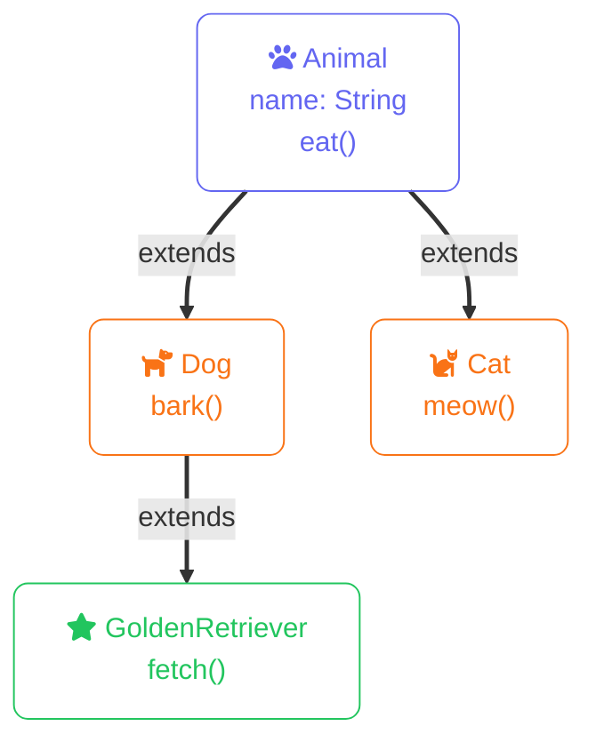
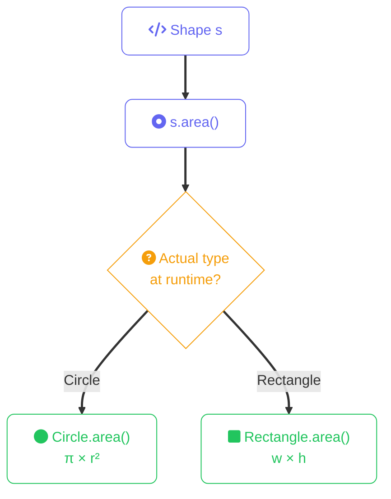

import Callout from '../../../components/mdx/Callout.astro';
import KeyPoints from '../../../components/mdx/KeyPoints.astro';
import Quiz from '../../../components/mdx/Quiz.astro';
import CodeTabs from '../../../components/mdx/CodeTabs.astro';
import List from '../../../components/mdx/List.astro';
import { Icon } from 'astro-icon/components';

Object-Oriented Programming (OOP) organizes code around **objects** — bundles of data and the functions that operate on that data. Instead of thinking about procedures that transform inputs to outputs, you think about entities that have state and behavior.

Java is a class-based OOP language at its core. Rust takes a different approach — it uses structs for data and traits for behavior, achieving similar goals through composition rather than inheritance.

## Classes and Objects

A **class** is a blueprint. An **object** is an instance of that blueprint.

<CodeTabs tabs={[
  {
    label: "Java",
    lang: "java",
    code: `
public class Dog {
    // Fields (state)
    private String name;
    private int age;
    
    // Constructor
    public Dog(String name, int age) {
        this.name = name;
        this.age = age;
    }
    
    // Method (behavior)
    public void bark() {
        System.out.println(name + " says woof!");
    }
    
    // Getter
    public String getName() {
        return name;
    }
}

// Creating an object
Dog myDog = new Dog("Rex", 3);
myDog.bark();  // Rex says woof!
    `,
  },
  {
    label: "Rust",
    lang: "rust",
    code: `
struct Dog {
    name: String,
    age: u32,
}

impl Dog {
    // Associated function (like a static method / constructor)
    fn new(name: String, age: u32) -> Self {
        Self { name, age }
    }
    
    // Method (takes &self)
    fn bark(&self) {
        println!("{} says woof!", self.name);
    }
    
    fn name(&self) -> &str {
        &self.name
    }
}

// Creating an instance
let my_dog = Dog::new(String::from("Rex"), 3);
my_dog.bark();  // Rex says woof!
    `,
  },
]} />

<Callout type="info">
In Rust, `self` in a method signature determines how the method accesses the struct: `&self` borrows immutably, `&mut self` borrows mutably, and `self` takes ownership.
</Callout>

## Encapsulation

Encapsulation means hiding internal details and exposing only what's necessary. This protects data integrity and lets you change implementation without breaking callers.

**Java** uses access modifiers:

| Modifier | Class | Package | Subclass | World |
|----------|-------|---------|----------|-------|
| `private` | <Icon name="mdi:check" class="inline w-4 h-4 align-middle text-green-500" /> | <Icon name="mdi:close" class="inline w-4 h-4 align-middle text-red-500" /> | <Icon name="mdi:close" class="inline w-4 h-4 align-middle text-red-500" /> | <Icon name="mdi:close" class="inline w-4 h-4 align-middle text-red-500" /> |
| (default) | <Icon name="mdi:check" class="inline w-4 h-4 align-middle text-green-500" /> | <Icon name="mdi:check" class="inline w-4 h-4 align-middle text-green-500" /> | <Icon name="mdi:close" class="inline w-4 h-4 align-middle text-red-500" /> | <Icon name="mdi:close" class="inline w-4 h-4 align-middle text-red-500" /> |
| `protected` | <Icon name="mdi:check" class="inline w-4 h-4 align-middle text-green-500" /> | <Icon name="mdi:check" class="inline w-4 h-4 align-middle text-green-500" /> | <Icon name="mdi:check" class="inline w-4 h-4 align-middle text-green-500" /> | <Icon name="mdi:close" class="inline w-4 h-4 align-middle text-red-500" /> |
| `public` | <Icon name="mdi:check" class="inline w-4 h-4 align-middle text-green-500" /> | <Icon name="mdi:check" class="inline w-4 h-4 align-middle text-green-500" /> | <Icon name="mdi:check" class="inline w-4 h-4 align-middle text-green-500" /> | <Icon name="mdi:check" class="inline w-4 h-4 align-middle text-green-500" /> |

**Rust** uses module-based privacy — everything is private by default, use `pub` to expose.

<CodeTabs tabs={[
  {
    label: "Java",
    lang: "java",
    code: `
public class BankAccount {
    private double balance;  // Hidden from outside
    
    public void deposit(double amount) {
        if (amount > 0) {
            balance += amount;  // Controlled access
        }
    }
    
    public double getBalance() {
        return balance;  // Read-only access
    }
}
    `,
  },
  {
    label: "Rust",
    lang: "rust",
    code: `
mod bank {
    pub struct Account {
        balance: f64,  // Private field (no pub)
    }
    
    impl Account {
        pub fn new() -> Self {
            Self { balance: 0.0 }
        }
        
        pub fn deposit(&mut self, amount: f64) {
            if amount > 0.0 {
                self.balance += amount;
            }
        }
        
        pub fn balance(&self) -> f64 {
            self.balance
        }
    }
}

// Outside the module:
let mut account = bank::Account::new();
account.deposit(100.0);
// account.balance = 0.0;  // ERROR: field is private
    `,
  },
]} />

## Inheritance

Inheritance lets one class derive from another, inheriting its fields and methods. It models "is-a" relationships.

Java uses `extends` for inheritance. Rust deliberately doesn't support inheritance — use **composition** instead:

<CodeTabs tabs={[
  {
    label: "Java",
    lang: "java",
    code: `
public class Animal {
    protected String name;
    
    public Animal(String name) {
        this.name = name;
    }
    
    public void eat() {
        System.out.println(name + " is eating");
    }
}

public class Cat extends Animal {
    public Cat(String name) {
        super(name);  // Call parent constructor
    }
    
    public void meow() {
        System.out.println(name + " says meow!");
    }
}

Cat cat = new Cat("Whiskers");
cat.eat();   // Inherited from Animal
cat.meow();  // Defined in Cat
    `,
  },
  {
    label: "Rust",
    lang: "rust",
    code: `
struct Animal {
    name: String,
}

impl Animal {
    fn eat(&self) {
        println!("{} is eating", self.name);
    }
}

struct Cat {
    animal: Animal,  // Composition: Cat HAS an Animal
}

impl Cat {
    fn new(name: String) -> Self {
        Self {
            animal: Animal { name },
        }
    }
    
    fn meow(&self) {
        println!("{} says meow!", self.animal.name);
    }
    
    fn eat(&self) {
        self.animal.eat();  // Delegate to inner Animal
    }
}
    `,
  },
]} />

<Callout type="warning">
Rust's lack of inheritance is intentional. Deep inheritance hierarchies are a common source of complexity and fragile code. Composition is more flexible and easier to reason about.
</Callout>

## Polymorphism

Polymorphism means "many forms" — the ability to treat different types uniformly through a common interface.

Java uses `interface` and abstract classes. Rust uses **traits**:

<CodeTabs tabs={[
  {
    label: "Java",
    lang: "java",
    code: `
interface Shape {
    double area();
}

class Circle implements Shape {
    private double radius;
    
    public Circle(double radius) {
        this.radius = radius;
    }
    
    @Override
    public double area() {
        return Math.PI * radius * radius;
    }
}

class Rectangle implements Shape {
    private double width, height;
    
    public Rectangle(double width, double height) {
        this.width = width;
        this.height = height;
    }
    
    @Override
    public double area() {
        return width * height;
    }
}

// Polymorphic usage
Shape[] shapes = { new Circle(5), new Rectangle(3, 4) };
for (Shape s : shapes) {
    System.out.println(s.area());  // Calls correct implementation
}
    `,
  },
  {
    label: "Rust",
    lang: "rust",
    code: `
trait Shape {
    fn area(&self) -> f64;
}

struct Circle {
    radius: f64,
}

impl Shape for Circle {
    fn area(&self) -> f64 {
        std::f64::consts::PI * self.radius * self.radius
    }
}

struct Rectangle {
    width: f64,
    height: f64,
}

impl Shape for Rectangle {
    fn area(&self) -> f64 {
        self.width * self.height
    }
}

// Static dispatch (generics) — resolved at compile time
fn print_area<T: Shape>(shape: &T) {
    println!("Area: {}", shape.area());
}

// Dynamic dispatch (trait objects) — resolved at runtime
fn print_areas(shapes: &[&dyn Shape]) {
    for shape in shapes {
        println!("Area: {}", shape.area());
    }
}
    `,
  },
]} />

<Callout type="info">
Rust offers both **static dispatch** (generics, zero runtime cost) and **dynamic dispatch** (trait objects with `dyn`, small runtime cost). Java interfaces always use dynamic dispatch.
</Callout>

## Key Differences Summary

| Concept | Java | Rust |
|---------|------|------|
| Data + behavior | Classes | Structs + impl blocks |
| Privacy default | Package-private | Private |
| Inheritance | `extends` keyword | Not supported (use composition) |
| Interfaces | `interface` keyword | Traits |
| Polymorphism | Always dynamic dispatch | Static (generics) or dynamic (`dyn`) |

<KeyPoints>
- **Encapsulation** protects data by controlling access through methods
- **Inheritance** (Java) creates "is-a" relationships; Rust prefers **composition** ("has-a")
- **Polymorphism** lets you write code that works with any type implementing an interface/trait
- Rust's approach is more explicit but avoids common OOP pitfalls like fragile base class problems
</KeyPoints>