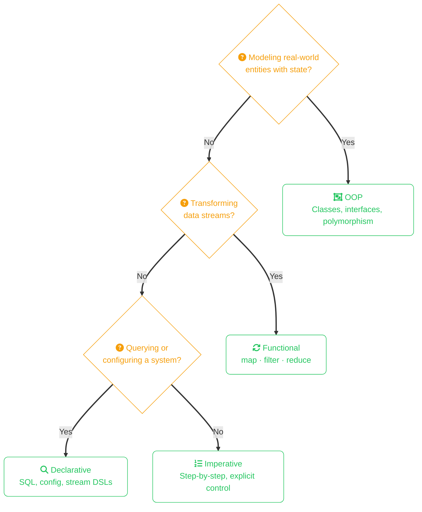

import Callout from '../../../components/mdx/Callout.astro';
import KeyPoints from '../../../components/mdx/KeyPoints.astro';
import Quiz from '../../../components/mdx/Quiz.astro';
import CodeTabs from '../../../components/mdx/CodeTabs.astro';
import List from '../../../components/mdx/List.astro';

A programming paradigm is a fundamental style or approach to writing code. Most languages support multiple paradigms — understanding them helps you recognize patterns, choose the right tool, and read code written by others more fluently.

Both Java and Rust are **multi-paradigm** languages. You'll use different paradigms for different problems, often mixing them in the same codebase.



## Imperative Programming

Imperative code tells the computer **how** to do something — step by step, in explicit sequence.

<CodeTabs tabs={[
  {
    label: "Java",
    lang: "java",
    code: `
int sum = 0;
for (int i = 0; i < numbers.length; i++) {
    sum += numbers[i];
}
    `,
  },
  {
    label: "Rust",
    lang: "rust",
    code: `
let mut sum = 0;
for i in 0..numbers.len() {
    sum += numbers[i];
}
    `,
  },
]} />

Characteristics:
- Explicit control flow (`if`, `for`, `while`)
- Mutable state that changes over time
- Step-by-step instructions

This is the most intuitive paradigm for beginners — it maps directly to how CPUs execute instructions.

## Declarative Programming

Declarative code describes **what** you want, not how to get it. The implementation details are abstracted away.

<CodeTabs tabs={[
  {
    label: "Java",
    lang: "java",
    code: `
int sum = Arrays.stream(numbers).sum();
    `,
  },
  {
    label: "Rust",
    lang: "rust",
    code: `
let sum: i32 = numbers.iter().sum();
    `,
  },
]} />

You describe the result you want (`sum`), and the language figures out how to compute it. SQL is a classic example of a declarative language:

```sql
SELECT name FROM users WHERE age > 18;
```

You don't tell the database *how* to search — just *what* you want.

## Functional Programming

Functional programming treats computation as evaluating mathematical functions. Key principles:

### Pure Functions

A pure function always returns the same output for the same input and has no side effects:

<CodeTabs tabs={[
  {
    label: "Java",
    lang: "java",
    code: `
// Pure function
int add(int a, int b) {
    return a + b;  // No side effects, deterministic
}

// Impure function
int counter = 0;
int addAndCount(int a, int b) {
    counter++;  // Side effect!
    return a + b;
}
    `,
  },
  {
    label: "Rust",
    lang: "rust",
    code: `
// Pure function
fn add(a: i32, b: i32) -> i32 {
    a + b
}

// Rust makes impurity explicit with mut
static mut COUNTER: i32 = 0;
fn add_and_count(a: i32, b: i32) -> i32 {
    unsafe { COUNTER += 1; }  // Requires unsafe
    a + b
}
    `,
  },
]} />

### Immutability

Functional code prefers immutable data — instead of changing values, you create new ones:

<CodeTabs tabs={[
  {
    label: "Java",
    lang: "java",
    code: `
// Imperative: mutate in place
List<Integer> nums = new ArrayList<>(Arrays.asList(1, 2, 3));
for (int i = 0; i < nums.size(); i++) {
    nums.set(i, nums.get(i) * 2);
}

// Functional: create new collection
List<Integer> doubled = nums.stream()
    .map(n -> n * 2)
    .collect(Collectors.toList());
    `,
  },
  {
    label: "Rust",
    lang: "rust",
    code: `
// Imperative: mutate in place
let mut nums = vec![1, 2, 3];
for n in &mut nums {
    *n *= 2;
}

// Functional: create new collection
let doubled: Vec<i32> = nums.iter().map(|n| n * 2).collect();
    `,
  },
]} />

### Higher-Order Functions

Functions that take functions as arguments or return functions:

<CodeTabs tabs={[
  {
    label: "Java",
    lang: "java",
    code: `
// map, filter, reduce are higher-order functions
List<String> names = people.stream()
    .filter(p -> p.age() > 18)      // Takes a predicate function
    .map(Person::name)               // Takes a mapper function
    .collect(Collectors.toList());
    `,
  },
  {
    label: "Rust",
    lang: "rust",
    code: `
let names: Vec<&str> = people.iter()
    .filter(|p| p.age > 18)
    .map(|p| p.name.as_str())
    .collect();
    `,
  },
]} />

<Callout type="info">
Rust's iterator system is heavily influenced by functional programming. Iterators are lazy, composable, and often compile to code as efficient as hand-written loops.
</Callout>

## Object-Oriented Programming

OOP organizes code around objects that combine data and behavior. Core concepts:

- **Encapsulation** — bundling data with methods that operate on it
- **Inheritance** — deriving new types from existing ones (Java)
- **Polymorphism** — treating different types uniformly through interfaces

<CodeTabs tabs={[
  {
    label: "Java",
    lang: "java",
    code: `
interface Drawable {
    void draw();
}

class Circle implements Drawable {
    private int radius;
    
    @Override
    public void draw() {
        System.out.println("Drawing circle with radius " + radius);
    }
}
    `,
  },
  {
    label: "Rust",
    lang: "rust",
    code: `
trait Drawable {
    fn draw(&self);
}

struct Circle {
    radius: i32,
}

impl Drawable for Circle {
    fn draw(&self) {
        println!("Drawing circle with radius {}", self.radius);
    }
}
    `,
  },
]} />

Java is built around OOP. Rust supports OOP concepts but favors composition over inheritance.

## Comparing Paradigms

| Paradigm | Focus | State | Best For |
|----------|-------|-------|----------|
| **Imperative** | How (steps) | Mutable | Performance-critical loops, low-level control |
| **Declarative** | What (result) | Abstracted | Data queries, configuration |
| **Functional** | Transformations | Immutable | Data pipelines, concurrent code |
| **OOP** | Objects | Encapsulated | Large systems, modeling real-world entities |

## Mixing Paradigms

Real code mixes paradigms. Here's a practical example:

<CodeTabs tabs={[
  {
    label: "Java",
    lang: "java",
    code: `
// OOP structure, functional data processing
public class OrderService {  // OOP: encapsulated service
    private final OrderRepository repo;
    
    public List<Order> getHighValueOrders() {
        return repo.findAll().stream()  // Functional: stream pipeline
            .filter(o -> o.getTotal() > 1000)
            .sorted(Comparator.comparing(Order::getDate))
            .collect(Collectors.toList());
    }
}
    `,
  },
  {
    label: "Rust",
    lang: "rust",
    code: `
// struct + impl for organization, functional for processing
struct OrderService {
    repo: OrderRepository,
}

impl OrderService {
    fn high_value_orders(&self) -> Vec<Order> {
        self.repo.find_all()
            .into_iter()
            .filter(|o| o.total > 1000)
            .sorted_by_key(|o| o.date)
            .collect()
    }
}
    `,
  },
]} />

<KeyPoints>
- **Imperative** = explicit steps with mutable state
- **Declarative** = describe what, not how
- **Functional** = pure functions, immutability, higher-order functions
- **OOP** = objects encapsulating data and behavior
- Both Java and Rust are multi-paradigm — use the right approach for each problem
</KeyPoints>