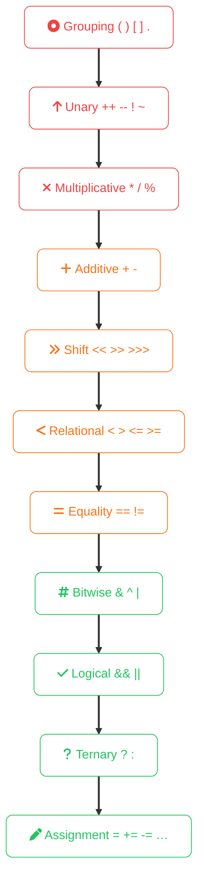

import Callout from '../../../components/mdx/Callout.astro';
import KeyPoints from '../../../components/mdx/KeyPoints.astro';

Operator precedence rules determine the order in which expressions evaluate when multiple operators appear together. Getting this wrong is a common source of subtle bugs — understanding it once saves considerable debugging time.

<KeyPoints>
- The full precedence hierarchy from highest (grouping) to lowest (assignment)
- Why `&&` binds tighter than `||` and how that affects compound conditions
- The difference between pre-increment (`++x`) and post-increment (`x++`)
- How integer division truncates and why mixing `int` and `double` matters
- The golden rule: use parentheses when intent is not obvious
</KeyPoints>

---

## The Golden Rule

When in doubt, **use parentheses**. They always override precedence rules and make your intent explicit to the next person reading the code.
```java
// Unclear — what evaluates first?
int result = 2 + 3 * 4 - 1;

// Clear — intent is explicit
int result = 2 + (3 * 4) - 1;
```

## Precedence Table (High to Low)

| Level | Operators | Description |
|---|---|---|
| 1 (highest) | `()` `[]` `.` | Grouping, access |
| 2 | `++` `--` `!` `~` `-` (unary) | Unary operators |
| 3 | `*` `/` `%` | Multiplicative |
| 4 | `+` `-` | Additive |
| 5 | `<<` `>>` `>>>` | Bitwise shift |
| 6 | `<` `>` `<=` `>=` | Relational |
| 7 | `==` `!=` | Equality |
| 8 | `&` | Bitwise AND |
| 9 | `^` | Bitwise XOR |
| 10 | `\|` | Bitwise OR |
| 11 | `&&` | Logical AND |
| 12 | `\|\|` | Logical OR |
| 13 | `? :` | Ternary |
| 14 (lowest) | `=` `+=` `-=` etc. | Assignment |



## Common Pitfalls

### Arithmetic vs Comparison
```java
// You might expect this to check if result is 5 or 6
if (result == 5 || 6) { }  // WRONG — always true, 6 is truthy

// Correct
if (result == 5 || result == 6) { }
```

### Logical AND vs OR

`&&` has higher precedence than `||` — this surprises people:
```java
// Evaluates as: (a && b) || c
boolean x = a && b || c;

// If you want: a && (b || c)
boolean x = a && (b || c);
```

### Increment Operators
```java
int a = 5;
int b = a++;   // b = 5, then a becomes 6 (post-increment)
int c = ++a;   // a becomes 7 first, then c = 7 (pre-increment)
```

### Integer Division
```java
int result = 7 / 2;      // 3, not 3.5 — integer division truncates
double result = 7.0 / 2; // 3.5 — one double operand promotes the result
```

## Associativity

When operators have the **same precedence**, associativity determines the order. Most operators are **left-to-right**:
```java
int x = 10 - 3 - 2;  // (10 - 3) - 2 = 5, not 10 - (3 - 2) = 9
```

Assignment operators are **right-to-left**:
```java
int a, b, c;
a = b = c = 5;  // c=5 first, then b=5, then a=5
```

## In Rust

Rust follows the same general precedence rules with a few differences:

- Rust has no `++` or `--` operators — use `+= 1` instead
- The `as` casting operator sits between unary and multiplicative
- Rust's range operators `..` and `..=` have lower precedence than arithmetic
```rust
let x = 2 + 3 * 4;    // 14 — same as Java
let y = (2 + 3) * 4;  // 20 — parentheses override
```

The practical advice is the same in both languages: **parentheses are free, bugs are expensive**.