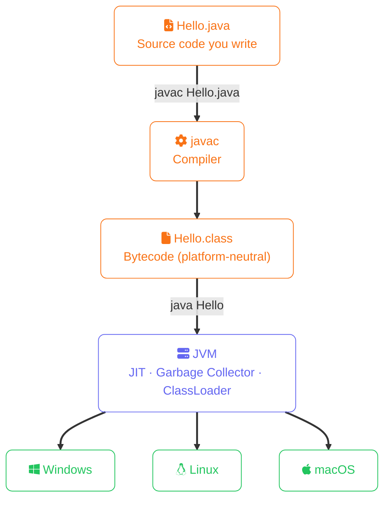
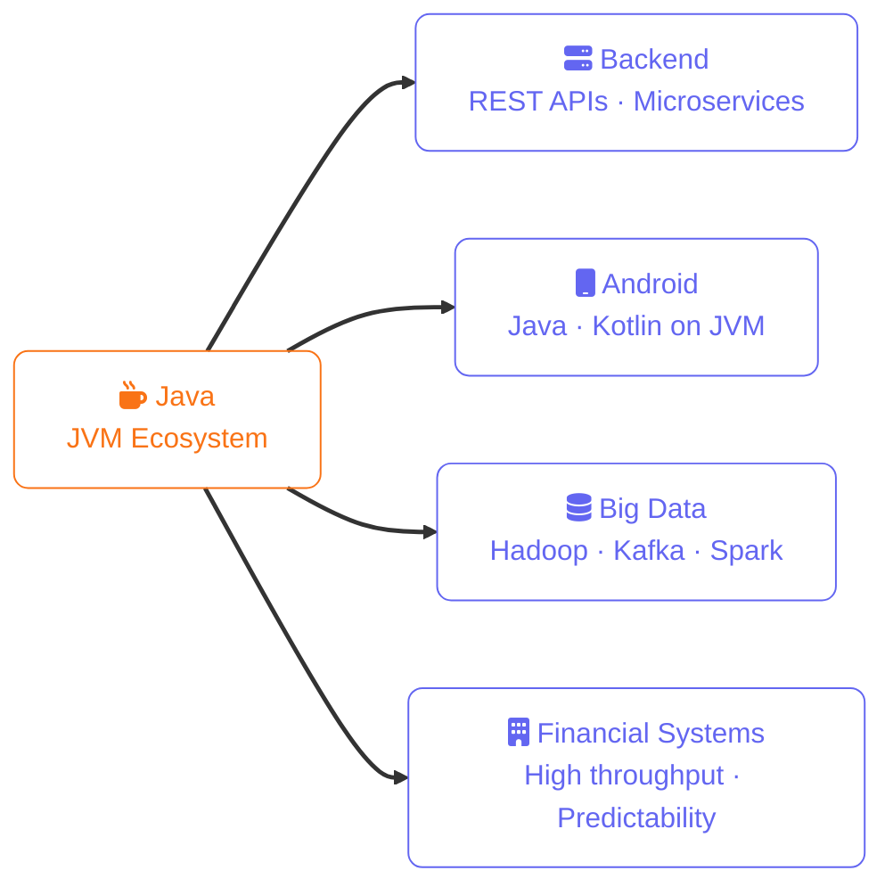

import Callout from '../../../components/mdx/Callout.astro';
import KeyPoints from '../../../components/mdx/KeyPoints.astro';
import CodeComparison from '../../../components/mdx/CodeComparison.astro';

Java is one of the most widely used programming languages in the world. It powers everything from Android apps to large-scale enterprise backends. Understanding why Java has stayed relevant for nearly 30 years is the first step to learning it well.

<KeyPoints>
- How Java compiles to bytecode and why that makes it platform-independent
- The JVM's role as the runtime that executes bytecode on any OS
- Java's four defining characteristics: typed, object-oriented, garbage-collected, explicit
- The major domains where Java is the dominant choice today
</KeyPoints>

---

## The JVM — Write Once, Run Anywhere

Java code doesn't compile directly to machine code. Instead it compiles to **bytecode**, which runs on the **Java Virtual Machine (JVM)**. The JVM is available on virtually every platform — Windows, Linux, macOS — which means the same compiled Java program runs anywhere without modification.



## Key Characteristics

**Strongly typed** — every variable has a declared type and the compiler enforces it. This catches entire classes of bugs before your program ever runs.

**Object-oriented** — Java organises code into classes and objects. Everything (except primitives) is an object.

**Garbage collected** — you don't manually allocate or free memory. The JVM handles it, which eliminates memory leaks and dangling pointers at the cost of some control.

**Verbose but explicit** — Java tends to be more verbose than Python or JavaScript, but that explicitness makes large codebases easier to navigate and reason about.

## Where Java is Used Today



## Your First Java Program
```java
public class Hello {
    public static void main(String[] args) {
        System.out.println("Hello, world!");
    }
}
```

<Callout type="tip" title="Pro Tip">
  Use `var` for local variables in Java 10+ to reduce verbosity without losing type safety.
</Callout>

Save this as `Hello.java`, then compile and run:
```bash
javac Hello.java
java Hello
```

Every Java program needs a class with a `main` method — that's the entry point the JVM looks for when starting your program.