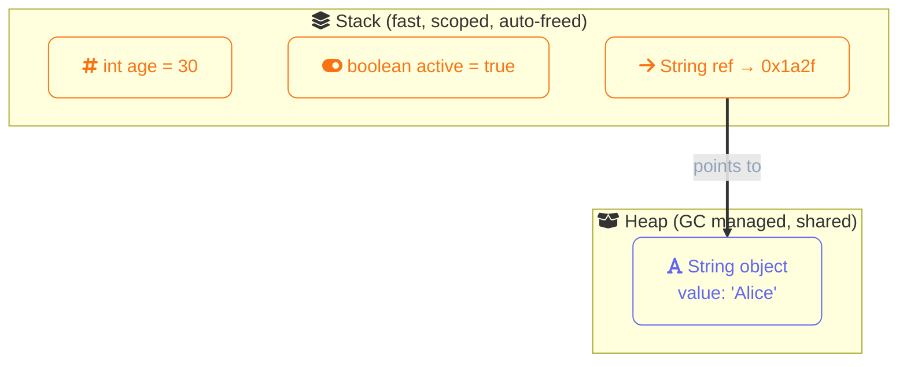
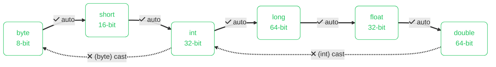

import Callout from '../../../components/mdx/Callout.astro';
import KeyPoints from '../../../components/mdx/KeyPoints.astro';
import Quiz from '../../../components/mdx/Quiz.astro';

Java is a statically typed language — every variable must have a declared type, and that type cannot change. This strictness is one of Java's biggest strengths in large codebases.

<KeyPoints>
- The 8 primitive types and their sizes in memory
- Why primitives live on the stack while reference types live on the heap
- How widening and narrowing conversions work with explicit casting
- When to use `var` for local type inference
</KeyPoints>

---

## Primitive Types

Java has 8 primitive types that hold raw values directly in memory:

| Type | Size | Example |
|---|---|---|
| `int` | 32-bit | `int age = 30;` |
| `long` | 64-bit | `long population = 8_000_000_000L;` |
| `double` | 64-bit float | `double price = 9.99;` |
| `float` | 32-bit float | `float ratio = 0.5f;` |
| `boolean` | true/false | `boolean active = true;` |
| `char` | 16-bit Unicode | `char grade = 'A';` |
| `byte` | 8-bit | `byte flags = 0b0010;` |
| `short` | 16-bit | `short port = 8080;` |

Primitives are stored directly on the **stack** — fast to access and automatically cleaned up when they go out of scope.

## Primitive vs Reference Types in Memory



## Reference Types

Everything else in Java is a reference type — variables hold a reference (pointer) to an object in **heap** memory.
```java
String name = "Alice";       // String is a reference type
int[] numbers = {1, 2, 3};  // arrays are reference types
```

The most important implication: when you assign one reference variable to another, both point to the same object.
```java
int[] a = {1, 2, 3};
int[] b = a;      // b points to the same array as a
b[0] = 99;
System.out.println(a[0]); // prints 99
```

## Type Widening and Narrowing



Java won't silently convert between types — you have to be explicit:
```java
int x = 9;
double d = x;          // widening — safe, happens automatically
int y = (int) 9.99;    // narrowing — must cast explicitly, loses .99
```

## var — Local Type Inference

Since Java 10 you can use `var` and let the compiler infer the type:
```java
var message = "Hello";   // compiler infers String
var count = 42;          // compiler infers int
var items = new ArrayList<String>(); // infers ArrayList<String>
```

`var` only works for local variables — not method parameters or fields.

## Constants

Use `final` to declare a variable whose value cannot be reassigned:
```java
final double PI = 3.14159;
final String APP_NAME = "Acert";
```

By convention, constants are written in UPPER_SNAKE_CASE.

<Callout type="warning" title="Narrowing Can Silently Lose Data">
  `(int) 9.99` gives you `9`, not an error. Always verify the target range before narrowing — casting a large `long` to `int` wraps silently if the value overflows.
</Callout>

<Quiz
  question="What is printed by: `int[] a = {1,2,3}; int[] b = a; b[0] = 99; System.out.println(a[0]);`"
  options={[
    { label: "1 — arrays are copied on assignment" },
    { label: "99 — both variables point to the same array object", correct: true },
    { label: "Compilation error" },
    { label: "0 — b is a new empty array" },
  ]}
  explanation="Arrays are reference types. `b = a` makes both variables point to the same array on the heap. Mutating via b affects the same array a points to."
/>