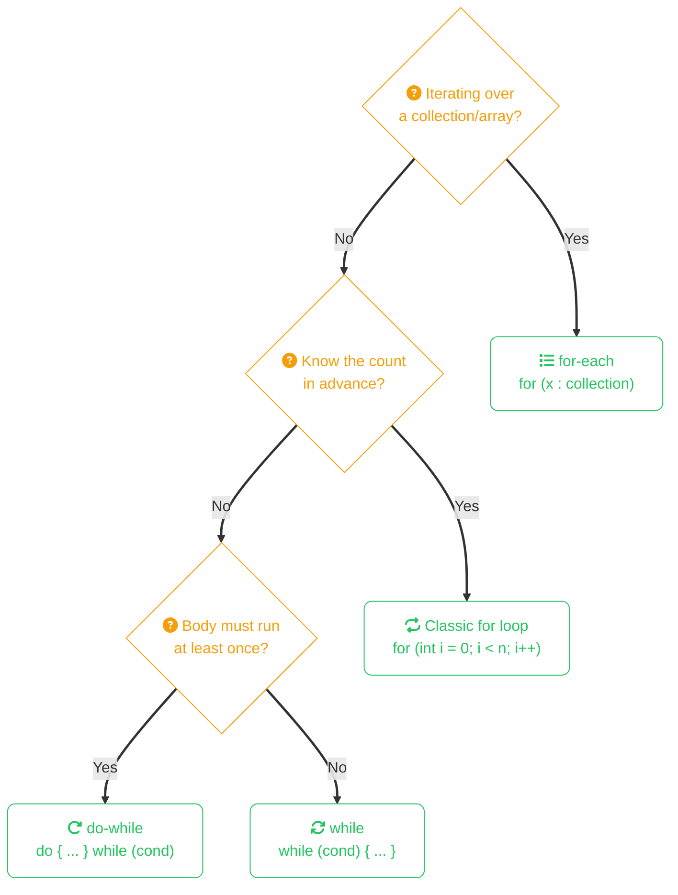

import Callout from '../../../components/mdx/Callout.astro';
import KeyPoints from '../../../components/mdx/KeyPoints.astro';
import Quiz from '../../../components/mdx/Quiz.astro';

Control flow determines the order in which your code executes. Java gives you a familiar set of tools — conditionals, loops, and switches — with a few modern additions worth knowing.

<KeyPoints>
- When to use `if/else if/else` vs modern switch expressions
- The four loop types and when each is the right choice
- How `break` and `continue` modify loop flow
- The ternary operator for compact conditional expressions
</KeyPoints>

---

## Choosing the Right Loop



## if / else if / else
```java
int score = 85;

if (score >= 90) {
    System.out.println("A");
} else if (score >= 80) {
    System.out.println("B");
} else if (score >= 70) {
    System.out.println("C");
} else {
    System.out.println("F");
}
```

## Switch Expressions (Java 14+)

The traditional `switch` statement is verbose and error-prone. The modern switch expression is cleaner:
```java
String day = "MONDAY";

String type = switch (day) {
    case "MONDAY", "TUESDAY", "WEDNESDAY", "THURSDAY", "FRIDAY" -> "Weekday";
    case "SATURDAY", "SUNDAY" -> "Weekend";
    default -> "Unknown";
};
```

Note the `->` arrow syntax — no fall-through, no `break` needed.

## for Loop
```java
for (int i = 0; i < 5; i++) {
    System.out.println(i);
}
```

## Enhanced for Loop (for-each)

Use this whenever you're iterating over a collection or array — it's cleaner and less error-prone:
```java
String[] languages = {"Java", "Rust", "Go"};

for (String lang : languages) {
    System.out.println(lang);
}
```

## while and do-while
```java
// while — checks condition before each iteration
int i = 0;
while (i < 3) {
    System.out.println(i);
    i++;
}

// do-while — always runs at least once
int j = 0;
do {
    System.out.println(j);
    j++;
} while (j < 3);
```

## break and continue
```java
for (int i = 0; i < 10; i++) {
    if (i == 3) continue;  // skip 3
    if (i == 7) break;     // stop at 7
    System.out.println(i);
}
// prints: 0 1 2 4 5 6
```

## Ternary Operator

A compact one-liner for simple conditionals:
```java
int age = 20;
String status = age >= 18 ? "adult" : "minor";
```

<Callout type="warning" title="Avoid Nesting Ternaries">
  `a ? b ? c : d : e` is legal but unreadable. Use an `if/else` the moment there's more than one level of nesting.
</Callout>

<Quiz
  question="Which loop type guarantees its body executes at least once?"
  options={[
    { label: "for" },
    { label: "while" },
    { label: "do-while", correct: true },
    { label: "for-each" },
  ]}
  explanation="do-while evaluates the condition after the body, so the body always runs at least once regardless of whether the condition is initially true."
/>