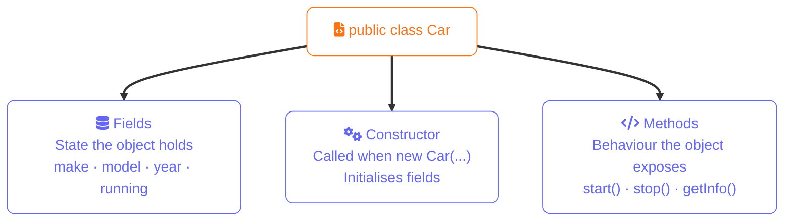
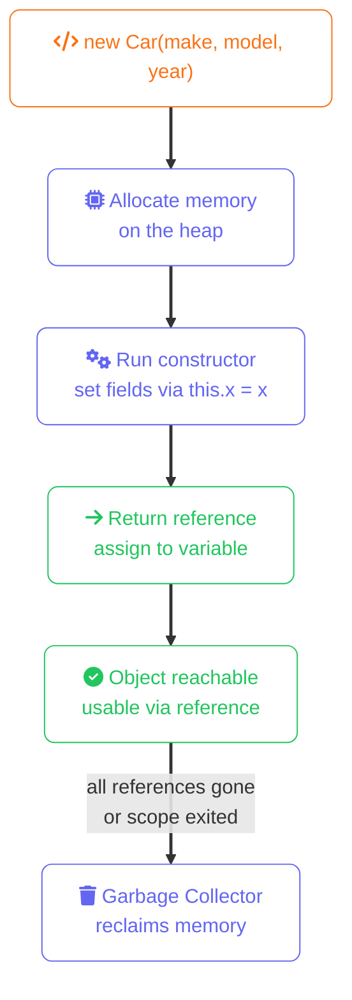

import Callout from '../../../components/mdx/Callout.astro';
import KeyPoints from '../../../components/mdx/KeyPoints.astro';
import Quiz from '../../../components/mdx/Quiz.astro';

Java is fundamentally object-oriented. Everything you build is organised into classes — blueprints that define data and behaviour — and objects, which are instances of those blueprints.

<KeyPoints>
- How a class defines fields, a constructor, and methods
- What happens in memory when `new` creates an object
- Access modifiers and why `private` fields with public methods is the right default
- How `static` members differ from instance members
</KeyPoints>

---

## Class Anatomy



## Defining a Class
```java
public class Car {
    // Fields — the data a Car holds
    String make;
    String model;
    int year;
    boolean running;

    // Constructor — called when creating a new Car
    public Car(String make, String model, int year) {
        this.make = make;
        this.model = model;
        this.year = year;
        this.running = false;
    }

    // Methods — the behaviour a Car has
    public void start() {
        running = true;
        System.out.println(make + " " + model + " started.");
    }

    public void stop() {
        running = false;
        System.out.println(make + " " + model + " stopped.");
    }

    public String getInfo() {
        return year + " " + make + " " + model;
    }
}
```

## Object Creation Lifecycle



## Creating Objects
```java
Car myCar = new Car("Toyota", "Corolla", 2022);
Car anotherCar = new Car("Ford", "Mustang", 2023);

myCar.start();
System.out.println(myCar.getInfo());
```

## Access Modifiers

Control what other classes can see and use:

| Modifier | Accessible from |
|---|---|
| `public` | Anywhere |
| `private` | Only within this class |
| `protected` | This class and subclasses |
| _(none)_ | Same package only |

The golden rule: make fields `private` and expose them through methods. This is **encapsulation**.
```java
public class BankAccount {
    private double balance;  // nobody can touch this directly

    public double getBalance() {
        return balance;
    }

    public void deposit(double amount) {
        if (amount > 0) balance += amount;
    }

    public void withdraw(double amount) {
        if (amount > 0 && amount <= balance) balance -= amount;
    }
}
```

## The this Keyword

`this` refers to the current object instance. Use it to disambiguate when a parameter has the same name as a field:
```java
public Car(String make, String model, int year) {
    this.make = make;   // this.make = field, make = parameter
    this.model = model;
    this.year = year;
}
```

## Static Members

`static` fields and methods belong to the class itself, not any individual instance:
```java
public class Counter {
    private static int count = 0;  // shared across all instances

    public Counter() {
        count++;
    }

    public static int getCount() {
        return count;
    }
}

Counter a = new Counter();
Counter b = new Counter();
System.out.println(Counter.getCount()); // 2
```

<Callout type="info" title="static vs instance">
  Call static methods on the class name: `Counter.getCount()`. Call instance methods on an object: `myCar.start()`. Calling a static method on an instance reference compiles but is misleading — avoid it.
</Callout>

<Quiz
  question="What is the purpose of the `this` keyword in a Java constructor?"
  options={[
    { label: "It calls a parent class constructor" },
    { label: "It refers to the current object instance, disambiguating field names from parameter names", correct: true },
    { label: "It creates a new copy of the object" },
    { label: "It marks the class as a singleton" },
  ]}
  explanation="`this.make` refers to the instance field, while `make` (without this) refers to the constructor parameter. This disambiguation is needed when they share a name."
/>