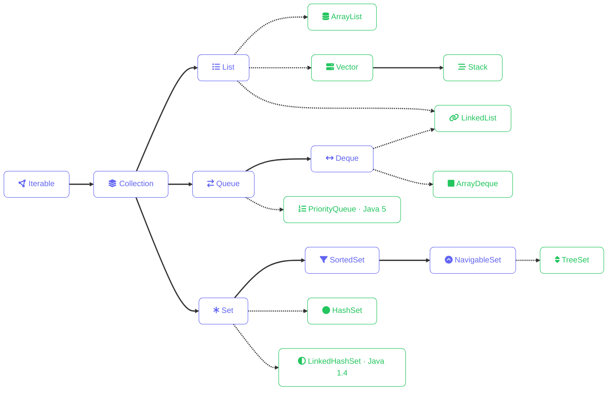
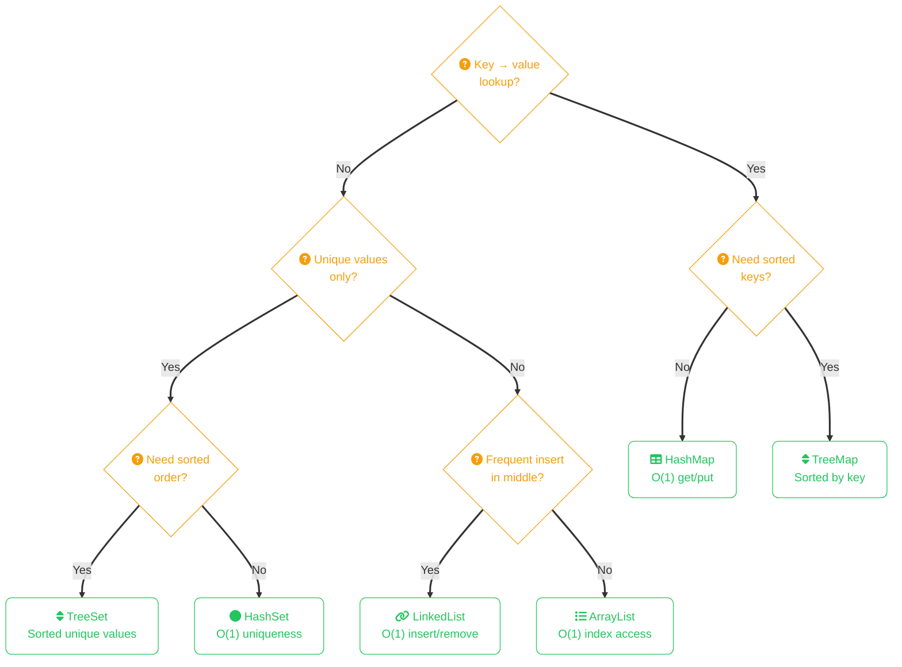

import Callout from '../../../components/mdx/Callout.astro';
import KeyPoints from '../../../components/mdx/KeyPoints.astro';
import Quiz from '../../../components/mdx/Quiz.astro';

Java's Collections Framework gives you ready-made data structures for storing and manipulating groups of objects. Knowing which one to reach for is a core Java skill.

<KeyPoints>
- The Collections Framework hierarchy: Iterable → Collection → List/Set/Queue
- When ArrayList beats LinkedList and vice versa
- How HashMap achieves O(1) lookup with key-value pairs
- Using the interface type (`List<>` not `ArrayList<>`) for flexible code
</KeyPoints>

---

## Collections Framework Hierarchy



## Choosing the Right Collection



## ArrayList

A resizable array. Use it when you need an ordered list and fast index-based access.
```java
import java.util.ArrayList;

ArrayList<String> languages = new ArrayList<>();

languages.add("Java");
languages.add("Rust");
languages.add("Go");

System.out.println(languages.get(0));   // Java
System.out.println(languages.size());   // 3

languages.remove("Go");

for (String lang : languages) {
    System.out.println(lang);
}
```

## LinkedList

Better than ArrayList when you frequently insert or remove from the middle of a list:
```java
import java.util.LinkedList;

LinkedList<String> queue = new LinkedList<>();
queue.addLast("first");
queue.addLast("second");
queue.removeFirst();  // acts like a queue
```

## HashMap

Stores key-value pairs. Lookups, inserts, and deletes are O(1) on average.
```java
import java.util.HashMap;

HashMap<String, Integer> scores = new HashMap<>();

scores.put("Alice", 95);
scores.put("Bob", 82);
scores.put("Charlie", 91);

System.out.println(scores.get("Alice"));       // 95
System.out.println(scores.containsKey("Bob")); // true

// Iterate over entries
for (var entry : scores.entrySet()) {
    System.out.println(entry.getKey() + ": " + entry.getValue());
}
```

## HashSet

A collection of unique values — duplicates are automatically ignored:
```java
import java.util.HashSet;

HashSet<String> tags = new HashSet<>();
tags.add("java");
tags.add("backend");
tags.add("java");  // ignored — already exists

System.out.println(tags.size()); // 2
```

## The List Interface

In practice, declare variables using the interface type rather than the implementation:
```java
// Prefer this
List<String> items = new ArrayList<>();

// Over this
ArrayList<String> items = new ArrayList<>();
```

This makes it easy to swap implementations later without changing the rest of your code.

## Useful Utility Methods
```java
import java.util.Collections;

List<Integer> numbers = new ArrayList<>(List.of(3, 1, 4, 1, 5, 9));

Collections.sort(numbers);           // [1, 1, 3, 4, 5, 9]
Collections.reverse(numbers);        // [9, 5, 4, 3, 1, 1]
int max = Collections.max(numbers);  // 9
```

<Callout type="tip" title="ArrayList vs LinkedList in practice">
  ArrayList outperforms LinkedList for nearly all real-world workloads because CPU caches favour contiguous memory. Only use LinkedList when profiling confirms middle-insertion cost is the bottleneck.
</Callout>

<Quiz
  question="Which collection should you use to store a set of usernames where each name must appear exactly once?"
  options={[
    { label: "ArrayList — because it preserves order" },
    { label: "HashMap — because it has fast lookups" },
    { label: "HashSet — because it automatically rejects duplicates", correct: true },
    { label: "LinkedList — because it has fast insert" },
  ]}
  explanation="HashSet enforces uniqueness — adding a value that already exists is silently ignored. It also provides O(1) average time for add, contains, and remove operations."
/>