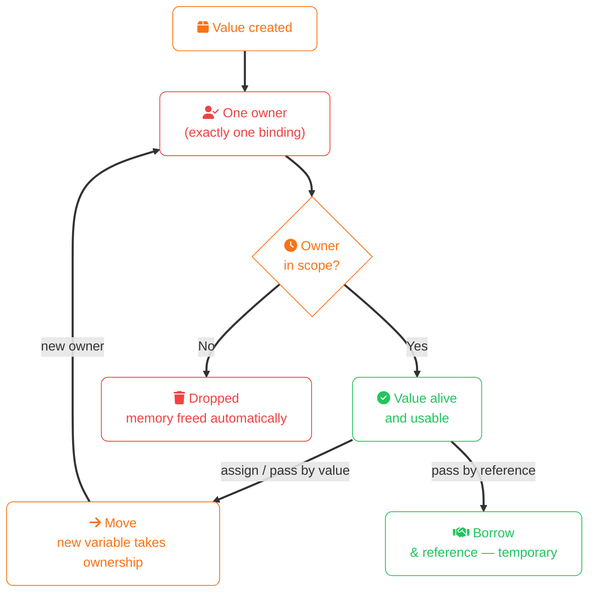

import Callout from '../../../components/mdx/Callout.astro';
import KeyPoints from '../../../components/mdx/KeyPoints.astro';
import Quiz from '../../../components/mdx/Quiz.astro';

Rust is a systems programming language designed to give you the performance of C/C++ with memory safety guarantees enforced at compile time — no garbage collector, no runtime overhead, no data races.

<KeyPoints>
- Rust guarantees memory safety without a garbage collector
- Every value has exactly one owner; when the owner goes out of scope, the value is dropped automatically
- Borrowing (`&T`) lets you use a value without taking ownership
- The borrow checker enforces safety rules at compile time, not runtime
- Rust has no `null` — use `Option<T>` instead
</KeyPoints>

---

## Why Rust?

Most languages make a trade-off between safety and performance:

| Approach | Languages | Safety | Perf |
|---|---|---|---|
| Garbage collected | Java, Go, Python | ✓ | Moderate |
| Manual memory | C, C++ | Manual | Maximum |
| Ownership system | Rust | ✓ compile-time | Maximum |

Rust breaks this trade-off. Memory safety is enforced by the compiler — there's no runtime cost.

## The Ownership Model



The three ownership rules:
1. Every value has exactly one owner at a time
2. When the owner goes out of scope, the value is dropped (memory freed)
3. Ownership can be transferred (moved) or temporarily lent (borrowed)

## Your First Rust Program

```rust
fn main() {
    println!("Hello, world!");
}
```

With Cargo (Rust's build tool and package manager):
```bash
cargo new hello-world
cd hello-world
cargo run
```

## Variables and Mutability

By default, all variables in Rust are immutable. You must explicitly opt into mutation:
```rust
let x = 5;
// x = 6;  // ERROR: cannot assign twice to immutable variable

let mut y = 5;
y = 6;  // OK — explicitly mutable
```

This default pushes you toward safer code and makes mutation visible at the call site.

## Ownership in Practice

```rust
fn main() {
    let s1 = String::from("hello");
    let s2 = s1;           // s1 is MOVED into s2

    // println!("{}", s1); // ERROR: value borrowed after move
    println!("{}", s2);    // OK
}
```

To keep using `s1`, clone it or borrow it:
```rust
// Clone: deep copy — both are independent
let s1 = String::from("hello");
let s2 = s1.clone();

// Borrow: share without transferring ownership
let s3 = &s1;   // s1 still owns the value
println!("{} {}", s1, s3);
```

## Borrowing Rules

The borrow checker enforces these rules at compile time:
- Any number of **immutable references** (`&T`) simultaneously, **or**
- Exactly **one mutable reference** (`&mut T`) — never both at the same time
- References must always point to valid data (no dangling pointers)

```rust
let mut s = String::from("hello");

let r1 = &s;      // OK
let r2 = &s;      // OK — multiple immutable refs allowed
println!("{} {}", r1, r2);

let r3 = &mut s;  // OK — r1 and r2 are no longer in use
r3.push_str(" world");
```

<Callout type="info" title="The borrow checker is your friend">
  When the borrow checker rejects your code, it's preventing a real memory bug — a use-after-free, double-free, or data race. Rust error messages are detailed; they tell you what went wrong and often suggest the fix.
</Callout>

## No Null — Use Option

Rust has no `null`. Instead you use `Option<T>`, which forces you to handle the "nothing" case:
```rust
let some_number: Option<i32> = Some(42);
let no_number: Option<i32>   = None;

// The compiler won't let you use the value without checking
match some_number {
    Some(n) => println!("Got {}", n),
    None    => println!("Nothing here"),
}

// Or use if let for a single arm
if let Some(n) = some_number {
    println!("Number is {}", n);
}
```

This eliminates an entire class of null pointer exceptions at compile time.

<Quiz
  question="What happens in Rust when you write: let s2 = s1; (where s1 is a String)?"
  options={[
    { label: "Both s1 and s2 can be used — the value is shared between them" },
    { label: "The value is automatically deep-copied so both variables are valid" },
    { label: "Ownership moves to s2 — s1 can no longer be used", correct: true },
    { label: "A compile error occurs — you cannot assign one String variable to another" },
  ]}
  explanation="Rust moves ownership for heap-allocated types like String. After let s2 = s1, s1 is no longer valid. Use s1.clone() for a deep copy, or &s1 to borrow without transferring ownership."
/>